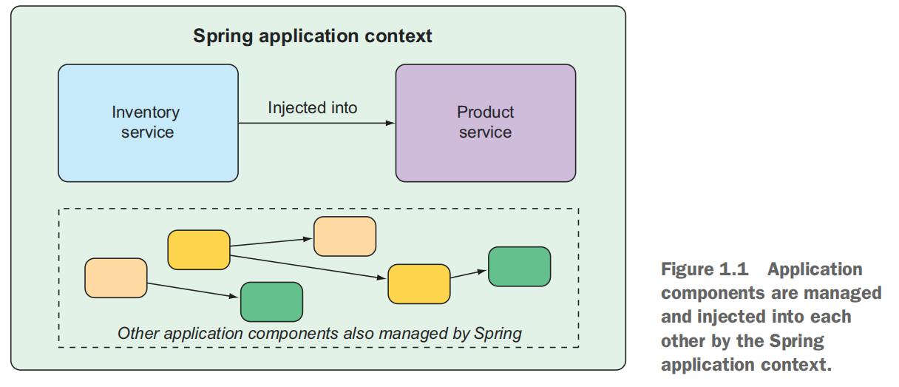
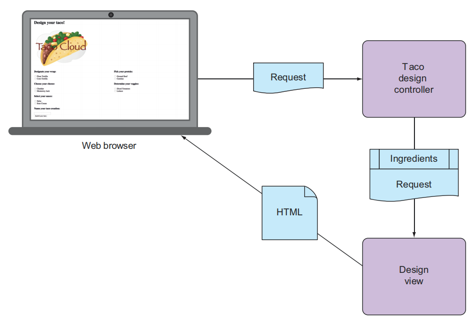
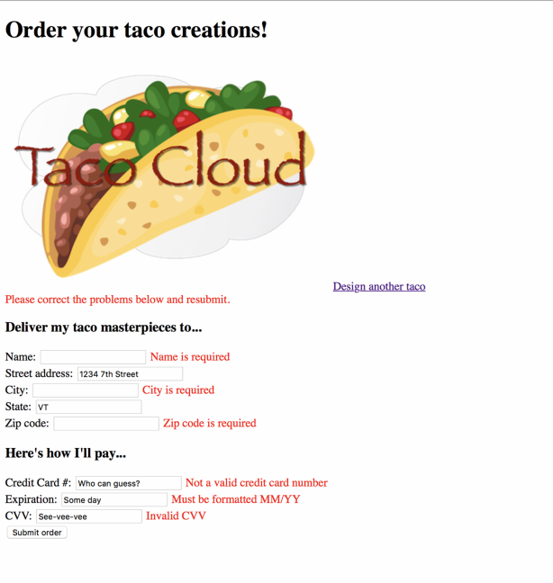
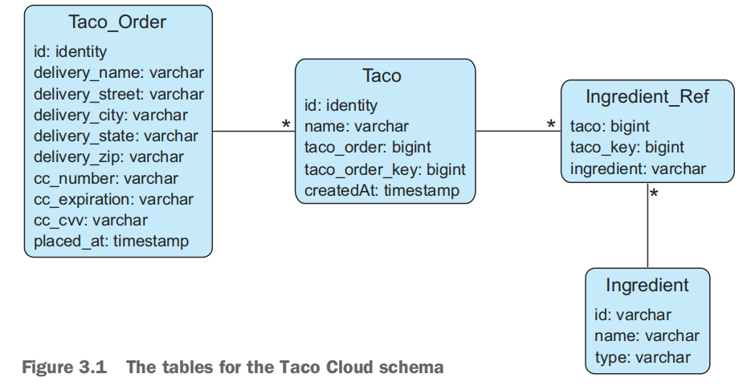
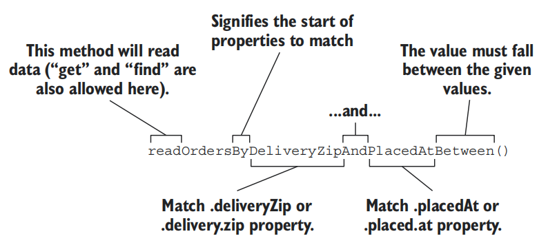

# Spring

# Part 1

# 1 Getting started with Spring

## 1.1 What is Spring

### 1.1.1 Spring application context

Spring offers a container, often referred to as the Spring application context, that creates and manages application components. These components, or beans,are wired together inside the Spring application context to make a complete application.

the next Figure illustrates the relationships between these beans and the Springapplication context



Historically,the way you would guide Spring’s application context to wire beans together was with one or more XML files that described the components and their relationship to other components.For example:

```xml
<bean id="inventoryService"
 	class="com.example.InventoryService" />
<bean id="productService"
 	class="com.example.ProductService" />
 <constructor-arg ref="inventoryService" />
</bean>
```

In recent versions of Spring, however, a Java-based configuration is more common.

```java
@Configuration
public class ServiceConfiguration {
 	@Bean
	 public InventoryService inventoryService() {
 		return new InventoryService();
 	 }
	@Bean
 	public ProductService productService() {
 		return new ProductService(inventoryService());
 	 }
}
```

The @Configuration annotation indicates to Spring that this is a configuration class that will provide beans to the Spring application context.
 The configuration’s methods are annotated with @Bean, indicating that the objects they return should be added as beans in the application context (where, bydefault, their respective bean IDs will be the same as the names of the methods thatdefine them).

>  Java-based configuration offers several benefits,including ==greater type safety and improved refactorability.==

### 1.1.2 Dependency injection

DI is a design pattern where the dependencies (i.e., other objects or services) required by a component are provided to it, rather than the component creating or managing those dependencies itself. 

## 1.2 Initializing a Spring application

### 1.2.1 bootstrap the application

One of the most powerful lines of code is also one of the shortest.

```java
package sia.tacocloud;

import org.springframework.boot.SpringApplication;
import org.springframework.boot.autoconfigure.SpringBootApplication;

@SpringBootApplication //the most powerful lines of code
public class TacoCloudApplication {

    public static void main(String[] args) {
        SpringApplication.run(TacoCloudApplication.class, args);
    }

}
```

`@SpringBootApplication` is a composite annotation that combines the following three annotations:

* `@SpringBootConfiguration`----Designates this class as a configuration class.Although there’s not much configuration in the class yet, you can add Javabased Spring Framework configuration to this class if you need to. This annotation is, in fact, ==a specialized form of the `@Configuration` annotation==.
* `@EnableAutoConfiguration`---Enables Spring Boot automatic configuration.We’ll talk more about autoconfiguration later. For now, know that this annotation tells Spring Boot to automatically configure any components that it thinksyou’ll need.
* `@ComponentScan`---Enables component scanning. This lets you declare otherclasses with annotations like `@Component`, `@Controller`, and `@Service` to have Spring automatically discover and register them as components in the Spring application context.

### 1.2.2 Testing The Application

Manual testing implies that there’s a human involved and thus potential for human error and inconsistent testing. Automated tests are more consistent and repeatable.

Recognizing this, the Spring Initializr gives you a test class to get started. The following listing shows the baseline test class.

```java
package sia.tacocloud;

import org.junit.jupiter.api.Test;
import org.springframework.boot.test.context.SpringBootTest;

@SpringBootTest
class TacoCloudApplicationTests {

    @Test
    void contextLoads() {
    }

}
```

This test class does perform an essential check to ensure that the Spring application context can be loaded successfully. If you make any changes that prevent the Spring application context from being created, this test fails, and you can react by fixing the problem.

`@SpringBootTest` is a compositeannotation, which is itself annotated with `@ExtendWith(SpringExtension.class)`, to add Spring testing capabilities to JUnit 5. 

## 1.3 Writing a Spring application

### 1.3.1 Handing web requests

In the context of web development, a request and a response are fundamental concepts in the communication between a client (typically a web browser) and a server.

1. **Request:** When you, ==as a user==, access a website by entering a URL in your browser or clicking a link, your browser sends a request to the server hosting that website. This request includes information about the resource you want (e.g., a webpage, an image) and additional details like the type of request (GET, POST, etc.), headers, and sometimes data, depending on the type of request.
2. **Response:** The server processes the request and sends back a response to the browser. This response includes the requested resource (like an HTML page or an image), along with metadata such as status codes, headers, and sometimes additional data. The browser then interprets the response and renders the content to display on your screen.

```java
package tacos;

import org.springframework.stereotype.Controller;
import org.springframework.web.bind.annotation.GetMapping;

@Controller  //the controller
public class HomeController {
    @GetMapping("/") //handlers requests for the root path/
    public String home(){
        return "home";// returns the view name
    }

}
```

`@Controller`--- Its primary purpose is to identify this class as a component for component scanning.Because HomeController is annotated with `@Controller`, Spring’s component scanning automatically discovers it and creates an instance of HomeController as a bean in the Spring application context.In fact, a handful of other annotations (including `@Component`, `@Service`, and`@Repository`) serve a purpose similar to `@Controller`.The choice of `@Controller `is, however, more ==descriptive of this component’s role== in the application.

`@GetMapping`--- The home() annotated with `@GetMapping` to indicate that if an HTTP GET request is received for the root path /, then this method should handle that request. It does so by doing nothing more than ==returning a `String` value of `home`==. This value is interpreted as the logical name of a view.

The template name is derived from the logical view name by prefixing it with /templates/ and postfixing it with .html. The resulting path for the template is /templates/home.html.

> Why Thymeleaf?
>
> Even though JSP may seem like an obvious choice,there are some challenges to overcome when using JSP with Spring Boot. I didn’t want to go down that rabbit hole in chapter 1. Hang tight. We’ll look at other template options, including JSP, in chapter 2.

```html
<!DOCTYPE html>
<html lang="en"  xmlns="http://www.w3.org/1999/xhtml"
                xmlns:th="http://www.thymeleaf.org">
<head>
    <meta charset="UTF-8">
    <title>Taco Cloud</title>
</head>
<body>
    <h1>Welcome to ...</h1>
    
</body>
</html>
```

The following code will test the home page

```java
package tacos;

import org.junit.jupiter.api.Test;
import org.springframework.beans.factory.annotation.Autowired;
import org.springframework.boot.test.autoconfigure.web.servlet.WebMvcTest;
import org.springframework.test.web.servlet.MockMvc;

import static 
 org.hamcrest.Matchers.containsString;
import static      org.springframework.test.web.servlet.request.MockMvcRequestBuilders.get;
import static
 org.springframework.test.web.servlet.result.MockMvcResultMatchers.content;
import static
 org.springframework.test.web.servlet.result.MockMvcResultMatchers.status;
import static
 org.springframework.test.web.servlet.result.MockMvcResultMatchers.view;

@WebMvcTest(HomeController.class)
public class HomeControllerTest {
    @Autowired
    private MockMvc mockMvc;

    @Test
    public  void testHomePage() throws Exception {
        mockMvc.perform(get("/"))
                .andExpect(status().isOk())
                .andExpect(view().name("home"))
                .andExpect(content().string(
                        containsString("Welcome to ...")
                ));
    }
}
```

### 1.3.2 Getting to know Spring Boot DevTools

As its name suggests, DevTools provides Spring developers with some handy development-time tools. Among those are the following:

* Automatic application restart when code changes
* Automatic browser refresh when browser-destined resources (such as templates,JavaScript, stylesheets, and so on) change
* Automatic disabling of template caches
* Built in H2 Console, if the H2 database is in use

### 1.3.3 How does application work

What is Spring doing behind the scenes to make sure your application needs are met? To understand what Spring is doing, let’s start by looking at the build specification.

```xml
<dependencies>
        <dependency>
            <groupId>org.springframework.boot</groupId>
            <artifactId>spring-boot-starter-thymeleaf</artifactId>
        </dependency>
        <dependency>
            <groupId>org.springframework.boot</groupId>
            <artifactId>spring-boot-starter-web</artifactId>
        </dependency>

        <dependency>
            <groupId>org.springframework.boot</groupId>
            <artifactId>spring-boot-devtools</artifactId>
            <scope>runtime</scope>
            <optional>true</optional>
        </dependency>
        <dependency>
            <groupId>org.projectlombok</groupId>
            <artifactId>lombok</artifactId>
            <optional>true</optional>
        </dependency>
        <dependency>
            <groupId>org.springframework.boot</groupId>
            <artifactId>spring-boot-starter-test</artifactId>
            <scope>test</scope>
        </dependency>
    </dependencies>
```


In the pom.xml file, you declared a dependency on the Web and Thymeleaf starters. These two dependencies transitively brought in a handful of other dependencies,including the following:

1. Spring’s MVC framework
2. Embedded Tomcat
3. Thymeleaf and the Thymeleaf layout dialect

It also brought Spring Boot’s autoconfiguration library along for the ride. When the application starts, Spring Boot autoconfiguration detects those libraries and automatically performs the following tasks:

1. Configures the beans in the Spring application context to enable Spring MVC
2. Configures the embedded Tomcat server in the Spring application context
3. Configures a Thymeleaf view resolver for rendering Spring MVC views with Thymeleaf templates

In short, ==autoconfiguration does all the grunt work==, leaving you to focus on writing code that implements your application functionality.

## 1.4 Surverying the Spring landscape

### 1.4.1 The core Spring Framework

The core Spring Framework is the foundation of everything else in the Spring universe.It provides the ==core container and dependency== injection framework. But it also provides a few other essential features.

1. Using Spring MVC to write a controller class to handle web requests.Spring MVC can also be used to create REST APIs that produce non-HTML output.
2. Offerring some elemental data persistence support,specifically, template-based JDBC support.
3. Spring includes support for reactive-style programming, including a new reactive web framework called Spring WebFlux that borrows heavily from Spring MVC.

### 1.4.2 Spring Boot

In addition to starter dependencies and autoconfiguration,Spring Boot also offers the following other useful features:

1. The Actuator provides runtime insight into the inner workings of an application, including metrics, thread dump information, application health, and environment properties available to the application.
2. Flexible specification of environment properties.
3. Additional testing support on top of the testing assistance found in the core framework.

### 1.4.3 Spring Data

Spring Data provides something quite amazing: the ability to define your application’s data repositories as simple Java interfaces, using a naming convention when defining methods to drive how data is stored and retrieved.

What’s more, Spring Data is capable of working with several different kinds of databases, including relational (via JDBC or JPA), document (Mongo), graph (Neo4j),and others.

### 1.4.4 Spring Security

Spring Security addresses a broad range of application security needs, including authentication, authorization, and API security.

### 1.4.5 Spring Integration and Spring Batch

At some point, most applications will need to integrate with other applications or even with other components of the same application. Several patterns of application integration have emerged to address these needs. Spring Integration and Spring Batch provide the implementation of these patterns for Spring applications.

Spring Integration addresses real-time integration where data is processed as it’s made available. In contrast, Spring Batch addresses batched integration where data is allowed to collect for a time until some trigger (perhaps a time trigger) signals that it’s time for the batch of data to be processed.

### 1.4.6 Spring Cloud

The application development world is entering a new era where we’ll no longer develop our applications as single-deployment, unit monoliths and will instead compose applications from several individual deployment units known as microservices.
Microservices are a hot topic, addressing several practical development and runtime concerns. In doing so, however, they bring to fore their own challenges. Those challenges are met head-on by Spring Cloud, a collection of projects for developing cloud-native applications with Spring.

For a complete discussion of Spring Cloud, I suggest taking a look at Cloud Native Spring in Action by Thomas Vitale (Manning, 2020, www.manning.com/books/ cloud-native-spring-in-action).

### 1.4.7 Spring Native

A relatively new development in Spring is the Spring Native project. This experimental project enables compilation of Spring Boot projects into native executables using the GraalVM native-image compiler, resulting in images that start significantly faster and have a lighter footprint.
For more information on Spring Native, see https://github.com/spring-projects experimental/spring-native

## 1.5 Summary 

1. Spring aims to ==make developer challenges easy==, like creating web applications,working with databases, securing applications, and microservices.
2. Spring Boot builds on top of Spring to make Spring even easier with ==simplified dependency management, automatic configuration, and runtime insights==.
3. Spring applications can be initialized using the Spring Initializr, which is webbased and ==supported natively in most Java development environments==.
4. The components, commonly referred to as beans, in a Spring application context can be declared explicitly with Java or XML, discovered by component scanning, or automatically configured with Spring Boot autoconfigurations.

# 2 Developing Web Application

## 2.1 Displaying information

the typical Spring MVC request flow



### 2.1.1 Establishing the domain

```java
package tacos;

import lombok.Data;

@Data
public class Ingredient {
    private final String id;
    private final String name;
    private final Type type;

    public enum Type{
        WRAP,PROTEIN,VEGGIES,CHEESE,SAUCE
    }
}
```

`@Data`: the `@Data` annotation at the class level is provided by Lombok and tells Lombok to generate all of those missing methods(equals(), hashCode(),toString(), and others.) as well as a constructor that accepts all final properties as arguments. By using Lombok, you can keep the code for Ingredient slim and trim.

To use Lombok, you can manually add it with the following entry in pom.xml:

```xml
<dependency>
 <groupId>org.projectlombok</groupId>
 <artifactId>lombok</artifactId>
</dependency>
```

If you decide to manually add Lombok to your build, you’ll also want to exclude it from the Spring Boot Maven plugin in the <build> section of the pom.xml file.The Spring Boot Maven plugin automatically includes some dependencies, and it might include Lombok by default. However, if you've manually added Lombok to your project, having it included again by the Spring Boot Maven plugin might lead to conflicts or unnecessary duplication.

```xml
<build>
    <plugins>
        <plugin>
            <groupId>org.springframework.boot</groupId>
            <artifactId>spring-boot-maven-plugin</artifactId>
            <configuration>
                <excludes>
                    <exclude>
                        <groupId>org.projectlombok</groupId>
                        <artifactId>lombok</artifactId>
                    </exclude>
                </excludes>
            </configuration>
        </plugin>
    </plugins>
</build>
```


```java
package tacos;

import lombok.Data;
import java.util.List;

@Data
public class Taco {
    private String name;

    private List<Ingredient> ingredients;
}
```


```java
package tacos;

import lombok.Data;
import java.util.ArrayList;
import java.util.List;

@Data
public class TacoOrder {
    private String deliveryName;
    private String deliveryStreet;
    private String deliveryCity;
    private String deliveryState;
    private String deliveryZip;
    private String ccNumber;
    private String ccExpiration;
    private String ccCVV;

    private List<Taco> tacos = new ArrayList<>();
    public void addTaco(Taco taco) {
        this.tacos.add(taco);
    }
}
```

### 2.1.2 creating a controller class

Controllers are the major players in Spring’s MVC framework. Their primary job is to handle HTTP requests and either hand off a request to a view to render HTML (browser-displayed) or write data directly to the body of a response (RESTful).

```java
package tacos.web;

import java.util.Arrays;
import java.util.List;
import java.util.stream.Collectors;
import org.springframework.stereotype.Controller;
import org.springframework.ui.Model;
import org.springframework.web.bind.annotation.GetMapping;
import org.springframework.web.bind.annotation.ModelAttribute;
import org.springframework.web.bind.annotation.PostMapping;
import org.springframework.web.bind.annotation.RequestMapping;
import org.springframework.web.bind.annotation.SessionAttributes;

import lombok.extern.slf4j.Slf4j;
import tacos.Ingredient;
import tacos.Ingredient.Type;
import tacos.Taco;
import tacos.TacoOrder;

import javax.validation.Valid;
import org.springframework.validation.Errors;

@Slf4j
@Controller
@RequestMapping("/design")
@SessionAttributes("tacoOrder")
public class DesignTacoController {


    @ModelAttribute
    public void addIngredientsToModel(Model model) {
        List<Ingredient> ingredients = Arrays.asList(
                new Ingredient("FLTO", "Flour Tortilla", Type.WRAP),
                new Ingredient("COTO", "Corn Tortilla", Type.WRAP),
                new Ingredient("GRBF", "Ground Beef", Type.PROTEIN),
                new Ingredient("CARN", "Carnitas", Type.PROTEIN),
                new Ingredient("TMTO", "Diced Tomatoes", Type.VEGGIES),
                new Ingredient("LETC", "Lettuce", Type.VEGGIES),
                new Ingredient("CHED", "Cheddar", Type.CHEESE),
                new Ingredient("JACK", "Monterrey Jack", Type.CHEESE),
                new Ingredient("SLSA", "Salsa", Type.SAUCE),
                new Ingredient("SRCR", "Sour Cream", Type.SAUCE)
        );

        Type[] types = Ingredient.Type.values();
        for (Type type : types) {
            model.addAttribute(type.toString().toLowerCase(),
                    filterByType(ingredients, type));
        }
    }

    @ModelAttribute(name = "tacoOrder")
    public TacoOrder order() {
        return new TacoOrder();
    }

    @ModelAttribute(name = "taco")
    public Taco taco() {
        return new Taco();
    }

    @GetMapping
    public String showDesignForm() {
        return "design";
    }

/*
  @PostMapping
  public String processTaco(Taco taco,
  			@ModelAttribute TacoOrder tacoOrder) {
    tacoOrder.addTaco(taco);
    log.info("Processing taco: {}", taco);

    return "redirect:/orders/current";
  }
 */

    @PostMapping
    public String processTaco(
            @Valid Taco taco, Errors errors,
            @ModelAttribute TacoOrder tacoOrder) {

        if (errors.hasErrors()) {
            return "design";
        }

        tacoOrder.addTaco(taco);
        log.info("Processing taco: {}", taco);

        return "redirect:/orders/current";
    }

    private Iterable<Ingredient> filterByType(
            List<Ingredient> ingredients, Type type) {
        return ingredients
                .stream()
                .filter(x -> x.getType().equals(type))
                .collect(Collectors.toList());
    }

}

```

1. `@Slf4j`--- is a Lombok-provided annotation that, at compilation time, will automatically generate an SLF4J (Simple Logging Facade for Java,https://www.slf4j.org/)

   > `Logger` static property in the class. This modest annotation has the same effect as if you were to explicitly add the following lines within the class:
   >
   > ```java
   > private static final org.slf4j.Logger log =
   >  org.slf4j.LoggerFactory.getLogger(DesignTacoController.class);
   > ```

2. `@Controller`---This annotation serves to identify this class as a controller and to mark it as a candidate for
   component scanning, so that Spring will discover it and automatically create an instance of `DesignTacoController` as a bean in the Spring application context.

3. `@RequestMapping`--- when applied at the class level, specifies the kind of requests that this controller handles.

4. `@SessionAttributes("tacoOrder")`--- This indicates that the TacoOrder object that is put into the model a little later in the class should be maintained in session

5. | Annotation        | Description                      |
   | ----------------- | -------------------------------- |
   | `@RequestMapping` | General-purpose request handling |
   | `@GetMapping`     | Handles HTTP *GET* requests      |
   | `@PostMapping`    | Handles HTTP *POST* requests     |
   | `@PutMapping`     | Handles HTTP *PUT* requests      |
   | `@DeleteMapping`  | Handles HTTP *DELETE* requests   |
   | `@PatchMapping`   | Handles HTTP *PATCH* requests    |

6. `@ModelAttribute` --- is an annotation in Spring Framework used in the context of Spring MVC. It is primarily used to bind method parameters or method return values to a model attribute.

> addIngredientsToModel

### 2.1.3 Designing the view

Thymeleaf are designed to be decoupled from any particular web framework. As such, they’re unaware of Spring’s model abstraction and are unable to work with the data that the controller places in Model. But they can work with ==servlet request attributes.==

```html
<!DOCTYPE html>
<html lang="en" xmlns="http://www.w3.org/1999/xhtml"
                xmlns:th="http://www.thymeleaf.org">
<head>
    <meta charset="UTF-8">
    <title>Taco Cloud</title>
    <link rel="stylesheet" th:href="@{/styles.css}" />
</head>
<body>
<h1>Design your taco!</h1>


<!-- tag::formTag[] -->
<form method="POST" th:object="${taco}">
    <!-- end::all[] -->

    <span class="validationError"
          th:if="${#fields.hasErrors('ingredients')}"
          th:errors="*{ingredients}">Ingredient Error</span>

    <!-- tag::all[] -->
    <div class="grid">
        <!-- end::formTag[] -->
        <!-- end::head[] -->
        <div class="ingredient-group" id="wraps">
            <!-- tag::designateWrap[] -->
            <h3>Designate your wrap:</h3>
            <div th:each="ingredient : ${wrap}">
                <input th:field="*{ingredients}" type="checkbox"
                       th:value="${ingredient.id}"/>
                <span th:text="${ingredient.name}">INGREDIENT</span><br/>
            </div>
            <!-- end::designateWrap[] -->
        </div>

        <div class="ingredient-group" id="proteins">
            <h3>Pick your protein:</h3>
            <div th:each="ingredient : ${protein}">
                <input th:field="*{ingredients}" type="checkbox"
                       th:value="${ingredient.id}"/>
                <span th:text="${ingredient.name}">INGREDIENT</span><br/>
            </div>
        </div>

        <div class="ingredient-group" id="cheeses">
            <h3>Choose your cheese:</h3>
            <div th:each="ingredient : ${cheese}">
                <input th:field="*{ingredients}" type="checkbox"
                       th:value="${ingredient.id}"/>
                <span th:text="${ingredient.name}">INGREDIENT</span><br/>
            </div>
        </div>

        <div class="ingredient-group" id="veggies">
            <h3>Determine your veggies:</h3>
            <div th:each="ingredient : ${veggies}">
                <input th:field="*{ingredients}" type="checkbox"
                       th:value="${ingredient.id}"/>
                <span th:text="${ingredient.name}">INGREDIENT</span><br/>
            </div>
        </div>

        <div class="ingredient-group" id="sauces">
            <h3>Select your sauce:</h3>
            <div th:each="ingredient : ${sauce}">
                <input th:field="*{ingredients}" type="checkbox"
                       th:value="${ingredient.id}"/>
                <span th:text="${ingredient.name}">INGREDIENT</span><br/>
            </div>
        </div>
    </div>

    <div>


        <h3>Name your taco creation:</h3>
        <input type="text" th:field="*{name}"/>
        <!-- end::all[] -->
        <span class="validationError"
              th:if="${#fields.hasErrors('name')}"
              th:errors="*{name}">Name Error</span>
        <!-- tag::all[] -->
        <br/>

        <button>Submit Your Taco</button>
    </div>
    <!-- tag::closeFormTag[] -->
</form>
<!-- end::closeFormTag[] -->
</body>
</html>
```


## 2.2 Processing form submission

 The `name` field on the form needs to capture only a simple textual value. Thus the `name` property of Taco is of type `String`.

The ingredients check boxes also have textual values, but because zero or many of them may be selected, the ingredients property that they’re bound to is a List<Ingredient> that will capture each of the chosen ingredients.If the ingredients check boxes have textual (e.g., String) values, but the Taco object represents a list of ingredients as List<Ingredient>, then isn’t there a mismatch?----==yes,it's a potential mismatch in the data types.==Here is the solution.

A converter is any class that implements Spring’s `Converter` interface and implements its `convert()`method to take one value and convert it to another.

```java
package tacos.web;

import org.springframework.core.convert.converter.Converter;
import org.springframework.stereotype.Component;
import tacos.Ingredient;

import java.util.HashMap;
import java.util.Map;

@Component
public class IngredientByIdConverter implements Converter<String, Ingredient> {
    private Map<String, Ingredient> ingredientMap = new HashMap<>();

    public IngredientByIdConverter() {
        ingredientMap.put("FLTO",
                new Ingredient("FLTO", "Flour Tortilla", Ingredient.Type.WRAP));
        ingredientMap.put("COTO",
                new Ingredient("COTO", "Corn Tortilla", Ingredient.Type.WRAP));
        ingredientMap.put("GRBF",
                new Ingredient("GRBF", "Ground Beef", Ingredient.Type.PROTEIN));
        ingredientMap.put("CARN",
                new Ingredient("CARN", "Carnitas", Ingredient.Type.PROTEIN));
        ingredientMap.put("TMTO",
                new Ingredient("TMTO", "Diced Tomatoes", Ingredient.Type.VEGGIES));
        ingredientMap.put("LETC",
                new Ingredient("LETC", "Lettuce", Ingredient.Type.VEGGIES));
        ingredientMap.put("CHED",
                new Ingredient("CHED", "Cheddar", Ingredient.Type.CHEESE));
        ingredientMap.put("JACK",
                new Ingredient("JACK", "Monterrey Jack", Ingredient.Type.CHEESE));
        ingredientMap.put("SLSA",
                new Ingredient("SLSA", "Salsa", Ingredient.Type.SAUCE));
        ingredientMap.put("SRCR",
                new Ingredient("SRCR", "Sour Cream", Ingredient.Type.SAUCE));
    }

    @Override
    public Ingredient convert(String id) {
        return ingredientMap.get(id);
    }
}
```

```java
  @PostMapping
  public String processTaco(Taco taco,
  			@ModelAttribute TacoOrder tacoOrder) {
    tacoOrder.addTaco(taco);
    log.info("Processing taco: {}", taco);

    return "redirect:/orders/current";
  }
```

processTaco() finishes by returning aString value.The value returned indicates a view that will be shown to the user. But the value returned is prefixed with "redirect:", indicating that this is a redirect view.

> the difference between (`redirect:/successPage`) and (`successView`)
>
> 1. Redirecting to Another URL ("redirect:/successPage"):==generate two requests==
>    * In a redirect, the browser is instructed to make a new request to a different URL.
>    * The URL specified with the "redirect:" prefix is sent to the browser, and the browser then makes a new GET request to that URL.
>    * This is useful when you want to completely change the URL in the user's browser and perform a new, separate request.
>    * It's commonly used after processing a form submission to prevent users from accidentally resubmitting the form when they refresh the page.
> 2. Forwarding to Another View (`successView`):==generate only one request==
>    - In a forward, the request is internally forwarded to another view within the same request.
>    - The URL in the browser's address bar doesn't change; it remains the URL of the original request.
>    - This is useful when you want to reuse the existing request and simply render a different view based on the same request.
>    - It's commonly used when you want to display a success page without changing the URL.

```java
package tacos.web;
import org.springframework.stereotype.Controller;
import org.springframework.web.bind.annotation.GetMapping;
import org.springframework.web.bind.annotation.RequestMapping;
import org.springframework.web.bind.annotation.SessionAttributes;
import org.springframework.web.bind.support.SessionStatus;
import lombok.extern.slf4j.Slf4j;
import tacos.TacoOrder;
@Slf4j
@Controller
@RequestMapping("/orders")
@SessionAttributes("tacoOrder")
public class OrderController {
    
 	@GetMapping("/current")
 	public String orderForm() {
 		return "orderForm";
	}
}
```

```html
<!-- tag::allButValidation[] -->
<!DOCTYPE html>
<html xmlns="http://www.w3.org/1999/xhtml"
      xmlns:th="http://www.thymeleaf.org">
  <head>
    <title>Taco Cloud</title>
    <link rel="stylesheet" th:href="@{/styles.css}" />
  </head>

  <body>

    <form method="POST" th:action="@{/orders}" th:object="${tacoOrder}">
      <h1>Order your taco creations!</h1>

      

      <h3>Your tacos in this order:</h3>
      <a th:href="@{/design}" id="another">Design another taco</a><br/>
      <ul>
        <li th:each="taco : ${tacoOrder.tacos}">
          <span th:text="${taco.name}">taco name</span></li>
      </ul>

<!-- end::allButValidation[] -->
      <div th:if="${#fields.hasErrors()}">
        <span class="validationError">
        Please correct the problems below and resubmit.
        </span>
      </div>

<!-- tag::allButValidation[] -->
      <h3>Deliver my taco masterpieces to...</h3>
      <label for="deliveryName">Name: </label>
      <input type="text" th:field="*{deliveryName}"/>
<!-- end::allButValidation[] -->
      <span class="validationError"
            th:if="${#fields.hasErrors('deliveryName')}"
            th:errors="*{deliveryName}">Name Error</span>
<!-- tag::allButValidation[] -->
      <br/>

      <label for="deliveryStreet">Street address: </label>
      <input type="text" th:field="*{deliveryStreet}"/>
<!-- end::allButValidation[] -->
      <span class="validationError"
            th:if="${#fields.hasErrors('deliveryStreet')}"
            th:errors="*{deliveryStreet}">Street Error</span>
<!-- tag::allButValidation[] -->
      <br/>

      <label for="deliveryCity">City: </label>
      <input type="text" th:field="*{deliveryCity}"/>
<!-- end::allButValidation[] -->
      <span class="validationError"
            th:if="${#fields.hasErrors('deliveryCity')}"
            th:errors="*{deliveryCity}">City Error</span>
<!-- tag::allButValidation[] -->
      <br/>

      <label for="deliveryState">State: </label>
      <input type="text" th:field="*{deliveryState}"/>
<!-- end::allButValidation[] -->
      <span class="validationError"
            th:if="${#fields.hasErrors('deliveryState')}"
            th:errors="*{deliveryState}">State Error</span>
<!-- tag::allButValidation[] -->
      <br/>

      <label for="deliveryZip">Zip code: </label>
      <input type="text" th:field="*{deliveryZip}"/>
<!-- end::allButValidation[] -->
      <span class="validationError"
            th:if="${#fields.hasErrors('deliveryZip')}"
            th:errors="*{deliveryZip}">Zip Error</span>
<!-- tag::allButValidation[] -->
      <br/>

      <h3>Here's how I'll pay...</h3>
<!-- tag::validatedField[] -->
      <label for="ccNumber">Credit Card #: </label>
      <input type="text" th:field="*{ccNumber}"/>
<!-- end::allButValidation[] -->
      <span class="validationError"
            th:if="${#fields.hasErrors('ccNumber')}"
            th:errors="*{ccNumber}">CC Num Error</span>
<!-- tag::allButValidation[] -->
<!-- end::validatedField[] -->
      <br/>

      <label for="ccExpiration">Expiration: </label>
      <input type="text" th:field="*{ccExpiration}"/>
<!-- end::allButValidation[] -->
      <span class="validationError"
            th:if="${#fields.hasErrors('ccExpiration')}"
            th:errors="*{ccExpiration}">CC Num Error</span>
<!-- tag::allButValidation[] -->
      <br/>

      <label for="ccCVV">CVV: </label>
      <input type="text" th:field="*{ccCVV}"/>
<!-- end::allButValidation[] -->
      <span class="validationError"
            th:if="${#fields.hasErrors('ccCVV')}"
            th:errors="*{ccCVV}">CC Num Error</span>
<!-- tag::allButValidation[] -->
      <br/>

      <input type="submit" value="Submit Order"/>
    </form>
  </body>
</html>
<!-- end::allButValidation[] -->
```

Without an action specified, the formm would submit an HTTP POST request back to the same URL that presented the form.But here, you specify that the form should be POSTed to /orders (using Thymeleaf’s @{…} operator for a context-relative path).

```java
@PostMapping
public String processOrder(TacoOrder order,
 	SessionStatus sessionStatus) {
 	log.info("Order submitted: {}", order);
 	sessionStatus.setComplete();//ensuring that the session is cleaned up 
    return "redirect:/";		//and ready for a new order the next time the 								//user creates a taco.
 	
}
```

## 2.3 Validating form input

The Validation API offers several annotations that can be placed on properties of domain objects to declare validation rules.If you prefer manually editing your build, the following entry in the Maven pom.xml file will do the trick:

```xml
<dependency>
      <groupId>org.springframework.boot</groupId>
      <artifactId>spring-boot-starter-validation</artifactId>
</dependency>
```

### 2.3.1 Declaring validation rules

```java
package tacos;

import lombok.Data;

import javax.validation.constraints.NotNull;
import javax.validation.constraints.Size;
import java.util.List;

@Data
public class Taco {
    @NotNull
    @Size(min=5, message="Name must be at least 5 characters long")
    private String name;

    @NotNull
    @Size(min=1, message="You must choose at least 1 ingredient")
    private List<Ingredient> ingredients;
}
```

```java
package tacos;
import javax.validation.constraints.Digits;
import javax.validation.constraints.NotBlank;
import javax.validation.constraints.Pattern;
import org.hibernate.validator.constraints.CreditCardNumber;
import java.util.List;
import java.util.ArrayList;
import lombok.Data;

@Data
public class TacoOrder {

    @NotBlank(message="Delivery name is required")
    private String deliveryName;

    @NotBlank(message="Street is required")
    private String deliveryStreet;

    @NotBlank(message="City is required")
    private String deliveryCity;

    @NotBlank(message="State is required")
    private String deliveryState;

    @NotBlank(message="Zip code is required")
    private String deliveryZip;

    @CreditCardNumber(message="Not a valid credit card number")
    private String ccNumber;

    @Pattern(regexp="^(0[1-9]|1[0-2])([\\/])([2-9][0-9])$",
            message="Must be formatted MM/YY")
    private String ccExpiration;

    // contains exactly three numeric digits.
    @Digits(integer=3, fraction=0, message="Invalid CVV")
    private String ccCVV;

    private List<Taco> tacos = new ArrayList<>();

    public void addTaco(Taco taco) {
        this.tacos.add(taco);
    }
}
```

### 2.3.2 Performing validation at form binding

```java
@PostMapping
    public String processTaco(
            @Valid Taco taco, Errors errors,
            @ModelAttribute TacoOrder tacoOrder) {

        if (errors.hasErrors()) {
            return "design";
        }

        tacoOrder.addTaco(taco);
        log.info("Processing taco: {}", taco);

        return "redirect:/orders/current";
    }
```

The `@Valid` annotation tells Spring MVC to perform validation on the submitted Taco object after it’s bound to the submitted form data and before the processTaco() method is called.

If there are any validation errors, the details of those errors will be captured in an `Errors` object that’s passed into processTaco(). The first few lines of processTaco() consult the Errors object, asking its hasErrors() method if there are any validation errors. If there are, the method concludes without processing the Taco and returns the "design" view name so that the form is redisplayed.

```java
@PostMapping
  public String processOrder(@Valid TacoOrder order, Errors errors,
		  SessionStatus sessionStatus) {
    if (errors.hasErrors()) {
      return "orderForm";
    }

    log.info("Order submitted: {}", order);
    sessionStatus.setComplete();

    return "redirect:/";
  }
```

### 2.3.3 Displaying vaildation errors

Thymeleaf offers convenient access to the Errors object via the fields property and with its `th:errors` attribute.

```java
<label for="ccNumber">Credit Card #: </label>
 	<input type="text" th:field="*{ccNumber}"/>
 	<span class="validationError"
 	th:if="${#fields.hasErrors('ccNumber')}"
	 th:errors="*{ccNumber}">CC Num Error</span>
```

Aside from a class attribute that can be used to style the error so that it catches the user’s attention, the <span> element uses a th:if attribute to decide whether to display the <span>. The fields property’s hasErrors() method checks whether there are any errors in the ccNumber field. If so, the <span> will be rendered.

The `th:errors` attribute references the `ccNumber` field and, assuming errors exist for that field, it will replace the placeholder content of the `<span>` element with the validation message.



​											Validation errors displayed on the order form

## 2.4 Working with view controllers

When a controller is simple enough that it doesn’t populate a model or process input—as is the case with
your HomeController—there’s another way that you can define the controller.

```java
package tacos.web;

import org.springframework.context.annotation.Configuration;
import org.springframework.web.servlet.config.annotation.ViewControllerRegistry;
import org.springframework.web.servlet.config.annotation.WebMvcConfigurer;

@Configuration
public class WebConfig implements WebMvcConfigurer {

  @Override
  public void addViewControllers(ViewControllerRegistry registry) {
    registry.addViewController("/").setViewName("home");
  }

}
```

`WebMvcConfigurer` defines several methods for configuring Spring MVC. Even though it’s an interface, it provides default implementations of all the methods, so you need to override only the methods you need.

The addViewControllers() method is given a ViewControllerRegistry that you can use to register one or more view controllers.

## 2.5 Choosing a view template library

 The follow table  catalogs the template options supported by Spring Boot autoconfiguration.

| Template               | Spring Boot starter dependency       |
| ---------------------- | ------------------------------------ |
| FreeMarker             | spring-boot-starter-freemarker       |
| Groovy templates       | spring-boot-starter-groovy-templates |
| JavaServer Pages (JSP) | None (provided by Tomcat or Jetty)   |
| Mustache               | spring-boot-starter-mustache         |
| Thymeleaf              | spring-boot-starter-thymeleaf        |

### 2.5.1 Caching templates

By default, templates are parsed only once—when they’re first used—and the results of that parse are cached for subsequent use. This is a great feature for production, because it prevents redundant template parsing on each request and thus improves performance.

That feature is not so awesome at development time, however. Fortunately, we have a way to disable caching. All we need to do is set a templateappropriate caching property to ==false==.

| Template         | Cache-enable property        |
| ---------------- | ---------------------------- |
| FreeMarker       | spring.freemarker.cache      |
| Groovy templates | spring.groovy.template.cache |
| Mustache         | spring.mustache.cache        |
| Thymeleaf        | spring.thymeleaf.cache       |

By default, all of these properties are set to true to enable caching. You can disable caching for your chosen template engine by setting its cache property to false. 

```properties
spring.thymeleaf.cache=false
```

## 2.6 Summary

1. Spring offers a powerful web framework called Spring MVC that can be used to develop the web frontend for a Spring application.
2. Spring MVC is annotation-based, enabling the declaration of request-handling methods with annotations such as `@RequestMapping`, `@GetMapping`, and `@PostMapping`.
3. Most request-handling methods conclude by returning the logical name of a view, such as a Thymeleaf template, to which the request (along with any model data) is forwarded.
4. Spring MVC supports validation through the JavaBean Validation API and implementations of the Validation API such as Hibernate Validator.
5. View controllers can be registered with `addViewController` in a `WebMvcConfigurer` class to handle HTTP GET requests for which no model data or processing is required.
6. In addition to Thymeleaf, Spring supports a variety of view options, including FreeMarker, Groovy templates, and Mustache.

# 3 Working with data                                                                                                                                                                                                                                                                                                                                                                                                                                                                                                                                                                                                                                                                                                                                                                                                                                                                                                                                                                                                                                                                                                                                                                                                                                                                                                                                                                                                  

Spring JDBC support is rooted in the `JdbcTemplate` class. JdbcTemplate provides a means by which developers can perform SQL operations against a relational database without all the ceremony and boilerplate typically required when working with JDBC.

## 3.1.Reading and writing data with JDBC

### 3.1.1 Working with JdbcTemplate

Before you can start using JdbcTemplate, you need to add it to your project classpath.

```xml
<dependency>
 <groupId>org.springframework.boot</groupId>
 <artifactId>spring-boot-starter-jdbc</artifactId>
</dependency>
```

```java
package tacos.data;

import tacos.Ingredient;

import java.util.Optional;

public interface IngredientRepository {

    Iterable<Ingredient> findAll();

    Optional<Ingredient> findById(String id);

    Ingredient save(Ingredient ingredient);

}
```


```java
package tacos.data;

import org.springframework.jdbc.core.JdbcTemplate;
import org.springframework.stereotype.Repository;
import tacos.Ingredient;

import java.util.Optional;

@Repository
public class JdbcIngredientRepository implements IngredientRepository{

    private JdbcTemplate jdbcTemplate;

    public JdbcIngredientRepository(JdbcTemplate jdbcTemplate) {
        this.jdbcTemplate = jdbcTemplate;
    }
    
.....
}
```

`@Repository` --- By annotating with `@Repository`, you declare that it should be automatically discovered by Spring component scanning and instantiated as a bean in the Spring application context.

When Spring creates the JdbcIngredientRepository bean, it injects it with JdbcTemplate. That’s because when there’s only one constructor, ==Spring implicitly applies autowiring of dependencies through that constructor’s parameters==.If there is more than one constructor, or if you just want autowiring to be explicitly stated, then you
can annotate the constructor with @Autowired as follows:

```java
@Autowired
public JdbcIngredientRepository(JdbcTemplate jdbcTemplate) {
 	this.jdbcTemplate = jdbcTemplate;
}
```

### 3.1.2  Defining a schema and preloading data



### 3.1.4 Inserting data

The id property on the Taco_Order table is an identity, meaning that the database will determine the value
automatically. But if the database determines the value for you, then you will need to know what that value is so that it can be returned in the TacoOrder object returned from the save() method.Fortunately, Spring offers a helpful `GeneratedKeyHolder` type that can help with that. But it involves working with a prepared statement, as shown in the following implementation of the save() method:

```java
@Override
  @Transactional
  public TacoOrder save(TacoOrder order) {
    PreparedStatementCreatorFactory pscf =
      new PreparedStatementCreatorFactory(
        "insert into Taco_Order "
        + "(delivery_name, delivery_street, delivery_city, "
        + "delivery_state, delivery_zip, cc_number, "
        + "cc_expiration, cc_cvv, placed_at) "
        + "values (?,?,?,?,?,?,?,?,?)",
        Types.VARCHAR, Types.VARCHAR, Types.VARCHAR,
        Types.VARCHAR, Types.VARCHAR, Types.VARCHAR,
        Types.VARCHAR, Types.VARCHAR, Types.TIMESTAMP
    );
    pscf.setReturnGeneratedKeys(true);

    order.setPlacedAt(new Date());
    PreparedStatementCreator psc =
        pscf.newPreparedStatementCreator(
            Arrays.asList(
                order.getDeliveryName(),
                order.getDeliveryStreet(),
                order.getDeliveryCity(),
                order.getDeliveryState(),
                order.getDeliveryZip(),
                order.getCcNumber(),
                order.getCcExpiration(),
                order.getCcCVV(),
                order.getPlacedAt()));

    GeneratedKeyHolder keyHolder = new GeneratedKeyHolder();
    jdbcOperations.update(psc, keyHolder);
    long orderId = keyHolder.getKey().longValue();
    order.setId(orderId);

    List<Taco> tacos = order.getTacos();
    int i=0;
    for (Taco taco : tacos) {
      saveTaco(orderId, i++, taco);
    }

    return order;
  }
```

The purpose of `pscf.setReturnGeneratedKeys(true)` is to instruct Spring JDBC to return the primary key generated by the database after executing an SQL insert operation. In this method, the primary key is generated automatically by the database through auto-increment.

If `setReturnGeneratedKeys(true)` is not used, `GeneratedKeyHolder` won't capture any information about the generated primary key. By default, `GeneratedKeyHolder` does not store any generated key information. Enabling this feature with `setReturnGeneratedKeys(true)` allows `GeneratedKeyHolder` to capture the generated primary key value after inserting the record.

In this specific example, `GeneratedKeyHolder` is used to store the generated primary key value ( `orderId` ) after inserting into the `Taco_Order` table. Then, `keyHolder.getKey().longValue()` is used to retrieve this value, which is then set to `order.setId(orderId)`, ensuring that the `order` object contains the primary key value generated after the insert operation.

## 3.2 Working with Spring Data JDBC

The Spring Data project is a rather large umbrella project comprising several subprojects, most of which are focused on data persistence with a variety of different database types. A few of the most popular Spring Data projects include these:

1. Spring Data JDBC—JDBC persistence against a relational database
2. Spring Data JPA—JPA persistence against a relational database
3. Spring Data MongoDB—Persistence to a Mongo document database
4. Spring Data Neo4j—Persistence to a Neo4j graph database
5. Spring Data Redis—Persistence to a Redis key-value store
6. Spring Data Cassandra—Persistence to a Cassandra column store database

```java
package tacos.data;

import org.springframework.data.repository.CrudRepository;

import tacos.Ingredient;

public interface IngredientRepository 
         extends CrudRepository<Ingredient, String> {

}
```

```java
package tacos.data;

import org.springframework.data.repository.CrudRepository;

import tacos.TacoOrder;

public interface OrderRepository 
         extends CrudRepository<TacoOrder, Long> {

}
```

Spring Data automatically creates implementations of these interfaces at run time, you no longer need the explicit implementations in JdbcIngredientRepository and JdbcOrderRepository.

We’ll need to do is annotate our domain classes so that Spring Data JDBC will know how to persist them. Generally speaking, this means annotating the identity properties with `@Id`—so that Spring Data will know which field represents the object’s identity—and optionally annotating the class with `@Table`.

```java
@Data
@Table
public class TacoOrder implements Serializable {
    
 	private static final long serialVersionUID = 1L;
    
 	@Id
 	private Long id;
    
 	// ...
}
```

`@Table` ---  The object is mapped to a table based on the domain class name. If you’d prefer to map it to a different table name, then you can specify the table name as a parameter to @Table like this:

```JAVA
@Table("Taco_Cloud_Order")
public class TacoOrder {
 ...
}
```

`@Id` ---  It designates the id property as being the identity for a TacoOrder

`@Column` --- Explicitly define the column name mapping

```java
@Column("customer_name")
@NotBlank(message="Delivery name is required")
private String deliveryName;
```

## 3.3 Persisting data with Spring Data JPA

Whereas Spring Data JDBC makes easy work of persisting data, the Java Persistence API (JPA) is another popular option for working with data in a relational database.Spring Data JPA offers an approach to persistence with JPA similar to what Spring Data JDBC gave us for JDBC.

### 3.3.1 Adding Spring Data JPA to the project

```xml
<dependency>
 <groupId>org.springframework.boot</groupId>
 <artifactId>spring-boot-starter-data-jpa</artifactId>
</dependency>
```

### 3.3.2 Annotating the domain as entities

```java
package tacos;

import lombok.AccessLevel;
import lombok.AllArgsConstructor;
import lombok.Data;
import lombok.NoArgsConstructor;


import javax.persistence.Entity;
import javax.persistence.Id;

@Data
@Entity
@AllArgsConstructor
@NoArgsConstructor(access = AccessLevel.PRIVATE,force = true)
public class Ingredient {
    @Id
    private final String id;
    private final String name;
    private final Type type;

    public enum Type{
        WRAP,PROTEIN,VEGGIES,CHEESE,SAUCE
    }
}
```

To declare this as a JPA entity, Ingredient must be annotated with `@Entity`. And its `id` property must be annotated with `@Id` to designate it as the property that will uniquely identify the entity in the database. Note that this `@Id` annotation is the JPA variety from the `javax.persistence package`, as opposed to the `@Id `provided by Spring Datain the `org.springframework.data.annotation` package.

`@RequiredArgsConstructor` --- The `@Data` annotation implicitly adds a required arguments constructor, but when a `@NoArgsConstructor` is used, that constructor is removed. An explicit `@RequiredArgsConstructor` ensures that you’ll still have a required arguments constructor, in addition to the private noarguments constructor.

```java
package tacos;

import lombok.Data;
import lombok.RequiredArgsConstructor;


import javax.persistence.*;
import javax.validation.constraints.NotNull;
import javax.validation.constraints.Size;
import java.util.Date;
import java.util.List;

@Data
@Entity
@RequiredArgsConstructor
public class Taco {

    @Id
    @GeneratedValue(strategy = GenerationType.AUTO)
    private Long id;

    private Date createdAt = new Date();

    @NotNull
    @Size(min=5, message="Name must be at least 5 characters long")
    private String name;


    @Size(min=1, message="You must choose at least 1 ingredient")
    @ManyToMany
    private List<Ingredient> ingredients;
}
```

Because you’re relying on the database to automatically generate the ID value, you also annotate the id property with `@GeneratedValue`, specifying a strategy of AUTO.

`@ManyToMany` ---  To declare the relationship between a Taco and its associated Ingredient list.A Taco can have many Ingredient objects,and an Ingredient can be a part of many Tacos.

```java
public class TacoOrder implements Serializable{
    ...
    @OneToMany(cascade = CascadeType.ALL)
 	private List<Taco> tacos = new ArrayList<>();
    
    ...
}
```

the cascade attribute is set to CascadeType.ALL so that if the order is deleted, its related tacos will also be deleted. 

### 3.3.3 Declaring JPA repositories

It's as same as Spring Data JDBC:

```java
package tacos.data;

import org.springframework.data.repository.CrudRepository;

import tacos.Ingredient;

public interface IngredientRepository 
         extends CrudRepository<Ingredient, String> {
  
}
```

```java
package tacos.data;

import org.springframework.data.repository.CrudRepository;

import tacos.TacoOrder;

public interface OrderRepository 
         extends CrudRepository<TacoOrder, Long> {

}

```

### 3.3.4  Customizing repositories

When generating the repository implementation, Spring Data examines each method in the repository interface, parses the method name, and attempts to understand the method’s purpose in the context of the persisted object.

Suppose that you need to query for all orders delivered to a given ZIP code within a given date range. In that case, the following method, when added to OrderRepository, might prove useful:

```java
List<TacoOrder> readOrdersByDeliveryZipAndPlacedAtBetween(
 	String deliveryZip, Date startDate, Date endDate);
```

As you can see, the verb in readOrdersByDeliveryZipAndPlacedAtBetween() is read. Spring Data also understands find, read, and get as synonymous for fetching one or more entities. Alternatively, you can also use count as the verb if you want the method to return only an int with the count of matching entities.



Although the naming convention can be useful for relatively simple queries, it doesn’t take much imagination to see that method names could get out of hand for more complex queries. In that case, feel free to name the method anything you want and annotate it with @Query to explicitly specify the query to be performed when the

method is called, as this example shows:

```java
@Query("Order o where o.deliveryCity='Seattle'")
List<TacoOrder> readOrdersDeliveredInSeattle();
```

 Custom query methods also work with Spring Data JDBC but with the following

key differences:

1. All custom query methods require @Query. This is because, unlike JPA, there’s no mapping metadata to help Spring Data JDBC automatically infer the query from the method name.
2. All queries specified in @Query must be SQL queries, not JPA queries.

## 3.4 Summary

1. Spring’s JdbcTemplate greatly simplifies working with JDBC.
2. PreparedStatementCreator and KeyHolder can be used together when you need to know the value of a database-generated ID.
3. Spring Data JDBC and Spring Data JPA make working with relational data as

easy as writing a repository interface.

# 4 Working with nonrelational data


