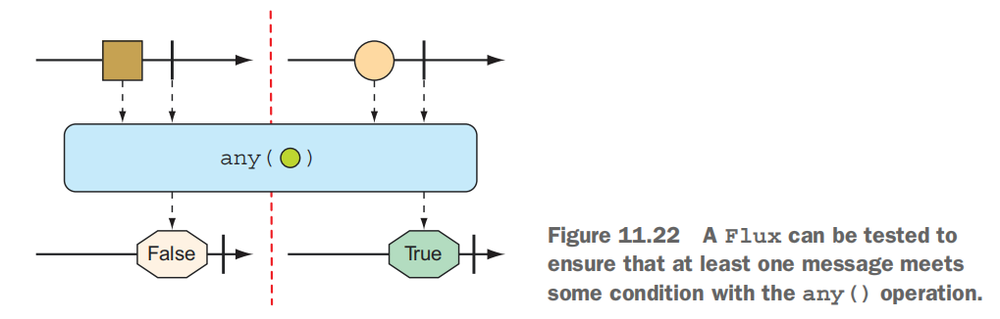

# Spring

# Part 1 --- Foundational Spring

## 1 Getting started with Spring

### 1.1 What is Spring

1.1.1 Spring application context

Spring offers a container, often referred to as the Spring application context, that creates and manages application components. These components, or beans,are wired together inside the Spring application context to make a complete application.

the next Figure illustrates the relationships between these beans and the Springapplication context


Historically,the way you would guide Spring’s application context to wire beans together was with one or more XML files that described the components and their relationship to other components.For example:

```xml
<bean id="inventoryService"
 	class="com.example.InventoryService" />
<bean id="productService"
 	class="com.example.ProductService" />
 <constructor-arg ref="inventoryService" />
</bean>
```

In recent versions of Spring, however, a Java-based configuration is more common.

```java
@Configuration
public class ServiceConfiguration {
 	@Bean
	 public InventoryService inventoryService() {
 		return new InventoryService();
 	 }
	@Bean
 	public ProductService productService() {
 		return new ProductService(inventoryService());
 	 }
}
```

The @Configuration annotation indicates to Spring that this is a configuration class that will provide beans to the Spring application context.
 The configuration’s methods are annotated with @Bean, indicating that the objects they return should be added as beans in the application context (where, bydefault, their respective bean IDs will be the same as the names of the methods thatdefine them).

>  Java-based configuration offers several benefits,including ==greater type safety and improved refactorability.==

#### 1.1.2 Dependency injection

DI is a design pattern where the dependencies (i.e., other objects or services) required by a component are provided to it, rather than the component creating or managing those dependencies itself. 

### 1.2 Initializing a Spring application

#### 1.2.1 bootstrap the application

One of the most powerful lines of code is also one of the shortest.

```java
package sia.tacocloud;

import org.springframework.boot.SpringApplication;
import org.springframework.boot.autoconfigure.SpringBootApplication;

@SpringBootApplication //the most powerful lines of code
public class TacoCloudApplication {

    public static void main(String[] args) {
        SpringApplication.run(TacoCloudApplication.class, args);
    }

}
```

`@SpringBootApplication` is a composite annotation that combines the following three annotations:

* `@SpringBootConfiguration`----Designates this class as a configuration class.Although there’s not much configuration in the class yet, you can add Javabased Spring Framework configuration to this class if you need to. This annotation is, in fact, ==a specialized form of the `@Configuration` annotation==.
* `@EnableAutoConfiguration`---Enables Spring Boot automatic configuration.We’ll talk more about autoconfiguration later. For now, know that this annotation tells Spring Boot to automatically configure any components that it thinksyou’ll need.
* `@ComponentScan`---Enables component scanning. This lets you declare otherclasses with annotations like `@Component`, `@Controller`, and `@Service` to have Spring automatically discover and register them as components in the Spring application context.

#### 1.2.2 Testing The Application

Manual testing implies that there’s a human involved and thus potential for human error and inconsistent testing. Automated tests are more consistent and repeatable.

Recognizing this, the Spring Initializr gives you a test class to get started. The following listing shows the baseline test class.

```java
package sia.tacocloud;

import org.junit.jupiter.api.Test;
import org.springframework.boot.test.context.SpringBootTest;

@SpringBootTest
class TacoCloudApplicationTests {

    @Test
    void contextLoads() {
    }

}
```

This test class does perform an essential check to ensure that the Spring application context can be loaded successfully. If you make any changes that prevent the Spring application context from being created, this test fails, and you can react by fixing the problem.

`@SpringBootTest` is a compositeannotation, which is itself annotated with `@ExtendWith(SpringExtension.class)`, to add Spring testing capabilities to JUnit 5. 

### 1.3 Writing a Spring application

#### 1.3.1 Handing web requests

In the context of web development, a request and a response are fundamental concepts in the communication between a client (typically a web browser) and a server.

1. **Request:** When you, ==as a user==, access a website by entering a URL in your browser or clicking a link, your browser sends a request to the server hosting that website. This request includes information about the resource you want (e.g., a webpage, an image) and additional details like the type of request (GET, POST, etc.), headers, and sometimes data, depending on the type of request.
2. **Response:** The server processes the request and sends back a response to the browser. This response includes the requested resource (like an HTML page or an image), along with metadata such as status codes, headers, and sometimes additional data. The browser then interprets the response and renders the content to display on your screen.

```java
package tacos;

import org.springframework.stereotype.Controller;
import org.springframework.web.bind.annotation.GetMapping;

@Controller  //the controller
public class HomeController {
    @GetMapping("/") //handlers requests for the root path/
    public String home(){
        return "home";// returns the view name
    }

}
```

`@Controller`--- Its primary purpose is to identify this class as a component for component scanning.Because HomeController is annotated with `@Controller`, Spring’s component scanning automatically discovers it and creates an instance of HomeController as a bean in the Spring application context.In fact, a handful of other annotations (including `@Component`, `@Service`, and`@Repository`) serve a purpose similar to `@Controller`.The choice of `@Controller `is, however, more ==descriptive of this component’s role== in the application.

`@GetMapping`--- The home() annotated with `@GetMapping` to indicate that if an HTTP GET request is received for the root path /, then this method should handle that request. It does so by doing nothing more than ==returning a `String` value of `home`==. This value is interpreted as the logical name of a view.

The template name is derived from the logical view name by prefixing it with /templates/ and postfixing it with .html. The resulting path for the template is /templates/home.html.

> Why Thymeleaf?
>
> Even though JSP may seem like an obvious choice,there are some challenges to overcome when using JSP with Spring Boot. I didn’t want to go down that rabbit hole in chapter 1. Hang tight. We’ll look at other template options, including JSP, in chapter 2.

```html
<!DOCTYPE html>
<html lang="en"  xmlns="http://www.w3.org/1999/xhtml"
                xmlns:th="http://www.thymeleaf.org">
<head>
    <meta charset="UTF-8">
    <title>Taco Cloud</title>
</head>
<body>
    <h1>Welcome to ...</h1>
    
</body>
</html>
```

The following code will test the home page

```java
package tacos;

import org.junit.jupiter.api.Test;
import org.springframework.beans.factory.annotation.Autowired;
import org.springframework.boot.test.autoconfigure.web.servlet.WebMvcTest;
import org.springframework.test.web.servlet.MockMvc;

import static 
 org.hamcrest.Matchers.containsString;
import static      org.springframework.test.web.servlet.request.MockMvcRequestBuilders.get;
import static
 org.springframework.test.web.servlet.result.MockMvcResultMatchers.content;
import static
 org.springframework.test.web.servlet.result.MockMvcResultMatchers.status;
import static
 org.springframework.test.web.servlet.result.MockMvcResultMatchers.view;

@WebMvcTest(HomeController.class)
public class HomeControllerTest {
    @Autowired
    private MockMvc mockMvc;

    @Test
    public  void testHomePage() throws Exception {
        mockMvc.perform(get("/"))
                .andExpect(status().isOk())
                .andExpect(view().name("home"))
                .andExpect(content().string(
                        containsString("Welcome to ...")
                ));
    }
}
```

#### 1.3.2 Getting to know Spring Boot DevTools

As its name suggests, DevTools provides Spring developers with some handy development-time tools. Among those are the following:

* Automatic application restart when code changes
* Automatic browser refresh when browser-destined resources (such as templates,JavaScript, stylesheets, and so on) change
* Automatic disabling of template caches
* Built in H2 Console, if the H2 database is in use

#### 1.3.3 How does application work

What is Spring doing behind the scenes to make sure your application needs are met? To understand what Spring is doing, let’s start by looking at the build specification.

```xml
<dependencies>
        <dependency>
            <groupId>org.springframework.boot</groupId>
            <artifactId>spring-boot-starter-thymeleaf</artifactId>
        </dependency>
        <dependency>
            <groupId>org.springframework.boot</groupId>
            <artifactId>spring-boot-starter-web</artifactId>
        </dependency>

        <dependency>
            <groupId>org.springframework.boot</groupId>
            <artifactId>spring-boot-devtools</artifactId>
            <scope>runtime</scope>
            <optional>true</optional>
        </dependency>
        <dependency>
            <groupId>org.projectlombok</groupId>
            <artifactId>lombok</artifactId>
            <optional>true</optional>
        </dependency>
        <dependency>
            <groupId>org.springframework.boot</groupId>
            <artifactId>spring-boot-starter-test</artifactId>
            <scope>test</scope>
        </dependency>
    </dependencies>
```


In the pom.xml file, you declared a dependency on the Web and Thymeleaf starters. These two dependencies transitively brought in a handful of other dependencies,including the following:

1. Spring’s MVC framework
2. Embedded Tomcat
3. Thymeleaf and the Thymeleaf layout dialect

It also brought Spring Boot’s autoconfiguration library along for the ride. When the application starts, Spring Boot autoconfiguration detects those libraries and automatically performs the following tasks:

1. Configures the beans in the Spring application context to enable Spring MVC
2. Configures the embedded Tomcat server in the Spring application context
3. Configures a Thymeleaf view resolver for rendering Spring MVC views with Thymeleaf templates

In short, ==autoconfiguration does all the grunt work==, leaving you to focus on writing code that implements your application functionality.

### 1.4 Surverying the Spring landscape

#### 1.4.1 The core Spring Framework

The core Spring Framework is the foundation of everything else in the Spring universe.It provides the ==core container and dependency== injection framework. But it also provides a few other essential features.

1. Using Spring MVC to write a controller class to handle web requests.Spring MVC can also be used to create REST APIs that produce non-HTML output.
2. Offerring some elemental data persistence support,specifically, template-based JDBC support.
3. Spring includes support for reactive-style programming, including a new reactive web framework called Spring WebFlux that borrows heavily from Spring MVC.

#### 1.4.2 Spring Boot

In addition to starter dependencies and autoconfiguration,Spring Boot also offers the following other useful features:

1. The Actuator provides runtime insight into the inner workings of an application, including metrics, thread dump information, application health, and environment properties available to the application.
2. Flexible specification of environment properties.
3. Additional testing support on top of the testing assistance found in the core framework.

#### 1.4.3 Spring Data

Spring Data provides something quite amazing: the ability to define your application’s data repositories as simple Java interfaces, using a naming convention when defining methods to drive how data is stored and retrieved.

What’s more, Spring Data is capable of working with several different kinds of databases, including relational (via JDBC or JPA), document (Mongo), graph (Neo4j),and others.

### 1.4.4 Spring Security

Spring Security addresses a broad range of application security needs, including authentication, authorization, and API security.

#### 1.4.5 Spring Integration and Spring Batch

At some point, most applications will need to integrate with other applications or even with other components of the same application. Several patterns of application integration have emerged to address these needs. Spring Integration and Spring Batch provide the implementation of these patterns for Spring applications.

Spring Integration addresses real-time integration where data is processed as it’s made available. In contrast, Spring Batch addresses batched integration where data is allowed to collect for a time until some trigger (perhaps a time trigger) signals that it’s time for the batch of data to be processed.

#### 1.4.6 Spring Cloud

The application development world is entering a new era where we’ll no longer develop our applications as single-deployment, unit monoliths and will instead compose applications from several individual deployment units known as microservices.
Microservices are a hot topic, addressing several practical development and runtime concerns. In doing so, however, they bring to fore their own challenges. Those challenges are met head-on by Spring Cloud, a collection of projects for developing cloud-native applications with Spring.

For a complete discussion of Spring Cloud, I suggest taking a look at Cloud Native Spring in Action by Thomas Vitale (Manning, 2020, www.manning.com/books/ cloud-native-spring-in-action).

### 1.4.7 Spring Native

A relatively new development in Spring is the Spring Native project. This experimental project enables compilation of Spring Boot projects into native executables using the GraalVM native-image compiler, resulting in images that start significantly faster and have a lighter footprint.
For more information on Spring Native, see https://github.com/spring-projects experimental/spring-native

### 1.5 Summary 

1. Spring aims to ==make developer challenges easy==, like creating web applications,working with databases, securing applications, and microservices.
2. Spring Boot builds on top of Spring to make Spring even easier with ==simplified dependency management, automatic configuration, and runtime insights==.
3. Spring applications can be initialized using the Spring Initializr, which is webbased and ==supported natively in most Java development environments==.
4. The components, commonly referred to as beans, in a Spring application context can be declared explicitly with Java or XML, discovered by component scanning, or automatically configured with Spring Boot autoconfigurations.

## 2 Developing Web Application

### 2.1 Displaying information

the typical Spring MVC request flow


#### 2.1.1 Establishing the domain

```java
package tacos;

import lombok.Data;

@Data
public class Ingredient {
    private final String id;
    private final String name;
    private final Type type;

    public enum Type{
        WRAP,PROTEIN,VEGGIES,CHEESE,SAUCE
    }
}
```

`@Data`: the `@Data` annotation at the class level is provided by Lombok and tells Lombok to generate all of those missing methods(equals(), hashCode(),toString(), and others.) as well as a constructor that accepts all final properties as arguments. By using Lombok, you can keep the code for Ingredient slim and trim.

To use Lombok, you can manually add it with the following entry in pom.xml:

```xml
<dependency>
 <groupId>org.projectlombok</groupId>
 <artifactId>lombok</artifactId>
</dependency>
```

If you decide to manually add Lombok to your build, you’ll also want to exclude it from the Spring Boot Maven plugin in the <build> section of the pom.xml file.The Spring Boot Maven plugin automatically includes some dependencies, and it might include Lombok by default. However, ==if you've manually added Lombok to your project==, having it included again by the Spring Boot Maven plugin ==might lead to conflicts or unnecessary duplication==.

```xml
<build>
    <plugins>
        <plugin>
            <groupId>org.springframework.boot</groupId>
            <artifactId>spring-boot-maven-plugin</artifactId>
            <configuration>
                <excludes>
                    <exclude>
                        <groupId>org.projectlombok</groupId>
                        <artifactId>lombok</artifactId>
                    </exclude>
                </excludes>
            </configuration>
        </plugin>
    </plugins>
</build>
```


```java
package tacos;

import lombok.Data;
import java.util.List;

@Data
public class Taco {
    private String name;

    private List<Ingredient> ingredients;
}
```


```java
package tacos;

import lombok.Data;
import java.util.ArrayList;
import java.util.List;

@Data
public class TacoOrder {
    private String deliveryName;
    private String deliveryStreet;
    private String deliveryCity;
    private String deliveryState;
    private String deliveryZip;
    private String ccNumber;
    private String ccExpiration;
    private String ccCVV;

    private List<Taco> tacos = new ArrayList<>();
    public void addTaco(Taco taco) {
        this.tacos.add(taco);
    }
}
```

#### 2.1.2 creating a controller class

==Controllers== are the major players in Spring’s MVC framework. Their primary job is to ==handle HTTP requests and either hand off a request to a view to render HTML (browser-displayed) or write data directly to the body of a response (RESTful)==.

```java
package tacos.web;

import java.util.Arrays;
import java.util.List;
import java.util.stream.Collectors;
import org.springframework.stereotype.Controller;
import org.springframework.ui.Model;
import org.springframework.web.bind.annotation.GetMapping;
import org.springframework.web.bind.annotation.ModelAttribute;
import org.springframework.web.bind.annotation.PostMapping;
import org.springframework.web.bind.annotation.RequestMapping;
import org.springframework.web.bind.annotation.SessionAttributes;

import lombok.extern.slf4j.Slf4j;
import tacos.Ingredient;
import tacos.Ingredient.Type;
import tacos.Taco;
import tacos.TacoOrder;

import javax.validation.Valid;
import org.springframework.validation.Errors;

@Slf4j
@Controller
@RequestMapping("/design")
@SessionAttributes("tacoOrder")
public class DesignTacoController {


    @ModelAttribute
    public void addIngredientsToModel(Model model) {
        List<Ingredient> ingredients = Arrays.asList(
                new Ingredient("FLTO", "Flour Tortilla", Type.WRAP),
                new Ingredient("COTO", "Corn Tortilla", Type.WRAP),
                new Ingredient("GRBF", "Ground Beef", Type.PROTEIN),
                new Ingredient("CARN", "Carnitas", Type.PROTEIN),
                new Ingredient("TMTO", "Diced Tomatoes", Type.VEGGIES),
                new Ingredient("LETC", "Lettuce", Type.VEGGIES),
                new Ingredient("CHED", "Cheddar", Type.CHEESE),
                new Ingredient("JACK", "Monterrey Jack", Type.CHEESE),
                new Ingredient("SLSA", "Salsa", Type.SAUCE),
                new Ingredient("SRCR", "Sour Cream", Type.SAUCE)
        );

        Type[] types = Ingredient.Type.values();
        for (Type type : types) {
            model.addAttribute(type.toString().toLowerCase(),
                    filterByType(ingredients, type));
        }
    }

    @ModelAttribute(name = "tacoOrder")
    public TacoOrder order() {
        return new TacoOrder();
    }

    @ModelAttribute(name = "taco")
    public Taco taco() {
        return new Taco();
    }

    @GetMapping
    public String showDesignForm() {
        return "design";
    }

/*
  @PostMapping
  public String processTaco(Taco taco,
  			@ModelAttribute TacoOrder tacoOrder) {
    tacoOrder.addTaco(taco);
    log.info("Processing taco: {}", taco);

    return "redirect:/orders/current";
  }
 */

    @PostMapping
    public String processTaco(
            @Valid Taco taco, Errors errors,
            @ModelAttribute TacoOrder tacoOrder) {

        if (errors.hasErrors()) {
            return "design";
        }

        tacoOrder.addTaco(taco);
        log.info("Processing taco: {}", taco);

        return "redirect:/orders/current";
    }

    private Iterable<Ingredient> filterByType(
            List<Ingredient> ingredients, Type type) {
        return ingredients
                .stream()
                .filter(x -> x.getType().equals(type))
                .collect(Collectors.toList());
    }

}

```

1. `@Slf4j`--- is a Lombok-provided annotation that, at compilation time, will automatically generate an SLF4J (Simple Logging Facade for Java,https://www.slf4j.org/)

   > `Logger` static property in the class. This modest annotation has the same effect as if you were to explicitly add the following lines within the class:
   >
   > ```java
   > private static final org.slf4j.Logger log =
   >  org.slf4j.LoggerFactory.getLogger(DesignTacoController.class);
   > ```

2. `@Controller`---This annotation serves to identify this class as a controller and to mark it as a candidate for
   component scanning, so that Spring will discover it and automatically create an instance of `DesignTacoController` as a bean in the Spring application context.

3. `@RequestMapping`--- when applied at the class level, specifies the kind of requests that this controller handles.

4. `@SessionAttributes("tacoOrder")`--- This indicates that the TacoOrder object that is put into the model a little later in the class should be maintained in session

5. | Annotation        | Description                      |
   | ----------------- | -------------------------------- |
   | `@RequestMapping` | General-purpose request handling |
   | `@GetMapping`     | Handles HTTP *GET* requests      |
   | `@PostMapping`    | Handles HTTP *POST* requests     |
   | `@PutMapping`     | Handles HTTP *PUT* requests      |
   | `@DeleteMapping`  | Handles HTTP *DELETE* requests   |
   | `@PatchMapping`   | Handles HTTP *PATCH* requests    |

6. `@ModelAttribute` --- is an annotation in Spring Framework used in the context of Spring MVC. It is primarily used to bind method parameters or method return values to a model attribute.

> addIngredientsToModel

#### 2.1.3 Designing the view

Thymeleaf are designed to be decoupled from any particular web framework. As such, they’re unaware of Spring’s model abstraction and are unable to work with the data that the controller places in Model. But they can work with ==servlet request attributes.==

```html
<!DOCTYPE html>
<html lang="en" xmlns="http://www.w3.org/1999/xhtml"
                xmlns:th="http://www.thymeleaf.org">
<head>
    <meta charset="UTF-8">
    <title>Taco Cloud</title>
    <link rel="stylesheet" th:href="@{/styles.css}" />
</head>
<body>
<h1>Design your taco!</h1>


<!-- tag::formTag[] -->
<form method="POST" th:object="${taco}">
    <!-- end::all[] -->

    <span class="validationError"
          th:if="${#fields.hasErrors('ingredients')}"
          th:errors="*{ingredients}">Ingredient Error</span>

    <!-- tag::all[] -->
    <div class="grid">
        <!-- end::formTag[] -->
        <!-- end::head[] -->
        <div class="ingredient-group" id="wraps">
            <!-- tag::designateWrap[] -->
            <h3>Designate your wrap:</h3>
            <div th:each="ingredient : ${wrap}">
                <input th:field="*{ingredients}" type="checkbox"
                       th:value="${ingredient.id}"/>
                <span th:text="${ingredient.name}">INGREDIENT</span><br/>
            </div>
            <!-- end::designateWrap[] -->
        </div>

        <div class="ingredient-group" id="proteins">
            <h3>Pick your protein:</h3>
            <div th:each="ingredient : ${protein}">
                <input th:field="*{ingredients}" type="checkbox"
                       th:value="${ingredient.id}"/>
                <span th:text="${ingredient.name}">INGREDIENT</span><br/>
            </div>
        </div>

        <div class="ingredient-group" id="cheeses">
            <h3>Choose your cheese:</h3>
            <div th:each="ingredient : ${cheese}">
                <input th:field="*{ingredients}" type="checkbox"
                       th:value="${ingredient.id}"/>
                <span th:text="${ingredient.name}">INGREDIENT</span><br/>
            </div>
        </div>

        <div class="ingredient-group" id="veggies">
            <h3>Determine your veggies:</h3>
            <div th:each="ingredient : ${veggies}">
                <input th:field="*{ingredients}" type="checkbox"
                       th:value="${ingredient.id}"/>
                <span th:text="${ingredient.name}">INGREDIENT</span><br/>
            </div>
        </div>

        <div class="ingredient-group" id="sauces">
            <h3>Select your sauce:</h3>
            <div th:each="ingredient : ${sauce}">
                <input th:field="*{ingredients}" type="checkbox"
                       th:value="${ingredient.id}"/>
                <span th:text="${ingredient.name}">INGREDIENT</span><br/>
            </div>
        </div>
    </div>

    <div>


        <h3>Name your taco creation:</h3>
        <input type="text" th:field="*{name}"/>
        <!-- end::all[] -->
        <span class="validationError"
              th:if="${#fields.hasErrors('name')}"
              th:errors="*{name}">Name Error</span>
        <!-- tag::all[] -->
        <br/>

        <button>Submit Your Taco</button>
    </div>
    <!-- tag::closeFormTag[] -->
</form>
<!-- end::closeFormTag[] -->
</body>
</html>
```


2.2 Processing form submission

 The `name` field on the form needs to capture only a simple textual value. Thus the `name` property of Taco is of type `String`.

The ingredients check boxes also have textual values, but because zero or many of them may be selected, the ingredients property that they’re bound to is a List<Ingredient> that will capture each of the chosen ingredients.If the ingredients check boxes have textual (e.g., String) values, but the Taco object represents a list of ingredients as List<Ingredient>, then isn’t there a mismatch?----==yes,it's a potential mismatch in the data types.==Here is the solution.

A converter is any class that implements Spring’s `Converter` interface and implements its `convert()`method to take one value and convert it to another.

```java
package tacos.web;

import org.springframework.core.convert.converter.Converter;
import org.springframework.stereotype.Component;
import tacos.Ingredient;

import java.util.HashMap;
import java.util.Map;

@Component
public class IngredientByIdConverter implements Converter<String, Ingredient> {
    private Map<String, Ingredient> ingredientMap = new HashMap<>();

    public IngredientByIdConverter() {
        ingredientMap.put("FLTO",
                new Ingredient("FLTO", "Flour Tortilla", Ingredient.Type.WRAP));
        ingredientMap.put("COTO",
                new Ingredient("COTO", "Corn Tortilla", Ingredient.Type.WRAP));
        ingredientMap.put("GRBF",
                new Ingredient("GRBF", "Ground Beef", Ingredient.Type.PROTEIN));
        ingredientMap.put("CARN",
                new Ingredient("CARN", "Carnitas", Ingredient.Type.PROTEIN));
        ingredientMap.put("TMTO",
                new Ingredient("TMTO", "Diced Tomatoes", Ingredient.Type.VEGGIES));
        ingredientMap.put("LETC",
                new Ingredient("LETC", "Lettuce", Ingredient.Type.VEGGIES));
        ingredientMap.put("CHED",
                new Ingredient("CHED", "Cheddar", Ingredient.Type.CHEESE));
        ingredientMap.put("JACK",
                new Ingredient("JACK", "Monterrey Jack", Ingredient.Type.CHEESE));
        ingredientMap.put("SLSA",
                new Ingredient("SLSA", "Salsa", Ingredient.Type.SAUCE));
        ingredientMap.put("SRCR",
                new Ingredient("SRCR", "Sour Cream", Ingredient.Type.SAUCE));
    }

    @Override
    public Ingredient convert(String id) {
        return ingredientMap.get(id);
    }
}
```

```java
  @PostMapping
  public String processTaco(Taco taco,
  			@ModelAttribute TacoOrder tacoOrder) {
    tacoOrder.addTaco(taco);
    log.info("Processing taco: {}", taco);

    return "redirect:/orders/current";
  }
```

processTaco() finishes by returning aString value.The value returned indicates a view that will be shown to the user. But the value returned is prefixed with "redirect:", indicating that this is a redirect view.

> the difference between (`redirect:/successPage`) and (`successView`)
>
> 1. Redirecting to Another URL ("redirect:/successPage"):==generate two requests==
>    * In a redirect, the browser is instructed to make a new request to a different URL.
>    * The URL specified with the "redirect:" prefix is sent to the browser, and the browser then makes a new GET request to that URL.
>    * This is useful when you want to completely change the URL in the user's browser and perform a new, separate request.
>    * It's commonly used after processing a form submission to prevent users from accidentally resubmitting the form when they refresh the page.
> 2. Forwarding to Another View (`successView`):==generate only one request==
>    - In a forward, the request is internally forwarded to another view within the same request.
>    - The URL in the browser's address bar doesn't change; it remains the URL of the original request.
>    - This is useful when you want to reuse the existing request and simply render a different view based on the same request.
>    - It's commonly used when you want to display a success page without changing the URL.

```java
package tacos.web;
import org.springframework.stereotype.Controller;
import org.springframework.web.bind.annotation.GetMapping;
import org.springframework.web.bind.annotation.RequestMapping;
import org.springframework.web.bind.annotation.SessionAttributes;
import org.springframework.web.bind.support.SessionStatus;
import lombok.extern.slf4j.Slf4j;
import tacos.TacoOrder;
@Slf4j
@Controller
@RequestMapping("/orders")
@SessionAttributes("tacoOrder")
public class OrderController {
    
 	@GetMapping("/current")
 	public String orderForm() {
 		return "orderForm";
	}
}
```

```html
<!-- tag::allButValidation[] -->
<!DOCTYPE html>
<html xmlns="http://www.w3.org/1999/xhtml"
      xmlns:th="http://www.thymeleaf.org">
  <head>
    <title>Taco Cloud</title>
    <link rel="stylesheet" th:href="@{/styles.css}" />
  </head>

  <body>

    <form method="POST" th:action="@{/orders}" th:object="${tacoOrder}">
      <h1>Order your taco creations!</h1>

      

      <h3>Your tacos in this order:</h3>
      <a th:href="@{/design}" id="another">Design another taco</a><br/>
      <ul>
        <li th:each="taco : ${tacoOrder.tacos}">
          <span th:text="${taco.name}">taco name</span></li>
      </ul>

<!-- end::allButValidation[] -->
      <div th:if="${#fields.hasErrors()}">
        <span class="validationError">
        Please correct the problems below and resubmit.
        </span>
      </div>

<!-- tag::allButValidation[] -->
      <h3>Deliver my taco masterpieces to...</h3>
      <label for="deliveryName">Name: </label>
      <input type="text" th:field="*{deliveryName}"/>
<!-- end::allButValidation[] -->
      <span class="validationError"
            th:if="${#fields.hasErrors('deliveryName')}"
            th:errors="*{deliveryName}">Name Error</span>
<!-- tag::allButValidation[] -->
      <br/>

      <label for="deliveryStreet">Street address: </label>
      <input type="text" th:field="*{deliveryStreet}"/>
<!-- end::allButValidation[] -->
      <span class="validationError"
            th:if="${#fields.hasErrors('deliveryStreet')}"
            th:errors="*{deliveryStreet}">Street Error</span>
<!-- tag::allButValidation[] -->
      <br/>

      <label for="deliveryCity">City: </label>
      <input type="text" th:field="*{deliveryCity}"/>
<!-- end::allButValidation[] -->
      <span class="validationError"
            th:if="${#fields.hasErrors('deliveryCity')}"
            th:errors="*{deliveryCity}">City Error</span>
<!-- tag::allButValidation[] -->
      <br/>

      <label for="deliveryState">State: </label>
      <input type="text" th:field="*{deliveryState}"/>
<!-- end::allButValidation[] -->
      <span class="validationError"
            th:if="${#fields.hasErrors('deliveryState')}"
            th:errors="*{deliveryState}">State Error</span>
<!-- tag::allButValidation[] -->
      <br/>

      <label for="deliveryZip">Zip code: </label>
      <input type="text" th:field="*{deliveryZip}"/>
<!-- end::allButValidation[] -->
      <span class="validationError"
            th:if="${#fields.hasErrors('deliveryZip')}"
            th:errors="*{deliveryZip}">Zip Error</span>
<!-- tag::allButValidation[] -->
      <br/>

      <h3>Here's how I'll pay...</h3>
<!-- tag::validatedField[] -->
      <label for="ccNumber">Credit Card #: </label>
      <input type="text" th:field="*{ccNumber}"/>
<!-- end::allButValidation[] -->
      <span class="validationError"
            th:if="${#fields.hasErrors('ccNumber')}"
            th:errors="*{ccNumber}">CC Num Error</span>
<!-- tag::allButValidation[] -->
<!-- end::validatedField[] -->
      <br/>

      <label for="ccExpiration">Expiration: </label>
      <input type="text" th:field="*{ccExpiration}"/>
<!-- end::allButValidation[] -->
      <span class="validationError"
            th:if="${#fields.hasErrors('ccExpiration')}"
            th:errors="*{ccExpiration}">CC Num Error</span>
<!-- tag::allButValidation[] -->
      <br/>

      <label for="ccCVV">CVV: </label>
      <input type="text" th:field="*{ccCVV}"/>
<!-- end::allButValidation[] -->
      <span class="validationError"
            th:if="${#fields.hasErrors('ccCVV')}"
            th:errors="*{ccCVV}">CC Num Error</span>
<!-- tag::allButValidation[] -->
      <br/>

      <input type="submit" value="Submit Order"/>
    </form>
  </body>
</html>
<!-- end::allButValidation[] -->
```

Without an action specified, the formm would submit an HTTP POST request back to the same URL that presented the form.But here, you specify that the form should be POSTed to /orders (using Thymeleaf’s @{…} operator for a context-relative path).

```java
@PostMapping
public String processOrder(TacoOrder order,
 	SessionStatus sessionStatus) {
 	log.info("Order submitted: {}", order);
 	sessionStatus.setComplete();//ensuring that the session is cleaned up 
    return "redirect:/";		//and ready for a new order the next time the 								//user creates a taco.
 	
}
```

### 2.3 Validating form input

The Validation API offers several annotations that can be placed on properties of domain objects to declare validation rules.If you prefer manually editing your build, the following entry in the Maven pom.xml file will do the trick:

```xml
<dependency>
      <groupId>org.springframework.boot</groupId>
      <artifactId>spring-boot-starter-validation</artifactId>
</dependency>
```

#### 2.3.1 Declaring validation rules

```java
package tacos;

import lombok.Data;

import javax.validation.constraints.NotNull;
import javax.validation.constraints.Size;
import java.util.List;

@Data
public class Taco {
    @NotNull
    @Size(min=5, message="Name must be at least 5 characters long")
    private String name;

    @NotNull
    @Size(min=1, message="You must choose at least 1 ingredient")
    private List<Ingredient> ingredients;
}
```

```java
package tacos;
import javax.validation.constraints.Digits;
import javax.validation.constraints.NotBlank;
import javax.validation.constraints.Pattern;
import org.hibernate.validator.constraints.CreditCardNumber;
import java.util.List;
import java.util.ArrayList;
import lombok.Data;

@Data
public class TacoOrder {

    @NotBlank(message="Delivery name is required")
    private String deliveryName;

    @NotBlank(message="Street is required")
    private String deliveryStreet;

    @NotBlank(message="City is required")
    private String deliveryCity;

    @NotBlank(message="State is required")
    private String deliveryState;

    @NotBlank(message="Zip code is required")
    private String deliveryZip;

    @CreditCardNumber(message="Not a valid credit card number")
    private String ccNumber;

    @Pattern(regexp="^(0[1-9]|1[0-2])([\\/])([2-9][0-9])$",
            message="Must be formatted MM/YY")
    private String ccExpiration;

    // contains exactly three numeric digits.
    @Digits(integer=3, fraction=0, message="Invalid CVV")
    private String ccCVV;

    private List<Taco> tacos = new ArrayList<>();

    public void addTaco(Taco taco) {
        this.tacos.add(taco);
    }
}
```

#### 2.3.2 Performing validation at form binding

```java
@PostMapping
    public String processTaco(
            @Valid Taco taco, Errors errors,
            @ModelAttribute TacoOrder tacoOrder) {

        if (errors.hasErrors()) {
            return "design";
        }

        tacoOrder.addTaco(taco);
        log.info("Processing taco: {}", taco);

        return "redirect:/orders/current";
    }
```

The `@Valid` annotation tells Spring MVC to perform validation on the submitted Taco object after it’s bound to the submitted form data and before the processTaco() method is called.

If there are any validation errors, the details of those errors will be captured in an `Errors` object that’s passed into processTaco(). The first few lines of processTaco() consult the Errors object, asking its hasErrors() method if there are any validation errors. If there are, the method concludes without processing the Taco and returns the "design" view name so that the form is redisplayed.

```java
@PostMapping
  public String processOrder(@Valid TacoOrder order, Errors errors,
		  SessionStatus sessionStatus) {
    if (errors.hasErrors()) {
      return "orderForm";
    }

    log.info("Order submitted: {}", order);
    sessionStatus.setComplete();

    return "redirect:/";
  }
```

#### 2.3.3 Displaying vaildation errors

Thymeleaf offers convenient access to the Errors object via the fields property and with its `th:errors` attribute.

```java
<label for="ccNumber">Credit Card #: </label>
 	<input type="text" th:field="*{ccNumber}"/>
 	<span class="validationError"
 	th:if="${#fields.hasErrors('ccNumber')}"
	 th:errors="*{ccNumber}">CC Num Error</span>
```

Aside from a class attribute that can be used to style the error so that it catches the user’s attention, the <span> element uses a th:if attribute to decide whether to display the <span>. The fields property’s hasErrors() method checks whether there are any errors in the ccNumber field. If so, the <span> will be rendered.

The `th:errors` attribute references the `ccNumber` field and, assuming errors exist for that field, it will replace the placeholder content of the `<span>` element with the validation message.


​											Validation errors displayed on the order form

### 2.4 Working with view controllers

When a controller is simple enough that it doesn’t populate a model or process input—as is the case with
your HomeController—there’s another way that you can define the controller.

```java
package tacos.web;

import org.springframework.context.annotation.Configuration;
import org.springframework.web.servlet.config.annotation.ViewControllerRegistry;
import org.springframework.web.servlet.config.annotation.WebMvcConfigurer;

@Configuration
public class WebConfig implements WebMvcConfigurer {

  @Override
  public void addViewControllers(ViewControllerRegistry registry) {
    registry.addViewController("/").setViewName("home");
  }

}
```

`WebMvcConfigurer` defines several methods for configuring Spring MVC. Even though it’s an interface, it provides default implementations of all the methods, so you need to override only the methods you need.

The addViewControllers() method is given a ViewControllerRegistry that you can use to register one or more view controllers.

### 2.5 Choosing a view template library

 The follow table  catalogs the template options supported by Spring Boot autoconfiguration.

| Template               | Spring Boot starter dependency       |
| ---------------------- | ------------------------------------ |
| FreeMarker             | spring-boot-starter-freemarker       |
| Groovy templates       | spring-boot-starter-groovy-templates |
| JavaServer Pages (JSP) | None (provided by Tomcat or Jetty)   |
| Mustache               | spring-boot-starter-mustache         |
| Thymeleaf              | spring-boot-starter-thymeleaf        |

#### 2.5.1 Caching templates

By default, templates are parsed only once—when they’re first used—and the results of that parse are cached for subsequent use. This is a great feature for production, because it prevents redundant template parsing on each request and thus improves performance.

That feature is not so awesome at development time, however. Fortunately, we have a way to disable caching. All we need to do is set a templateappropriate caching property to ==false==.

| Template         | Cache-enable property        |
| ---------------- | ---------------------------- |
| FreeMarker       | spring.freemarker.cache      |
| Groovy templates | spring.groovy.template.cache |
| Mustache         | spring.mustache.cache        |
| Thymeleaf        | spring.thymeleaf.cache       |

By default, all of these properties are set to true to enable caching. You can disable caching for your chosen template engine by setting its cache property to false. 

```properties
spring.thymeleaf.cache=false
```

### 2.6 Summary

1. Spring offers a powerful web framework called Spring MVC that can be used to develop the web frontend for a Spring application.
2. Spring MVC is annotation-based, enabling the declaration of request-handling methods with annotations such as `@RequestMapping`, `@GetMapping`, and `@PostMapping`.
3. Most request-handling methods conclude by returning the logical name of a view, such as a Thymeleaf template, to which the request (along with any model data) is forwarded.
4. Spring MVC supports validation through the JavaBean Validation API and implementations of the Validation API such as Hibernate Validator.
5. View controllers can be registered with `addViewController` in a `WebMvcConfigurer` class to handle HTTP GET requests for which no model data or processing is required.
6. In addition to Thymeleaf, Spring supports a variety of view options, including FreeMarker, Groovy templates, and Mustache.

## 3 Working with data                                                                                                                                                                                                                                                                                                                                                                                                                                                                                                                                                                                                                                                                                                                                                                                                                                                                                                                                                                                                                                                                                                                                                                                                                                                                                                                                                                                                  

Spring JDBC support is rooted in the `JdbcTemplate` class. JdbcTemplate provides a means by which developers can perform SQL operations against a relational database without all the ceremony and boilerplate typically required when working with JDBC.

### 3.1.Reading and writing data with JDBC

#### 3.1.1 *Adapting the domain for persistence*

```java
@Data
public class Taco {
  private Long id;
  private Date createdAt = new Date();
  // ...
}
```


```java
@Data
public class TacoOrder implements Serializable {
 private static final long serialVersionUID = 1L;
 private Long id;
 private Date placedAt;
 // ...
}
```


#### 3.1.2 Working with JdbcTemplate

Before you can start using JdbcTemplate, you need to add it to your project classpath.

```xml
<dependency>
 <groupId>org.springframework.boot</groupId>
 <artifactId>spring-boot-starter-jdbc</artifactId>
</dependency>
```

```java
package tacos.data;

import tacos.Ingredient;

import java.util.Optional;

public interface IngredientRepository {

    Iterable<Ingredient> findAll();

    Optional<Ingredient> findById(String id);

    Ingredient save(Ingredient ingredient);

}
```


```java
package tacos.data;

import org.springframework.jdbc.core.JdbcTemplate;
import org.springframework.stereotype.Repository;
import tacos.Ingredient;

import java.util.Optional;

@Repository
public class JdbcIngredientRepository implements IngredientRepository{

    private JdbcTemplate jdbcTemplate;

    public JdbcIngredientRepository(JdbcTemplate jdbcTemplate) {
        this.jdbcTemplate = jdbcTemplate;
    }
    
.....
}
```

`@Repository` --- By annotating with `@Repository`, you declare that it should be automatically discovered by Spring component scanning and instantiated as a bean in the Spring application context.

When Spring creates the JdbcIngredientRepository bean, it injects it with JdbcTemplate. That’s because when there’s only one constructor, ==Spring implicitly applies autowiring of dependencies through that constructor’s parameters==.If there is more than one constructor, or if you just want autowiring to be explicitly stated, then you
can annotate the constructor with @Autowired as follows:

```java
@Autowired
public JdbcIngredientRepository(JdbcTemplate jdbcTemplate) {
 	this.jdbcTemplate = jdbcTemplate;
}
```

#### 3.1.3 Defining a schema and preloading data


#### 3.1.4 Inserting data

The id property on the Taco_Order table is an identity, meaning that the database will determine the value
automatically. But if the database determines the value for you, then you will need to know what that value is so that it can be returned in the TacoOrder object returned from the save() method.Fortunately, Spring offers a helpful `GeneratedKeyHolder` type that can help with that. But it involves working with a prepared statement, as shown in the following implementation of the save() method:

```java
@Override
  @Transactional
  public TacoOrder save(TacoOrder order) {
    PreparedStatementCreatorFactory pscf =
      new PreparedStatementCreatorFactory(
        "insert into Taco_Order "
        + "(delivery_name, delivery_street, delivery_city, "
        + "delivery_state, delivery_zip, cc_number, "
        + "cc_expiration, cc_cvv, placed_at) "
        + "values (?,?,?,?,?,?,?,?,?)",
        Types.VARCHAR, Types.VARCHAR, Types.VARCHAR,
        Types.VARCHAR, Types.VARCHAR, Types.VARCHAR,
        Types.VARCHAR, Types.VARCHAR, Types.TIMESTAMP
    );
    pscf.setReturnGeneratedKeys(true);

    order.setPlacedAt(new Date());
    PreparedStatementCreator psc =
        pscf.newPreparedStatementCreator(
            Arrays.asList(
                order.getDeliveryName(),
                order.getDeliveryStreet(),
                order.getDeliveryCity(),
                order.getDeliveryState(),
                order.getDeliveryZip(),
                order.getCcNumber(),
                order.getCcExpiration(),
                order.getCcCVV(),
                order.getPlacedAt()));

    GeneratedKeyHolder keyHolder = new GeneratedKeyHolder();
    jdbcOperations.update(psc, keyHolder);
    long orderId = keyHolder.getKey().longValue();
    order.setId(orderId);

    List<Taco> tacos = order.getTacos();
    int i=0;
    for (Taco taco : tacos) {
      saveTaco(orderId, i++, taco);
    }

    return order;
  }
```

The purpose of `pscf.setReturnGeneratedKeys(true)` is to instruct Spring JDBC to return the primary key generated by the database after executing an SQL insert operation. In this method, the primary key is generated automatically by the database through auto-increment.

If `setReturnGeneratedKeys(true)` is not used, `GeneratedKeyHolder` won't capture any information about the generated primary key. By default, `GeneratedKeyHolder` does not store any generated key information. Enabling this feature with `setReturnGeneratedKeys(true)` allows `GeneratedKeyHolder` to capture the generated primary key value after inserting the record.

In this specific example, `GeneratedKeyHolder` is used to store the generated primary key value ( `orderId` ) after inserting into the `Taco_Order` table. Then, `keyHolder.getKey().longValue()` is used to retrieve this value, which is then set to `order.setId(orderId)`, ensuring that the `order` object contains the primary key value generated after the insert operation.

### 3.2 Working with Spring Data JDBC

The Spring Data project is a rather large umbrella project comprising several subprojects, most of which are focused on data persistence with a variety of different database types. A few of the most popular Spring Data projects include these:

1. Spring Data JDBC—JDBC persistence against a relational database
2. Spring Data JPA—JPA persistence against a relational database
3. Spring Data MongoDB—Persistence to a Mongo document database
4. Spring Data Neo4j—Persistence to a Neo4j graph database
5. Spring Data Redis—Persistence to a Redis key-value store
6. Spring Data Cassandra—Persistence to a Cassandra column store database

```java
package tacos.data;

import org.springframework.data.repository.CrudRepository;

import tacos.Ingredient;

public interface IngredientRepository 
         extends CrudRepository<Ingredient, String> {

}
```

```java
package tacos.data;

import org.springframework.data.repository.CrudRepository;

import tacos.TacoOrder;

public interface OrderRepository 
         extends CrudRepository<TacoOrder, Long> {

}
```

Spring Data automatically creates implementations of these interfaces at run time, you no longer need the explicit implementations in JdbcIngredientRepository and JdbcOrderRepository.

We’ll need to do is annotate our domain classes so that Spring Data JDBC will know how to persist them. Generally speaking, this means annotating the identity properties with `@Id`—so that Spring Data will know which field represents the object’s identity—and optionally annotating the class with `@Table`.

```java
@Data
@Table
public class TacoOrder implements Serializable {
    
 	private static final long serialVersionUID = 1L;
    
 	@Id
 	private Long id;
    
 	// ...
}
```

`@Table` ---  The object is mapped to a table based on the domain class name. If you’d prefer to map it to a different table name, then you can specify the table name as a parameter to @Table like this:

```JAVA
@Table("Taco_Cloud_Order")
public class TacoOrder {
 ...
}
```

`@Id` ---  It designates the id property as being the identity for a TacoOrder

`@Column` --- Explicitly define the column name mapping

```java
@Column("customer_name")
@NotBlank(message="Delivery name is required")
private String deliveryName;
```

### 3.3 Persisting data with Spring Data JPA

Whereas Spring Data JDBC makes easy work of persisting data, the Java Persistence API (JPA) is another popular option for working with data in a relational database.Spring Data JPA offers an approach to persistence with JPA similar to what Spring Data JDBC gave us for JDBC.

#### 3.3.1 Adding Spring Data JPA to the project

```xml
<dependency>
 <groupId>org.springframework.boot</groupId>
 <artifactId>spring-boot-starter-data-jpa</artifactId>
</dependency>
```

#### 3.3.2 Annotating the domain as entities

```java
package tacos;

import lombok.AccessLevel;
import lombok.AllArgsConstructor;
import lombok.Data;
import lombok.NoArgsConstructor;


import javax.persistence.Entity;
import javax.persistence.Id;

@Data
@Entity
@AllArgsConstructor
@NoArgsConstructor(access = AccessLevel.PRIVATE,force = true)
public class Ingredient {
    @Id
    private final String id;
    private final String name;
    private final Type type;

    public enum Type{
        WRAP,PROTEIN,VEGGIES,CHEESE,SAUCE
    }
}
```

To declare this as a JPA entity, Ingredient must be annotated with `@Entity`. And its `id` property must be annotated with `@Id` to designate it as the property that will uniquely identify the entity in the database. Note that this `@Id` annotation is the JPA variety from the `javax.persistence package`, as opposed to the `@Id `provided by Spring Data JDB in the `org.springframework.data.annotation` package.

`@RequiredArgsConstructor` --- The `@Data` annotation implicitly adds a required arguments constructor, but when a `@NoArgsConstructor` is used, that constructor is removed. An explicit `@RequiredArgsConstructor` ensures that you’ll still have a required arguments constructor, in addition to the private noarguments constructor.

```java
package tacos;

import lombok.Data;
import lombok.RequiredArgsConstructor;


import javax.persistence.*;
import javax.validation.constraints.NotNull;
import javax.validation.constraints.Size;
import java.util.Date;
import java.util.List;

@Data
@Entity
@RequiredArgsConstructor
public class Taco {

    @Id
    @GeneratedValue(strategy = GenerationType.AUTO)
    private Long id;

    private Date createdAt = new Date();

    @NotNull
    @Size(min=5, message="Name must be at least 5 characters long")
    private String name;


    @Size(min=1, message="You must choose at least 1 ingredient")
    @ManyToMany
    private List<Ingredient> ingredients;
}
```

Because you’re relying on the database to automatically generate the ID value, you also annotate the id property with `@GeneratedValue`, specifying a strategy of AUTO.

`@ManyToMany` ---  To declare the relationship between a Taco and its associated Ingredient list.A Taco can have many Ingredient objects,and an Ingredient can be a part of many Tacos.

```java
public class TacoOrder implements Serializable{
    ...
    @OneToMany(cascade = CascadeType.ALL)
 	private List<Taco> tacos = new ArrayList<>();
    
    ...
}
```

the cascade attribute is set to CascadeType.ALL so that if the order is deleted, its related tacos will also be deleted. 

#### 3.3.3 Declaring JPA repositories

It's as same as Spring Data JDBC:

```java
package tacos.data;

import org.springframework.data.repository.CrudRepository;

import tacos.Ingredient;

public interface IngredientRepository 
         extends CrudRepository<Ingredient, String> {
  
}
```

```java
package tacos.data;

import org.springframework.data.repository.CrudRepository;

import tacos.TacoOrder;

public interface OrderRepository 
         extends CrudRepository<TacoOrder, Long> {

}

```

#### 3.3.4  Customizing repositories

When generating the repository implementation, Spring Data examines each method in the repository interface, parses the method name, and attempts to understand the method’s purpose in the context of the persisted object.

Suppose that you need to query for all orders delivered to a given ZIP code within a given date range. In that case, the following method, when added to OrderRepository, might prove useful:

```java
List<TacoOrder> readOrdersByDeliveryZipAndPlacedAtBetween(
 	String deliveryZip, Date startDate, Date endDate);
```

As you can see, the verb in readOrdersByDeliveryZipAndPlacedAtBetween() is read. Spring Data also understands find, read, and get as synonymous for fetching one or more entities. Alternatively, you can also use count as the verb if you want the method to return only an int with the count of matching entities.


Although the naming convention can be useful for relatively simple queries, it doesn’t take much imagination to see that method names could get out of hand for more complex queries. In that case, feel free to name the method anything you want and annotate it with `@Query` to explicitly specify the query to be performed when the

method is called, as this example shows:

```java
@Query("Order o where o.deliveryCity='Seattle'")
List<TacoOrder> readOrdersDeliveredInSeattle();
```

 Custom query methods also work with Spring Data JDBC but with the following

key differences:

1. All custom query methods require `@Query`. This is because, unlike JPA, there’s no mapping metadata to help Spring Data JDBC automatically infer the query from the method name.
2. All queries specified in `@Query` must be SQL queries, not JPA queries.

### 3.4 Summary

1. Spring’s JdbcTemplate greatly simplifies working with JDBC.
2. PreparedStatementCreator and KeyHolder can be used together when you need to know the value of a database-generated ID.
3. Spring Data JDBC and Spring Data JPA make working with relational data as

easy as writing a repository interface.

## 4 Working with nonrelational data

### 4.1 Working with Cassandra

Cassandra is a distributed, high-performance, always available, eventually consistent, partitioned-column-store, NoSQL database.

#### 4.1.1  Enabling Spring Data Cassandra

There are actually two separate Spring Data Cassandra starter dependencies to choose from: ==one for reactive data persistence and one for standard, nonreactive persistence==.We’ll talk more about writing reactive repositories later in chapter 15. For now,though, we’ll use the nonreactive starter in our build as shown here:

```java
<dependency>
 <groupId>org.springframework.boot</groupId>
 <artifactId>spring-boot-starter-data-cassandra</artifactId>
</dependency>
```

and some properties:

```yaml
spring:
	 data:
 		cassandra:
 			keyspace-name: taco_cloud
 			schema-action: recreate
 			local-datacenter: datacenter1
 			contact-points:
 			- casshost-1.tacocloud.com
 			- casshost-2.tacocloud.com
 			- casshost-3.tacocloud.com
 			port: 9043
 			username: tacocloud
 			password: s3cr3tP455w0rd
```

> In Cassandra, a *keyspace* is a grouping of tables in a Cassandra node. It’s roughly analogous to how tables, views, and constraints are grouped in a relational database.
>
> schema-action: it ensures that any tables and enuser-defined types will be dropped and recreated every time the application starts
>
> local-datacenter : property identifies the name of the local data center for purposes of setting Cassandra’s load-balancing policy

#### 4.1.2 Understanding Cassandra data modeling

a few of the ways that Cassandra data modeling is different from how you might model your data for persistence in a relational database:

1. Cassandra tables may have any number of columns, but not all rows will necessarily use all of those columns.
2. Cassandra databases are split across multiple partitions. Any row in a given table may be managed by one or more partitions, but it’s unlikely that all partitions will have all rows.
3. A Cassandra table has two kinds of keys: ==partition keys== and ==clustering keys==. Hash operations are performed on each row’s partition key to determine which partition(s) that row will be managed by. Clustering keys determine the order in which the rows are maintained within a partition (not necessarily the order in which they may appear in the results of a query). Refer to Cassandra documentation (http://mng.bz/yJ6E) for a more detailed explanation of data modeling in Cassandra, including partitions, clusters, and their respective keys.
4. ==Cassandra is highly optimized for read operations==. As such, it’s common and desirable for tables to be highly denormalized and for data to be duplicated across multiple tables. (For example, customer information may be kept in a customer table as well as duplicated in a table containing orders placed by customers.)

#### 4.1.3 Mapping domain types for Cassandra persistence

Suffice it to say that adapting the Taco Cloud domain types to work with Cassandra won’t be a matter of simply swapping out a few JPA annotations for Cassandra annotations. 

```java
package tacos;
import org.springframework.data.cassandra.core.mapping.PrimaryKey;
import org.springframework.data.cassandra.core.mapping.Table;
import lombok.AccessLevel;
import lombok.AllArgsConstructor;
import lombok.Data;
import lombok.NoArgsConstructor;
import lombok.RequiredArgsConstructor;
@Data
@AllArgsConstructor
@NoArgsConstructor(access=AccessLevel.PRIVATE, force=true)
@Table("ingredients")
public class Ingredient {
 @PrimaryKey
 private String id;
 private String name;
 private Type type;
 public enum Type {
 WRAP, PROTEIN, VEGGIES, CHEESE, SAUCE
 }
}
```

The Ingredient class is one of your simplest domain types. Things get more interesting when you map the Taco class for Cassandra persistence, as shown in the next listing.

```java
package tacos;

import com.datastax.oss.driver.api.core.uuid.Uuids;
import lombok.Data;
import lombok.RequiredArgsConstructor;
import org.springframework.data.cassandra.core.cql.Ordering;
import org.springframework.data.cassandra.core.cql.PrimaryKeyType;
import org.springframework.data.cassandra.core.mapping.Column;
import org.springframework.data.cassandra.core.mapping.PrimaryKeyColumn;
import org.springframework.data.cassandra.core.mapping.Table;

import javax.validation.constraints.NotNull;
import javax.validation.constraints.Size;
import java.util.Date;
import java.util.List;
import java.util.UUID;

@Data
@Table("tacos")
public class Taco {

    @PrimaryKeyColumn(type = PrimaryKeyType.PARTITIONED)
    private UUID id = Uuids.timeBased();

    @PrimaryKeyColumn(type = PrimaryKeyType.CLUSTERED,
                      ordering = Ordering.DESCENDING)
    private Date createdAt = new Date();

    @NotNull
    @Size(min=5, message="Name must be at least 5 characters long")
    private String name;


    @Size(min=1, message="You must choose at least 1 ingredient")
    @Column("ingredients")
    private List<IngredientUDT> ingredients;

    public void addIngredient(Ingredient ingredient) {
        this.ingredients.add(TacoUDRUtils.toIngredientUDT(ingredient));
    }
}
```

`@PrimaryKeyColumn` with a type of `PrimaryKeyType.PARTITIONED`. This specifies that the id property serves as the partition key, used to determine to which Cassandra partition(s) each row of taco

data will be written.

`@PrimaryKeyColumn` is set to `PrimaryKeyType.CLUSTERED`, which designates the createdAt property as a clustering key.Clustering keys are used to determine the ordering of rows within a partition. More specifically, the ordering is set to descending order—therefore, within a given partition, newer rows appear first in the tacos table.

```java
package tacos;

import org.springframework.data.cassandra.core.mapping.PrimaryKey;
import org.springframework.data.cassandra.core.mapping.Table;

import lombok.AccessLevel;
import lombok.AllArgsConstructor;
import lombok.Data;
import lombok.NoArgsConstructor;
import lombok.RequiredArgsConstructor;

@Data
@AllArgsConstructor
@NoArgsConstructor(access=AccessLevel.PRIVATE, force=true)
@Table("ingredients")
public class Ingredient {

  @PrimaryKey
  private String id;
  private String name;
  private Type type;

  public enum Type {
    WRAP, PROTEIN, VEGGIES, CHEESE, SAUCE
  }

}
```

But why do you need to introduce a new IngredientUDT class? Why can’t you just reuse the Ingredient class? Put simply, columns that contain collections of data, such as the ingredients column, ==must be collections of native types== (integers, strings, and so on) or user-defined types.

In Cassandra, user-defined types enable you to declare table columns that are richer than simple native types. Often they’re used as a denormalized analog for relational foreign keys. In contrast to foreign keys, which only hold a reference to a row in another table, columns with user-defined types actually carry data that may be copied from a row in another table. In the case of the ingredients column in the tacos table, it will contain a collection of data structures that define the ingredients themselves.

The follow figure  shows the data model for the entire Taco Cloud database, including user-defined types


Another way of looking at this that might help you understand how user-defined types are used is to query the database for rows from the tacos table. Using CQL and the cqlsh tool that comes with Cassandra, you see the following results:

```sql
cqlsh:tacocloud> select id, name, createdAt, ingredients from tacos;
```

```xml
 id | name | createdat | ingredients
----------+-----------+-----------+----------------------------------------
 827390...| Carnivore | 2018-04...| [{name: 'Flour Tortilla', type: 'WRAP'},
 									{name: 'Carnitas', type: 'PROTEIN'},
 									{name: 'Sour Cream', type: 'SAUCE'},
 									{name: 'Salsa', type: 'SAUCE'},
									{name: 'Cheddar', type: 'CHEESE'}]
```

#### 4.1.4 Writing Cassandra repositories

```java
package tacos.data;

import org.springframework.data.repository.CrudRepository;

import tacos.Ingredient;

public interface IngredientRepository 
         extends CrudRepository<Ingredient, String> {
  
}
```

```java
package tacos.data;

import java.util.UUID;

import org.springframework.data.repository.CrudRepository;

import tacos.TacoOrder;

public interface OrderRepository 
         extends CrudRepository<TacoOrder, UUID> {

}
```

### 4.2 Writing MongoDB repositories

MongoDB is considered a document database. More specifically,MongoDB stores documents in BSON (Binary JSON) format, which can be queried for and retrieved in a way that’s roughly similar to how you might query for data in any other database.

#### 4.2.1  Enabling Spring Data MongoDB

```xml
<dependency>
 <groupId>org.springframework.boot</groupId>
 <artifactId>
 	spring-boot-starter-data-mongodb
 </artifactId>
</dependency>
```

By default, Spring Data MongoDB assumes that you have a MongoDB server running locally and listening on port 27017. If you have Docker installed on your machine, an easy way to get a MongoDB server running is with the following command line:

```dockerfile
$ docker run -p 27017:27017 -d mongo:latest
```

But for convenience in testing or developing, you can choose to work with an embedded Mongo database instead. To do that, add the following Flapdoodle embedded MongoDB dependency to your build:

```XML
<dependency>
 <groupId>de.flapdoodle.embed</groupId>
 <artifactId>de.flapdoodle.embed.mongo</artifactId>
 <!-- <scope>test</scope> -->
</dependency>
```


```yaml
spring:
 	data:
 	mongodb:
 	host: mongodb.tacocloud.com
	 port: 27017
 	username: tacocloud
 	password: s3cr3tp455w0rd
 	database: tacoclouddb
```

* *spring.data.mongodb.host*—The hostname where Mongo is running (default: localhost)

* spring.data.mongodb.port*—The port that the Mongo server is listening on (default: 27017)

* *spring.data.mongodb.username*—The username for accessing a secured Mongo database

* *spring.data.mongodb.password*—The password for accessing a secured Mongo database

* *spring.data.mongodb.database*—The database name (default: test)


#### 4.2.2 Mapping domain types to documents

the following four are useful for most common use cases for mapping:

* `@Id`—Designates a property as the document ID (from Spring Data Commons)
* `@Document`—Declares a domain type as a document to be persisted to MongoDB
* `@Field`—Specifies the field name (and, optionally, the order) for storing a property in the persisted document 
* `@Transient`—Specifies that a property is not to be persisted

Of those three annotations, only the `@Id` and `@Document` annotations are strictly required.Unless you specify otherwise, properties that aren’t annotated with `@Field` or `@Transient` will assume a field name equal to the property name.

```java
package tacos;

import lombok.AccessLevel;
import lombok.AllArgsConstructor;
import lombok.Data;
import lombok.NoArgsConstructor;
import org.springframework.data.annotation.Id;
import org.springframework.data.mongodb.core.mapping.Document;

@Data
@AllArgsConstructor
@NoArgsConstructor(access = AccessLevel.PRIVATE,force = true)
@Document
public class Ingredient {
    @Id
    private final String id;
    private final String name;
    private final Type type;

    public enum Type{
        WRAP,PROTEIN,VEGGIES,CHEESE,SAUCE
    }
}
```

By default, the collection name (the Mongo analog to a relational database table) is based on the class name, with the first letter lowercase. Because you haven’t specified otherwise, Ingredient objects will be persisted to a collection named ingredient. But you can change that by setting the collection attribute of `@Document` as follows:

```java
@Data
@AllArgsConstructor
@NoArgsConstructor(access=AccessLevel.PRIVATE, force=true)
@Document(collection="ingredients")
public class Ingredient {
...
}
```

You can use `@Id` on any property whose type is Serializable, including String and Long.

MongoDB’s approach to document persistence lends itself very well to the domaindriven-design way of applying persistence at the aggregate root level. Documents in MongoDB tend to be defined as aggregate roots, with members of the aggregate as subdocuments.

What that means for Taco Cloud is that because Taco is only ever persisted as a member of the TacoOrder-rooted aggregate, the Taco class doesn’t need to be annotated as a `@Document`, nor does it need an `@Id `property. The Taco class can remain clean of any persistence annotations, as shown here:

```java
package tacos;


import lombok.Data;

import javax.validation.constraints.NotNull;
import javax.validation.constraints.Size;
import java.util.Date;
import java.util.List;

/**
 * @author zjx
 * @Date 2023-11-22 19:59:55
 * @Desc
 */
@Data
public class Taco {

    private Date createdAt = new Date();

    @NotNull
    @Size(min=5, message="Name must be at least 5 characters long")
    private String name;


    @Size(min=1, message="You must choose at least 1 ingredient")

    private List<Ingredient> ingredients;

    public void addIngredient(Ingredient ingredient) {
        this.ingredients.add(ingredient);
    }
}
```

The TacoOrder class, however, being the root of the aggregate, will need to be annotated with `@Document` and have an `@Id` property, as follows:

```java
package tacos;
import java.io.Serializable;
import java.util.ArrayList;
import java.util.Date;
import java.util.List;

import javax.validation.constraints.Digits;
import javax.validation.constraints.NotBlank;
import javax.validation.constraints.Pattern;

import org.hibernate.validator.constraints.CreditCardNumber;
import org.springframework.data.annotation.Id;
import org.springframework.data.mongodb.core.mapping.Document;

import lombok.Data;

@Data
@Document
public class TacoOrder implements Serializable {

  private static final long serialVersionUID = 1L;

  @Id
  private String id;

  private Date placedAt = new Date();

  @NotBlank(message="Delivery name is required")
  private String deliveryName;

  @NotBlank(message="Street is required")
  private String deliveryStreet;

  @NotBlank(message="City is required")
  private String deliveryCity;

  @NotBlank(message="State is required")
  private String deliveryState;

  @NotBlank(message="Zip code is required")
  private String deliveryZip;

  @CreditCardNumber(message="Not a valid credit card number")
  private String ccNumber;

  @Pattern(regexp="^(0[1-9]|1[0-2])([\\/])([2-9][0-9])$",
           message="Must be formatted MM/YY")
  private String ccExpiration;

  @Digits(integer=3, fraction=0, message="Invalid CVV")
  private String ccCVV;

  private List<Taco> tacos = new ArrayList<>();

  public void addTaco(Taco taco) {
    this.tacos.add(taco);
  }

}
```

#### 4.2.3 Writing MongoDB repository interfaces

Indeed, it’s the same interface, with no changes. This highlights one of the benefits of extending CrudRepository—it’s more portable across various database types and works equally well for MongoDB as for Cassandra.

```java
package tacos.data;
import org.springframework.data.repository.CrudRepository;
import tacos.Ingredient;

public interface IngredientRepository 
 extends CrudRepository<Ingredient, String> {
 
}
```

```java
package tacos.data;
import org.springframework.data.repository.CrudRepository;
import tacos.TacoOrder;

public interface OrderRepository 
 extends CrudRepository<TacoOrder, String> {
}
```

### 4.3 Summary

* Spring Data supports repositories for a variety of NoSQL databases, including Cassandra, MongoDB, Neo4j, and Redis.
* The programming model for creating repositories differs very little across different underlying databases.
* Working with nonrelational databases demands an understanding of how to model data appropriately for how the database ultimately stores the data. 

## 5 Securing Spring

### 5.1 Enabling Spring Security

The very first step in securing your Spring application is to add the Spring Boot security starter dependency to your build. 

```xml
<dependency>
 <groupId>org.springframework.boot</groupId>
 <artifactId>spring-boot-starter-security</artifactId>
</dependency>
```

You’ll be prompted for authentication with a rather plain login page that looks something like the follow figure:


To get past the login page, you’ll need to provide a username and password. The username is *user*. As for the password, it’s randomly generated and written to the application log file. The log entry will look something like this:

```xml
Using generated security password: a3792805-4e18-4442-9df7-a56a8ade1bfc
```

By doing nothing more than adding the security starter to the project build, you get the following security features:

* All HTTP request paths require authentication.
* No specific roles or authorities are required.
* Authentication is prompted with a simple login page.
* There’s only one user; the username is *user*.

### 5.2 Configuring authentication

```java
package tacos.security;

import org.springframework.context.annotation.Bean;
import org.springframework.context.annotation.Configuration;
import org.springframework.security.crypto.bcrypt.BCryptPasswordEncoder;
import org.springframework.security.crypto.password.PasswordEncoder;


@Configuration
public class SecurityConfig {
    @Bean
    public PasswordEncoder passwordEncoder(){
        return new BCryptPasswordEncoder();
    }
}
```

The main thing it does is declare a `PasswordEncoder` bean, which we’ll use both when creating new users and when authenticating users at login.There are  handful of password encoders provided by Spring Security:

* *BCryptPasswordEncoder*—Applies bcrypt strong hashing encryption
* *NoOpPasswordEncoder*—Applies no encoding
* *Pbkdf2PasswordEncoder*—Applies PBKDF2 encryption
* *SCryptPasswordEncoder*—Applies Scrypt hashing encryption
* *StandardPasswordEncoder*—Applies SHA-256 hashing encryption

No matter which password encoder you use, it’s important to understand that ==the password in the database is never decoded==. 

> Which password encoder should you use?
>
> Not all password encoders are created equal. Ultimately, you’ll need to weigh each password encoder’s algorithm against your security goals and decide for yourself. But you should avoid a couple of password encoders for production applications.
>
> `NoOpPasswordEncoder` applies no encryption whatsoever. Therefore, although it may be useful for testing, it is unsuitable for production use. And `StandardPasswordEncoder` is not considered secure enough for password encryption and has, in fact,been deprecated.
>
> Instead, consider one of the other password encoders, any of which are more secure.We’re going to use `BCryptPasswordEncoder` for the examples in this book.

To configure ==a user store== for authentication purposes, you’ll need to declare a `UserDetailsService` bean. 

```java
public interface UserDetailsService {
 	UserDetails loadUserByUsername(String username) throws 
		UsernameNotFoundException;
}
```

As it turns out, Spring Security offers several out-of-the-box implementations of `UserDetailsService`, including the following:

* An in-memory user store
* A JDBC user store
* An LDAP user store

#### 5.2.1 In-memory user details service

One place where user information can be kept is in memory. Suppose you have only a handful of users, none of which are likely to change. 

```java
@Bean
public UserDetailsService userDetailsService(PasswordEncoder encoder) {
 	List<UserDetails> usersList = new ArrayList<>();
 	usersList.add(new User(
 		"buzz", encoder.encode("password"),
 			Arrays.asList(new SimpleGrantedAuthority("ROLE_USER"))));
	usersList.add(new User(
 		"woody", encoder.encode("password"),
 			Arrays.asList(new SimpleGrantedAuthority("ROLE_USER"))));
 	return new InMemoryUserDetailsManager(usersList);
}
```

Then an `InMemoryUserDetailsManager` is created using that list.

 If you try out the application now, you should be able to log in as either “woody” or “buzz,” using *password* as the password.

For the Taco Cloud application, you want customers to be able to register with the application and manage their own user accounts. That doesn’t fit with the limitations of the in-memory user details service.

#### 5.2.2  Customizing user authentication

==DEFINING THE USER DOMAIN AND PERSISTENCE==

```java
package tacos;

import lombok.AccessLevel;
import lombok.Data;
import lombok.NoArgsConstructor;
import lombok.RequiredArgsConstructor;
import org.springframework.security.core.GrantedAuthority;
import org.springframework.security.core.authority.SimpleGrantedAuthority;
import org.springframework.security.core.userdetails.UserDetails;

import javax.persistence.Entity;
import javax.persistence.GeneratedValue;
import javax.persistence.GenerationType;
import javax.persistence.Id;
import java.util.Arrays;
import java.util.Collection;

@Entity
@Data
@NoArgsConstructor(access=AccessLevel.PRIVATE, force=true)
@RequiredArgsConstructor
public class User implements UserDetails {

  private static final long serialVersionUID = 1L;

  @Id
  @GeneratedValue(strategy=GenerationType.AUTO)
  private Long id;
  
  private final String username;
  private final String password;
  private final String fullname;
  private final String street;
  private final String city;
  private final String state;
  private final String zip;
  private final String phoneNumber;
  
  @Override
  public Collection<? extends GrantedAuthority> getAuthorities() {
    return Arrays.asList(new SimpleGrantedAuthority("ROLE_USER"));
  }

  @Override
  public boolean isAccountNonExpired() {
    return true;
  }

  @Override
  public boolean isAccountNonLocked() {
    return true;
  }

  @Override
  public boolean isCredentialsNonExpired() {
    return true;
  }

  @Override
  public boolean isEnabled() {
    return true;
  }

}

```


```java
package tacos.data;
import org.springframework.data.repository.CrudRepository;
import tacos.User;
public interface UserRepository extends CrudRepository<User, Long> {
 User findByUsername(String username);
 
}
```

As you learned in chapter 3, Spring Data JPA automatically generates the implementation of this interface at run time. 

==CREATING A USER DETAILS SERVICE==

```java
@Bean
public UserDetailsService userDetailsService(UserRepository userRepo) {
    
 return username -> {
 	User user = userRepo.findByUsername(username);
 	if (user != null) return user;
 	throw new UsernameNotFoundException("User '" + username + "' not found");
	 };
}
```

在这个方法中，`UserDetailsService`的`loadUserByUsername`方法使用了一个Lambda表达式，这个表达式接受一个`username`参数，然后执行一系列操作.The loadByUsername() method has one simple rule: it must never return null.

REGISTERING USERS

```java
package tacos.security;

import org.springframework.security.crypto.password.PasswordEncoder;
import org.springframework.stereotype.Controller;
import org.springframework.web.bind.annotation.GetMapping;
import org.springframework.web.bind.annotation.PostMapping;
import org.springframework.web.bind.annotation.RequestMapping;
import tacos.data.UserRepository;

@Controller
@RequestMapping("/register")
public class RegistrationController {
    private UserRepository userRepo;
    private PasswordEncoder passwordEncoder;

    public RegistrationController(
            UserRepository userRepo, PasswordEncoder passwordEncoder) {
        this.userRepo = userRepo;
        this.passwordEncoder = passwordEncoder;
    }

    @GetMapping
    public String registerForm() {
        return "registration";
    }

    @PostMapping
    public String processRegistration(RegistrationForm form) {
        userRepo.save(form.toUser(passwordEncoder));
        return "redirect:/login";
    }
}

```

### 5.3 Securing web requests

```java
@Bean
public SecurityFilterChain filterChain(HttpSecurity http) throws Exception {
 	return http.build();
}
```

The following are among the many things you can configure with HttpSecurity:

* Requiring that certain security conditions be met before allowing a request to be served
* Configuring a custom login page
* Enabling users to log out of the application
* Configuring cross-site request forgery protection

#### 5.3.1 Securing requests

Ensuring that requests for /design and /orders are available only to authenticated users; all other requests should be permitted for all users. The following configuration does exactly that:

```java
@Bean
public SecurityFilterChain filterChain(HttpSecurity http) throws Exception {
 	return http
 		.authorizeRequests()
 			.antMatchers("/design", "/orders").hasRole("USER")
 			.antMatchers("/", "/**").permitAll()
 		.and()
 		.build();
}
```

| method                      | what it doss                                                 |
| --------------------------- | ------------------------------------------------------------ |
| access(string)              | Allows access if the given Spring Expression Language (SpEL)  expression evaluates to true |
| anonymous ()                | Allows access to anonymous users                             |
| authenticated()             | Allows access to authenticated users                         |
| denyAl1()                   | Denies access unconditionally                                |
| fullyAuthenticated()        | Allows access if the user is fully authenticated (not remembered) |
| hasAnyAuthority(string....) | Allows access if the user has any of the given authorities   |
| hasAnyRole(string...)       | Allows access if the user has any of the given roles         |
| hasAuthority(string)        | Allows access if the user has the given authority            |
| hasIpAddress(string)        | Allows access if the request comes from the given IP address |
| hasRole(string              | Allows access if the user has the given role                 |
| not ()                      | Negates the effect of any of the other access methods        |
| permitAl1()                 | Allows access unconditionally                                |
| rememberMe()                | Allows access for users who are authenticated via remember-me |

Most of the methods in table provide essential security rules for request handling, but they’re self-limiting, enabling security rules only as defined by those methods.Alternatively, you can use the `access()` method to provide a SpEL expression to declare richer security rules. Spring Security extends SpEL to include several security-specific values and functions, as listed in the follow table.

| Security expression                                          | What it evaluates to                                         |
| ------------------------------------------------------------ | ------------------------------------------------------------ |
| authentication                                               | he user’s authentication object                              |
| denyAll                                                      | Always evaluates to false                                    |
| hasAnyAuthority(String… authorities)                         | true if the user has been granted any of the given authorities |
| hasAnyRole(String… roles)                                    | true if the user has any of the given roles                  |
| hasAuthority(String authority)                               | true if the user has been granted the specified authority    |
| hasPermission(Objecttarget, Object permission)               | true if the user has access to the specified target object for the given permission |
| hasPermission(Serializable targetId, StringtargetType, Object permission) | true if the user has access to the object specified by targetId and the specified targetType for the given permission |
| hasRole(String role)                                         | true if the user has the given role                          |
| hasIpAddress(String ipAddress)                               | true if the request comes from the given IP address          |
| isAnonymous()                                                | true if the user is anonymous                                |
| isAuthenticated()                                            | true if the user is authenticated                            |
| isFullyAuthenticated()                                       | true if the user is fully authenticated (not authenticated with remember-me) |
| permitAll                                                    | Always evaluates to true                                     |
| principal                                                    | The user’s principal object                                  |

The expressions can be much more flexible.For instance, suppose that (for some crazy reason) you wanted to allow only users with ROLE_USER authority to create new tacos on Tuesdays (for example, on Taco Tuesday):

```java
@Bean
public SecurityFilterChain filterChain(HttpSecurity http) throws Exception {
 return http
 	.authorizeRequests()
 		.antMatchers("/design", "/orders")
 			.access("hasRole('USER') && " +
 				"T(java.util.Calendar).getInstance().get("+
 				"T(java.util.Calendar).DAY_OF_WEEK) == " +
 				"T(java.util.Calendar).TUESDAY")
 		.antMatchers("/", "/**").access("permitAll")
     
 	.and()
 	.build();
}
```

#### 5.3.2 createing a custom login page

To replace the built-in login page, you first need to tell Spring Security what path your custom login page will be at. That can be done by calling `formLogin()` on the HttpSecurity object, as shown next:

```java
@Bean
    public SecurityFilterChain filterChain(HttpSecurity http) throws Exception {
        return http
                .authorizeRequests()
                .antMatchers("/design", "/orders").hasRole("USER")
                .antMatchers("/", "/**").permitAll()

                .and()
                    .formLogin()
                        .loginPage("/login")
                
                .and()
                .build();
    }
```

The `and()` method signifies that you’re finished with the authorization configuration and are ready to apply some additional HTTP configuration.

The call to loginPage() after that designates the path where your custom login page will be provided. When Spring Security determines that the user is unauthenticated and needs to log in, it will redirect them to this path.

The following addViewControllers() method sets up the login page view controller alongside the view controller that maps “/” to the home controller:

```java
package tacos.web;

import org.springframework.context.annotation.Configuration;
import org.springframework.web.servlet.config.annotation.ViewControllerRegistry;
import org.springframework.web.servlet.config.annotation.WebMvcConfigurer;

@Configuration
public class WebConfig implements WebMvcConfigurer {

  @Override
  public void addViewControllers(ViewControllerRegistry registry) {
    registry.addViewController("/").setViewName("home");
    registry.addViewController("/login").setViewName("login");
  }

}
```

```html
<!-- tag::all[] -->
<!DOCTYPE html>
<html xmlns="http://www.w3.org/1999/xhtml"
      xmlns:th="http://www.thymeleaf.org">
  <head>
    <title>Taco Cloud</title>
  </head>

  <body>
    <h1>Login</h1>
    

    <div th:if="${error}">
      Unable to login. Check your username and password.
    </div>

    <p>New here? Click
       <a th:href="@{/register}">here</a> to register.</p>

    <!-- tag::thAction[] -->
    <form method="POST" th:action="@{/login}" id="loginForm">
    <!-- end::thAction[] -->
      <label for="username">Username: </label>
      <input type="text" name="username" id="username" /><br/>

      <label for="password">Password: </label>
      <input type="password" name="password" id="password" /><br/>

      <input type="submit" value="Login"/>
    </form>
  </body>
</html>
<!-- end::all[] -->
```

The key things to note about this login page are the path it posts to and the names of the username and password fields. By default, Spring Security listens for login requests at /login and expects that the username and password fields be named username and password. This is configurable, however. For example, the following configuration customizes the path and field names:

```java
.and()
 	.formLogin()
 		.loginPage("/login")
 		.loginProcessingUrl("/authenticate")
 		.usernameParameter("user")
 		.passwordParameter("pwd")
```

Here, you specify that Spring Security should listen for requests to /authenticate to handle login submissions. Also, the username and password fields should now be named user and pwd.

If the user were to directly navigate to the login page, a successful login would take them to the root path (for example, the home page). But you can change that by specifying a default success page, as shown next:

```java
.and()
 	.formLogin()
 		.loginPage("/login")
 		.defaultSuccessUrl("/design")
```

Optionally, you can force the user to the design page after login, even if they were navigating elsewhere prior to logging in, by passing true as a second parameter to defaultSuccessUrl as follows:

```java
.and()
 	.formLogin()
 		.loginPage("/login")
 		.defaultSuccessUrl("/design", true)
```

#### 5.3.3 Enabling third-party authentication

You may have seen links or buttons on your favorite website that say “Sign in with Facebook,” “Log in with Twitter,” or something similar.This type of authentication is based on OAuth2 or OpenID Connect (OIDC).Although OAuth2 is an authorization specification, and we’ll talk more about how to use it to secure REST APIs in chapter 8, it can be also used to perform authentication via a third-party website. OpenID Connect is another security specification that is based on OAuth2 to formalize the interaction that takes place during a third-party authentication.

To employ this type of authentication in your Spring application, you’ll need to add the OAuth2 client starter to the build as follows:

```xml
<dependency>
 <groupId>org.springframework.boot</groupId>
 <artifactId>spring-boot-starter-oauth2-client</artifactId>
</dependency>
```

```yaml
spring:
  security:
    oauth2:
      client:
        registration:
          <oauth2 or openid provider name>:
 			clientId: <client id>
			clientSecret: <client secret>
 			scope: <comma-separated list of requested scopes>
```

For example:

```yaml
 spring:
  security:
    oauth2:
      client:
        registration:
          facebook:
            clientId: <facebook client id>
            clientSecret: <facebook client secret>
            scope: email, public_profile
```

If you’ve customized security by declaring a SecurityFilterChain bean,then you’ll need to enable OAuth2 login along with the rest of the security configuration as follows:

#### 5.3.4 Preventing cross-site request forgery

Cross-site request forgery (CSRF) is a common security attack. It involves subjecting a user to code on a maliciously designed web page that automatically (and usually secretly) submits a form to another application on behalf of a user who is often the victim of the attack. For example, a user may be presented with a form on an attacker’s website that automatically posts to a URL on the user’s banking website (which is presumably poorly designed and vulnerable to such an attack) to transfer money. The user may not even know that the attack happened until they notice money missing from their account.

To protect against such attacks, applications can generate a CSRF token upon displaying a form, place that token in a hidden field, and then stow it for later use on the server. When the form is submitted, the token is sent back to the server along with the rest of the form data. The request is then intercepted by the server and compared with the token that was originally generated. If the token matches, the request is allowed to proceed. Otherwise, the form must have been rendered by an evil website without knowledge of the token generated by the server.

Spring Security has built-in CSRF protection. Even more fortunate is that it’s enabled by default and you don’t need to explicitly configure it. You only need to make sure that any forms your application submits include a field named _csrf that contains the CSRF token.

Spring Security even makes that easy by placing the CSRF token in a request attribute with the name _csrf. Therefore, you could render the CSRF token in a hidden field with the following in a Thymeleaf template:

```html
<input type="hidden" name="_csrf" th:value="${_csrf.token}"/>
```

If you’re using Spring MVC’s JSP tag library or Thymeleaf with the Spring Security dialect, you needn’t even bother explicitly including a hidden field. The hidden field will be rendered automatically for you.

if you insist on disabling it, you can do so by calling disable() like this:

```java
.and()
  .csrf()
    .disable()
```


### 5.4 Applying method-level security

 we can apply security directly on the deleteAllOrders() method like this:

```java
package tacos.data.service;

import org.springframework.security.access.prepost.PreAuthorize;
import org.springframework.stereotype.Service;
import tacos.data.OrderRepository;


@Service
public class OrderAdminService {
    private OrderRepository orderRepository;

    public OrderAdminService(OrderRepository orderRepository) {
        this.orderRepository = orderRepository;
    }

    @PreAuthorize("hasRole('ADMIN')")
    public void deleteAllOrders() {
        orderRepository.deleteAll();
    }
}
```

The `@PreAuthorize` annotation takes a SpEL expression, and, if the expression evaluates to false, the method will not be invoked. 

In the event that @PreAuthorize blocks the call, then Spring Security’s `AccessDeniedException` will be thrown. This is an unchecked exception, so you don’t need to catch it, unless you want to apply some custom behavior around the exception handling. If left uncaught, it will bubble up and eventually be caught by Spring Security’s filters and handled accordingly, either with an HTTP 403 page or perhaps by redirecting to the login page if the user is unauthenticated.

For `@PreAuthorize` to work, you’ll need to enable global method security. For that, you’ll need to annotate the security configuration class with `@EnableGlobalMethodSecurity` as follows:

```java
@Configuration
@EnableWebSecurity
public class SecurityConfig extends WebSecurityConfigurerAdapter {
 ...
}
```

The `@PostAuthorize` annotation works almost the same as the `@PreAuthorize` annotation, except that its expression won’t be evaluated until after the target method is invoked and returns. This allows the expression to consider the return value of the method in deciding whether to permit the method invocation.

For example, suppose we have a method that fetches an order by its ID. If you want to restrict it from being used except by admins or by the user who the order belongs to, you can use `@PostAuthorize` like this:

```java
@PostAuthorize("hasRole('ADMIN') || " +
 "returnObject.user.username == authentication.name")
public TacoOrder getOrder(long id) {
 ...
}
```

### 5.5  Knowing your user

To achieve the desired connection between an TacoOrder entity and a User entity,you need to add the following new property to the TacoOrder class:

```java
@Data
@Entity
@Table(name="Taco_Order")
public class TacoOrder implements Serializable {
 ...
 @ManyToOne
 private User user;
 ...
}
```

We have several ways to determine who the user is. A few of the most common ways follow:

* Inject a java.security.==Principal== object into the controller method.

* Inject an org.springframework.security.core.==Authentication== object into the controller method.

* Use org.springframework.security.core.context.==SecurityContextHolder== to get at the security context.

* Inject an ==@AuthenticationPrincipal== annotated method parameter.(@AuthenticationPrincipal is from Spring Security’s org.springframework.security.core.annotation package.)

For example, you could modify `processOrder()` to accept a java.security.Principal as a parameter. You could then use the principal name to look up the user from a `UserRepository` as follows:

```java
@PostMapping
public String processOrder(@Valid TacoOrder order, Errors errors,
 SessionStatus sessionStatus,
 Principal principal) {
 ...
     User user = userRepository.findByUsername(
 					principal.getName());
    
 	 order.setUser(user);
 ...
}
```

This works fine, but it litters code that’s otherwise unrelated to security with security code. You can trim down some of the security-specific code by modifying `processOrder()` to accept an `Authentication` object as a parameter instead of a Principal,as shown next:

```java
@PostMapping
public String processOrder(@Valid TacoOrder order, Errors errors,
 SessionStatus sessionStatus,
 Authentication authentication) {
 ...
 	User user = (User) authentication.getPrincipal();
 	order.setUser(user);
 ...
}
```

Perhaps the cleanest solution of all, however, is to simply accept a User object in `processOrder()` but annotate it with `@AuthenticationPrincipal` so that it will be the authentication’s principal, as follows:

```java
@PostMapping
public String processOrder(@Valid TacoOrder order, Errors errors, 
    SessionStatus sessionStatus, 
    @AuthenticationPrincipal User user) {
  	if (errors.hasErrors()) {
    	return "orderForm";
  	}
  	order.setUser(user);
  	orderRepo.save(order);
  	sessionStatus.setComplete();
  	return "redirect:/";
}
```

What’s nice about `@AuthenticationPrincipal` is that it doesn’t require a cast (as with Authentication), and it limits the security-specific code to the annotation itself. 

There’s one other way of identifying who the authenticated user is, although it’s a bit messy in the sense that it’s very heavy with security-specific code. You can obtain an Authentication object from the security context and then request its principal like this:

```java
Authentication authentication =
 	SecurityContextHolder.getContext().getAuthentication();
User user = (User) authentication.getPrincipal();
```

Although this snippet is thick with security-specific code, it has one advantage over the other approaches described: it can be used anywhere in the application, not just in a controller’s handler methods. This makes it suitable for use in lower levels of the code.

### 5.6 Summary

* Spring Security autoconfiguration is a great way to get started with security, but most applications will need to explicitly configure security to meet their unique security requirements.
* User details can be managed in user stores backed by relational databases,LDAP, or completely custom implementations.
* Spring Security automatically protects against CSRF attacks.
* Information about the authenticated user can be obtained via the SecurityContext object (returned from SecurityContextHolder.getContext()) or injected into controllers using @AuthenticationPrincipal.

## 6 Working with configuration properties

Spring Boot provides a way to set property values on application components with configuration properties. Configuration properties are nothing more than properties on `@ConfigurationProperties`-annotated beans in the Spring application context. 

### 6.1 Fine-tuning autoconfiguration

It’s important to establish the following different (but related) kinds of configurations in Spring:

* *Bean wiring*—Configuration that declares application components to be created as beans in the Spring application context and how they should be injected into each other.
* *Property injection*—Configuration that sets values on beans in the Spring application context

#### 6.1.1  *Understanding Spring’s environment abstraction*

The Spring environment pulls from several property sources, including the following:

* JVM system properties
* Operating system environment variables
* Command-line arguments
* Application property configuration files


The Spring environment pulls properties from property sources and makes them available to beans in the application context.

For example, suppose that you would like the application’s underlying servlet container to listen for requests on some port other than the default port of 8080. To do that, specify a different port by setting the server.port property in src/main/resources/application.properties like this:

```yaml
server:
 port: 9090
```

or using a command-line argument as follows:

```xml
$ java -jar tacocloud-0.0.5-SNAPSHOT.jar --server.port=9090
```

or setting it one time as an operating system environment variable, as shown next:

```xm
$ export SERVER_PORT=9090
```

#### 6.1.2 Configuring a data source

If you were to start using a MySQL database, you might add the following configuration properties to application.yml:

```yaml
spring:
 	datasource:
 	url: jdbc:mysql:/ /localhost/tacocloud
 	username: tacouser
 	password: tacopassword
 	driver-class-name: com.mysql.jdbc.Driver
```

The DataSource bean will be pooled using the HikariCP connection pool if it’s available on the classpath. If not, Spring Boot looks for and uses one of the following other connection pool implementations on the classpath:

* Tomcat JDBC Connection Pool
* Apache Commons DBCP2

Earlier in this chapter, we suggested that there might be a way to specify the database initialization scripts to run when the application starts. In that case, the `spring.datasource.schema` and `spring.datasource.data `properties, shown here, prove useful:

```yaml
spring:
 	datasource:
 		schema:
 		- order-schema.sql
 		- ingredient-schema.sql
 		- taco-schema.sql
 		- user-schema.sql
 		data:
 		- ingredients.sql
```

#### 6.1.3 Configuring the embedded server

```yaml
server:
 	port: 8443
 	ssl:
 		key-store: file:/ / /path/to/mykeys.jks
 		key-store-password: letmein
 		key-password: letmein
```

#### 6.1.4 Configuring logging

By default, Spring Boot configures logging via Logback (http://logback.qos.ch) to write to the console at an ==INFO== level. 

```xml
2021-07-29 17:24:24.187 INFO 52240 --- [nio-8080-exec-1] 
➥ com.example.demo.Hello Here's a log entry.
2021-07-29 17:24:24.187 INFO 52240 --- [nio-8080-exec-1] 
➥ com.example.demo.Hello Here's another log entry.
2021-07-29 17:24:24.187 INFO 52240 --- [nio-8080-exec-1] 
➥ com.example.demo.Hello And here's one more.
```


For full control over the logging configuration, you can create a logback.xml file at the root of the classpath (in src/main/resources). Here’s an example of a simple logback.xml file you might use:

```xml
<configuration>
    <appender name="STDOUT" class="ch.qos.logback.core.ConsoleAppender">
        <encoder>
            <pattern>
                %d{HH:mm:ss.SSS} [%thread] %-5level %logger{36} - %msg%n
            </pattern>
        </encoder>
    </appender>
    <logger name="root" level="INFO"/>
    <root level="INFO">
        <appender-ref ref="STDOUT" />
    </root>
</configuration>
```

```xml
17:25:09.088 [http-nio-8080-exec-1] INFO com.example.demo.Hello -
 										  Here's a log entry.
17:25:09.088 [http-nio-8080-exec-1] INFO com.example.demo.Hello -
 										  Here's another log entry.
17:25:09.088 [http-nio-8080-exec-1] INFO com.example.demo.Hello -
 										  And here's one more.
```

For instance, suppose you’d like to set the root logging level to WARN, but log Spring Security logs at a DEBUG level. The following entries in application.yml will take care of that for you:

```yaml
logging:
 	level:
 		root: WARN
 		org:springframework:security: DEBUG
 	file:
 		path: /var/logs/
 		file: TacoCloud.log
```

The file and path indicates you want to write the log entries to the file TacoCloud.log at /var/logs/.

#### 6.1.5 *Using special property values*

When setting properties, you aren’t limited to declaring their values as hardcoded String and numeric values. Instead, you can derive their values from other configuration properties.

For example, suppose (for whatever reason) you want to set a property named greeting.welcome to echo the value of another property named spring.application.name.

```yaml
greeting:
 	welcome: ${spring.application.name}
```

You can even embed that placeholder amid other text, as shown here:

```yaml
greeting:
 	welcome: You are using ${spring.application.name}.
```

### 6.2 Creating your own configuration properties

To support property injection of configuration properties, Spring Boot provides the `@ConfigurationProperties` annotation. When placed on any Spring bean, it specifies that the properties of that bean can be injected from properties in the Spring environment.

```java
@GetMapping
public String ordersForUser(
 @AuthenticationPrincipal User user, Model model) {
 	Pageable pageable = PageRequest.of(0, 20);
 	model.addAttribute("orders",
 	orderRepo.findByUserOrderByPlacedAtDesc(user, pageable));
 	return "orderList";
}
```

```java
List<TacoOrder> findByUserOrderByPlacedAtDesc(
 		User user, Pageable pageable);
```

What if you later decide that 20 is too many orders to list, and you decide to change it to 10? 

First, you need to add a new property called `pageSize` to `OrderController`, and then annotate OrderController with `@ConfigurationProperties` as shown in the next listing.

```java
@Controller
@RequestMapping("/orders")
@SessionAttributes("order")
@ConfigurationProperties(prefix="taco.orders")
public class OrderController {
 	private int pageSize = 20;
 	public void setPageSize(int pageSize) {
 	this.pageSize = pageSize;
 	}
    
 	...
 	@GetMapping
 	public String ordersForUser(
 			@AuthenticationPrincipal User user, Model model) {
 		Pageable pageable = PageRequest.of(0, pageSize);
 		model.addAttribute("orders",
 			orderRepo.findByUserOrderByPlacedAtDesc(user, pageable));
 		return "orderList";
 	}
}
```

`@ConfigurationProperties` ---- Its prefix attribute is set to taco.orders, which means that when setting the `pageSize` property, you need to use a configuration property named ==taco.orders.pageSize==.

```yaml
taco:
 	orders:
	 pageSize: 10
```

#### 6.2.1 *Defining configuration property holders*

`@ConfigurationProperties` are in fact often placed on beans whose sole purpose in the application is to be holders of configuration data.This keeps configuration-specific details out of the controllers and other application classes. It also makes it easy to share common configuration properties among several beans that may make use of that information.

In the case of the pageSize property in OrderController, you could extract it to a separate class. 

```java
package tacos.web;
import org.springframework.boot.context.properties.ConfigurationProperties;
import org.springframework.stereotype.Component;
import lombok.Data;
@Component
@ConfigurationProperties(prefix="taco.orders")
@Data
public class OrderProps {
 
 private int pageSize = 20;
}
```

There’s nothing particularly special about configuration property holders. They’re beans that have their properties injected from the Spring environment. They can be injected into any other bean that needs those properties. For OrderController, this means removing the pageSize property from OrderController and instead injecting and using the OrderProps bean, as shown next:

```java
 private OrderRepository orderRepo;

    private OrderProps props;

    public OrderController(OrderRepository orderRepo,
                           OrderProps props) {
        this.orderRepo = orderRepo;
        this.props = props;
    }
...
    @GetMapping
    public String ordersForUser(
            @AuthenticationPrincipal User user, Model model) {

        Pageable pageable = PageRequest.of(0, props.getPageSize());
        model.addAttribute("orders",
                orderRepo.findByUserOrderByPlacedAtDesc(user, pageable));

        return "orderList";
    }
}
    
```

#### 6.2.2 *Declaring configuration property metadata*

You may notice that the taco.orders.pageSize entry in application.yml (or application.properties) has a warning saying something like Unknown Property ‘taco’. 


Configuration property metadata is completely optional and doesn’t prevent configuration properties from working. But the metadata can be useful for providing some minimal documentation around the configuration properties, especially in the IDE.

To help those who might use the configuration properties that you define—which might even be you—it’s generally a good idea to create some metadata around those properties. 

To create metadata for your custom configuration properties, you’ll need to create a file under the META-INF (e.g., in the project under src/main/resources/META-INF) named ==additional-spring-configuration-metadata.json.==

```json
{"properties": [{
 "name": "taco.orders.page-size",
 "type": "java.lang.Integer",
 "description": "Sets the maximum number of orders to display in a list."
}]}
```


### 6.3 *Configuring with profiles*

Profiles are a type of conditional configuration where different beans, configuration classes, and configuration

properties are applied or ignored based on what profiles are active at run time.

For instance, let’s say that for development and debugging purposes, you want to use the embedded H2 database, and you want the logging levels for the Taco Cloud code to be set to DEBUG. But in production, you want to use an external MySQL database and set the logging levels to WARN. 

#### 6.3.1  *Defining profile-specific properties*

One way to define profile-specific properties is to create yet another YAML or properties file containing only the properties for production. The name of the file should follow this convention: application-{profile name}.yml or application-{profile name}.properties. Then you can specify the configuration properties appropriate to that

profile. For example, you could create a new file named ==application-prod.yml== that contains the following properties:

```yaml
spring:
 	datasource:
 	url: jdbc:mysql:/ /localhost/tacocloud
 	username: tacouser
 	password: tacopassword
 	
logging:
 	level:
 		tacos: WARN
```

Another way to specify profile-specific properties works only with YAML configuration. It involves placing profile-specific properties alongside nonprofiled properties in application.yml, ==separated by three hyphens(---)== and the spring.profiles property to name the profile.When applying the production properties to application.yml in this way, the entire application.yml would look like this:

```yaml
logging:
 level:
 tacos: DEBUG
---
spring:
 profiles: prod
 datasource:
 url: jdbc:mysql:/ /localhost/tacocloud
 username: tacouser
 password: tacopassword
logging:
 level:
 tacos: WARN
```

As you can see, this application.yml file is divided into two sections by a set of triple hyphens (---). The second section specifies a value for spring.profiles, indicating that the properties that follow apply to the prod profile. The first section, on the other hand, doesn’t specify a value for spring.profiles. Therefore, its properties are common to all profiles or are defaults if the active profile doesn’t otherwise have the properties set.

Although there’s no benefit to either approach, you might find that putting all profile configurations in a

single YAML file works best when the number of properties is small, whereas distinct files for each profile is better when you have a large number of properties. 

#### 6.3.2 *Activating profiles*

All it takes to make a profile active is to include it in the list of profile names given to the spring.profiles.active property. For example, you could set it in application.yml like this:

```yaml
spring:
 	profiles:
 	active:
 	- prod
```

But that’s perhaps the worst possible way to set an active profile. If you set the active profile in application.yml, then that profile becomes the default profile, and you achieve none of the benefits of using profiles to separate the production-specific properties from development properties. Instead, I recommend that you set the active profile(s) with environment variables. On the production environment, you would set SPRING_PROFILES_ACTIVE like this:

```xml
% export SPRING_PROFILES_ACTIVE=prod
```

If you’re running the application as an executable JAR file, you might also set the active profile with a command-line argument like this:

```xml
% java -jar taco-cloud.jar --spring.profiles.active=prod
```

Note that the spring.profiles.active property name contains the plural word *profiles*. This means you can specify more than one active profile. Often, this is with a comma-separated list as when setting it with an environment variable, as shown here:

```xml
% export SPRING_PROFILES_ACTIVE=prod,audit,ha
```

in YAML

```yaml
spring:
 	profiles:
 		active:
 		- prod
 		- audit
 		- ha
```

It’s also worth noting that if you deploy a Spring application to Cloud Foundry, a profile named cloud is automatically activated for you. If Cloud Foundry is your production environment, you’ll want to be sure to specify production-specific properties under the cloud profile.

#### 6.3.3 *Conditionally creating beans with profiles*

Normally, any bean declared in a Java configuration class is created, regardless of which profile is

active. But suppose you need some beans to be created only if a certain profile is active. In that case, the `@Profile` annotation can designate beans as being applicable to only a given profile.

For instance, suppose you have a `CommandLineRunne`r bean declared in `TacoCloudApplication` that’s used to load the embedded database with ingredient data when the application starts. That’s great for development but would be unnecessary (and undesirable) in a production application. To prevent the ingredient data from being loaded every time the application starts in a production deployment, you could annotate the `CommandLineRunner` bean method with `@Profile` like this:

```java
@Bean
@Profile("dev")
public CommandLineRunner dataLoader(IngredientRepository repo,
 	UserRepository userRepo, PasswordEncoder encoder) {
 		...
}
```

Or suppose that you need the CommandLineRunner created if either the dev profile or *qa* profile is active. 

```java
@Bean
@Profile({"dev", "qa"})
public CommandLineRunner dataLoader(IngredientRepository repo,
 UserRepository userRepo, PasswordEncoder encoder) {
 ...
}
```

It would be even more convenient if that `CommandLineRunner` bean were always created unless the prod profile is active. 

```java
@Bean
@Profile("!prod")
public CommandLineRunner dataLoader(IngredientRepository repo,
 UserRepository userRepo, PasswordEncoder encoder) {
 ...
}
```

It states that the `CommandLineRunner `bean will be created if the prod profile isn’t active.

It’s also possible to use `@Profile` on an entire `@Configuration`-annotated class. For example, suppose that you were to extract the `CommandLineRunner` bean into a separate configuration class named `DevelopmentConfig`. Then you could annotate `DevelopmentConfig` with `@Profile` as follows:

```java
@Profile({"!prod", "!qa"})
@Configuration
public class DevelopmentConfig {
 	@Bean
 	public CommandLineRunner dataLoader(IngredientRepository repo,
 	UserRepository userRepo, PasswordEncoder encoder) {
 		...
 	}
}
```

### 6.4 Summary

* We can annotate Spring beans with `@ConfigurationProperties` to enable injection of values from one of several property sources.
* Configuration properties can be set in command-line arguments, environment variables, JVM system properties, properties files, or YAML files, among other options.
* Use configuration properties to override autoconfiguration settings, including the ability to specify a data source URL and logging levels.
* Spring profiles can be used with property sources to conditionally set configuration properties based on the active profile(s).

# Part 2 --- Integrated Spring

## 7 Creating REST service

### 7.1 *Writing RESTful controllers*

In a nutshell, REST APIs aren’t much different from websites. Both involve responding to HTTP requests. But the key difference is that instead of responding to those requests with HTML, as websites do, ==REST APIs typically respond with a data-oriented format such as JSON or XML.==

| Annotation      | HTTP method                                                  | Typical user          |
| --------------- | ------------------------------------------------------------ | --------------------- |
| @GetMapping     | HTTP GET requests                                            | Reading resource data |
| @PostMapping    | HTTP POST requests                                           | Creating a resource   |
| @PutMapping     | HTTP PUT requests                                            | Updating a resource   |
| @PatchMapping   | HTTP PATCH requests                                          | Updating a resource   |
| @DeleteMapping  | HTTP DELETE request                                          | Deleting a resource   |
| @RequestMapping | General-purpose request handling; HTTP method specified in the method attribute | Deleting a resource   |

#### 7.1.1 Retrieving data from the server

```java
package tacos.web;

import org.springframework.data.domain.PageRequest;
import org.springframework.data.domain.Sort;
import org.springframework.web.bind.annotation.CrossOrigin;
import org.springframework.web.bind.annotation.GetMapping;
import org.springframework.web.bind.annotation.RequestMapping;
import org.springframework.web.bind.annotation.RestController;
import tacos.data.TacoRepository;
import tacos.domain.Taco;


@RestController
@RequestMapping(path="/api/tacos",
                produces = "application/json")
@CrossOrigin
public class TacoController {
    private TacoRepository tacoRepo;

    public TacoController(TacoRepository tacoRepo) {
        this.tacoRepo = tacoRepo;
    }

    @GetMapping(params = "recent")
    //the recentTacos() method is responsible for 
    //handling GET requests for /design?recent.
    public Iterable<Taco> recentTacos() {
        PageRequest page = PageRequest.of(
                0, 12, Sort.by("createdAt").descending());
        return tacoRepo.findAll(page).getContent();
    }
}

```

This new TacoController is a REST controller, as indicated by the `@RestController `annotation.

The @RestController annotation serves two purposes. First, it’s a stereotype annotation like @Controller and @Service that marks a class for discovery by component scanning. But most relevant to the discussion of REST, ==the @RestController annotation tells Spring that all handler methods in the controller should have their return value written directly to the body of the response, rather than being carried in the model to a view for rendering.==

Alternatively, you could have annotated TacoController with @Controller, just like any Spring MVC controller. But then you’d need to also annotate all of the handler methods with @ResponseBody to achieve the same result.

==@RestController = @Controller + @ResponseBody==

You’ll notice that the `@RequestMapping` annotation also sets a `produces` attribute.This specifies that any of the handler methods in TacoController will handle requests only if the client sends a request with an Accept header that includes "application/json", indicating that the client can handle responses only in JSON format. This use of produces limits your API to only producing JSON results.

You’re welcome to set produces to an array of String for multiple content types. For example, to allow for XML output, you could add "text/xml" to the produces attribute as follows:

```java
@RequestMapping(path="/api/tacos",
 				produces={"application/json", "text/xml"})
```

`@CrossOrigin`是Spring Framework中用于处理跨域请求的注解。跨域请求是指在Web应用程序中，前端代码和后端代码运行在不同的域（域名、端口或协议）下的情况。浏览器的同源策略通常会阻止跨域请求，但通过使用`@CrossOrigin`注解，你可以在Spring框架中配置允许跨域访问的规则。

As applied here, @CrossOrigin allows clients from localhost, port 8080, to access the API. The origins attribute accepts an array, however, so you can also specify multiple values, as shown next:

```java
@RestController
@RequestMapping(path="/api/tacos",
 				produces="application/json")
@CrossOrigin(origins={"http://tacocloud:8080", "http://tacocloud.com"})
public class TacoController {
 ...
}
```

Now let’s say that you want to offer an endpoint that fetches a single taco by its ID. By using a placeholder variable in the handler method’s path and accepting a path variable, you can capture the ID and use it to look up the Taco object through the repository as follows:

```java
@GetMapping("/{id}")
public Optional<Taco> tacoById(@PathVariable("id") Long id) {
      return tacoRepo.findById(id);
}
```

The repository’s findById() method returns an Optional<Taco>, because it is possible that there may not be a taco that matches the given ID.The Optional<Taco> is simply returned from the controller method.

If the ID doesn’t match any known tacos, the response body will contain “null” and the response’s HTTP status code will be 200 (OK). The client is handed a response it can’t use, but the status code indicates everything is fine. ==A better approach would be to return a response with an HTTP 404 (NOT FOUND) status.==

if you make a few small tweaks, you can set the status code appropriately, as shown here:

```java
@GetMapping("/{id}")
public ResponseEntity<Taco> tacoById(@PathVariable("id") Long id) {
 	Optional<Taco> optTaco = tacoRepo.findById(id);
    if (optTaco.isPresent()) {
 	return new ResponseEntity<>(optTaco.get(), HttpStatus.OK);
 	}
 return new ResponseEntity<>(null, HttpStatus.NOT_FOUND);
}
```

#### 7.1.2  *Sending data to the server*

```java
@PostMapping(consumes="application/json")
@ResponseStatus(HttpStatus.CREATED)
public Taco postTaco(@RequestBody Taco taco) {
 	return tacoRepo.save(taco);
}
```

The `consumes` attribute is to request input what `produces` is to request output. Here you use consumes to say that the method will only handle requests whose Content-type matches application/json.

The method’s Taco parameter is annotated with `@RequestBody` to indicate that the body of the request should be converted to a `Taco` object and bound to the parameter. This annotation is important—without it, Spring MVC would assume that you want request parameters (either query parameters or form parameters) to be bound to the Taco object. But the @RequestBody annotation ensures that JSON in the request body is bound to the `Taco `object instead.

`@ResponseStatus(HttpStatus.CREATED).`--- when the request successful but a resource was created as a result an HTTP status of 201 (CREATED) will return.

#### 7.1.3 *Updating data on the server*

PUT is really intended to perform a wholesale *replacement* operation rather than an update operation. In contrast, the purpose of HTTP PATCH is to perform a patch or partial update of resource data.

```java
@PutMapping(path="/{orderId}", consumes="application/json")
public TacoOrder putOrder(
 					@PathVariable("orderId") Long orderId,
 					@RequestBody TacoOrder order) {
 	order.setId(orderId);
 	return repo.save(order);
}
```

This could work, but it would require that the client submit the complete order data in the PUT request.  If any of the order’s properties are omitted, that property’s value would be overwritten with null. Even the tacos in the order would need to be set along with the order data or else they’d be removed from the order.

Spring’s `@PatchMapping` are good for. Here’s how you might write a controller method to handle a PATCH request for an order:

```java
@PatchMapping(path="/{orderId}", consumes="application/json")
  public TacoOrder patchOrder(
      					@PathVariable("orderId") Long orderId,
                        @RequestBody TacoOrder patch) {

    TacoOrder order = repo.findById(orderId).get();
    if (patch.getDeliveryName() != null) {
      order.setDeliveryName(patch.getDeliveryName());
    }
    if (patch.getDeliveryStreet() != null) {
      order.setDeliveryStreet(patch.getDeliveryStreet());
    }
    if (patch.getDeliveryCity() != null) {
      order.setDeliveryCity(patch.getDeliveryCity());
    }
    if (patch.getDeliveryState() != null) {
      order.setDeliveryState(patch.getDeliveryState());
    }
    if (patch.getDeliveryZip() != null) {
      order.setDeliveryZip(patch.getDeliveryZip());
    }
    if (patch.getCcNumber() != null) {
      order.setCcNumber(patch.getCcNumber());
    }
    if (patch.getCcExpiration() != null) {
      order.setCcExpiration(patch.getCcExpiration());
    }
    if (patch.getCcCVV() != null) {
      order.setCcCVV(patch.getCcCVV());
    }
    return repo.save(order);
  }
```

In the case of the putOrder() method, you accepted the complete data for an order and saved it. Instead of completely replacing the order with the new data sent in, it inspects each field of the incoming TacoOrder object and applies any non-null values to the existing order.This approach allows the client to send only the properties that should be changed and enables the server to retain existing data for any properties not specified by the client.

> There’s more than one way to PATCH
>
> The patching approach applied in the patchOrder() method has the following limitations:
>
> * If null values are meant to specify no change, how can the client indicate that a field should be set to null?
> * There’s no way of removing or adding a subset of items from a collection. If the client wants to add or remove an entry from a collection, it must send the complete altered collection.
>
> There’s really no hard-and-fast rule about how PATCH requests should be handled or what the incoming data should look like. Rather than sending the actual domain data, a client could send a patch-specific description of the changes to be applied. Of course, the request handler would have to be written to handle patch instructions instead of the domain data.

#### 7.1.4 *Deleting data from the server*

```java
@DeleteMapping("/{orderId}")
@ResponseStatus(HttpStatus.NO_CONTENT)
public void deleteOrder(@PathVariable("orderId") Long orderId) {
 	try {
 		repo.deleteById(orderId);
 	} catch (EmptyResultDataAccessException e) {}
}
```

### 7.2 *Enabling data-backed services*

Spring Data REST is another member of the Spring Data family that automatically creates REST APIs for repositories created by Spring Data. By doing little more than adding Spring Data REST to your build, you get an API with operations for each repository interface you’ve defined.

```xml
<dependency>
  <groupId>org.springframework.boot</groupId>
  <artifactId>spring-boot-starter-data-rest</artifactId>
</dependency>
```

#### 7.2.1 *Adjusting resource paths and relation names*

```java
@Data
@Entity
@RestResource(rel="tacos", path="tacos")
public class Taco {
 ...
}
```

The `@RestResource` annotation lets you give the entity any relation name and path you want. In this case, you’re setting them both to "tacos". Now when you request the home resource, you see the tacos link with correct pluralization, as shown next:

```xml
"tacos" : {
 "href" : "http://localhost:8080/data-api/tacos{?page,size,sort}",
 "templated" : true
},
```

#### 7.2.2  *Paging and sorting*

For example, you need a way to fetch the 12 most recently created tacos for the UI to display. You can do that by specifying the following mix of paging and sorting parameters:

```xml
$ curl "localhost:8080/data-api/tacos?sort=createdAt,desc&page=0&size=12"
```

### 7.3  *Consuming REST services*

A Spring application can consume a REST API with the following:

* *RestTemplate*—A straightforward, synchronous REST client provided by the core Spring Framework.
* *Traverson*—A wrapper around Spring’s RestTemplate, provided by Spring HATEOAS, to enable a hyperlink-aware, synchronous REST client. Inspired from a JavaScript library of the same name.
* *WebClient*—A reactive, asynchronous REST client.

`RestTemplate` provides 41 methods for interacting with REST resources. Rather than examine all of the methods that it offers, it’s easier to consider only a dozen unique operations, each overloaded to equal the complete set of 41 methods. 

| Method             | Description                                                  |
| ------------------ | ------------------------------------------------------------ |
| delete(…)          | Performs an HTTP DELETE request on a resource at a specified URL |
| exchange(…)        | Executes a specified HTTP method against a URL, returning a ResponseEntity containing an object mapped from the response body |
| execute(…)         | Executes a specified HTTP method against a URL, returning an object mapped from the response body |
| getForEntity(…)    | Sends an HTTP GET request, returning a ResponseEntity containing an object mapped from the response body |
| getForObject(…)    | Sends an HTTP GET request, returning an object mapped from a response body |
| headForHeaders(…)  | Sends an HTTP HEAD request, returning the HTTP headers for the specified resource URL |
| optionsForAllow(…) | Sends an HTTP OPTIONS request, returning the Allow header for the specified URL |
| patchForObject(…)  | Sends an HTTP PATCH request, returning the resulting object mapped from the response body |
| postForEntity(…)   | POSTs data to a URL, returning a ResponseEntity containing an object mapped from the response body |
| postForLocation(…) | POSTs data to a URL, returning the URL of the newly created resource |
| postForObject(…)   | POSTs data to a URL, returning an object mapped from the response body |
| put(…)             | PUTs resource data to the specified URL                      |

Most of the methods in table are overloaded into the following three method forms:

* One accepts a `String` URL specification with URL parameters specified in a variable argument list.
* One accepts a String URL specification with URL parameters specified in a `Map<String,String>`.
* One accepts a j`ava.net.URI` as the URL specification, with no support for parameterized URLs.

To use RestTemplate, you’ll either need to create an instance at the point you need it, as follows:

```java
RestTemplate rest = new RestTemplate();
```

or

```java
@Bean
public RestTemplate restTemplate() {
 return new RestTemplate();
}
```

#### 7.3.1 *GETting resources*

Suppose that you want to fetch an ingredient from the Taco Cloud API. For that, you can use RestTemplate’s getForObject() to fetch the ingredient. 

```java
public Ingredient getIngredientById(String ingredientId) {
 return rest.getForObject("http://localhost:8080/ingredients/{id}",
 Ingredient.class, ingredientId);
}
```

It’s important to know that the variable parameters are assigned to the placeholders in the order that they’re given

```java
public Ingredient getIngredientById(String ingredientId) {
 Map<String, String> urlVariables = new HashMap<>();
 urlVariables.put("id", ingredientId);
    return rest.getForObject("http://localhost:8080/ingredients/{id}",
 Ingredient.class, urlVariables);
}
```

Using a URI parameter is a bit more involved, requiring that you construct a URI object before calling getForObject(). Otherwise, it’s similar to both of the other variants, as shown here:

```java
public Ingredient getIngredientById(String ingredientId) {
 Map<String, String> urlVariables = new HashMap<>();
 urlVariables.put("id", ingredientId);
 URI url = UriComponentsBuilder
 .fromHttpUrl("http://localhost:8080/ingredients/{id}")
 .build(urlVariables);
 return rest.getForObject(url, Ingredient.class);
}
```

The `getForObject()` method is a no-nonsense way of fetching a resource. But if the client

needs more than the payload body, you may want to consider using `getForEntity()`.

`getForEntity()` works in much the same way as getForObject(), but instead of returning a domain object that represents the response’s payload, it returns a `ResponseEntity` object that wraps that domain object. The `ResponseEntity` gives access to additional response details, such as the response headers.

For example, suppose that in addition to the ingredient data, you want to inspect the Date header from the response. With getForEntity() that becomes straightforward, as shown in the following code:

```java
public Ingredient getIngredientById(String ingredientId) {
 ResponseEntity<Ingredient> responseEntity =
 	rest.getForEntity("http://localhost:8080/ingredients/{id}",
 		Ingredient.class, ingredientId);
 log.info("Fetched time: {}",
 responseEntity.getHeaders().getDate());
 return responseEntity.getBody();
}
```

#### 7.3.2 *PUTting resources*

For sending HTTP PUT requests, RestTemplate offers the put() method. All three overloaded variants of put() accept an Object that is to be serialized and sent to the given URL. 

Suppose that you want to replace an ingredient resource with the data from a new Ingredient object. The following code should do the trick:

```java
public void updateIngredient(Ingredient ingredient) {
 rest.put("http://localhost:8080/ingredients/{id}",
 ingredient, ingredient.getId());
}
```

#### 7.3.3 *DELETEing resources*

Suppose that Taco Cloud no longer offers an ingredient and wants it completely removed as an option. To make that happen, you can call the delete() method from RestTemplate as follows:

```java
public void deleteIngredient(Ingredient ingredient) {
 rest.delete("http://localhost:8080/ingredients/{id}",
 ingredient.getId());
}
```

#### 7.3.4 *POSTing resource data*

Now let’s say that you add a new ingredient to the Taco Cloud menu. An HTTP POST request to the …/ingredients endpoint with ingredient data in the request body will make that happen. 

```java
public Ingredient createIngredient(Ingredient ingredient) {
 return rest.postForObject("http://localhost:8080/ingredients",
 ingredient, Ingredient.class);
}
```

If your client has more need for the location of the newly created resource, then you can call postForLocation() instead, as shown here:

```java
public java.net.URI createIngredient(Ingredient ingredient) {
 return rest.postForLocation("http://localhost:8080/ingredients",
 ingredient);
}
```

Notice that postForLocation() works much like postForObject(), with the exception that ==it returns a URI of the newly created resource instead of the resource object itself.== The URI returned is derived from the response’s Location header. In the of chance that you need both the location and response payload, you can call postForEntity() like so:

```java
public Ingredient createIngredient(Ingredient ingredient) {
 ResponseEntity<Ingredient> responseEntity =
 	rest.postForEntity("http://localhost:8080/ingredients",
 		ingredient,
        Ingredient.class);
 log.info("New resource created at {}",
 responseEntity.getHeaders().getLocation());
 return responseEntity.getBody();
}
```

### 7.4 *Summary*

* REST endpoints can be created with Spring MVC, with controllers that follow the same programming model as browser-targeted controllers.
* Controller handler methods can either be annotated with @ResponseBody or return ResponseEntity objects to bypass the model and view and write data directly to the response body.
* The @RestController annotation simplifies REST controllers, eliminating the need to use @ResponseBody on handler methods.
* Spring Data repositories can automatically be exposed as REST APIs using Spring Data REST.

## 8 Scuring REST

Securing a REST API is different from securing a browser-based web application. In this chapter, we’re going to look at OAuth 2, an authorization specification created specifically for API security. In doing so, we’ll look at Spring Security’s support for OAuth 2.

### 8.1 *Introducing OAuth 2*

```java
package tacos.web.api;

import java.util.Optional;

import org.springframework.data.domain.PageRequest;
import org.springframework.data.domain.Sort;
import org.springframework.http.HttpStatus;
import org.springframework.web.bind.annotation.CrossOrigin;
import org.springframework.web.bind.annotation.GetMapping;
import org.springframework.web.bind.annotation.PathVariable;
import org.springframework.web.bind.annotation.PostMapping;
import org.springframework.web.bind.annotation.RequestBody;
import org.springframework.web.bind.annotation.RequestMapping;
import org.springframework.web.bind.annotation.ResponseStatus;
import org.springframework.web.bind.annotation.RestController;

import tacos.Taco;
import tacos.data.TacoRepository;

@RestController
@RequestMapping(path="/api/tacos",                      // <1>
                produces="application/json")
@CrossOrigin(origins="http://tacocloud:8080")        // <2>
public class TacoController {
  private TacoRepository tacoRepo;

  public TacoController(TacoRepository tacoRepo) {
    this.tacoRepo = tacoRepo;
  }

  @GetMapping(params="recent")
  public Iterable<Taco> recentTacos() {                 //<3>
    PageRequest page = PageRequest.of(
            0, 12, Sort.by("createdAt").descending());
    return tacoRepo.findAll(page).getContent();
  }

  @PostMapping(consumes="application/json")
  @ResponseStatus(HttpStatus.CREATED)
  public Taco postTaco(@RequestBody Taco taco) {
    return tacoRepo.save(taco);
  }

  @GetMapping("/{id}")
  public Optional<Taco> tacoById(@PathVariable("id") Long id) {
    return tacoRepo.findById(id);
  }


}

```

There’s no security around that API yet. If our backend application can make HTTP requests to add and delete ingredients, so can anyone else. 

One option is to use HTTP Basic authentication to secure the /ingredients endpoints. This could be done by adding @PreAuthorize to the handler methods like this:

```java
@PostMapping
@PreAuthorize("#{hasRole('ADMIN')}")
public Ingredient saveIngredient(@RequestBody Ingredient ingredient) {
 return repo.save(ingredient);
}

@DeleteMapping("/{id}")
@PreAuthorize("#{hasRole('ADMIN')}")
public void deleteIngredient(@PathVariable("id") String ingredientId) {
    repo.deleteById(ingredientId);
}
```

Or, the endpoints could be secured in the security configuration like this:

```java
@Override
protected void configure(HttpSecurity http) throws Exception {
 http
 .authorizeRequests()
 .antMatchers(HttpMethod.POST, "/ingredients").hasRole("ADMIN")
 .antMatchers(HttpMethod.DELETE, "/ingredients/**").hasRole("ADMIN")
 ...
}
```

> Whether or not to use the “ROLE_” prefix
>
> Authorities in Spring Security can take several forms, including roles, permissions, and (as we’ll see later) OAuth2 scopes. Roles, specifically, are a specialized form of authority that are prefixed with "ROLE_".
>
> When working with methods or SpEL expressions that deal directly with roles, such as hasRole(), the "ROLE_" prefix is inferred. Thus, a call to hasRole("ADMIN") is internally checking for an authority whose name is "ROLE_ADMIN". You do not need to explicitly use the "ROLE_" prefix when calling these methods and functions (and, in fact, doing so will result in a double "ROLE_" prefix).
>
> Other Spring Security methods and functions that deal with authority more generically can also be used to check for roles. But in those cases, you must explicitly add the "ROLE_" prefix. For example, if you chose to use hasAuthority() instead of hasRole(), you’d need to pass in "ROLE_ADMIN" instead of "ADMIN".

How OAuth 2 authorization works?----- Instead of requiring that the admin user identify themselves on every request, the API just asks for some token that proves that they are authorized to access the resources


Figure 8.1  The OAuth 2 authorization code flow

OAuth 2 is a very rich security specification that offers a lot of ways to use it. The flow described in figure 8.1 is called *authorization code grant*. Other flows supported by the OAuth 2 specification include these:

* *Implicit grant*—Like authorization code grant, implicit grant redirects the user’s browser to the authorization server to get user consent. But when redirecting back, rather than provide an authorization code in the request, the access token is granted implicitly in the request. Although originally designed for JavaScript clients running in a browser, this flow is not generally recommended anymore, and authorization code grant is preferred.
* *User credentials (or password) grant*—In this flow, no redirect takes place, and there may not even be a web browser involved. Instead, the client application obtains the  user’s credentials and exchanges them directly for an access token. This flow seems ==suitable for clients that are not browser based==, but modern applications often favor asking the user to go to a website in their browser and perform authorization code grant to avoid having to handle the user’s credentials.
* *Client credentials grant*—This flow is like user credentials grant, except that instead of exchanging a user’s credentials for an access token, the client exchanges its own credentials for an access token. However, ==the token granted is limited in scope to performing non-user-focused operations and can’t be used to act on behalf of a user.==

Four parts of the authorization code grant flow:

* *The authorization server*—==An authorization server’s job is to obtain permission from a user on behalf of a client application==. If the user grants permission, then the authorization server gives an access token to the client application that it can use to gain authenticated access to an API.
* *The resource server*—A resource server is just another name for an API that is secured by OAuth 2. Although ==the resource server is part of the API itself==, for the sake of discussion, the two are often treated as two distinct concepts. ==The resource server restricts access to its resources unless the request provides a valid access token with the necessary permission scope.== For our purposes, the Taco Cloud API we started in chapter 7 will serve as our resource server, once we add a bit of security configuration to it.
* *The client application*—The client application is an application that wants to consume an API but needs permission to do so. We’ll build a simple administrative application for Taco Cloud to be able to add new ingredients.
* *The user*—This is the human who uses the client application and grants the application permission to access the resource server’s API on their behalf.

### 8.2 *Creating an authorization server*

An authorization server’s job is primarily to issue an access token on behalf of a user.Spring Authorization Server is experimental and doesn’t implement all of the OAuth 2 grant types, but it does implement the authorization code grant and client credentials grant.

The authorization server is a distinct application from any application that provides the API and is also distinct from the client. Therefore, to get started with SpringAuthorization Server, ==you’ll want to create a new Spring Boot project,== choosing (at least) the web and security starters. 

```xml
<dependency>
 <groupId>org.springframework.security.experimental</groupId>
 <artifactId>spring-security-oauth2-authorization-server</artifactId>
 <version>0.1.2</version>
</dependency>
```

```java
package tacos.authorization.config;

import org.springframework.context.annotation.Bean;
import org.springframework.security.config.annotation.web.builders.HttpSecurity;
import org.springframework.security.config.annotation.web.configuration.EnableWebSecurity;
import org.springframework.security.core.userdetails.UserDetailsService;
import org.springframework.security.crypto.bcrypt.BCryptPasswordEncoder;
import org.springframework.security.crypto.password.PasswordEncoder;
import org.springframework.security.web.SecurityFilterChain;
import tacos.authorization.users.UserRepository;

@EnableWebSecurity
public class SecurityConfig {
    @Bean
    SecurityFilterChain defaultSecurityFilterChain(HttpSecurity http)
        throws Exception{
        return http
                .authorizeHttpRequests(authorizeRequest ->
                        authorizeRequest.anyRequest().authenticated()
                )

                .formLogin()

                .and().build();
    }

    @Bean
    UserDetailsService userDetailsService(UserRepository userRepo) {
        return username -> userRepo.findByUsername(username);
    }
    @Bean
    public PasswordEncoder passwordEncoder() {
        return new BCryptPasswordEncoder();
    }
}

```

Now we can start applying configuration to enable an authorization server. The first step in configuring an authorization server is to create a new configuration class that imports some common configuration for an authorization server. 

```java
@Configuration(proxyBeanMethods = false)
public class AuthorizationServerConfig {
 @Bean
  @Order(Ordered.HIGHEST_PRECEDENCE)
  public SecurityFilterChain authorizationServerSecurityFilterChain(HttpSecurity http) throws Exception {
    OAuth2AuthorizationServerConfiguration
        .applyDefaultSecurity(http);
    return http
        .formLogin(Customizer.withDefaults())
        .build();
  }

}
```

The @Order annotation is given Ordered.HIGHEST_PRECEDENCE to ensure that if for some reason there are other beans of this type declared, this one takes precedence over the others.

Spring Authorization Server offers an in-memory implementation that is perfect for demonstration and testing purposes. You’re encouraged to implement RegisteredClientRepository however you see fit. 

```java
@Bean
  public RegisteredClientRepository registeredClientRepository(
          PasswordEncoder passwordEncoder) {
    RegisteredClient registeredClient =
      RegisteredClient.withId(UUID.randomUUID().toString())
        .clientId("taco-admin-client")
        .clientSecret(passwordEncoder.encode("secret"))
        .clientAuthenticationMethod(
                ClientAuthenticationMethod.CLIENT_SECRET_BASIC)
        .authorizationGrantType(AuthorizationGrantType.AUTHORIZATION_CODE)
        .authorizationGrantType(AuthorizationGrantType.REFRESH_TOKEN)
        .redirectUri(
            "http://127.0.0.1:9090/login/oauth2/code/taco-admin-client")
        .scope("writeIngredients")
        .scope("deleteIngredients")
        .scope(OidcScopes.OPENID)
        .clientSettings(
            clientSettings -> clientSettings.requireUserConsent(true))
        .build();
    return new InMemoryRegisteredClientRepository(registeredClient);
  }
```

* *ID*—A random, unique identifier.
* *Client ID*—Analogous to a username, but instead of a user, it is a client. In this case, "taco-admin-client".
* *Client secret*—Analogous to a password for the client. Here we’re using the word "secret" for the client secret.
* *Authorization grant type*—The OAuth 2 grant types that this client will support. In this case, we’re enabling authorization code and refresh token grants.
* *Redirect URL*—One or more registered URLs that the authorization server can redirect to after authorization has been granted. This adds another level of security, preventing some arbitrary application from receiving an authorization code that it could exchange for a token.
* *Scope*—One or more OAuth 2 scopes that this client is allowed to ask for. Here we are setting three scopes: "writeIngredients", "deleteIngredients", and the constant OidcScopes.OPENID, which resolves to "openid". The "openid" scope will be necessary later when we use the authorization server as a singlesign-on solution for the Taco Cloud admin application.
* *Client settings*—This is a lambda that allows us to customize the client settings. In this case, we’re requiring explicit user consent before granting the requested scope. Without this, the scope would be implicitly granted after the user logs in.

Finally, because our authorization server will be producing JWT tokens, the tokens will need to include a signature created using a JSON Web Key (JWK)3 as the signing key. Therefore, we’ll need a few beans to produce a JWK. Add the following bean method (and private helper methods) to AuthorizationServerConfig to handle that for us:

```java
@Bean
  public JWKSource<SecurityContext> jwkSource()
		  throws NoSuchAlgorithmException {
    RSAKey rsaKey = generateRsa();
    JWKSet jwkSet = new JWKSet(rsaKey);
    return (jwkSelector, securityContext) -> jwkSelector.select(jwkSet);
  }

  private static RSAKey generateRsa() throws NoSuchAlgorithmException {
    KeyPair keyPair = generateRsaKey();
    RSAPublicKey publicKey = (RSAPublicKey) keyPair.getPublic();
    RSAPrivateKey privateKey = (RSAPrivateKey) keyPair.getPrivate();
    return new RSAKey.Builder(publicKey)
        .privateKey(privateKey)
        .keyID(UUID.randomUUID().toString())
        .build();
  }

  private static KeyPair generateRsaKey() throws NoSuchAlgorithmException {
	  KeyPairGenerator keyPairGenerator = KeyPairGenerator.getInstance("RSA");
	  keyPairGenerator.initialize(2048);
	  return keyPairGenerator.generateKeyPair();
  }

  @Bean
  public JwtDecoder jwtDecoder(JWKSource<SecurityContext> jwkSource) {
    return OAuth2AuthorizationServerConfiguration.jwtDecoder(jwkSource);
  }
```

The JWKSource creates RSA 2048-bit key pairs that will be used to sign the token. The token will be signed using the private key. The resource server can then verify that the token received in a request is valid by obtaining the public key from the authorization server. 


As you can see, the token is decoded into three parts: the header, the payload, and the signature. A closer look at the payload shows that this token was issued on behalf of the user named tacochef and the token has the "writeIngredients" and "deleteIngredients" scopes. Just what we asked for!

### 8.3  *Securing an API with a resource server*

The resource server is actually just a filter that sits in front of an API, ensuring that requests for resources that require authorization include a valid access token with the required scope. Spring Security provides an OAuth2 resource server implementation that you can add to an existing API by adding the following dependency to the build for the project build as follows:

```xml
<dependency>
 <groupId>org.springframework.boot</groupId>
 <artifactId>spring-boot-starter-oauth2-resource-server</artifactId>
</dependency>
```

With the dependency in place, the next step is to declare that POST requests to /ingredients require the "writeIngredients" scope and that DELETE requests to /ingredients require the "deleteIngredients" scope

```java
@Override
  protected void configure(HttpSecurity http) throws Exception {
    http
        .authorizeRequests()
        .antMatchers(HttpMethod.OPTIONS).permitAll() // needed for Angular/CORS
        .antMatchers(HttpMethod.POST, "/api/ingredients")
            .hasAuthority("SCOPE_writeIngredients")
        .antMatchers(HttpMethod.DELETE, "/api//ingredients")
            .hasAuthority("SCOPE_deleteIngredients")
        ...
  }
```

In that same configuration class, we’ll also need to enable the resource server, as shown next:

```java
@Override
protected void configure(HttpSecurity http) throws Exception {
 http
 	...
 		.and()
 			.oauth2ResourceServer(oauth2 -> oauth2.jwt())
 ...
}
```

To be confident that the token was created by a trusted authorization server on behalf of a user, it will verify the token’s signature using the public key that matches the private key that was used to create the token’s signature. We’ll need to configure the resource server to know where to obtain the public key,

```yaml
spring:
   security:
     oauth2:
       resourceserver:
         jwt:
           jwk-set-uri: http:/ /localhost:9000/oauth2/jwks
```

### 8.4 *Developing the client*

In the OAuth 2 authorization dance, the client application’s role is to obtain an access token and make requests to the resource server on behalf of the user. Because we’re using OAuth 2’s authorization code flow, that means that when the client application determines that the user has not yet been authenticated, it should redirect the user’s browser to the authorization server to get consent from the user. Then, when the authorization server redirects control back to the client, the client must exchange the authorization code it receives for the access token.

First things first: the client will need Spring Security’s OAuth 2 client support in its classpath. The following starter dependency makes that happen:

```java
<dependency>
 <groupId>org.springframework.boot</groupId>
 <artifactId>spring-boot-starter-oauth2-client</artifactId>
</dependency>
```

Not only does this give the application OAuth 2 client capabilities that we’ll exploit in a moment, but it also transitively brings in Spring Security itself. The following SecurityFilterChain bean sets up Spring Security so that all requests require authentication:

```java
@Bean
  SecurityFilterChain defaultSecurityFilterChain(HttpSecurity http) throws Exception {
    http
      .authorizeRequests(
          authorizeRequests -> authorizeRequests.anyRequest().authenticated()
      )
      .oauth2Login(
        oauth2Login ->
        oauth2Login.loginPage("/oauth2/authorization/taco-admin-client"))
      .oauth2Client(withDefaults());
    return http.build();
  }
```

What’s more, this SecurityFilterChain bean also enables the client-side bits of OAuth 2. Specifically, it sets up a login page at the path /oauth2/authorization/taco-admin-client. But this is no ordinary login page that takes a username and password. Instead, it accepts an authorization code, exchanges it for an access token, and uses the access token to determine the identity of the user. Put another way, this is the path that the authorization server will redirect to after the user has granted permission.

We also need to configure details about the authorization server and our application’s OAuth 2 client details

```yaml
spring:
  security:
    oauth2:
      client:
        registration:
          taco-admin-client:
            provider: tacocloud
            client-id: taco-admin-client
            client-secret: secret
            authorization-grant-type: authorization_code
            redirect-uri: "http://127.0.0.1:9090/login/oauth2/code/{registrationId}"
            scope: writeIngredients,deleteIngredients,openid 
```

The provider property is set to tacocloud, which is a reference to a separate set of configuration that describes the tacocloud provider’s authorization server. That provider configuration is configured in the same application.yml file like this:

```yaml
spring:
  security:
    oauth2:
      client:
        provider:
          tacocloud:
            issuer-uri: http://authserver:9000
```

The only property required for a provider configuration is issuer-uri. This property identifies the base URI for the authorization server.

Building on the base URL, Spring Security’s OAuth 2 client will assume reasonable defaults for the authorization URL, token URL, and other authorization server specifics. But, if for some reason the authorization server you’re working with differs from those default values, you can explicitly configure authorization details like this:

```yaml
spring:
  security:
    oauth2:
      client:
        provider:
          tacocloud:
            issuer-uri: http://authserver:9000
            authorization-uri: http:/ /authserver:9000/oauth2/authorize
 			token-uri: http:/ /authserver:9000/oauth2/token
 			jwk-set-uri: http:/ /authserver:9000/oauth2/jwks
 			user-info-uri: http:/ /authserver:9000/userinfo
 			user-name-attribute: sub
```

The user-info-uri property  is used by the client to obtain essential user information, most notably the user’s username. A request to that URI should return a JSON response that includes the property specified in username-attribute to identify the user. Note, however, when using Spring Authorization Server, you do not need to create the endpoint for that URI; Spring Authorization Server will expose the user-info endpoint automatically.

Let’s suppose that we have a service bean that interacts with the Taco Cloud API using RestTemplate. The following RestIngredientService implementation shows such a class that offers two methods: one for fetching a list of ingredients and another for saving a new ingredient:

```java
package tacos;

import org.springframework.stereotype.Controller;
import org.springframework.ui.Model;
import org.springframework.web.bind.annotation.GetMapping;
import org.springframework.web.bind.annotation.PostMapping;
import org.springframework.web.bind.annotation.RequestMapping;

import lombok.RequiredArgsConstructor;

@Controller
@RequestMapping("/admin/ingredients")
@RequiredArgsConstructor
public class ManageIngredientsController {
  
  private final IngredientService ingredientService;

  @GetMapping
  public String ingredientsAdmin(Model model) {
    model.addAttribute("ingredients", ingredientService.findAll());
    return "ingredientsAdmin";
  }
  
  @PostMapping
  public String addIngredient(Ingredient ingredient) {
    ingredientService.addIngredient(ingredient);
    return "redirect:/admin/ingredients";
  }
  
}
```

The HTTP GET request for the /ingredients endpoint isn’t secured, so the findAll() method should work fine. But the addIngredient() method is likely to fail with an HTTP 401 response because we’ve secured POST requests to /ingredients to require "writeIngredients" scope. 

Spring Security’s OAuth 2 client should have the access token handy after completing the authorization code flow. All we need to do is make sure that the access token ends up in the request.

```java
 public RestIngredientService(String accessToken) {
    this.restTemplate = new RestTemplate();
    if (accessToken != null) {
      this.restTemplate
          .getInterceptors()
          .add(getBearerTokenInterceptor(accessToken));
    }
  }

private ClientHttpRequestInterceptor
            getBearerTokenInterceptor(String accessToken) {
    ClientHttpRequestInterceptor interceptor =
          new ClientHttpRequestInterceptor() {
      @Override
      public ClientHttpResponse intercept(
            HttpRequest request, byte[] bytes,
            ClientHttpRequestExecution execution) throws IOException {
        request.getHeaders().add("Authorization", "Bearer " + accessToken);
        return execution.execute(request, bytes);
      }
    };

    return interceptor;
  }
```

The constructor now takes a String parameter that is the access token. Using this token, it attaches a client request interceptor that adds the Authorization header to every request made by the RestTemplate such that the header’s value is "Bearer" followed by the token value.

Only one question remains: where does the access token come from? The following bean method is where the magic happens:

```java
@Bean
  @RequestScope
  public IngredientService ingredientService(
                OAuth2AuthorizedClientService clientService) {
    Authentication authentication =
            SecurityContextHolder.getContext().getAuthentication();

    String accessToken = null;

    if (authentication.getClass()
              .isAssignableFrom(OAuth2AuthenticationToken.class)) {
      OAuth2AuthenticationToken oauthToken =
              (OAuth2AuthenticationToken) authentication;
      String clientRegistrationId =
              oauthToken.getAuthorizedClientRegistrationId();
      if (clientRegistrationId.equals("taco-admin-client")) {
        OAuth2AuthorizedClient client =
            clientService.loadAuthorizedClient(
                clientRegistrationId, oauthToken.getName());
        accessToken = client.getAccessToken().getTokenValue();
      }
    }
    return new RestIngredientService(accessToken);
  }
```

@RequestScope--- This means that a new instance of the bean will be created on every request. The bean must be request-scoped because it needs to pull the authentication from the SecurityContext, which is populated on every request by one of Spring Security’s filters; there is no SecurityContext at application startup time when default-scoped beans are created.

### 8.5 *Summary*

* OAuth 2 security is a common way to secure APIs that is more robust than simple HTTP Basic authentication.
* An authorization server issues access tokens for a client to act on behalf of a user when making requests to an API (or on its own behalf in the case of client token flow).
* A resource server sits in front of an API to verify that valid, nonexpired tokens are presented with the scope necessary to access API resources.
* Spring Authorization Server is an experimental project that implements an OAuth 2 authorization server.
* Spring Security provides support for creating a resource server, as well as creating clients that obtain access tokens from the authorization server and pass those tokens when making requests through the resource server.

## 9 Sending messages asynchronously

Asynchronous messaging is a way of indirectly sending messages from one application to another without waiting for a response. ==This indirection affords looser coupling and greater scalability between the communicating applications.==

We’ll consider three options that Spring offers for asynchronous messaging: the Java Message Service (JMS), RabbitMQ and Advanced Message Queueing Protocol (AMQP), and Apache Kafka. In addition to the basic sending and receiving of messages, we’ll look at Spring’s support for message-driven POJOs: a way to receive messages that resembles Enterprise JavaBeans’ message-driven beans(MDBs).

### 9.1 Sending message with JMS

JMS is a Java standard that defines a common API for working with message brokers. Spring supports JMS through a template-based abstraction known as JmsTemplate.Using JmsTemplate, it’s easy to send messages across queues and topics from the producer side and to receive those messages on the consumer side. Spring also supports the notion of message-driven POJOs: simple Java objects that react to messages arriving on a queue or topic in an asynchronous fashion.

#### 9.1.1 Setting up JMS

Before you can use JMS, you must add a JMS client to your project’s build. All you need to do is add a starter dependency to the build. First, though, you must decide whether you’re going to use Apache ActiveMQ, or the newer Apache ActiveMQ Artemis broker.

If you’re using ActiveMQ, you’ll need to add the following dependency to your project’s pom.xml file:

```xml
<dependency>
 <groupId>org.springframework.boot</groupId>
 <artifactId>spring-boot-starter-activemq</artifactId>
</dependency>
```

If ActiveMQ Artemis is the choice, the starter dependency should look like this:

```xml
<dependency>
 <groupId>org.springframework.boot</groupId>
 <artifactId>spring-boot-starter-artemis</artifactId>
</dependency>
```

> RUNNING AN ARTEMIS BROKER You’ll need an Artemis broker running to be able to run the code presented in this chapter. If you don’t already have an Artemis instance running, you can following the instructions from the Artemis documentation at http://mng.bz/Xr81.

By default, Spring assumes that your Artemis broker is listening on localhost at port 61616. That’s fine for development purposes, but once you’re ready to send your application into production, you’ll need to set a few properties that tell Spring how to access the broker

Table 9.1 Properties for configuring the location and credentials of an Artemis broker


```yaml
spring:
  profiles: production
    
  artemis:
    host: artemis.tacocloud.com
    port: 61617
    user: tacoweb
    password: l3tm31n
```

If you were to use ActiveMQ instead of Artemis, you’d need to use the ActiveMQ specific properties listed in table 9.2.

Table 9.2 Properties for configuring the location and credentials of an ActiveMQ broker


```yaml
spring:
 activemq:
  broker-url: tcp:/ /activemq.tacocloud.com
  user: tacoweb
  password: l3tm31n
```

If you’re using ActiveMQ, you will, however, need to set the spring.activemq.in-memory property to false to prevent Spring from starting an in-memory broker.放在内存中，只有当在同一个应用中使用这些消息的时候才有好处。

#### 9.1.2 *Sending messages with JmsTemplate*

With a JMS starter dependency (either Artemis or ActiveMQ) in your build, Spring Boot will autoconfigure a JmsTemplate (among other things) that you can inject and use to send and receive messages.

JmsTemplate has several methods that are useful for sending messages, including the following:

```JAVA
// Send raw messages
void send(MessageCreator messageCreator) throws JmsException;
void send(Destination destination, MessageCreator messageCreator) throws JmsException;
void send(String destinationName, MessageCreator messageCreator) throws JmsException;
// Send messages converted from objects
void convertAndSend(Object message) throws JmsException;
void convertAndSend(Destination destination, Object message) throws JmsException;
void convertAndSend(String destinationName, Object message) throws JmsException;
// Send messages converted from objects with post-processing
void convertAndSend(Object message, MessagePostProcessor postProcessor) throws JmsException;
void convertAndSend(Destination destination, Object message, MessagePostProcessor postProcessor) throws JmsException;
void convertAndSend(String destinationName, Object message, MessagePostProcessor postProcessor) throws JmsException;
```

这些方法总的能分成两大类，`send()` 和 `convertAndSend()`

In trying to understand what all of these methods do, consider the following breakdown:

* Three `send()` methods require a MessageCreator to manufacture a `Message` object.
* Three `convertAndSend()` methods accept an `Object` and automatically convert that Object into a `Message` behind the scenes.
* Three `convertAndSend()` methods automatically convert an Object to a Message but also accept a `MessagePostProcessor` to allow for customization of the Message before it’s sent.

Moreover, each of these three method categories is composed of three overriding methods that are distinguished by how the JMS destination (queue or topic) is specified, as follows:

* One method accepts no destination parameter and sends the message to a default destination.
* One method accepts a Destination object that specifies the destination for the message.
* One method accepts a String that specifies the destination for the message by name.

Putting these methods to work, consider JmsOrderMessagingService in the next listing, which uses the most basic form of the send() method.

```java
package tacos.messaging;

import javax.jms.JMSException;
import javax.jms.Message;
import javax.jms.Session;

import org.springframework.beans.factory.annotation.Autowired;
import org.springframework.jms.core.JmsTemplate;
import org.springframework.jms.core.MessageCreator;
import org.springframework.stereotype.Service;

import tacos.TacoOrder;

@Service
public class JmsOrderMessagingService implements OrderMessagingService {

  private JmsTemplate jms;

  @Autowired
  public JmsOrderMessagingService(JmsTemplate jms) {
    this.jms = jms;
  }

  @Override
  public void sendOrder(TacoOrder order) {
    jms.send(new MessageCreator() {
               @Override
               public Message createMessage(Session session)
                       throws JMSException {
                 return session.createObjectMessage(order);
               }
             }
    );
  }
  

}

```

Because the JMS-specific JmsOrderMessagingService implements the more generic `OrderMessagingService` interface, we can put this service to work by injecting it into

the `OrderApiController` and calling `sendOrder()` when an order is created, as shown

here:

```java
@RestController
@RequestMapping(path="/api/orders",
                produces="application/json")
@CrossOrigin(origins="http://localhost:8080")
public class OrderApiController {

  private OrderRepository repo;
  private OrderMessagingService messageService;

  public OrderApiController(
          OrderRepository repo,
          OrderMessagingService messageService) {
    this.repo = repo;
    this.messageService = messageService;
  }

  @GetMapping(produces="application/json")
  public Iterable<TacoOrder> allOrders() {
    return repo.findAll();
  }

  @PostMapping(consumes="application/json")
  @ResponseStatus(HttpStatus.CREATED)
  public TacoOrder postOrder(@RequestBody TacoOrder order) {
    messageService.sendOrder(order);
    return repo.save(order);
  }
    ...
}
```

But notice that the call to jms.send() doesn’t specify a destination. For this to work, you must also specify a default destination name with the spring.jms.template.default-destination property. 

```yaml
spring:
  jms:
   template:
    default-destination: tacocloud.order.queue
```

But if you ever need to send a message to a destination other than the default destination, you’ll need to specify that destination as a parameter to send().

```java
@Bean
public Destination orderQueue() {
 return new ActiveMQQueue("tacocloud.order.queue");
}
```

This bean method can be added to any configuration class in the application that will be sending or receiving messages via JMS. For the sake of organization, it’s best to add it to a configuration class designated for messaging configuration, such as `MessagingConfig`.

If this Destination bean is injected into `JmsOrderMessagingService`, you can use it to specify the destination when calling send() as follows:

```java
@Service
public class JmsOrderMessagingService implements OrderMessagingService {

  private JmsTemplate jms;
  private Destiontion orderQueue;

  @Autowired
  public JmsOrderMessagingService(JmsTemplate jms,Destiontion orderQueue) {
    this.jms = jms;
    this.orderQueue = orderQueue;
  }

 ...
	@Override
	public void sendOrder(TacoOrder order) {
 		jms.send(
 			orderQueue,
 			session -> session.createObjectMessage(order));
	}

}

```

相比于配置destination name，配置`Destination`要可以配置更多的信息，但是在实际的开发当中，除了name几乎不会配置别的东西。如果是用name配置，如下：

```java
@Override
public void sendOrder(TacoOrder order) {
 	jms.send(
 		"tacocloud.order.queue",
 		session -> session.createObjectMessage(order));
}
```

Wouldn’t it be simpler if you needed to specify only the object that’s to be sent (and optionally the destination)? That describes succinctly how convertAndSend() works. Let’s take a look.

==CONVERTING MESSAGES BEFORE SENDING==

The JmsTemplatesconvertAndSend() method simplifies message publication by eliminating the need to provide a MessageCreator.Instead, you pass the object that’s to be sent directly to `convertAndSend()`, and the object will be converted into a Message before being sent.

```java
@Override
public void sendOrder(TacoOrder order) {
 jms.convertAndSend("tacocloud.order.queue", order);
}
```

和`send()`方法一样，`convertAndSend()`可以接受Destination name也可以接受Destination Object。在消息发送之前，convertAndSend()方法会将 `TacoOrder`对象转成Message。因为在幕后会有一个实现了`MessageConverter`的类，去做这一系列的事。

==CONFIGURING A MESSAGE CONVERTER==

MessageConverter is a Spring-defined interface that has only the following two methods to be implemented:

```java
public interface MessageConverter {
 Message toMessage(Object object, Session session) throws JMSException, MessageConversionException;
 Object fromMessage(Message message)
}
```

通常情况下，我们不需要自己去实现这个类，Spring已经提供了一些实现类：

Table 9.3 Spring message converters for common conversion tasks (all in the  **org.springframework.jms.support.converter** package)


`SimpleMessageConverter` is the default, but it requires that the object being sent implement Serializable.`MappingJackson2MessageConverter`不需要Object对象序列化。

To apply a different message converter, all you must do is declare an instance of the chosen converter as a bean. 

```java
@Bean
public MappingJackson2MessageConverter messageConverter() {
 MappingJackson2MessageConverter messageConverter = new MappingJackson2MessageConverter();
 messageConverter.setTypeIdPropertyName("_typeId");
 return messageConverter;
}
```

把这个bean放在`MessagingConfig`。`setTypeIdPropertyName()`里面放的是全类名。这个方法有点呆板，因为她需要receiver拥有相同的类型。` setTypeIdMappings()`要灵活的多。

```java
@Bean
public MappingJackson2MessageConverter messageConverter() {
 MappingJackson2MessageConverter messageConverter =
 new MappingJackson2MessageConverter();
 messageConverter.setTypeIdPropertyName("_typeId");
 
 Map<String, Class<?>> typeIdMappings = new HashMap<String, Class<?>>();
 typeIdMappings.put("order", TacoOrder.class);
 messageConverter.setTypeIdMappings(typeIdMappings);
 
 return messageConverter;
}
```

Instead of the fully qualified classname being sent in the message’s _typeId property, the value TacoOrder will be sent. In the receiving application, a similar message converter will have been configured, mapping TacoOrder to its own understanding of what an order is. That implementation of an order may be in a different package, have a different name, and even have a subset of the sender’s TacoOrder properties. 

==POSTPROCESSING MESSAGES==

如果Taco订单有的来自于网店，有的来自线下实体。通常会增加source属性来标注来源，但是那样的话需要同时修改WebSite和Kitchen，比较麻烦。

An easier solution would be to add a custom header to the message to carry the order’s source. If you were using the send() method to send the taco orders, this could easily be accomplished by calling setStringProperty() on the Message object as follows:

```java
jms.send("tacocloud.order.queue",
 session -> {
 Message message = session.createObjectMessage(order);
 message.setStringProperty("X_ORDER_SOURCE", "WEB");
 });
```

如果用的是 `convertAndSend()`, the Message object is created under the covers, and you don’t have access to it.

Fortunately, you have a way to tweak a Message created under the covers before it’s sent. By passing in a `MessagePostProcessor` as the final parameter to `convertAndSend()`, you can do whatever you want with the Message after it has been created. 

```java
jms.convertAndSend("tacocloud.order.queue", order, new MessagePostProcessor() 
{
 @Override
 public Message postProcessMessage(Message message) throws JMSException {
 message.setStringProperty("X_ORDER_SOURCE", "WEB");
 return message;
 }
});
```

`MessagePostProcessor`是一个lambda接口，所以可以使用lambda函数简写

```java
jms.convertAndSend("tacocloud.order.queue", order,
 message -> {
 message.setStringProperty("X_ORDER_SOURCE", "WEB");
 return message;
 });
```

Although you need this particular MessagePostProcessor for only this one call to `convertAndSend()`, ==you may find yourself using the same `MessagePostProcesso`r for several different calls to `convertAndSend()`==.为了避免这个问题：

```java
@GetMapping("/convertAndSend/order")
public String convertAndSendOrder() {
 TacoOrder order = buildOrder();
 jms.convertAndSend("tacocloud.order.queue", order,
 this::addOrderSource);
 return "Convert and sent order";
}
private Message addOrderSource(Message message) throws JMSException {
 message.setStringProperty("X_ORDER_SOURCE", "WEB");
 return message;
}
```

#### 9.1.3  *Receiving JMS messages*

When it comes to consuming messages, you have the choice of a *pull model*, where your code requests a message and waits until one arrives, or a *push model*, in which messages are handed to your code as they become available.

`JmsTemplate` offers several methods for receiving messages, but all of them use ==a pull model==. You call one of those methods to request a message, and the thread is blocked until a message is available .

On the other hand, you also have the option of using a push model, wherein you define a message listener that’s invoked any time a message is available.

It’s generally accepted that the ==push model== is the best choice, because it doesn’t block a thread. But in some use cases, a listener could be overburdened if messages arrive too quickly. The pull model enables a consumer to declare that they’re ready to process a new message.

==RECEIVING WITH JMSTEMPLATE==

JmsTemplate offers several methods for pulling methods from the broker, including the following:

```java
Message receive() throws JmsException;
Message receive(Destination destination) throws JmsException;
Message receive(String destinationName) throws JmsException;
Object receiveAndConvert() throws JmsException;
Object receiveAndConvert(Destination destination) throws JmsException;
Object receiveAndConvert(String destinationName) throws JmsException;
```

As you can see, these six methods mirror the send() and convertAndSend() methods from JmsTemplate. `receive()` methods receive a raw Message. `receiveAndConvert()` methods use a configured message converter to convert messages into domain types.

To see these in action, you’ll write some code that pulls an TacoOrder from the tacocloud.order.queue destination. 

```java
package tacos.kitchen.messaging.jms;
import javax.jms.Message;
import org.springframework.beans.factory.annotation.Autowired;
import org.springframework.jms.core.JmsTemplate;
import org.springframework.jms.support.converter.MessageConverter;
import org.springframework.stereotype.Component;
@Component
public class JmsOrderReceiver implements OrderReceiver {
 	private JmsTemplate jms;
 	private MessageConverter converter;
 	@Autowired
 	public JmsOrderReceiver(JmsTemplate jms, MessageConverter converter) {
 	this.jms = jms;
 	this.converter = converter;
 	}
    
 	public TacoOrder receiveOrder() {
 	Message message = jms.receive("tacocloud.order.queue");
 	return (TacoOrder) converter.fromMessage(message);
 }
}
```

在这里通过String指定提取信息的目的地，`receive()`方法返回一个为转化的`Message`.`TacoOrder`在`Message`当中。Message当中的Type ID属性会指引转换器将`Message`转换成`RacoOrder`.

When you care only about the message’s payload, receiveAndConvert() is a lot simpler.

```java
package tacos.kitchen.messaging.jms;

import org.springframework.context.annotation.Profile;
import org.springframework.jms.core.JmsTemplate;
import org.springframework.stereotype.Component;
import tacos.TacoOrder;
import tacos.kitchen.OrderReceiver;

@Profile("jms-template")
@Component
public class JmsOrderReceiver implements OrderReceiver {

  private JmsTemplate jms;

  public JmsOrderReceiver(JmsTemplate jms) {
    this.jms = jms;
  }

  @Override
  public TacoOrder receiveOrder() {
    return (TacoOrder) jms.receiveAndConvert("tacocloud.order.queue");
  }

}
```

在继续之前，让我们考虑一下如何在Taco中使用`receiveOrder()`云厨房应用。在Taco Cloud的一个厨房里，食物准备人员可能会按下按钮或采取一些行动，表明他们准备开始制作玉米饼。此时，将调用receiveOrder()，并且对receive()或receiveAndConvert()的调用将被阻塞。在订单消息准备好之前，不会发生任何其他事情。一旦订单到达，它将从receiveOrder()返回，它的信息将用于显示订单的详细信息，以便食品准备人员开始工作。

This seems like a natural choice for a pull model.

==DECLARING MESSAGE LISTENERS==

Now let’s see how a ==push model== works by declaring a JMS listener. 

Unlike the pull model, where an explicit call to `receive()` or `receiveAndConvert()` was required to receive a message, a message listener is a passive component that’s idle until a message arrives.

To create a message listener that reacts to JMS messages, you simply annotate a method in a component with `@JmsListener`.

```java
package tacos.kitchen.messaging.jms.listener;

import org.springframework.beans.factory.annotation.Autowired;
import org.springframework.context.annotation.Profile;
import org.springframework.jms.annotation.JmsListener;
import org.springframework.stereotype.Component;

import tacos.TacoOrder;
import tacos.kitchen.KitchenUI;

@Profile("jms-listener")
@Component
public class OrderListener {
  
  private KitchenUI ui;

  @Autowired
  public OrderListener(KitchenUI ui) {
    this.ui = ui;
  }

  @JmsListener(destination = "tacocloud.order.queue")
  public void receiveOrder(TacoOrder order) {
    ui.displayOrder(order);
  }
  
}
```

The receiveOrder() method is annotated with `JmsListener` to “listen” for messages on the tacocloud.order.queue destination. Framework code within Spring waits for messages to arrive on the specified destination, and when they arrive, the `receiveOrder()` method is invoked automatically with the message’s TacoOrder payload as a parameter.

Message listeners are often touted as the best choice because ==they don’t block and are able to handle multiple messages quickly==. 但是在点Taco的这个系统中，这可能不是最优选择，因为Taco的制作，并不能像点单一样快，他的速度是有瓶颈的。

这并不是说message listener不好。因为在处理特别快的应用，使用是非常好的。 But when the message handlers need to bem able to ask for more messages on their own timing, the pull model offered by JmsTemplate seems more fitting.

JMS的短板，只适用于Java程序。但是 RabbitMQ and Kafka 是跨平台的，适用于多种语言。

### 9.2  *Working with RabbitMQ and AMQP*

JMS messages are addressed with the name of a destination from which the receiver will retrieve them, AMQP messages are addressed with the name of an exchange and a routing key, which are decoupled from the queue to which the receiver is listening. 


1. **消息到达 RabbitMQ 经纪人：** 当一个消息被发送到 RabbitMQ 经纪人时，它并不直接发送到队列。相反，它首先发送到一个叫做 Exchange（交换机）的组件。
2. **Exchange 负责路由消息：** Exchange 是一个消息的分发中心。它负责将消息路由到一个或多个队列。Exchange 通过一种称为路由键（routing key）的机制来确定消息应该被发送到哪个队列。
3. **Exchange 和队列的绑定：** 在消息被路由之前，需要将 Exchange 和队列进行绑定。这样，Exchange 就知道将消息发送到哪些队列。绑定的过程中，可以指定一些条件，比如使用的路由键。
4. **消息的路由机制：** 当消息到达 Exchange 时，Exchange 根据消息的路由键和绑定规则将消息路由到一个或多个队列。这个过程就是消息的路由机制。

也就是当消息到达 RabbitMQ 经纪人时，它并不直接发送到队列，而是通过 Exchange 进行路由，最终根据 Exchange 和队列之间的绑定关系，以及消息的路由键，被发送到一个或多个队列中。

There are several different kinds of exchanges, including the following:

* *Default*—A special exchange that’s automatically created by the broker. It routes messages to queues whose name is the same as the message’s routing key.  All queues will automatically be bound to the default exchange.
* *Direct*—Routes messages to a queue whose binding key is the same as the message’s routing key.
* *Topic*—Routes a message to one or more queues where the binding key (which may contain wildcards) matches the message’s routing key.
* *Fanout*—Routes messages to all bound queues without regard for binding keys or routing keys.
* *Headers*—Similar to a topic exchange, except that routing is based on message header values rather than routing keys.
* *Dead letter*—A catchall for any messages that are undeliverable (meaning they don’t match any defined exchange-to-queue binding).

#### 9.2.1 *Adding RabbitMQ to Spring*

Before you can start sending and receiving RabbitMQ messages with Spring, you’ll need to add Spring Boot’s AMQP starter dependency .

```xml
<dependency>
 <groupId>org.springframework.boot</groupId>
 <artifactId>spring-boot-starter-amqp</artifactId>
</dependency>
```

Adding the AMQP starter to your build will trigger autoconfiguration that will create an AMQP connection factory and `RabbitTemplate` beans, as well as other supporting components.  Simply adding this dependency is all you need to do to start sending and receiving messages from a RabbitMQ broker with Spring. But there are a handful of useful properties you’ll want to know about, listed in following table.


For example, suppose that as you move into production, your RabbitMQ broker is on a server named rabbit.tacocloud.com, listening on port 5673, and requiring credentials. 

```java
spring:
 profiles: prod
 rabbitmq:
   host: rabbit.tacocloud.com
   port: 5673
   username: tacoweb
   password: l3tm31n
```

#### 9.2.2  *Sending messages with RabbitTemplate*

At the core of Spring’s support for RabbitMQ messaging is RabbitTemplate. RabbitTemplate is similar to JmsTemplate and offers a similar set of methods. As you’ll see, however, some subtle differences align with the unique way that RabbitMQ works.

With regard to sending messages with RabbitTemplate, the send() and convertAndSend() methods parallel the same-named methods from JmsTemplate. But unlike the JmsTemplate methods, which route messages only to a given queue or topic, RabbitTemplate methods send messages in terms of exchanges and routing keys. 

```java
// Send raw messages
void send(Message message) throws AmqpException;
void send(String routingKey, Message message) throws AmqpException;
void send(String exchange, String routingKey, Message message) throws AmqpException;

// Send messages converted from objects
void convertAndSend(Object message) throws AmqpException;
void convertAndSend(String routingKey, Object message) throws AmqpException;
void convertAndSend(String exchange, String routingKey, Object message) throws AmqpException;

// Send messages converted from objects with post-processing
void convertAndSend(Object message, MessagePostProcessor mPP)
 throws AmqpException;
void convertAndSend(String routingKey, Object message,
 MessagePostProcessor messagePostProcessor)
 throws AmqpException;
void convertAndSend(String exchange, String routingKey,
 Object message,
 MessagePostProcessor messagePostProcessor)
 throws AmqpException;
```

The first three `send()` methods all send a raw `Message` object. The next three `convertAndSend()` methods accept an object that will be converted to a `Message` behind the scenes before being sent. The final three `convertAndSend()` methods are like the previous three, but they accept a` MessagePostProcessor` that can be used to manipulate

the `Message` object before it’s sent to the broker.

这些方法不同于 `JmsTemplate`，他们接受String指定的是exchange和routing key，而不是destination。如果没有指定exchange，那么就是default exchange。同样的，如果没有指定routing key，那么就是使用 default routing key 对消息进行路由。

Let’s put RabbitTemplate to work sending taco orders. One way you can do that is by using the `send()` method. But before you can call send(), you’ll need to convert a TacoOrder object to a Message. That could be a tedious job, if not for the fact that RabbitTemplate makes its message converter readily available with a getMessageConverter() method.

```java
package tacos.messaging;
import org.springframework.amqp.core.Message;
import org.springframework.amqp.core.MessageProperties;
import org.springframework.amqp.rabbit.core.RabbitTemplate;
import org.springframework.amqp.support.converter.MessageConverter;
import org.springframework.beans.factory.annotation.Autowired;
import org.springframework.stereotype.Service;
import tacos.Order;

@Service
public class RabbitOrderMessagingService implements OrderMessagingService {
 private RabbitTemplate rabbit;
 @Autowired
 public RabbitOrderMessagingService(RabbitTemplate rabbit) {
   this.rabbit = rabbit;
 }
 public void sendOrder(TacoOrder order) {
   MessageConverter converter = rabbit.getMessageConverter();
   MessageProperties props = new MessageProperties();
   Message message = converter.toMessage(order, props);
   rabbit.send("tacocloud.order", message);
 }
}
```

In this example, you’re specifying only the routing key—tacocloud.order—along with the message, so the default exchange will be used.

默认的 exchange 和 routing-key 都是空字符串，也在可以自己手动或设置。

```yaml
spring:
 rabbitmq:
  template:
   exchange: tacocloud.order
   routing-key: kitchens.central
```

Creating a Message object from the message converter is easy enough, but it’s even easier to use convertAndSend() to let RabbitTemplate handle all of the conversion work for you,

```java
public void sendOrder(TacoOrder order) {
 rabbit.convertAndSend("tacocloud.order", order);
}
```

==CONFIGURING A MESSAGE CONVERTER==

By default, message conversion is performed with SimpleMessageConverter, which is able to convert simple types (like String) and Serializable objects to Message objects. But Spring offers several message converters for RabbitTemplate, including the following:

* *Jackson2JsonMessageConverter*—Converts objects to and from JSON using the Jackson 2 JSON processor
* *MarshallingMessageConverter*—Converts using a Spring Marshaller and Unmarshaller
* *SerializerMessageConverter*—Converts String and native objects of any kind using Spring’s Serializer and Deserializer abstractions
* *SimpleMessageConverter*—Converts String, byte arrays, and Serializable types
* *ContentTypeDelegatingMessageConverter*—Delegates to another MessageConverter based on the contentType header
* *MessagingMessageConverter*—Delegates to an underlying MessageConverter for the message conversion and to an AmqpHeaderConverter for the headers

If you need to change the message converter, just configure a bean of type MessageConverter. For example, for JSON-based message conversion, you can configure a Jackson2JsonMessageConverter like this:

```java
@Bean
public Jackson2JsonMessageConverter messageConverter() {
 return new Jackson2JsonMessageConverter();
}
```

==SETTING MESSAGE PROPERTIES==

```java
public void sendOrder(TacoOrder order) {
 MessageConverter converter = rabbit.getMessageConverter();
 MessageProperties props = new MessageProperties();
 props.setHeader("X_ORDER_SOURCE", "WEB");
 Message message = converter.toMessage(order, props);
 rabbit.send("tacocloud.order", message);
}
```

When using `convertAndSend()`, however, you don’t have quick access to the `MessageProperties` object. A MessagePostProcessor can help you with that, though, as shown here:

```java
public void sendOrder(TacoOrder order) {
 rabbit.convertAndSend("tacocloud.order.queue", order,
 new MessagePostProcessor() {
 @Override
 public Message postProcessMessage(Message message)
 throws AmqpException {
 MessageProperties props = message.getMessageProperties();
 props.setHeader("X_ORDER_SOURCE", "WEB");
 return message;
 } 
 });
 }
```

#### 9.2.3  *Receiving messages from RabbitMQ*

You’ve seen that sending messages with RabbitTemplate doesn’t differ much from sending messages with JmsTemplate. 

==RECEIVING MESSAGES WITH RABBITTEMPLATE==

RabbitTemplate comes with several methods for pulling messages from a queue. A few of the most useful ones are listed here:

```java
// Receive messages
Message receive() throws AmqpException;
Message receive(String queueName) throws AmqpException;
Message receive(long timeoutMillis) throws AmqpException;
Message receive(String queueName, long timeoutMillis) throws AmqpException;

// Receive objects converted from messages
Object receiveAndConvert() throws AmqpException;
Object receiveAndConvert(String queueName) throws AmqpException;
Object receiveAndConvert(long timeoutMillis) throws AmqpException;
Object receiveAndConvert(String queueName, long timeoutMillis) throws AmqpException;

// Receive type-safe objects converted from messages
<T> T receiveAndConvert(ParameterizedTypeReference<T> type) throws AmqpException;
<T> T receiveAndConvert( String queueName, ParameterizedTypeReference<T> type) throws AmqpException;
<T> T receiveAndConvert( long timeoutMillis, ParameterizedTypeReference<T> type) throws AmqpException;
<T> T receiveAndConvert(String queueName, long timeoutMillis, ParameterizedTypeReference<T> type) throws AmqpException;

```

A few obvious differences occur in the method signatures. First, none of these methods take an exchange or routing key as a parameter. That’s because exchanges and routing keys are used to route messages to queues, but once the messages are in the queue, their next destination is the consumer who pulls them off the queue.

`timeoutMillis`默认情况下是0，即超时时间是0毫秒。如果调用 `receive()` 方法，它会立即返回，如果没有可用的消息，可能会返回一个空值（null）。这与在 `JmsTemplate` 中的 `receive()` 方法的行为有明显的区别。在 `JmsTemplate` 中，默认情况下，`receive()` 方法是会阻塞的，即它会一直等待直到有消息到达为止。而在上述描述的情况中，如果不指定超时时间或将超时时间设置为0，`receive()` 方法会立即返回，而不管是否有消息。通过传递一个非零的超时值，你可以使 `receive()` 和 `receiveAndConvert()` 方法在等待消息到达或超时之前一直阻塞。但即使使用了非零的超时值，你的代码仍然需要准备处理可能的空返回值（null），因为在超时时，这两个方法也可能返回空值。

```java
package tacos.kitchen.messaging.rabbit;
import org.springframework.amqp.core.Message;
import org.springframework.amqp.rabbit.core.RabbitTemplate;
import org.springframework.amqp.support.converter.MessageConverter;
import org.springframework.beans.factory.annotation.Autowired;
import org.springframework.stereotype.Component;
@Component
public class RabbitOrderReceiver {
 private RabbitTemplate rabbit;
 private MessageConverter converter;
 @Autowired
 public RabbitOrderReceiver(RabbitTemplate rabbit) {
   this.rabbit = rabbit;
   this.converter = rabbit.getMessageConverter();
 }
 public TacoOrder receiveOrder() {
   Message message = rabbit.receive("tacocloud.order");
   return message != null
 		? (TacoOrder) converter.fromMessage(message)
 		: null;
 }
}
```

Let’s say you decide to wait up to 30 seconds before giving up. Then the receiveOrder() method can be changed to pass a 30,000 millisecond delay to receive() as follows:

```java
public TacoOrder receiveOrder() {
 Message message = rabbit.receive("tacocloud.order.queue", 30000);
 return message != null
 	? (TacoOrder) converter.fromMessage(message)
 	: null;
}
```

如果觉得把时间设置死了不好，也可以选择 `@ConfigurationProperties` 注解

```java
spring:
  rabbitmq:
   template:
    receive-timeout: 30000
```

如果已经有 message converter ，那么可以使用 ` receiveAndConvert()`，这样更简单

```java
public TacoOrder receiveOrder() {
 return (TacoOrder) rabbit.receiveAndConvert("tacocloud.order.queue");
}
```

除了强制转型，还可以使用 `ParameterizedTypeReference`

```java
public TacoOrder receiveOrder() {
 return rabbit.receiveAndConvert("tacocloud.order.queue",
 new ParameterizedTypeReference<Order>() {});
}
```

It’s debatable whether that’s better than casting, but it is a more type-safe approach than casting. The only requirement to using a ParameterizedTypeReference with receiveAndConvert() is that the ==message converter must be an implementation of SmartMessageConverter; Jackson2JsonMessageConverter==is the only out-of-the-box implementation to choose from.

==HANDLING RABBITMQ MESSAGES WITH LISTENERS==

和 `JmsListener`相对应，RabbitTemplate 在方法上使用注解 `@RabbitListener` 进行监听。

```java
package tacos.kitchen.messaging.rabbit.listener;

import org.springframework.amqp.rabbit.annotation.RabbitListener;
import org.springframework.beans.factory.annotation.Autowired;
import org.springframework.context.annotation.Profile;
import org.springframework.stereotype.Component;

import tacos.TacoOrder;
import tacos.kitchen.KitchenUI;

@Profile("rabbitmq-listener")
@Component
public class OrderListener {

  private KitchenUI ui;

  @Autowired
  public OrderListener(KitchenUI ui) {
    this.ui = ui;
  }

  @RabbitListener(queues = "tacocloud.order.queue")
  public void receiveOrder(TacoOrder order) {
    ui.displayOrder(order);
  }

}

```

这和 `JmsTemplate` 中的 `@JmsListener` 几乎一样，所以没什么好说的。

### 9.3  *Messaging with Kafka*

Kafka is a message broker just like ActiveMQ, Artemis, or Rabbit. But Kafka has a few unique tricks up its sleeves.

Kafka is designed to run in a cluster, affording great scalability. And by partitioning its topics across all instances in the cluster, it’s very resilient. Whereas RabbitMQ deals primarily with queues in exchanges, Kafka utilizes topics only to offer pub/sub messaging.

Kafka topics are replicated across all brokers in the cluster. Each node in the cluster acts as a leader for one or more topics, being responsible for that topic’s data and replicating it to the other nodes in the cluster.

Going a step further, each topic can be split into multiple partitions. In that case, each node in the cluster is the leader for one or more partitions of a topic, but not for the entire topic. Responsibility for the topic is split across all nodes. 


#### 9.3.1 *Setting up Spring for Kafka messaging*

添加 kafka 依赖

```xml
<dependency>
 <groupId>org.springframework.kafka</groupId>
 <artifactId>spring-kafka</artifactId>
</dependency>
```

KafkaTemplate defaults to work with a Kafka broker on localhost, listening on port 9092.It’s fine to start up a Kafka broker locally while developing an application, but when it’s time to go to production, you’ll need to configure a different host and port.

If one of the Kafka servers in the cluster is running at kafka.tacocloud.com and listening on port 9092, you can configure its location in YAML like this:

```yaml
spring:
 kafka:
  bootstrap-servers:
  - kafka.tacocloud.com:9092
```

But notice that spring.kafka.bootstrap-servers 是复数，可以接收一个集合.As such, you can provide it with multiple Kafka servers in the cluster, as shown next:

```yaml
spring:
 kafka:
  bootstrap-servers:
  - kafka.tacocloud.com:9092
  - kafka.tacocloud.com:9093
  - kafka.tacocloud.com:9094
```

如果实在本地开发，可以这么配置：

```yaml
spring:
 kafka:
  bootstrap-servers:
  - localhost:9092
```

#### 9.3.2 *Sending messages with KafkaTemplate*

和 `JmsTemplate` 以及 `RabbitTemplate` 很像

```java
ListenableFuture<SendResult<K, V>> send(String topic, V data);
ListenableFuture<SendResult<K, V>> send(String topic, K key, V data);
ListenableFuture<SendResult<K, V>> send(String topic, Integer partition, K key, V data);
ListenableFuture<SendResult<K, V>> send(String topic, Integer partition, Long timestamp, K key, V data);
ListenableFuture<SendResult<K, V>> send(ProducerRecord<K, V> record);
ListenableFuture<SendResult<K, V>> send(Message<?> message);
ListenableFuture<SendResult<K, V>> sendDefault(V data);
ListenableFuture<SendResult<K, V>> sendDefault(K key, V data);
ListenableFuture<SendResult<K, V>> sendDefault(Integer partition, K key, V data);
ListenableFuture<SendResult<K, V>> sendDefault(Integer partition, Long timestamp, K key, V data);
```

The first thing you may have noticed is that there are no convertAndSend() methods. That’s because KafkaTemplate is typed with generics and is able to deal with domain types directly when sending messages. In a way, all of the send() methods are doing the job of convertAndSend().

When sending messages in Kafka, you can specify the following parameters to guide how the message is sent as follows:

* The topic to which to send the message (required for send())
* A partition to which to write the topic (optional)
* A key to send on the record (optional)
* A timestamp (optional; defaults to System.currentTimeMillis())
* The payload (required)

==The topic and payload are the two most important parameters==. 其余的都是附加信息。==我们的目的是将 payload 发送给指定的 topic==。

For the send() method, you can also choose to send a ProducerRecord, which is little more than a type that captures all of the preceding parameters in a single object. You can also send a Message object, but doing so would require you to convert your domain objects into a Message.

下面是 `send()` 的使用案例：

```java
package tacos.messaging;
import org.springframework.beans.factory.annotation.Autowired;
import org.springframework.kafka.core.KafkaTemplate;
import org.springframework.stereotype.Service;
import tacos.TacoOrder;

@Service
public class KafkaOrderMessagingService
 implements OrderMessagingService {
 
 private KafkaTemplate<String, TacoOrder> kafkaTemplate;
 
 @Autowired
 public KafkaOrderMessagingService(
 KafkaTemplate<String, TacoOrder> kafkaTemplate) {
 this.kafkaTemplate = kafkaTemplate;
 }
 
 @Override
 public void sendOrder(TacoOrder order) {
 kafkaTemplate.send("tacocloud.orders.topic", order);
 }
 
}
```

If you set a default topic, you can simplify the sendOrder() method slightly. First, set your default topic to tacocloud.orders.topic by setting the spring.kafka.template.default-topic property as follows:

```java
spring:
  kafka:
    bootstrap-servers:
    - localhost:9092
    template:
    default-topic: tacocloud.orders.topic
```

Then, in the sendOrder() method, you can call sendDefault() instead of send() and not specify the topic name, as shown here:

```java
@Override
public void sendOrder(TacoOrder order) {
 kafkaTemplate.sendDefault(order);
}
```

#### 9.3.3 *Writing Kafka listeners*

KafkaTemplate differs from JmsTemplate and RabbitTemplate in that it doesn’t offer any methods for receiving messages. That means the only way to consume messages from a Kafka topic using Spring is to write a message listener.

For Kafka, message listeners are defined as methods that are annotated with `@KafkaListener`. The `@KafkaListener` annotation is roughly analogous to `@JmsListener `and `@RabbitListener` and is used in much the same way.

```java
package tacos.kitchen.messaging.kafka.listener;

import org.apache.kafka.clients.consumer.ConsumerRecord;
import org.springframework.beans.factory.annotation.Autowired;
import org.springframework.context.annotation.Profile;
import org.springframework.kafka.annotation.KafkaListener;
import org.springframework.stereotype.Component;

import lombok.extern.slf4j.Slf4j;
import tacos.TacoOrder;
import tacos.kitchen.KitchenUI;

@Profile("kafka-listener")
@Component
@Slf4j
public class OrderListener {

  private KitchenUI ui;

  @Autowired
  public OrderListener(KitchenUI ui) {
    this.ui = ui;
  }

  @KafkaListener(topics="tacocloud.orders.topic")
  public void handle(
		  TacoOrder order, ConsumerRecord<String, TacoOrder> record) {
    log.info("Received from partition {} with timestamp {}",
        record.partition(), record.timestamp());

    ui.displayOrder(order);
  }
}
```

if you need additional metadata from the message, it can also accept a `ConsumerRecord` or

Message object.

```java
@KafkaListener(topics="tacocloud.orders.topic")
public void handle( TacoOrder order, ConsumerRecord<String, TacoOrder> record) {
   log.info("Received from partition {} with timestamp {}",
   record.partition(), record.timestamp());
   ui.displayOrder(order);
}
```

Similarly, you could ask for a `Message` instead of a `ConsumerRecord` and achieve the same thing, as shown here:

```java
@KafkaListener(topics="tacocloud.orders.topic")
public void handle(Order order, Message<Order> message) {
   MessageHeaders headers = message.getHeaders();
   log.info("Received from partition {} with timestamp {}",
   headers.get(KafkaHeaders.RECEIVED_PARTITION_ID),
   headers.get(KafkaHeaders.RECEIVED_TIMESTAMP));
   ui.displayOrder(order);
}
```

### 9.4 *Summary*

* Asynchronous messaging provides a layer of indirection between communicating applications, which allows for looser coupling and greater scalability.
* Spring supports asynchronous messaging with JMS, RabbitMQ, or Apache Kafka.
* Applications can use template-based clients (JmsTemplate, RabbitTemplate, or KafkaTemplate) to send messages via a message broker.
* Receiving applications can consume messages in a pull-based model using the same template-based clients. 
* Messages can also be pushed to consumers by applying message listener annotations (@JmsListener, @RabbitListener, or @KafkaListener) to bean methods.

## 10 Integrating Spring

Spring Integration is a ready-to-use implementation of many of the integration patterns that are catalogued in *Enterprise Integration Patterns* by Gregor Hohpe and Bobby Woolf (Addison-Wesley, 2003). Each pattern is implemented as a component through which messages ferry data in a pipeline. Using Spring configuration, you can assemble these components into a pipeline through which data flows. 

### 10.1 *Declaring a simple integration flow*

Generally speaking, Spring Integration enables the creation of integration flows through which an application can receive or send data to some resource external to the application itself. One such resource that an application may integrate with is the filesystem. Therefore, ==among Spring Integration’s many components are channel adapters for reading and writing files==.

To create an integration flow that writes data to the filesystem. You need to add Spring Integration to your project build. For Maven, the necessary dependencies follow:

```xml
<dependency>
 <groupId>org.springframework.boot</groupId>
 <artifactId>spring-boot-starter-integration</artifactId>
</dependency>
<dependency>
 <groupId>org.springframework.integration</groupId>
 <artifactId>spring-integration-file</artifactId>
</dependency>
```

The second dependency is for Spring Integration’s file endpoint module. This module is one of over two dozen endpoint modules used to integrate with external systems. 

Next you need to create a way for the application to send data into an integration flow so that it can be written to a file. 

```java
package sia6;

import org.springframework.integration.annotation.MessagingGateway;
import org.springframework.integration.file.FileHeaders;
import org.springframework.messaging.handler.annotation.Header;

@MessagingGateway(defaultRequestChannel="textInChannel")   // 								//<1> Declares a  message gateway
public interface FileWriterGateway {

  void writeToFile(
      @Header(FileHeaders.FILENAME) String filename,       // 										//<2> Writes to a file
      String data);

}

```

`@MessagingGateway`---This annotation tells Spring Integration to generate an implementation of this interface at run time—similar to how Spring Data automatically generates implementations of repository interfaces.

The defaultRequestChannel attribute of `@MessagingGateway` indicates that any messages resulting from a call to the interface methods should be sent to the given message channel.In this case, you state that any messages that result from a call to writeToFile() should be sent to the channel whose name is textInChannel.

`@Header`---In this case, the `@Header` annotation indicates that the value passed to filename should be placed in a message header (specified as `FileHeaders.FILENAME`, which is a constant in the `FileHeaders` class that is equal to the value "file_name") rather than in the message payload. The data parameter value, on the other hand, is carried in the message payload.

虽然 Spring Integration 可以帮你自动配置，但是您仍然需要编写额外的配置来定义满足应用程序需求的 flows。Three configuration options for declaring integration flows follow:

* XML configuration
* Java configuration
* Java configuration with a DSL

#### 10.1.1 *Defining integration flows with XML*

```xml
<?xml version="1.0" encoding="UTF-8"?>
<beans xmlns="http://www.springframework.org/schema/beans"
  xmlns:xsi="http://www.w3.org/2001/XMLSchema-instance"
  xmlns:int="http://www.springframework.org/schema/integration"
  xmlns:int-file="http://www.springframework.org/schema/integration/file"
  xsi:schemaLocation="http://www.springframework.org/schema/beans
    http://www.springframework.org/schema/beans/spring-beans.xsd
    http://www.springframework.org/schema/integration
    http://www.springframework.org/schema/integration/spring-integration.xsd
    http://www.springframework.org/schema/integration/file
    http://www.springframework.org/schema/integration/file/spring-integration-file.xsd">

    <int:channel id="textInChannel" /> //Declares textInChannel

    <int:transformer id="upperCase"
        input-channel="textInChannel"
        output-channel="fileWriterChannel"
        expression="payload.toUpperCase()" />//Transforms the text

    <int:channel id="fileWriterChannel" /> //Declares FileWriterChannel    

    <int-file:outbound-channel-adapter id="writer"
        channel="fileWriterChannel"
        directory="/tmp/sia6/files"
        mode="APPEND"
        append-new-line="true" /> //Writes the text to a file                 

</beans>

```

Breaking down the XML, we get the following:

* You configured a channel named `textInChannel`. You’ll recognize this as the same channel that’s set as the request channel for `FileWriterGateway`. When the `writeToFile()` method is called on `FileWriterGateway`, the resulting message is published to this channel.
* You configured a transformer that receives messages from `textInChannel`. It uses a Spring Expression Language (SpEL) expression to call `toUpperCase()` on the message payload. The result of the uppercase operation is then published to `fileWriterChannel`.
* You configured the channel named `fileWriterChannel`. This channel serves as the conduit that connects the transformer with the outbound channel adapter.
* Finally, you configured an outbound channel adapter using the int-file namespace. This XML namespace is provided by Spring Integration’s file module to write files. As you configured it, it receives messages from fileWriterChannel and writes the message payload to a file whose name is specified in the message’s "file_name" header in the directory specified in the directory attribute. If the file already exists, the file will be appended with a newline rather than be overwritten.


The flow comprises five components: a gateway, two channels, a transformer, and a channel adapter.

If you want to use XML configuration in a Spring Boot application, you’ll need to import the XML as a resource into the Spring application. The easiest way to do this is to use Spring’s `@ImportResource` annotation

```java
@Configuration
@ImportResource("classpath:/filewriter-config.xml")
public class FileWriterIntegrationConfig { ... }
```

#### 10.1.2 *Configuring integration flows in Java*

Most modern Spring applications have eschewed XML configuration in favor of Java configuration.

```java
package sia6;
import java.io.File;
import org.springframework.context.annotation.Bean;
import org.springframework.context.annotation.Configuration;
import org.springframework.integration.annotation.ServiceActivator;
import org.springframework.integration.annotation.Transformer;
import org.springframework.integration.file.FileWritingMessageHandler;
import org.springframework.integration.file.support.FileExistsMode;
import org.springframework.integration.transformer.GenericTransformer;

@Configuration
public class FileWriterIntegrationConfig {
  @Bean
  @Transformer(inputChannel="textInChannel",
          outputChannel="fileWriterChannel")
  public GenericTransformer<String, String> upperCaseTransformer() {
    return text -> text.toUpperCase();
  }
    
  @Bean
  @ServiceActivator(inputChannel="fileWriterChannel")
  public FileWritingMessageHandler fileWriter() {
    FileWritingMessageHandler handler =
            new FileWritingMessageHandler(new File("/tmp/sia6/files"));
    handler.setExpectReply(false);
    handler.setFileExistsMode(FileExistsMode.APPEND);
    handler.setAppendNewLine(true);
    return handler;
  }
}
```

`@Transformer` ---  designating it as a transformer in the integration flow that receives messages on a channel named `textInChannel` and writes messages to the channel named `fileWriterChannel`.

`@ServiceActivator ` ---  indicate that it’ll accept messages from `fileWriterChannel` and hand those messages over to the service defined by an instance of `FileWritingMessageHandler`. 

`FileWritingMessageHandler` is a message handler that writes a message payload to a file in a specified directory using a filename specified in the message’s “file_name” header. 

`FileWritingMessageHandler` 调用 ` setExpectReply(false)`表明该 service activator 并不期望 reply channel 。（一个通道，通过它可以将值返回给流中的上游组件）

You’ll also notice that you didn’t need to explicitly declare the channels. The `textInChannel` and `fileWriterChannel` will be created automatically if no beans with those names exist. But if you want more control over how the channels are configured, you can explicitly construct them as beans like this:

```java
@Bean
public MessageChannel textInChannel() {
 return new DirectChannel();
}
...
@Bean
public MessageChannel fileWriterChannel() {
 return new DirectChannel();
}
```

#### 10.1.3 *Using Spring Integration’s DSL configuration*

This time, you’ll still define it in Java, but you’ll use Spring Integration’s Java DSL(Domain-Specific Language). Rather than declare an individual bean for each component in the flow, you’ll declare a single bean that defines the entire flow.

```java
package sia6;
import java.io.File;
import org.springframework.context.annotation.Bean;
import org.springframework.context.annotation.Configuration;
import org.springframework.integration.dsl.IntegrationFlow;
import org.springframework.integration.dsl.IntegrationFlows;
import org.springframework.integration.dsl.MessageChannels;
import org.springframework.integration.file.dsl.Files;
import org.springframework.integration.file.support.FileExistsMode;
@Configuration
public class FileWriterIntegrationConfig {
 @Bean
 public IntegrationFlow fileWriterFlow() {
 return IntegrationFlows
 	.from(MessageChannels.direct("textInChannel")) 
 	.<String, String>transform(t -> t.toUpperCase()) 
 	.handle(Files 
 		.outboundAdapter(new File("/tmp/sia6/files"))
 		.fileExistsMode(FileExistsMode.APPEND)
 		.appendNewLine(true))
 	.get();
 }
}
```

You start by receiving messages from the channel named `textInChannel`, which then go to a transformer that uppercases the message payload. After the transformer, messages are handled by an outbound channel adapter created from the `Files` type provided in Spring Integration’s file module. Finally, a call to `get()` builds the IntegrationFlow to be returned. In short, this single bean method defines the same integration flow as the XML and Java configuration examples.

在这里面，其实也不需要显示的配置 textInChannel 和 FilterWriterChannel，虽然上述的例子引用了 textInChannel ，但是因为IOC容器中没有这个 name 的channel，所以Spring会自动创建。如果你想要显示的配置：

```java
package sia6;
import java.io.File;
import org.springframework.context.annotation.Bean;
import org.springframework.context.annotation.Configuration;
import org.springframework.integration.dsl.IntegrationFlow;
import org.springframework.integration.dsl.IntegrationFlows;
import org.springframework.integration.dsl.MessageChannels;
import org.springframework.integration.file.dsl.Files;
import org.springframework.integration.file.support.FileExistsMode;
@Configuration
public class FileWriterIntegrationConfig {
 @Bean
 public IntegrationFlow fileWriterFlow() {
 return IntegrationFlows
 	.from(MessageChannels.direct("textInChannel")) 
 	.<String, String>transform(t -> t.toUpperCase()) 
    .channel(MessageChannels.direct("FileWriterChannel"))
 	.handle(Files 
 		.outboundAdapter(new File("/tmp/sia6/files"))
 		.fileExistsMode(FileExistsMode.APPEND)
 		.appendNewLine(true))
 	.get();
 }
}
```

One thing to keep in mind when working with Spring Integration’s Java DSL (as with any fluent API) is that you must employ whitespace shrewdly to maintain readability.

### 10.2 *Surveying the Spring Integration landscape*

An integration flow is composed of one or more of the following components. Before you write any more code, we’ll take a brief look at the role each of these components plays in an integration flow:

* *Channel*—Passes messages from one element to another
* *Filter*—Conditionally allows messages to pass through the flow based on some criteria
* *Transformer*—Changes message values and/or converts message payloads from one type to another
* *Router*—Directs messages to one of several channels, typically based on message headers
* *Splitter*—Splits incoming messages into two or more messages, each sent to different channels
* *Aggregator*—The opposite of a splitter; combines multiple messages coming in from separate channels into a single message
* *Service activator*—Hands a message off to some Java method for processing, and then publishes the return value on an output channel
* *Channel adapter*—Connects a channel to some external system or transport; can either accept input or write to the external system
* *Gateway*—Passes data into an integration flow via an interface

#### 10.2.1 *Message channels*

Message channels are the means by which messages move through an integration pipeline, as shown in figure 10.2. They’re the pipes that connect all the other parts of Spring Integration plumbing together.


Spring Integration provides several channel implementations, including the following:

* *PublishSubscribeChannel*—Messages published into a `PublishSubscribeChannel` are passed on to one or more consumers. If multiple consumers exist, all of them receive the message.
* *QueueChannel*—Messages published into a QueueChannel are stored in a queue until pulled by a consumer in a first in, first out (FIFO) fashion. If multiple consumers exist, only one of them receives the message.
* *PriorityChannel*—Like QueueChannel but, rather than FIFO behavior, messages are pulled by consumers based on the message priority header.
* *RendezvousChannel*—Like QueueChannel except that the sender blocks the channel until a consumer receives the message, effectively synchronizing the sender with the consumer.
* *DirectChannel*—Like PublishSubscribeChannel, but sends a message to a single consumer by invoking the consumer in the same thread as the sender. This allows for transactions to span across the channel.
* *ExecutorChannel*—Similar to DirectChannel, but the message dispatch occurs via a TaskExecutor, taking place in a thread separate from the sender. This channel type doesn’t support transactions that span the channel.
* *FluxMessageChannel*—A Reactive Streams Publisher message channel based on Project Reactor’s Flux. (We’ll talk more about Reactive Streams, Reactor, and Flux in chapter 11.)

In both the Java configuration and Java DSL styles, input channels are ==automatically created, with `DirectChannel` as the default==. But if you want to use a different channel implementation, you’ll need to explicitly declare the channel as a bean and reference it in the integration flow. 

```java
@Bean
public MessageChannel orderChannel() {
 return new PublishSubscribeChannel();
}
```

Then you’d reference this channel by name in the integration flow definition. For example, if the channel were being consumed by a service activator bean, you’d reference it in the `inputChannel` attribute of `@ServiceActivator` like so:

```java
@ServiceActivator(inputChannel="orderChannel")
```

Or, if you’re using the Java DSL configuration style, you’d reference it with a call to channel() as follows:

```java
@Bean
public IntegrationFlow orderFlow() {
 return IntegrationFlows
 		...
 		.channel("orderChannel")
 		...
 		.get();
}
```

It’s important to note that if you’re using QueueChannel, the consumers must be configured with a poller.

```java
@Bean
public MessageChannel orderChannel() {
 return new QueueChannel();
}
```

==You’d need to make sure that the consumer is configured to poll the channel for messages.==In the case of a service activator, the `@ServiceActivator` annotation might look like this:

```java
@ServiceActivator(inputChannel="orderChannel",
				  poller=@Poller(fixedRate="1000"))
```

In this example, the service activator polls from the channel named orderChannel every 1 second (or 1,000 ms). 

#### 10.1.2 *Filter*s

You can place filters in the midst of an integration pipeline to allow or disallow messages from proceeding to the next step in the flow, as shown in figure 10.3.


For example, suppose that messages containing integer values are published through a channel named `numberChannel`, but you want only even numbers to pass on to the channel named `evenNumberChannel`. In that case, you could declare a filter with the `@Filter` annotation like this:

```java
@Filter(inputChannel="numberChannel",
 outputChannel="evenNumberChannel")
public boolean evenNumberFilter(Integer number) {
 return number % 2 == 0;
}
```

Alternatively, if you’re using the Java DSL configuration style to define your integration flow, you could make a call to `filter()` like this:

```java
@Bean
public IntegrationFlow evenNumberFlow(AtomicInteger integerSource) {
 return IntegrationFlows
 		...
 		.<Integer>filter((p) -> p % 2 == 0)
 		...
 		.get();
}
```

the `filter()` method accepts a `GenericSelector` as an argument. This means that you can implement the `GenericSelector` interface instead, should your filtering needs be too involved for a simple lambda.

#### 10.2.3 *Transformers*

Transformers perform some operation on messages, typically resulting in a different message and, possibly, with a different payload type (see figure 10.4). The transformation can be something simple, such as performing mathematic operations on a number or manipulating a String value. Or the transformation can be more complex, such as using a String value representing an ISBN to look up and return details of the corresponding book.


For example, suppose that integer values are being published on a channel named mnumberChannel, and you want to convert those numbers to a String containing the Roman numeral equivalent.

```java
@Bean
@Transformer(inputChannel="numberChannel",
 outputChannel="romanNumberChannel")
public GenericTransformer<Integer, String> romanNumTransformer() {
 return RomanNumbers::toRoman;
}
```

The `@Transformer` annotation designates this bean as a transformer bean that receives Integer values from the channel named `numberChannel` and uses a static method named `toRoman()` to do the conversion. (The `toRoman()` method is statically defined in a class named `RomanNumbers` and referenced here with a method reference.) The result is published to the channel named `romanNumberChannel`.

In the Java DSL configuration style, it’s even easier with a call to `transform()`, passing in the method reference to the `toRoman()` method as follows:

```java
@Bean
public IntegrationFlow transformerFlow() {
 return IntegrationFlows
 		...
 		.transform(RomanNumbers::toRoman)
 		...
 		.get();
}
```

如果 transform 比较复杂，也可以直接插入类。

```java
@Bean
public RomanNumberTransformer romanNumberTransformer() {
  return new RomanNumberTransformer();
}

@Bean
public IntegrationFlow transformerFlow(RomanNumberTransformer romanNumberTransformer) {
  return IntegrationFlows
      ...
      .transform(romanNumberTransformer)
      ...
      .get();
}
```

#### 10.2.4 *Router*

Routers, based on some routing criteria, allow for branching in an integration flow, directing messages to different channels (see figure 10.5).


For example, suppose that you have a channel named `numberChannel` through which integer values flow. And let’s say that you want to direct all messages with even numbers to a channel named `evenChannel`, whereas messages with odd numbers are routed to a channel named `oddChannel`. To create such a routing in your integration flow, you can declare a bean of type `AbstractMessageRouter` and annotate the bean with `@Router`, as shown next:

```java
@Bean
  @Router(inputChannel="numberChannel")
  public AbstractMessageRouter evenOddRouter() {
    return new AbstractMessageRouter() {
      @Override
      protected Collection<MessageChannel>
      determineTargetChannels(Message<?> message) {
        Integer number = (Integer) message.getPayload();
        if (number % 2 == 0) {
          return Collections.singleton(evenChannel());
        }
        return Collections.singleton(oddChannel());
      }
    };
  }
  @Bean
  public MessageChannel evenChannel() {
    return new DirectChannel();
  }
  @Bean
  public MessageChannel oddChannel() {
    return new DirectChannel();
  }
```

In Java DSL form, routers are declared by calling route() in the course of a flow definition, as shown here:

```java
@Bean
    public IntegrationFlow numberRoutingFlow(AtomicInteger source) {
        return IntegrationFlows
                ...
                .<Integer, String>route(n -> n % 2 == 0 ? "EVEN" : "ODD", mapping -> mapping
                        .subFlowMapping("EVEN", sf -> sf
                                .<Integer, Integer>transform(n -> n * 10)
                                .handle((i, h) -> { ...})
                        )
                        .subFlowMapping("ODD", sf -> sf
                                .transform(RomanNumbers::toRoman)
                                .handle((i, h) -> { ...})
                        )
                )
                .get();
    }
```

#### 10.2.5 *Splitters*

At times in an integration flow, it can be useful to split a message into multiple messages to be handled independently. Splitters, as illustrated in figure 10.6, will split and handle those messages for you.


Splitters are useful in many circumstances, but you might use a splitter for the following two essential use cases:

* *A message payload contains a collection of items of the same type that you’d like to process* *as individual message payloads.* For example, a message carrying a list of products might be split into multiple messages with payloads of one product each.
* *A message payload carries information that, although related, can be split into two or* *more messages of different types.* For example, a purchase order might carry delivery, billing, and line-item information. The delivery details might be processed by one subflow, billing by another, and line items in yet another. In this use case, the splitter is typically followed by a router that routes messages by payload type to ensure that the data is handled by the right subflow.

When splitting a message payload into two or more messages of different types, it’s usually sufficient to define a POJO that extracts the individual pieces of the incoming payload and returns them as elements of a collection.

For example, suppose that you want to split a message carrying a purchase order into two messages: one carrying the billing information and another carrying a list of line items. The following OrderSplitter will do the job:

```java
public class OrderSplitter {
 public Collection<Object> splitOrderIntoParts(PurchaseOrder po) {
 	ArrayList<Object> parts = new ArrayList<>();
 	parts.add(po.getBillingInfo());
 	parts.add(po.getLineItems());
 	return parts;
 }
}
```

You can then declare an OrderSplitter bean as part of the integration flow by annotating it with `@Splitter` like this:

```java
@Bean
@Splitter(inputChannel="poChannel", outputChannel="splitOrderChannel")
public OrderSplitter orderSplitter() {
 return new OrderSplitter();
}
```

Here, purchase orders arrive on the channel named poChannel and are split by OrderSplitter. Then, each item in the returned collection is published as a separate message in the integration flow to a channel named splitOrderChannel. At this point in the flow, you can declare a PayloadTypeRouter to route the billing information and the line items to their own subflow as follows:

```java
@Bean
@Router(inputChannel="splitOrderChannel")
public MessageRouter splitOrderRouter() {
 PayloadTypeRouter router = new PayloadTypeRouter();
 router.setChannelMapping(
 	BillingInfo.class.getName(), "billingInfoChannel");
 router.setChannelMapping(
 	List.class.getName(), "lineItemsChannel");
 return router;
}
```

这是通过 `setChannelMapping` 方法为 `Router` 设置了两个通道映射规则。

1. 第一个规则：
   - 当消息类型为 `BillingInfo.class` 时，将消息发送到名为 "billingInfoChannel" 的通道。
2. 第二个规则：
   - 当消息类型为 `List.class`（可能是一个包含多个元素的列表）时，将消息发送到名为 "lineItemsChannel" 的通道。

如果想要进一步分解 `LineItem` ,All you need to do to split the line-item list into multiple messages, one for each line item, is write a method (not a bean) that’s annotated with `@Splitter` and returns a collection of LineItem objects, perhaps something like this:

```java
@Splitter(inputChannel="lineItemsChannel", outputChannel="lineItemChannel")
public List<LineItem> lineItemSplitter(List<LineItem> lineItems) {
 return lineItems;
}
```

If you’d rather use the Java DSL to declare the same splitter/router configuration, you can do so with calls to split() and route() as shown here:

```java
return IntegrationFlows
  ...
   .split(orderSplitter())
   .<Object, String> route(
 	 p -> {
 		if (p.getClass().isAssignableFrom(BillingInfo.class)) {
 			return "BILLING_INFO";
 		} else {
 			return "LINE_ITEMS";
 		}
 	 }, mapping -> mapping
 	   .subFlowMapping("BILLING_INFO", sf -> sf
 		 .<BillingInfo> handle((billingInfo, h) -> {
 			...
 		 }))
 	   .subFlowMapping("LINE_ITEMS", sf -> sf
 		 .split()
 		 .<LineItem> handle((lineItem, h) -> {
 			...
 		}))
 	)
 .get();
```

Lambda表达式虽然简洁，但是难以遵循。可以将 lambda 表达式以取出来解决这个问题。

```java
private String route(Object p) {
 return p.getClass().isAssignableFrom(BillingInfo.class)
 	? "BILLING_INFO"
 	: "LINE_ITEMS";
}
private BillingInfo handleBillingInfo(
 BillingInfo billingInfo, MessageHeaders h) {
 // ...
}
private LineItem handleLineItems(
 LineItem lineItem, MessageHeaders h) {
 // ...
}
```

Then, we could rewrite the integration flow with method references like this:

```java
return IntegrationFlows
 ...
 	.split()
 	.route(
 	 this::route,
 	 mapping -> mapping
 		.subFlowMapping("BILLING_INFO", sf -> sf
 		  .<BillingInfo> handle(this::handleBillingInfo))
 		.subFlowMapping("LINE_ITEMS", sf -> sf
 		  .split()
 		  .<LineItem> handle(this::handleLineItems)));
```

#### 10.2.6 *Service activators*

Service activators receive messages from an input channel and send those messages to an implementation of MessageHandler, as shown in figure 10.7.


Spring Integration offers several MessageHandler implementations out of the box (even PayloadTypeRouter is an implementation of MessageHandler), but you’ll often need to provide some custom implementation to act as a service activator. 

```java
@Bean
@ServiceActivator(inputChannel="someChannel")
public MessageHandler sysoutHandler() {
 return message -> {
   System.out.println("Message payload: " + message.getPayload());
 };
}
```

As for the MessageHandler itself, it’s implemented via a lambda. Although it’s a simple MessageHandler, when given a Message, it emits its payload to the standard output stream.

Alternatively, you could declare a service activator that processes the data in the incoming message before returning a new payload, as shown in the next code snippet. In that case, the bean should be a GenericHandler rather than a MessageHandler.

```java
@Bean
@ServiceActivator(inputChannel="orderChannel", outputChannel="completeChannel")
public GenericHandler<EmailOrder> orderHandler( OrderRepository orderRepo) {
 return (payload, headers) -> {
 	return orderRepo.save(payload);
 };
}
```

You may notice that a GenericHandler is given not only the payload but also the message headers (even if the example doesn’t use those headers in any way). If you prefer, you can also use service activators in the Java DSL configuration style by passing a MessageHandler or GenericHandler to handle() in the flow definition as follows:

```java
public IntegrationFlow someFlow() {
 return IntegrationFlows
 	...
 		.handle(msg -> {
 		  System.out.println("Message payload: " + msg.getPayload());
 		})
 		.get();
}
```

Similarly, handle() can be written to accept a GenericHandler if the service activator isn’t intended to be the end of the flow.

```java
public IntegrationFlow orderFlow(OrderRepository orderRepo) {
 return IntegrationFlows
 	...
 		.<EmailOrder>handle((payload, headers) -> {
 		  return orderRepo.save(payload);
 		})
 	...
 		.get();
}
```

Also, if you choose to use GenericHandler at the end of a flow, you’ll need to return null, or else you’ll get errors indicating that there’s no output channel specified. 

#### 10.2.7 *Gateways*

Gateways are the means by which an application can submit data into an integration flow and, optionally, receive a response that’s the result of the flow. Implemented by Spring Integration, gateways are realized as interfaces that the application can call to send messages to the integration flow (see figure 10.8).


When writing the gateway interface, be sure that the method returns some value to publish into the integration flow.

As an example, imagine a gateway that fronts a simple integration flow that accepts a String and translates the given String to all uppercase. The gateway interface might look something like this:

```java
package sia6;
import org.springframework.integration.annotation.MessagingGateway;
import org.springframework.stereotype.Component;

@Component
@MessagingGateway(defaultRequestChannel="inChannel",
 defaultReplyChannel="outChannel")
public interface UpperCaseGateway {
 String uppercase(String in);
}
```

What’s amazing about this interface is that it’s not necessary to implement it. Spring Integration automatically provides an implementation at run time that sends and receives data through the specified channels. Here, it’s expressed in the Java DSL configuration:

`uppercase()` 方法返回的是从 `outChannel` 中取出的数据。这种方式允许你通过方法调用来触发整个消息处理流程，并获取最终的处理结果。

Here, it’s expressed in the Java DSL configuration:

```java
@Bean
public IntegrationFlow uppercaseFlow() {
 return IntegrationFlows
 	.from("inChannel")
 	.<String, String> transform(s -> s.toUpperCase())
 	.channel("outChannel")
 	.get();
}
```

#### 10.2.8  *Channel adapters*

Channel adapters represent the entry and exit points of an integration flow. Data enters an integration flow by way of an inbound channel adapter and exits an integration flow by way of an outbound channel adapter. This is illustrated in figure 10.9.


Inbound channel adapters can take many forms, depending on the source of the data they introduce into the flow. For example, you might declare an inbound channel adapter that introduces incrementing numbers from an AtomicInteger into the flow.Using Java configuration, it might look like this:

```java
@Bean
@InboundChannelAdapter( poller=@Poller(fixedRate="1000"), channel="numberChannel")
public MessageSource<Integer> numberSource(AtomicInteger source) {
 return () -> {
 	return new GenericMessage<>(source.getAndIncrement());
 };
}
```

Whereas @InboundChannelAdapter indicates an inbound channel adapter when using Java configuration, the from() method is how it’s done when using the Java DSL to define the integration flow. 

```java
@Bean
public IntegrationFlow someFlow(AtomicInteger integerSource) {
 return IntegrationFlows
 	.from(integerSource, "getAndIncrement",
 		c -> c.poller(Pollers.fixedRate(1000)))
 ...
 	.get();
}
```

Often, channel adapters are provided by one of Spring Integration’s many endpoint modules. Suppose, for example, that you need an inbound channel adapter that monitors a specified directory and submits any files that are written to that directory as messages to a channel named file-channel. The following Java configuration uses FileReadingMessageSource from Spring Integration’s file endpoint module to achieve that:

```java
Bean
@InboundChannelAdapter(channel="file-channel", poller=@Poller(fixedDelay="1000"))
public MessageSource<File> fileReadingMessageSource() {
 	FileReadingMessageSource sourceReader = new FileReadingMessageSource();
 	sourceReader.setDirectory(new File(INPUT_DIR));
 	sourceReader.setFilter(new SimplePatternFileListFilter(FILE_PATTERN));
 	return sourceReader;
}
```

As shown next, an outbound channel adapter is the end of the line for the integration flow, handing off the final message to the application or to some other system:

```java
@Bean
public IntegrationFlow fileReaderFlow() {
 return IntegrationFlows
 	.from(Files.inboundAdapter(new File(INPUT_DIR))
 		.patternFilter(FILE_PATTERN))
 	.get();
}
```

Service activators, implemented as message handlers, often serve the purpose of an outbound channel adapter, especially when data needs to be handed off to the application itself. 

#### 10.2.9 *Endpoint modules*

It’s great that Spring Integration lets you create your own channel adapters. But

what’s even better is that Spring Integration provides more than two dozen endpoint

modules containing channel adapters—both inbound and outbound—for integration

with a variety of common external systems, including those listed in table 10.1.

| Module             | Dependency artifact ID (Group ID: **org.springframework.integration**) |
| ------------------ | ------------------------------------------------------------ |
| AMQP               | spring-integration-amqp                                      |
| Application events | spring-integration-event                                     |
| Atom and RSS       | spring-integration-feed                                      |
| Email              | spring-integration-mail                                      |
| Filesystem         | spring-integration-file                                      |
| FTP/FTPS           | spring-integration-ftp                                       |
| GemFire            | spring-integration-gemfire                                   |
| HTTP               | spring-integration-http                                      |
| JDBC               | spring-integration-jdbc                                      |
| JMS                | spring-integration-jms                                       |
| JMX                | spring-integration-jmx                                       |
| JPA                | spring-integration-jpa                                       |
| Kafka              | spring-integration-kafka                                     |
| MongoDB            | spring-integration-mongodb                                   |
| MQTT               | spring-integration-mqtt                                      |
| R2DBC              | spring-integration-r2dbc                                     |
| Redis              | spring-integration-redis                                     |
| RMI                | spring-integration-rmi                                       |
| RSocket            | spring-integration-rsocket                                   |
| SFTP               | spring-integration-sftp                                      |
| STOMP              | spring-integration-stomp                                     |
| Stream             | spring-integration-stream                                    |
| Syslog             | spring-integration-syslog                                    |
| TCP/UDP            | spring-integration-ip                                        |
| WebFlux            | spring-integration-webflux                                   |
| Web Services       | spring-integration-ws                                        |
| WebSocket          | spring-integration-websocket                                 |
| XMPP               | spring-integration-xmpp                                      |
| ZeroMQ             | spring-integration-zeromq                                    |
| ZooKeeper          | spring-integration-zookeeper                                 |

每个端点模块都提供通道适配器，这些适配器可以在使用Java配置时声明为bean，也可以在使用时通过静态方法引用 Java DSL配置。我鼓励您探索您最感兴趣的任何其他端点模块。你会发现它们的用法是相当一致的。

### 10.3 *Creating an email integration flow*

In this section, you’ll implement an integration flow that polls the Taco Cloud inbox for taco order emails, parses the emails for order details, and submits the orders to Taco Cloud for handling. In short, the integration flow you’re going to need will use an inbound channel adapter from the email endpoint module to ingest emails from the Taco Cloud inbox into the integration flow.

The next step in the integration flow will parse the emails into order objects that are handed off to another handler to submit orders to Taco Cloud’s REST API, where they’ll be processed the same as any order. To start with, let’s define a simple configuration properties class to capture the specifics of how to handle Taco Cloud emails, as shown here:

```java
package tacos.email;
import org.springframework.boot.context.properties.ConfigurationProperties;
import org.springframework.stereotype.Component;
import lombok.Data;

@Data
@ConfigurationProperties(prefix="tacocloud.email")
@Component
public class EmailProperties {
 
 private String username;
 private String password;
 private String host;
 private String mailbox;
 private long pollRate = 30000;
 
 public String getImapUrl() {
 	return String.format("imaps:/ /%s:%s@%s/%s",
 		this.username, this.password, this.host, this.mailbox);
 } 
 
}
```

The EmailProperties class is annotated at the class level with @ConfigurationProperties with a prefix attribute set to tacocloud.email. This means that you can configure the details of consuming an email in the application.yml file like this:

```yaml
tacocloud:
 email:
   host: imap.tacocloud.com
   mailbox: INBOX
   username: taco-in-flow
   password: 1L0v3T4c0s
   poll-rate: 10000
```

Now let’s use EmailProperties to configure the integration flow. The flow you’re aiming to create will look a little like figure 10.10.


You have the following two options when defining this flow:

* *Define it within the Taco Cloud application itself.* At the end of the flow, a service activator will call into the repositories you’ve defined to create the taco order.
* *Define it as a separate application.* At the end of the flow, a service activator will send a POST request to the Taco Cloud API to submit the taco order.

You’ll proceed by defining the integration flow in a separate application to avoid any confusion with the existing domain types.

```java
package tacos.email;
import org.springframework.context.annotation.Bean;
import org.springframework.context.annotation.Configuration;
import org.springframework.integration.dsl.IntegrationFlow;
import org.springframework.integration.dsl.IntegrationFlows;
import org.springframework.integration.dsl.Pollers;
import org.springframework.integration.mail.dsl.Mail;
@Configuration
public class TacoOrderEmailIntegrationConfig {
 
 @Bean
 public IntegrationFlow tacoOrderEmailFlow(
 EmailProperties emailProps,
 EmailToOrderTransformer emailToOrderTransformer,
 OrderSubmitMessageHandler orderSubmitHandler) {
 
 	return IntegrationFlows
 	.from(Mail.imapInboundAdapter(emailProps.getImapUrl()),
 		e -> e.poller(
 			Pollers.fixedDelay(emailProps.getPollRate())))
 	.transform(emailToOrderTransformer)
 	.handle(orderSubmitHandler)
 	.get();
 }
 
}
```

The taco order email flow, as defined in the tacoOrderEmailFlow() method, is composed of the following three distinct components:

* *An IMAP email inbound channel adapter*—This channel adapter is created with the IMAP URL generated from the getImapUrl() method of EmailProperties and polls on a delay set in the pollRate property of EmailProperties. The emails coming in are handed off to a channel connecting it to the transformer.
* *A transformer that transforms an email into an order object*—The transformer is implemented in EmailToOrderTransformer, which is injected into the tacoOrderEmailFlow() method. The orders resulting from the transformation are handed off to the final component through another channel.
* *A handler (acting as an outbound channel adapter)*—The handler accepts an order object and submits it to Taco Cloud’s REST API.

The call to Mail.imapInboundAdapter() is made possible by including the Email endpoint module as a dependency in your project build. The Maven dependency looks like this:

```xml
<dependency>
 <groupId>org.springframework.integration</groupId>
 <artifactId>spring-integration-mail</artifactId>
</dependency>
```

The `EmailToOrderTransformer` class is an implementation of Spring Integration’s Transformer interface, by way of extending `AbstractMailMessageTransformer`.

```java
package tacos.email;

import java.io.IOException;
import java.util.ArrayList;
import java.util.List;
import javax.mail.Message;
import javax.mail.MessagingException;
import javax.mail.internet.InternetAddress;
import org.apache.commons.text.similarity.LevenshteinDistance;
import org.slf4j.Logger;
import org.slf4j.LoggerFactory;
import org.springframework.integration.mail.transformer.AbstractMailMessageTransformer;
import org.springframework.integration.support.AbstractIntegrationMessageBuilder;
import org.springframework.integration.support.MessageBuilder;
import org.springframework.stereotype.Component;

@Component
public class EmailToOrderTransformer extends AbstractMailMessageTransformer<EmailOrder> {
     private static Logger log = LoggerFactory.getLogger(EmailToOrderTransformer.class);
    private static final String SUBJECT_KEYWORDS = "TACO ORDER";
    
    @Override
 	protected AbstractIntegrationMessageBuilder<EmailOrder> doTransform(Message mailMessage) throws Exception {
 	EmailOrder tacoOrder = processPayload(mailMessage);
 	return MessageBuilder.withPayload(tacoOrder);
 	}
    
 	private EmailOrder processPayload(Message mailMessage) {
 	try {
 		String subject = mailMessage.getSubject();
 		if (subject.toUpperCase().contains(SUBJECT_KEYWORDS)) {
 			String email =
 				((InternetAddress) mailMessage.getFrom()[0]).getAddress();
 			String content = mailMessage.getContent().toString();
 			return parseEmailToOrder(email, content);
 		}
 	} catch (MessagingException e) {
 		log.error("MessagingException: {}", e);
 	} catch (IOException e) {
 	log.error("IOException: {}", e);
 	}
 	return null;
 	}
    
    
    private EmailOrder parseEmailToOrder(String email, String content) {
    EmailOrder order = new EmailOrder(email);
    String[] lines = content.split("\\r?\\n");
    for (String line : lines) {
      if (line.trim().length() > 0 && line.contains(":")) {
        String[] lineSplit = line.split(":");
        String tacoName = lineSplit[0].trim();
        String ingredients = lineSplit[1].trim();
        String[] ingredientsSplit = ingredients.split(",");
        List<String> ingredientCodes = new ArrayList<>();
        for (String ingredientName : ingredientsSplit) {
          String code = lookupIngredientCode(ingredientName.trim());
          if (code != null) {
            ingredientCodes.add(code);
          }
        }
        Taco taco = new Taco(tacoName);
        taco.setIngredients(ingredientCodes);        
        order.addTaco(taco);
      }
    }
    return order;
  }
    private String lookupIngredientCode(String ingredientName) {
    	for (Ingredient ingredient : ALL_INGREDIENTS) {
            String ucIngredientName = ingredientName.toUpperCase();
      		if (LevenshteinDistance.getDefaultInstance()
                  .apply(ucIngredientName, ingredient.getName()) < 3 ||          			ucIngredientName.contains(ingredient.getName()) ||
          		ingredient.getName().contains(ucIngredientName)) {
        	return ingredient.getCode();
      	}
     }
    return null;
  }
    
    private static Ingredient[] ALL_INGREDIENTS = new Ingredient[] {
      new Ingredient("FLTO", "FLOUR TORTILLA"),
      new Ingredient("COTO", "CORN TORTILLA"),
      new Ingredient("GRBF", "GROUND BEEF"),
      new Ingredient("CARN", "CARNITAS"),
      new Ingredient("TMTO", "TOMATOES"),
      new Ingredient("LETC", "LETTUCE"),
      new Ingredient("CHED", "CHEDDAR"),
      new Ingredient("JACK", "MONTERREY JACK"),
      new Ingredient("SLSA", "SALSA"),
      new Ingredient("SRCR", "SOUR CREAM")
  };
}
```

`mailmessagetransformer` 是一个方便的基类，用于处理 payload 为email 的消息。它负责将 email 信息从incoming message 提取到传递给 `doTransform()` 方法的 `Message` 对象中。

在 `doTransform()` 方法中，您将消息传递给名为 `processPayload()` 的私有方法，以将 email 邮件解析为`EmailOrder ` 对象。

```java
package tacos.email;
import java.util.ArrayList;
import java.util.List;
import lombok.Data;
@Data
public class EmailOrder {
 
 private final String email;
 private List<Taco> tacos = new ArrayList<>();
    
 public void addTaco(Taco taco) {
 	this.tacos.add(taco);
 }
 
}
```

EmailToOrderTransformer 做的最后一件事是返回一个带有包含 EmailOrder 对象的 payload 的MessageBuilder。产生的信息 MessageBuilder 被发送到集成流中的最后一个组件:将订单发布到Taco Cloud的API的消息处理程序。The OrderSubmitMessageHandler, as shown in the next listing, implements Spring Integration’s GenericHandler to handle messages with an EmailOrder payload.

```java
package tacos.email;

import org.springframework.integration.handler.GenericHandler;
import org.springframework.messaging.MessageHeaders;
import org.springframework.stereotype.Component;
import org.springframework.web.client.RestTemplate;

@Component
public class OrderSubmitMessageHandler implements GenericHandler<EmailOrder>{
     private RestTemplate rest;
  	 private ApiProperties apiProps;
    
    public OrderSubmitMessageHandler(ApiProperties apiProps, RestTemplate rest) {
    	this.apiProps = apiProps;
    	this.rest = rest;
  	}
    
      @Override
  	public Object handle(EmailOrder order, MessageHeaders headers) {
    	rest.postForObject(apiProps.getUrl(), order, String.class);
    	return null;
  	}
}
    
```

To satisfy the requirements of the GenericHandler interface, OrderSubmitMessageHandler overrides the handle() method. This method receives the incoming EmailOrder object and uses an injected RestTemplate to submit the EmailOrder via a POST request to the URL captured in an injected ApiProperties object. Finally, the handle() method returns null to indicate that this handler marks the end of the flow.

ApiProperties is used to avoid hardcoding the URL in the call to `postForObject()`. It’s a configuration properties file that looks like this:

```java
package tacos.email;
import org.springframework.boot.context.properties.ConfigurationProperties;
import org.springframework.stereotype.Component;
import lombok.Data;
@Data
@ConfigurationProperties(prefix = "tacocloud.api")
@Component
public class ApiProperties {
 	private String url;
}
```

And in application.yml, the URL for the Taco Cloud API might be configured like this:

```java
tacocloud:
 api:
  url: http:/ /localhost:8080/orders/fromEmail
```

To make RestTemplate available in the project so that it can be injected into OrderSubmitMessageHandler, you need to add the Spring Boot web starter to the project build like so:

```xml
<dependency>
 <groupId>org.springframework.boot</groupId>
 <artifactId>spring-boot-starter-web</artifactId>
</dependency>
```

Although this makes RestTemplate available in the classpath, it also triggers autoconfiguration for Spring MVC. As a standalone Spring Integration flow, the application doesn’t need Spring MVC or even the embedded Tomcat that autoconfiguration provides. Therefore, you should disable Spring MVC autoconfiguration with the following entry in application.yml:

```yaml
spring:
 main:
  web-application-type: none
```

### 10.4 Summary

* Spring Integration enables the definition of flows through which data can be processed as it enters or leaves an application.
* Integration flows can be defined in XML, Java, or using a succinct Java DSL configuration style.
* Message gateways and channel adapters act as entry and exit points of an integration flow.
* Messages can be transformed, split, aggregated, routed, and processed by service activators in the course of a flow.
* Message channels connect the components of an integration flow.


# Part 3 --- Reactive Spring

## 11 Introduce Reactor

As we develop application code, we can write two styles of code—imperative and reactive, which are described as follows:

* *Imperative* code is a lot like that absurd hypothetical newspaper subscription.(定了一年的报纸，等一年结束了，一下子把整年的报纸都给你)  It’s a serial set of tasks, each running one at a time, each after the previous task. Data is processed in bulk and can’t be handed over to the next task until the previous task has completed its work on the bulk of data.
* *Reactive* code is a lot like a real newspaper subscription. A set of tasks is defined to process data, but those tasks can run in parallel. Each task can process subsets of the data, handing it off to the next task in line while it continues to work on another subset of the data.

In this chapter, we’re going to step away from the Taco Cloud application temporarily to explore Project Reactor (https://projectreactor.io/). 

### 11.1  *Understanding reactive programming*

响应式编程是命令式编程的一种替代范例。响应式编程解决了命令式编程的一些 limitation。

> 这并不能说响应式编程是什么灵丹妙药，就说命令编程不好，而相应编程好。就像您作为开发人员学到的任何东西一样，响应式编程在某些用例中非常适合，而在其他用例中则不适合。

Reactive programming is functional and declarative in nature. Rather than describe a set of steps that are to be performed sequentially, reactive programming involves describing a pipeline or stream through which data flows. Rather than requiring the data to be available and processed as a whole, a reactive stream processes data as it becomes available. 

Rather than describe a set of steps that are to be performed sequentially, reactive programming involves describing a pipeline or stream through which data flows. Rather than requiring the data to be available and processed as a whole, a reactive stream processes data as it becomes available. In fact, the incoming data may be endless.

命令式编程就像是水球，相应是编程就像是水管：

* A water balloon carries its payload all at once, soaking its intended target at the moment of impact. The water balloon has a finite capacity, however, and if you wish to soak more people (or the same person to a greater extent), your only choice is to scale up by increasing the number of water balloons.
* A garden hose carries its payload as a stream of water that flows from the spigot to the nozzle. The garden hose’s capacity may be finite at any given point in time, but it’s unlimited over the course of a water battle. As long as water is entering the hose from the spigot, it will continue to flow through the hose and spray out of the nozzle. The same garden hose is easily scalable to soak as many friends as you wish.

#### 11.1.1  *Defining Reactive Streams*

Reactive Streams aims to provide a standard for asynchronous stream processing with nonblocking backpressure.Backpressure is a means by which consumers of data can avoid being overwhelmed by an overly fast data source, by establishing limits on how much they’re willing to handle.

> Java streams vs. Reactive Streams
>
> There’s a lot of similarity between Java streams and Reactive Streams. To start with, they both have the word *streams* in their names. They also both provide a functional API for working with data. They even share many of the same operations.
>
> Java streams, however, are typically synchronous and work with a finite set of data. They’re essentially a means of iterating over a collection with functions.
>
> Reactive Streams support asynchronous processing of datasets of any size, including infinite datasets. They process data in real time, as it becomes available, with backpressure to avoid overwhelming their consumers.
>
> On the other hand, JDK 9’s Flow APIs correspond to Reactive Streams. The `Flow.Publisher`, `Flow.Subscriber`, `Flow.Subscription`, and `Flow.Processor` types in JDK 9 map directly to `Publisher`, `Subscriber`, `Subscription`, and `Processor` in Reactive Streams. That said, JDK 9’s Flow APIs are not an actual implementation of Reactive Streams.

The Reactive Streams specification can be summed up by four interface definitions: `Publisher`, `Subscriber`, `Subscription`, and `Processor` .A Publisher produces data that it sends to a Subscriber per a Subscription. The Publisher interface declares a single method, subscribe(), through which a Subscriber can subscribe to the Publisher, as shown here:

```java
public interface Publisher<T> {
 void subscribe(Subscriber<? super T> subscriber);
}
```

Once a Subscriber has subscribed, it can receive events from the Publisher. Those events are sent via methods on the `Subscriber` interface as follows:

```java
public interface Subscriber<T> {
 void onSubscribe(Subscription sub);
 void onNext(T item);
 void onError(Throwable ex);
 void onComplete();
}
```

The first event that the Subscriber will receive is through a call to `onSubscribe()`. When the Publisher calls onSubscribe(), it passes a `Subscription` object to the Subscriber. It’s through the Subscription that the Subscriber can manage its subscription, as shown next:

```java
public interface Subscription {
 void request(long n);
 void cancel();
}
```

When calling `request()`, the Subscriber passes in a `long` value to indicate how many data items it’s willing to accept. This is where backpressure comes in, preventing the Publisher from sending more data than the Subscriber is able to handle. 

Once the Subscriber has requested data, the data starts flowing through the stream. For every item that’s published by the Publisher, the `onNext()` method will be called to deliver the data to the Subscriber. If there are any errors, `onError()` is called. If the Publisher has no more data to send and isn’t going to produce any

more data, it will call `onComplete()` to tell the Subscriber that it’s out of business.

As for the Processor interface, it’s a combination of Subscriber and Publisher, as shown here:

```java
public interface Processor<T, R>
 extends Subscriber<T>, Publisher<R> {}
```


> 虽然使用了 `extends` 关键字，但在 Java 中接口的多继承是允许的。因此，`Processor` 接口通过 `extends` 关键字同时扩展了 `Subscriber<T>` 和 `Publisher<R>` 这两个接口。在这里，`extends` 表示接口的扩展，而不是类的继承。
>
> 总结一下：
>
> - 在类的继承中，`extends` 表示扩展一个类。
> - 在接口的继承中，`extends` 表示扩展一个接口，允许接口多继承。


> 在响应式编程中，`Publisher`、`Subscriber`、`Subscription` 和 `Transformer` 是 Reactor 或者 Reactive Streams API 中的核心概念，它们共同构成了一个流式数据处理的工作流程。
>
> 1. **Publisher:**
>    - `Publisher` 表示数据源，它负责生成并发射数据流。`Publisher` 接口定义了一个方法 `subscribe(Subscriber<? super T> s)`，用于接收一个订阅者，即 `Subscriber`。当有新的数据产生时，`Publisher` 会将数据推送给订阅者。
> 2. **Subscriber:**
>    - `Subscriber` 表示数据的消费者，它订阅了 `Publisher` 提供的数据流。`Subscriber` 接口定义了一系列的方法，如 `onNext(T data)` 用于处理接收到的数据，`onError(Throwable throwable)` 用于处理错误，以及 `onComplete()` 用于处理数据流的结束。`Subscriber` 通过调用 `Subscription` 对象的方法来请求或取消数据。
> 3. **Subscription:**
>    - `Subscription` 表示订阅关系，它在 `Publisher` 和 `Subscriber` 之间建立连接。`Subscription` 接口定义了方法，如 `request(long n)` 用于请求数据，以及 `cancel()` 用于取消订阅。`Publisher` 通过调用 `Subscriber` 提供的 `onSubscribe(Subscription s)` 方法将 `Subscription` 对象传递给订阅者。
> 4. **Transformer:**
>    - `Transformer` 是一个接口，用于定义数据流的转换规则。它可以接收一个 `Publisher`，进行某种处理，并返回一个新的 `Publisher`。 `Transformer` 可以被用于对数据流进行中间操作，例如映射、过滤等，以生成一个经过处理的新数据流。
>
> 
>
> - 整体流程如下：
>  - `Subscriber` 调用 `subscribe` 方法订阅了某个 `Publisher`。
>   - `Publisher` 在 `subscribe` 方法中创建一个新的 `Subscription` 对象，并调用 `onSubscribe` 方法将其传递给 `Subscriber`。
>   - `Subscriber` 在 `onSubscribe` 方法中获得了 `Subscription` 对象，并可以通过该对象调用 `request` 方法请求数据。
>   - `Publisher` 接收到 `request` 请求后，开始推送数据给 `Subscriber`，调用 `onNext` 方法。
>   - 数据流结束时，`Publisher` 调用 `onComplete` 方法通知 `Subscriber` 数据流结束，或者在发生错误时调用 `onError` 方法通知 `Subscriber` 出现错误。

### 11.2  *Getting started with Reactor*

Reactive programming requires us to think in a very different way from imperative programming. Rather than describe a set of steps to be taken, reactive programming means building a pipeline through which data will flow. As data passes through the pipeline, it can be altered or used in some way.

For example, suppose you want to take a person’s name, change all of the letters to uppercase, use it to create a greeting message, and then finally print it. In an imperative programming model, the code would look something like this:

```java
String name = "Craig";
String capitalName = name.toUpperCase();
String greeting = "Hello, " + capitalName + "!";
System.out.println(greeting);
```

 In contrast, functional, reactive code could achieve the same thing like this:

```java
Mono.just("Craig")
 	.map(n -> n.toUpperCase())
 	.map(cn -> "Hello, " + cn + "!")
 	.subscribe(System.out::println);
```

The `Mono` in the example is one of Reactor’s two core types. `Flux` is the other. Both are implementations of Reactive Streams’ Publisher. A Flux represents a pipeline of zero, one, or many (potentially infinite) data items. A Mono is a specialized reactive type that’s optimized for when the dataset is known to have no more than one data item.

The previous example actually contains three Mono objects. The `just()` operation creates the first one. When the Mono emits a value, that value is given to the map() operation to be capitalized and used to create another Mono. When the second Mono publishes its data, it’s given to the second map() operation to do some String concatenation, the results of which are used to create the third Mono. Finally, the call to subscribe() subscribes to the Mono, receives the data, and prints it.

> Reactor vs. RxJava (ReactiveX)
>
> If you’re already familiar with RxJava or ReactiveX, you may be thinking that Mono and Flux sound a lot like Observable and Single. In fact, they’re approximately equivalent semantically. They even offer many of the same operations.
>
> Although we focus on Reactor in this book, you may be happy to know that it’s possible to covert between Reactor and RxJava types. Moreover, as you’ll see in the following chapters, Spring can also work with RxJava types.


#### 11.2.1 *Diagramming reactive flows*

Reactive flows are often illustrated with marble diagrams. Marble diagrams, in their simplest form, depict a timeline of data as it flows through a Flux or Mono at the top, an operation in the middle, and the timeline of the resulting Flux or Mono at the bottom. Figure 11.1 shows a marble diagram template for a Flux. As you can see, as data flows through the original Flux, it’s processed through some operation, resulting in a new Flux through which the processed data flows.


Figure 11.2 shows a similar marble diagram, but for a Mono. As you can see, the key difference is that a Mono will have either zero or one data item, or an error.


#### 11.2.2 *Adding Reactor dependencies*

To get started with Reactor, add the following dependency to the project build:

```xml
<dependency>
 <groupId>io.projectreactor</groupId>
 <artifactId>reactor-core</artifactId>
</dependency>
```

Reactor also provides some great testing support.

```xml
<dependency>
 <groupId>io.projectreactor</groupId>
 <artifactId>reactor-test</artifactId>
 <scope>test</scope>
</dependency>
```

I’m assuming that you’re adding these dependencies to a Spring Boot project, which handles dependency management for you, so there’s no need to specify the <version> element for the dependencies. But if you want to use Reactor in a non–Spring Boot project, you’ll need to set up Reactor’s BOM (bill of materials) in the build. The following dependency management entry adds Reactor’s 2020.0.4 release to the build:

```xml
<dependencyManagement>
 	<dependencies>
 		<dependency>
 			<groupId>io.projectreactor</groupId>
 			<artifactId>reactor-bom</artifactId>
 			<version>2020.0.4</version>
 			<type>pom</type>
 			<scope>import</scope>
 		</dependency>
 	</dependencies>
</dependencyManagement>
```

### 11.3 *Applying common reactive operations*

Flux and Mono are the most essential building blocks provided by Reactor, and the operations those two reactive types offer are the mortar that binds them together to create pipelines through which data can flow. Flux and Mono offer more than 500 operations, which can be loosely categorized as follows:

* Creation
* Combination
* Transformation
* Logic

Mono 和 Flux 的操作大差不差，所以两个选择一个展示就行了。但是因为 Flux 相比更加有趣，所以后续的例子大多是用 Flux展示的

#### 11.3.1 *Creating reactive types*

Often when working with reactive types in Spring, you’ll be given a Flux or a Mono from a repository or a service, so you won’t need to create one yourself. But occasionally you’ll need to create a new reactive publisher.

==CREATING FROM OBJECTS==

If you have one or more objects from which you’d like to create a Flux or Mono, you can use the static just() method on Flux or Mono to create a reactive type whose data is driven by those objects.

```java
@Test
public void createAFlux_just() {
 Flux<String> fruitFlux = Flux
 .just("Apple", "Orange", "Grape", "Banana", "Strawberry");
}
```

At this point, the Flux has been created, but it has no subscribers. Without any subscribers, data won’t flow. Thinking of the garden hose analogy, you’ve attached the garden hose to the spigot, and there’s water from the utility company on the other side—but until you turn on the spigot, water won’t flow. Subscribing to a reactive type is how you turn on the flow of data.

```java
fruitFlux.subscribe(
 f -> System.out.println("Here's some fruit: " + f)
);
```

A better way to actually test a Flux or a Mono is to use Reactor’s StepVerifier. Given a Flux or Mono, `StepVerifier` subscribes to the reactive type and then applies assertions against the data as it flows through the stream, finally verifying that the stream completes as expected.

```java
StepVerifier.create(fruitFlux)
 .expectNext("Apple")
 .expectNext("Orange")
 .expectNext("Grape")
 .expectNext("Banana")
 .expectNext("Strawberry")
 .verifyComplete();
```


==CREATING FROM COLLECTIONS==

A Flux can also be created from an array, Iterable, or Java Stream. Figure 11.3 illustrates how this works with a marble diagram.


To create a Flux from an array, call the static `fromArray()` method, passing in the source array like so:

```java
	@Test
    public void createAFlux_fromArray() {
        String[] fruits = new String[] {
                "Apple", "Orange", "Grape", "Banana", "Strawberry" };

        Flux<String> fruitFlux = Flux.fromArray(fruits);

        StepVerifier.create(fruitFlux)
                .expectNext("Apple")
                .expectNext("Orange")
                .expectNext("Grape")
                .expectNext("Banana")
                .expectNext("Strawberry")
                .verifyComplete();
    }
```

If you need to create a Flux from a java.util.List, java.util.Set, or any other implementation of java.lang.Iterable, you can pass it into the static `fromIterable()` method, as shown here:

```java
	@Test
    public void createAFlux_fromIterable() {
        List<String> fruitList = new ArrayList<>();
        fruitList.add("Apple");
        fruitList.add("Orange");
        fruitList.add("Grape");
        fruitList.add("Banana");
        fruitList.add("Strawberry");

        Flux<String> fruitFlux = Flux.fromIterable(fruitList);

        StepVerifier.create(fruitFlux)
                .expectNext("Apple")
                .expectNext("Orange")
                .expectNext("Grape")
                .expectNext("Banana")
                .expectNext("Strawberry")
                .verifyComplete();
    }
```

if you happen to have a Java Stream that you’d like to use as the source for a Flux, `fromStream()` is the method you’ll use,

```java
@Test
    public void createAFlux_fromStream() {
        Stream<String> fruitStream =
                Stream.of("Apple", "Orange", "Grape", "Banana", "Strawberry");
        Flux<String> fruitFlux = Flux.fromStream(fruitStream);

        StepVerifier.create(fruitFlux)
                .expectNext("Apple")
                .expectNext("Orange")
                .expectNext("Grape")
                .expectNext("Banana")
                .expectNext("Strawberry")
                .verifyComplete();
    }
```


==GENERATING FLUX DATA==

Sometimes you don’t have any data to work with and just need Flux to act as a counter, emitting a number that increments with each new value. To create a counter Flux, you can use the static range() method. The diagram in figure 11.4 illustrates how range() works.


The following test method demonstrates how to create a range Flux:

```java
	@Test
    public void createAFlux_range() {
        Flux<Integer> intervalFlux =
                Flux.range(1, 5);

        StepVerifier.create(intervalFlux)
                .expectNext(1)
                .expectNext(2)
                .expectNext(3)
                .expectNext(4)
                .expectNext(5)
                .verifyComplete();
    }
```

和 rang() 有点像得方法 interval() ,都是创建一个 发送递增值的 Flux。但是 interval() 指定一个持续时间或应该发出一个值的频率：


```java
@Test
    public void createAFlux_interval() {
        Flux<Long> intervalFlux =
                Flux.interval(Duration.ofSeconds(1))
                        .take(5);

        StepVerifier.create(intervalFlux)
                .expectNext(0L)
                .expectNext(1L)
                .expectNext(2L)
                .expectNext(3L)
                .expectNext(4L)
                .verifyComplete();
    }
```

输出的值从0开始，每秒钟输出一个

#### 11.3.2  *Combining reactive types*

有时候你需要将两个响应式类型合并成一个，或者是将一个响应式类型拆封成两个甚至更多。In this section, we’ll examine operations that combine and split Reactor’s Flux and Mono.

==MERGING REACTIVE TYPES==

Suppose you have two Flux streams and need to create a single resulting Flux that will produce data as it becomes available from either of the upstream Flux streams. To merge one Flux with another, you can use the `mergeWith()` operation, as illustrated with the marble diagram in figure 11.6.


For example, suppose you have a Flux whose values are the names of TV and movie characters, and you have a second Flux whose values are the names of foods that those characters enjoy eating. The following test method shows how you could merge the two Flux objects with the `mergeWith()` method:

```java
	@Test
    public void mergeFluxes() {

        Flux<String> characterFlux = Flux
                .just("Garfield", "Kojak", "Barbossa")
                .delayElements(Duration.ofMillis(500));
        Flux<String> foodFlux = Flux
                .just("Lasagna", "Lollipops", "Apples")
                .delaySubscription(Duration.ofMillis(250))
                .delayElements(Duration.ofMillis(500));

        Flux<String> mergedFlux = characterFlux.mergeWith(foodFlux);
        StepVerifier.create(mergedFlux)
                .expectNext("Garfield")
                .expectNext("Lasagna")
                .expectNext("Kojak")
                .expectNext("Lollipops")
                .expectNext("Barbossa")
                .expectNext("Apples")
                .verifyComplete();
    }
```

`delayElements()` operation on both of the created Flux streams to slow them down a little

> 1. **`delaySubscription(Duration.ofMillis(250))`:**
>    - 这个操作是对整个订阅过程进行延迟。在 `foodFlux` 上应用这个操作后，订阅将被延迟250毫秒。也就是说，从创建 `mergedFlux` 开始的250毫秒内，`foodFlux` 不会被订阅。之后才会开始 `foodFlux` 的订阅，然后按照正常的时间间隔发射元素。
> 2. **`delayElements(Duration.ofMillis(500))`:**
>    - 这个操作是对每个元素的发射进行延迟。在 `characterFlux` 和 `foodFlux` 上应用这个操作后，每个元素都会在发射前延迟500毫秒。这就意味着，在合并后的流 `mergedFlux` 中，每个元素都会在正常的发射时间基础上再延迟500毫秒。

`zip()` 也用于合并两个或多个 Flux，但是它的行为是按照元素的索引位置进行配对。它会创建一个新的 Flux，其中的每个元素都是从各个源 Flux 中取得的元素组成的元组（tuple）。这就意味着，每个位置的元素都是同时从不同的 Flux 中取得的，而不是根据时间顺序合并。Figure 11.7 illustrates how two Flux objects can be zipped together.


```java
@Test
    public void zipFluxes() {
        Flux<String> characterFlux = Flux
                .just("Garfield", "Kojak", "Barbossa");
        Flux<String> foodFlux = Flux
                .just("Lasagna", "Lollipops", "Apples");

        Flux<Tuple2<String, String>> zippedFlux =
                Flux.zip(characterFlux, foodFlux);

        StepVerifier.create(zippedFlux)
                .expectNextMatches(p ->
                        p.getT1().equals("Garfield") &&
                                p.getT2().equals("Lasagna"))
                .expectNextMatches(p ->
                        p.getT1().equals("Kojak") &&
                                p.getT2().equals("Lollipops"))
                .expectNextMatches(p ->
                        p.getT1().equals("Barbossa") &&
                                p.getT2().equals("Apples"))
                .verifyComplete();
    }
```

If you’d rather not work with a Tuple2 and would rather work with some other type, you can provide a Function to `zip()` that produces any object you’d like, given the two items (as shown in the marble diagram in figure 11.8).


For example, the following test method shows how to zip the character Flux with the food Flux so that it results in a Flux of String objects:

```java
	@Test
    public void zipFluxesToObject() {
        Flux<String> characterFlux = Flux
                .just("Garfield", "Kojak", "Barbossa");
        Flux<String> foodFlux = Flux
                .just("Lasagna", "Lollipops", "Apples");

        Flux<String> zippedFlux =
                Flux.zip(characterFlux, foodFlux, (c, f) -> c + " eats " + f);

        StepVerifier.create(zippedFlux)
                .expectNext("Garfield eats Lasagna")
                .expectNext("Kojak eats Lollipops")
                .expectNext("Barbossa eats Apples")
                .verifyComplete();
    }
```


==SELECTING THE FIRST REACTIVE TYPE TO PUBLISH==

Suppose you have two Flux objects, and rather than merge them together, you merely want to create a new Flux that emits the values from the first Flux that produces a value. As shown in figure 11.9, the `firstWithSignal() `operation picks the first of two Flux objects and echoes the values it publishes.


```java
	@Test
    public void firstWithSignalFlux() {

        Flux<String> slowFlux = Flux.just("tortoise", "snail", "sloth")
                .delaySubscription(Duration.ofMillis(100));
        Flux<String> fastFlux = Flux.just("hare", "cheetah", "squirrel");

        Flux<String> firstFlux = Flux.firstWithSignal(slowFlux, fastFlux);

        StepVerifier.create(firstFlux)
                .expectNext("hare")
                .expectNext("cheetah")
                .expectNext("squirrel")
                .verifyComplete();
    }
```


#### 11.3.3 *Transforming and filtering reactive streams*

As data flows through a stream, you’ll likely need to filter out some values and modify other values. In this section, we’ll look at operations that transform and filter the data flowing through a reactive stream.

==FILTERING DATA FROM REACTIVE TYPES==

最简单的一个过滤就是忽略前面一系列条目。 `skip()` operation, illustrated in figure 11.10, does exactly that.


Given a Flux with several entries, the skip() operation will create a new Flux that skips over a specified number of items before emitting the remaining items from the source Flux.

```java
@Test
    public void skipAFew() {
        Flux<String> countFlux = Flux.just(
                        "one", "two", "skip a few", "ninety nine", "one hundred")
                .skip(3);
        StepVerifier.create(countFlux)
                .expectNext("ninety nine", "one hundred")
                .verifyComplete();
    }
```

The test method that follows uses skip() to create a Flux that waits 4 seconds before emitting any values. Because that Flux was created from a Flux that has a 1-second delay between items (using delayElements()), only the last two items will be emitted.

`take()` 方法和 `skip()` 刚好相反，take() 是只取前面特定数量的 item


```java
@Test
    public void take() {
        Flux<String> nationalParkFlux = Flux.just(
                        "Yellowstone", "Yosemite", "Grand Canyon", "Zion", "Acadia")
                .take(3);
        StepVerifier.create(nationalParkFlux)
                .expectNext("Yellowstone", "Yosemite", "Grand Canyon")
                .verifyComplete();
    }
```

`take()` 方法也可以传入参数 Duration ,表明只有在这段时间内的item 可以被取出来 


```java
	@Test
    public void takeForAwhile() {
        Flux<String> nationalParkFlux = Flux.just(
                        "Yellowstone", "Yosemite", "Grand Canyon", "Zion", "Grand Teton")
                .delayElements(Duration.ofSeconds(1))
                .take(Duration.ofMillis(3500));
        StepVerifier.create(nationalParkFlux)
                .expectNext("Yellowstone", "Yosemite", "Grand Canyon")
                .verifyComplete();
    }
```

For more general-purpose filtering of Flux values, you’ll find the `filter()` operation quite useful. Given a Predicate that decides whether an item will pass through the Flux, the filter() operation lets you selectively publish based on whatever criteria you want. The marble diagram in figure 11.14 shows how filter() works.


```java
@Test
    public void filter() {
        Flux<String> nationalParkFlux = Flux.just(
                        "Yellowstone", "Yosemite", "Grand Canyon", "Zion", "Grand Teton")
                .filter(np -> !np.contains(" "));
        StepVerifier.create(nationalParkFlux)
                .expectNext("Yellowstone", "Yosemite", "Zion")
                .verifyComplete();
    }
```

The distinct() operation, as illustrated in figure 11.15, results in a Flux that publishes only items from the source Flux that haven’t already been published.可以理解为去重


```java
    @Test
    public void distinct() {
        Flux<String> animalFlux = Flux.just(
                        "dog", "cat", "bird", "dog", "bird", "anteater")
                .distinct();
        StepVerifier.create(animalFlux)
                .expectNext("dog", "cat", "bird", "anteater")
                .verifyComplete();
    }
```

==MAPPING REACTIVE DATA==

One of the most common operations you’ll use on either a Flux or a Mono is to transform published items to some other form or type. Reactor’s types offer map() and flatMap() operations for that purpose.

The map() operation creates a Flux that simply performs a transformation as prescribed by a given Function on each object it receives before republishing it. Figure 11.16 illustrates how the map() operation works.


```java
@Test
    public void map() {
        Flux<Player> playerFlux = Flux
                .just("Michael Jordan", "Scottie Pippen", "Steve Kerr")
                .map(n -> {
                    String[] split = n.split("\\s");
                    return new Player(split[0], split[1]);
                });

        StepVerifier.create(playerFlux)
                .expectNext(new Player("Michael", "Jordan"))
                .expectNext(new Player("Scottie", "Pippen"))
                .expectNext(new Player("Steve", "Kerr"))
                .verifyComplete();
    }

    @Data
    private static class Player {
        private final String firstName;
        private final String lastName;
    }
```

What’s important to understand about map() is that the mapping is performed ==synchronously==, as each item is published by the source Flux. 

If you want to perform the mapping ==asynchronously==, you should consider the `flatMap()` operation.

The flatMap() operation requires some thought and practice to acquire full proficiency. As shown in figure 11.17, instead of simply mapping one object to another, as in the case of map(), flatMap() maps each object to a new Mono or Flux. The results of the Mono or Flux are flattened into a new resulting Flux.The results of the Mono or Flux are flattened into a new resulting Flux.When used along with `subscribeOn()`, flatMap() can unleash the asynchronous power of Reactor’s types.


```java
@Test
    public void flatMap() {
        Flux<Player> playerFlux = Flux
                .just("Michael Jordan", "Scottie Pippen", "Steve Kerr")
                .flatMap(n -> Mono.just(n)
                        .map(p -> {
                            String[] split = p.split("\\s");
                            return new Player(split[0], split[1]);
                        })
                        .subscribeOn(Schedulers.parallel())
                );

        List<Player> playerList = Arrays.asList(
                new Player("Michael", "Jordan"),
                new Player("Scottie", "Pippen"),
                new Player("Steve", "Kerr"));
        StepVerifier.create(playerFlux)
                .expectNextMatches(p -> playerList.contains(p))
                .expectNextMatches(p -> playerList.contains(p))
                .expectNextMatches(p -> playerList.contains(p))
                .verifyComplete();
    }
```

如果没有 `subscribeOn(Schedulers.parallel())` 那么将会和 `map()` 一样，是同步执行，但是有了这句，就可以异步执行，多线程并行。

> subscribeOn() and subscribe()
>
> Although subscribeOn() is named similarly to subscribe(), they’re quite different. \
>
> Whereas `subscribe()` is a verb, subscribing to a reactive flow and effectively kicking it off,
>
> `subscribeOn()` is more descriptive, specifying *how* a subscription should be handled concurrently. 

Reactor doesn’t force any particular concurrency model; it’s through subscribeOn() that you can specify the concurrency model, using one of the static methods from `Schedulers`, that you want to use. In this example, you used `parallel()`, which uses worker threads from a fixed pool (sized to the number of CPU cores). But Schedulers supports several concurrency models, such as those described in table 11.1.

Table 11.1 Concurrency models for **Schedulers**

| **Schedulers** method | Description                                                  |
| --------------------- | ------------------------------------------------------------ |
| .immediate()          | Executes the subscription in the current thread.             |
| .single()             | Executes the subscription in a single, reusable thread. Reuses the same thread for all callers. |
| .newSingle()          | Executes the subscription in a per-call dedicated thread.    |
| .elastic()            | Executes the subscription in a worker pulled from an unbounded, elastic pool. New worker threads are created as needed, and idle workers are disposed of (by default, after 60 seconds). |
| .parallel()           | Executes the subscription in a worker pulled from a fixed-size pool, sized to the number of CPU cores. |

==BUFFERING DATA ON A REACTIVE STREAM==

In the course of processing the data flowing through a Flux, you might find it helpful to break the stream of data into bite-size chunks. The `buffer()` operation, shown in figure 11.18, can help with that.


```java
    @Test
    public void buffer() {
        Flux<String> fruitFlux = Flux.just(
                "apple", "orange", "banana", "kiwi", "strawberry");

        Flux<List<String>> bufferedFlux = fruitFlux.buffer(3);

        StepVerifier
                .create(bufferedFlux)
                .expectNext(Arrays.asList("apple", "orange", "banana"))
                .expectNext(Arrays.asList("kiwi", "strawberry"))
                .verifyComplete();
    }
```

Buffering values from a reactive Flux into nonreactive List collections seems counterproductive. But when you combine buffer() with flatMap(), it enables each of the List collections to be processed in parallel, as shown next:

```java
	@Test
    public void bufferAndFlatMap() throws Exception {
        Flux.just(
                        "apple", "orange", "banana", "kiwi", "strawberry")
                .buffer(3)
                .flatMap(x ->
                        Flux.fromIterable(x)
                                .map(y -> y.toUpperCase())
                                .subscribeOn(Schedulers.parallel())
                                .log()
                ).subscribe();
    }
```

If, for some reason, you need to collect everything that a Flux emits into a List, you can call buffer() with no arguments as follows:

```java
Flux<List<String>> bufferedFlux = fruitFlux.buffer();
```

This results in a new Flux that emits a List that contains all the items published by the source Flux. You can achieve the same thing with the `collectList()` operation, illustrated by the marble diagram in figure 11.19.


Rather than produce a Flux that publishes a List, collectList() produces a Mono that publishes a List.

```java
@Test
    public void collectList() {
        Flux<String> fruitFlux = Flux.just(
                "apple", "orange", "banana", "kiwi", "strawberry");

        Mono<List<String>> fruitListMono = fruitFlux.collectList();

        StepVerifier
                .create(fruitListMono)
                .expectNext(Arrays.asList(
                        "apple", "orange", "banana", "kiwi", "strawberry"))
                .verifyComplete();
    }
```

An even more interesting way of collecting items emitted by a Flux is to collect them into a Map. As shown in figure 11.20, the collectMap() operation results in a Mono that publishes a Map that’s populated with entries whose key is calculated by a given Function.


```java
	@Test
    public void collectMap() {
        Flux<String> animalFlux = Flux.just(
                "aardvark", "elephant", "koala", "eagle", "kangaroo");

        Mono<Map<Character, String>> animalMapMono =
                animalFlux.collectMap(a -> a.charAt(0));

        StepVerifier
                .create(animalMapMono)
                .expectNextMatches(map -> {
                    return
                            map.size() == 3 &&
                                    map.get('a').equals("aardvark") &&
                                    map.get('e').equals("eagle") &&
                                    map.get('k').equals("kangaroo");
                })
                .verifyComplete();
    }
```

In the event that two animal names start with the same letter (as with *elephant* and *eagle* or *koala* and *kangaroo*), the last entry flowing through the stream overrides any earlier entries. 

#### 11.3.4  *Performing logic operations on reactive types*

Sometimes you just need to know if the entries published by a Mono or Flux match some criteria. The all() and any() operations perform such logic. Figures 11.21 and 11.22 illustrate how all() and any() work.




Suppose you want to know that every String published by a Flux contains the letter *a* or the letter *k*. The following test shows how to use all() to check for that condition:

```java
public void all() {
        Flux<String> animalFlux = Flux.just(
                "aardvark", "elephant", "koala", "eagle", "kangaroo");

        Mono<Boolean> hasAMono = animalFlux.all(a -> a.contains("a"));
        StepVerifier.create(hasAMono)
                .expectNext(true)
                .verifyComplete();

        Mono<Boolean> hasKMono = animalFlux.all(a -> a.contains("k"));
        StepVerifier.create(hasKMono)
                .expectNext(false)
                .verifyComplete();
    }
```

Rather than perform an all-or-nothing check, maybe you’re satisfied if at least one entry matches. In that case, the any() operation is what you want. This new test case uses any() to check for the letters *t* and *z*:

```java
public void any() {
        Flux<String> animalFlux = Flux.just(
                "aardvark", "elephant", "koala", "eagle", "kangaroo");

        Mono<Boolean> hasTMono = animalFlux.any(a -> a.contains("t"));

        StepVerifier.create(hasTMono)
                .expectNext(true)
                .verifyComplete();
        Mono<Boolean> hasZMono = animalFlux.any(a -> a.contains("z"));
        StepVerifier.create(hasZMono)
                .expectNext(false)
                .verifyComplete();
    }
```

### 11.4 *Summary*

* Reactive programming involves creating pipelines through which data flows.
* The Reactive Streams specification defines four types: Publisher, Subscriber, Subscription, and Transformer (which is a combination of Publisher and Subscriber).
* Project Reactor implements Reactive Streams and abstracts stream definitions into two primary types, Flux and Mono, each of which offers several hundred operations.
* Spring leverages Reactor to create reactive controllers, repositories, REST clients, and other reactive framework support.

## 12 Developing reactive APIs

### 12.1 *Working with Spring WebFlux*

Latency in slow worker threads makes things even worse because it’ll take longer for the worker thread to be returned to the pool, ready to handle another request. 

以前的客户端访问浏览器使用HTTP APIs 频率没有现在这么高，加上物联网的发展，就连汽车、飞行器和其他非传统客户端不断地与web api交换数据。随着越来越多的客户端使用web应用程序，可伸缩性比以往任何时候都更加重要。

Asynchronous web frameworks, in contrast, achieve higher scalability with fewer threads—generally one per CPU core. By applying a technique known as *event looping* (as illustrated in figure 12.1), these frameworks are able to handle many requests per thread, making the per-connection cost more economical.


在事件循环中，所有事情都作为事件处理，包括来自数据库和网络操作等密集操作的请求和回调。当需要一个代价高昂的操作时，事件循环为该操作注册一个回调，以便并行执行，同时继续处理其他事件。

当操作完成时，它被事件循环视为事件，与请求相同。因此，异步web框架能够以更少的线程更好地处理大请求量，从而减少线程管理的开销。

Spring offers a nonblocking, asynchronous web framework based largely on its Project Reactor to address the need for greater scalability in web applications and APIs.

#### 12.1.1  *Introducing Spring WebFlux*

Instead of trying to shoehorn a reactive programming model into Spring MVC, the Spring team decided to create a separate reactive web framework, borrowing as much from Spring MVC as possible. Spring WebFlux is the result. Figure 12.2 illustrates the complete web development stack available in Spring.


And because Spring WebFlux isn’t coupled to the Servlet API, it doesn’t require a servlet container to run on. Instead, it can run on any nonblocking web container including Netty, Undertow, Tomcat, Jetty, or any Servlet 3.1 or higher container.

What’s most noteworthy about figure 12.2 is the top-left box, which represents the components that are common between Spring MVC and Spring WebFlux, primarily the annotations used to define controllers. Because Spring MVC and Spring WebFlux share the same annotations, Spring WebFlux is, in many ways, indistinguishable from Spring MVC.

The box in the top-right corner represents an alternative programming model that defines controllers with a functional programming paradigm instead of using annotations. 

The most significant difference between Spring MVC and Spring WebFlux boils down to which dependency you add to your build. When working with Spring WebFlux, you’ll need to add the Spring Boot WebFlux starter dependency instead of the standard web starter (e.g., spring-boot-starter-web). 

```xml
<dependency>
 <groupId>org.springframework.boot</groupId>
 <artifactId>spring-boot-starter-webflux</artifactId>
</dependency>
```

An interesting side effect of using WebFlux instead of Spring MVC is that the default embedded server for WebFlux is Netty instead of Tomcat. Netty is one of a handful of asynchronous, event-driven servers and is a natural fit for a reactive web framework like Spring WebFlux.

Aside from using a different starter dependency, Spring WebFlux controller methods usually accept and return reactive types, like Mono and Flux, instead of domain types and collections.Spring WebFlux controllers can also deal with RxJava types like Observable, Single, and Completable.

>  ==REACTIVE SPRING MVC?==
>
> Although Spring WebFlux controllers typically return Mono and Flux, that doesn’t mean that Spring MVC doesn’t get to have some fun with reactive types. Spring MVC controller methods can also return a Mono or Flux, if you’d like.
>
> The difference is in how those types are used. Whereas Spring WebFlux is a truly reactive web framework, allowing for requests to be handled in an event loop, Spring MVC is servlet-based, relying on multithreading to handle multiple requests

#### 12.1.2  *Writing reactive controllers*

这是第七章的写法，返回的是一个 domain types 的集合：

```java
@RestController
@RequestMapping(path="/api/tacos",
        produces="application/json")
@CrossOrigin(origins="*")
public class TacoController {
...
  @GetMapping(params="recent")
  public Iterable<Taco> recentTacos() {
    PageRequest page = PageRequest.of(
            0, 12, Sort.by("createdAt").descending());
    return tacoRepo.findAll(page).getContent();
  }
...
}
```

要将他改成响应式， A simple but somewhat limited option here is to rewrite recentTacos() to convert the Iterable to a Flux. And, while you’re at it, you can do away with the paging code and replace it with a call to take() on the Flux as follows:

```java
@GetMapping(params = "recent")
  public Flux<Taco> recentTacos() {
    return Flux.fromIterable(tacoRepo.findAll()).take(12);
  }
```

But it would be even better if the repository gave you a Flux to start with so that you wouldn’t need to do the conversion. If that were the case, then recentTacos() could be written to look like this:

```java
@GetMapping(params = "recent")
  public Flux<Taco> recentTacos() {
    return tacoRepo.findAll().take(12);
  }
```

Ideally, a reactive controller will be the tip of a stack that’s reactive end to end, including controllers, repositories, the database, and any services that may sit in between. Such an end-to-end reactive stack is illustrated in figure 12.3.


下一章会详细说明 repository 返回 Flux 或是 Mono，现在先简单看一眼：

```java
package tacos.data;
import org.springframework.data.repository.reactive.ReactiveCrudRepository;
import tacos.Taco;
public interface TacoRepository extends ReactiveCrudRepository<Taco, Long> {
}
```

Another important observation to make is that although you’re getting a Flux<Taco> back from the repository, you can return it without calling subscribe(). Indeed, the framework will call subscribe() for you. This means that when a request for /api/ tacos?recent is handled, the recentTacos() method will be called and will return before the data is even fetched from the database!

==RETURNING SINGLE VALUES==

```java
@GetMapping("/{id}")
  public Taco tacoById(@PathVariable("id") Long id) {
    Optional<Taco> optTaco = tacoRepo.findById(id);
    if (optTaco.isPresent()) {
      return optTaco.get();
    }
    return null;
  }
```

换成响应式写法：

```java
@GetMapping("/{id}")
  public Mono<Taco> tacoById(@PathVariable("id") Long id) {
    return tacoRepo.findById(id);
  }
```

==WORKING WITH RXJAVA TYPES==

It’s worth pointing out that although Reactor types like Flux and Mono are a natural choice when working with Spring WebFlux, you can also choose to work with RxJava types like Observable and Single. For example, suppose there’s a service sitting between TacoController and the backend repository that deals in terms of RxJava types. In that case, you might write the recentTacos() method like this:

```java
@GetMapping(params = "recent")
public Observable<Taco> recentTacos() {
 return tacoService.getRecentTacos();
}
```

```java
@GetMapping("/{id}")
public Single<Taco> tacoById(@PathVariable("id") Long id) {
 return tacoService.lookupTaco(id);
}
```

In addition, Spring WebFlux controller methods can also return RxJava’s Completable, which is equivalent to a Mono<Void> in Reactor. WebFlux can also return RxJava’s Flowable as an alternative to Observable or Reactor’s Flux. 

==HANDLING INPUT REACTIVELY==

Spring WebFlux, you can also accept a Mono or a Flux as an input to a handler method. 

为了演示，先看看传统的写法：

```java
@PostMapping(consumes="application/json")
@ResponseStatus(HttpStatus.CREATED)
public Taco postTaco(@RequestBody Taco taco) {
 return tacoRepo.save(taco);
}
```

在Web框架中，特别是在Spring MVC中，当请求到达 `postTaco()` 方法时，它会阻塞等待请求体（request payload）被解析为 `Taco` 对象，这是因为框架需要确保方法参数正确地绑定到请求中的数据。一旦请求体被解析为 `Taco` 对象，然后调用 `save()` 方法，这里的 `save()` 方法也可能是一个阻塞的操作，具体取决于底层数据存储机制（比如数据库操作）。

所以，在这种情况下，你有两个阻塞点：

1. 请求到达 `postTaco()` 方法时，等待请求体的解析。
2. 在 `save()` 方法调用时，等待数据存储操作完成。

But by applying a little reactive coding to postTaco(), shown next, you can make it a fully nonblocking, request-handling method:

```java
@PostMapping(consumes = "application/json")
  @ResponseStatus(HttpStatus.CREATED)
  public Mono<Taco> postTaco(@RequestBody Mono<Taco> tacoMono) {
    return tacoRepo.saveAll(tacoMono).next();
  }
```

Here, postTaco() accepts a Mono<Taco> and calls the repository’s saveAll() method, which accepts any implementation of Reactive Streams Publisher, including Mono or Flux. The saveAll() method returns a Flux<Taco>, but because you started with a Mono, you know there’s at most one Taco that will be published by the Flux. You can therefore call next() to obtain a Mono<Taco> that will return from postTaco().

By accepting a Mono<Taco> as input, the method is invoked immediately without waiting for the Taco to be resolved from the request body. And because the repository is also reactive, ==it’ll accept a Mono and immediately return a Flux<Taco>==, from which you call next() and return the resulting Mono<Taco>

也可以这么写：

```java
@PostMapping(consumes = "application/json")
  @ResponseStatus(HttpStatus.CREATED)
  public Mono<Taco> postTaco(@RequestBody Mono<Taco> tacoMono) {
    return tacoMono.flatMap(tacoRepo::save);
  }
```


### 12.2 *Defining functional request handlers*

This new programming model is used more like a library and less like a framework, letting you map requests to handler code without annotations. Writing an API using Spring’s functional programming model involves the following four primary types:

* *RequestPredicate*—Declares the kind(s) of requests that will be handled
* *RouterFunction*—Declares how a matching request should be routed to the handler code
* *ServerRequest*—Represents an HTTP request, including access to header and body information
* *ServerResponse*—Represents an HTTP response, including header and body information

As a simple example that pulls all of these types together, consider the following Hello World example:

```java
package hello;

import static org.springframework.web
                 .reactive.function.server.RequestPredicates.GET;
import static org.springframework.web
                 .reactive.function.server.RouterFunctions.route;
import static org.springframework.web
                 .reactive.function.server.ServerResponse.ok;
import static reactor.core.publisher.Mono.just;
import org.springframework.context.annotation.Bean;
import org.springframework.context.annotation.Configuration;
import org.springframework.web.reactive.function.server.RouterFunction;

@Configuration
public class RouterFunctionConfig {

  @Bean
  public RouterFunction<?> helloRouterFunction() {
    return route(GET("/hello"),
        request -> ok().body(just("Hello World!"), String.class))
      ;
    }

}

```

In this @Configuration class, you have a single @Bean method of type RouterFunction<?>. As mentioned, a RouterFunction declares mappings between one or more RequestPredicate objects and the functions that will handle the matching request(s).

The route() method from RouterFunctions accepts two parameters: a RequestPredicate and a function to handle matching requests. 

As for the handler function, it’s written as a lambda, although it can also be a method reference. Although it isn’t explicitly declared, the handler lambda accepts a ServerRequest as a parameter. It returns a ServerResponse using ok() from ServerResponse and body() from BodyBuilder, which was returned from ok(). This was done to create a response with an HTTP 200 (OK) status code and a body payload that says "Hello World!"

As written, the helloRouterFunction() method declares a RouterFunction that handles only a single kind of request. But if you need to handle a different kind of request, you don’t have to write another @Bean method, although you can. You only need to call andRoute() to declare another RequestPredicate to function mapping

```java
@Bean
  public RouterFunction<?> helloRouterFunction() {
    return route(GET("/hello"),
        request -> ok().body(just("Hello World!"), String.class))
      .andRoute(GET("/bye"),
        request -> ok().body(just("See ya!"), String.class))
      ;
    }
```

To demonstrate how the functional programming model might be used in a realworld application, let’s reinvent the functionality of TacoController in the functional style. The following configuration class is a functional analog to TacoController:

```java
package tacos.web.api;
import static org.springframework.web.reactive.function.server
        .RequestPredicates.GET;
import static org.springframework.web.reactive.function.server
        .RequestPredicates.POST;
import static org.springframework.web.reactive.function.server
        .RequestPredicates.queryParam;
import static org.springframework.web.reactive.function.server
        .RouterFunctions.route;
import java.net.URI;
import org.springframework.beans.factory.annotation.Autowired;
import org.springframework.context.annotation.Bean;
import org.springframework.context.annotation.Configuration;
import org.springframework.web.reactive.function.server.RouterFunction;
import org.springframework.web.reactive.function.server.ServerRequest;
import org.springframework.web.reactive.function.server.ServerResponse;
import reactor.core.publisher.Mono;
import tacos.Taco;
import tacos.data.TacoRepository;

@Configuration
public class RouterFunctionConfig {
  @Autowired
  private TacoRepository tacoRepo;

  @Bean
  public RouterFunction<?> routerFunction() {
    return route(GET("/api/tacos").
                    and(queryParam("recent", t->t != null )),
            this::recents)
            .andRoute(POST("/api/tacos"), this::postTaco);
  }

  public Mono<ServerResponse> recents(ServerRequest request) {
    return ServerResponse.ok()
            .body(tacoRepo.findAll().take(12), Taco.class);
  }

  public Mono<ServerResponse> postTaco(ServerRequest request) {
    return request.bodyToMono(Taco.class)
            .flatMap(taco -> tacoRepo.save(taco))
            .flatMap(savedTaco -> {
              return ServerResponse
                      .created(URI.create(
                              "http:/ /localhost:8080/api/tacos/" +
                                      savedTaco.getId()))
                      .body(savedTaco, Taco.class);
            });
  }

}
```

对于了解 函数式请求处理程序 这段代码很值得细看

`route()`方法接受两个参数：

1. **路由条件（Route Predicate）**: 这是定义请求应该如何匹配的条件。在示例中，`GET("/api/tacos").and(queryParam("recent", t->t != null))`表示当收到GET请求，路径是"/api/tacos"且包含非空的"recent"查询参数时，该条件将匹配。
2. **处理函数（Handler Function）**: 这是在满足路由条件时要执行的功能。在示例中，`this::recents`和`this::postTaco`是两个处理函数，分别用于处理GET和POST请求。


### 12.3 *Testing reactive controllers*

Spring has introduced WebTestClient, a new test utility that makes it easy to write tests for reactive controllers written with Spring WebFlux.

#### 12.3.1 *Testing GET requests*

```java
package tacos.web.api;
import static org.mockito.ArgumentMatchers.any;
import static org.mockito.Mockito.when;
import java.util.ArrayList;
import java.util.List;
import org.junit.jupiter.api.Test;
import org.mockito.Mockito;
import org.springframework.http.MediaType;
import org.springframework.test.web.reactive.server.WebTestClient;
import reactor.core.publisher.Flux;
import reactor.core.publisher.Mono;
import tacos.Ingredient;
import tacos.Ingredient.Type;
import tacos.Taco;
import tacos.data.TacoRepository;

public class TacoControllerTest {

  @Test
  public void shouldReturnRecentTacos() {
    Taco[] tacos = {
        testTaco(1L), testTaco(2L),
        testTaco(3L), testTaco(4L),   // <1> 创建一些数据
        testTaco(5L), testTaco(6L),
        testTaco(7L), testTaco(8L),
        testTaco(9L), testTaco(10L),
        testTaco(11L), testTaco(12L),
        testTaco(13L), testTaco(14L),
        testTaco(15L), testTaco(16L)};
    Flux<Taco> tacoFlux = Flux.just(tacos);

    TacoRepository tacoRepo = Mockito.mock(TacoRepository.class);
    when(tacoRepo.findAll()).thenReturn(tacoFlux);    // <2>

    WebTestClient testClient = WebTestClient.bindToController(
        new TacoController(tacoRepo))
        .build();                                     // <3>

    testClient.get().uri("/api/tacos?recent")
      .exchange()                                     // <4>
      .expectStatus().isOk()                          // <5>
      .expectBody()
        .jsonPath("$").isArray()
        .jsonPath("$").isNotEmpty()
        .jsonPath("$[0].id").isEqualTo(tacos[0].getId().toString())
        .jsonPath("$[0].name").isEqualTo("Taco 1")
        .jsonPath("$[1].id").isEqualTo(tacos[1].getId().toString())
        .jsonPath("$[1].name").isEqualTo("Taco 2")
        .jsonPath("$[11].id").isEqualTo(tacos[11].getId().toString())
        .jsonPath("$[11].name").isEqualTo("Taco 12")
        .jsonPath("$[12]").doesNotExist();
  }

  private Taco testTaco(Long number) {
    Taco taco = new Taco();
    taco.setId(number != null ? number.toString(): "TESTID");
    taco.setName("Taco " + number);
    List<Ingredient> ingredients = new ArrayList<>();
    ingredients.add(
        new Ingredient("INGA", "Ingredient A", Type.WRAP));
    ingredients.add(
        new Ingredient("INGB", "Ingredient B", Type.PROTEIN));
    taco.setIngredients(ingredients);
    return taco;
  }

}
```

A call to exchange() submits the request, which will be handled by the controller that WebTestClient is bound to—the TacoController.

jsonPath() 代码太过冗长， For those cases where it may be clumsy to use jsonPath(), WebTestClient offers json(), which accepts a String parameter containing the JSON to compare the response against.

For example, suppose that you’ve created the complete response JSON in a file named recent-tacos.json and placed it in the classpath under the path /tacos. Then you can rewrite the WebTestClient assertions to look like this:

```java
	ClassPathResource recentsResource =
            new ClassPathResource("/tacos/recent-tacos.json");
    String recentsJson = StreamUtils.copyToString(
            recentsResource.getInputStream(), Charset.defaultCharset());
    testClient.get().uri("/api/tacos?recent")
            .accept(MediaType.APPLICATION_JSON)
            .exchange()
            .expectStatus().isOk()
            .expectBody()
            .json(recentsJson);
```

Another option offered by WebTestClient allows you to compare the response body with a list of values. The expectBodyList() method accepts either a Class or a ParameterizedTypeReference indicating the type of elements in the list and returns a ListBodySpec object to make assertions against. Using expectBodyList(), you can rewrite the test to use a subset of the same test data you used to create the mock TacoRepository, as shown here:

```java
testClient.get().uri("/api/tacos?recent")
        .accept(MediaType.APPLICATION_JSON)
        .exchange()
        .expectStatus().isOk()
        .expectBodyList(Taco.class)
            .contains(Arrays.copyOf(tacos, 12));
```

#### 12.3.2 *Testing POST requests*

WebTestClient can do more than just test GET requests against controllers. It can also be used to test any kind of HTTP method. Table 12.1 maps HTTP methods to WebTestClient methods.


```java
  @SuppressWarnings("unchecked")
  @Test
  public void shouldSaveATaco() {
    TacoRepository tacoRepo = Mockito.mock(
                TacoRepository.class);                         // <1>

    WebTestClient testClient = WebTestClient.bindToController( // <2>
        new TacoController(tacoRepo)).build();

    Mono<Taco> unsavedTacoMono = Mono.just(testTaco(1L));
    Taco savedTaco = testTaco(1L);
    Flux<Taco> savedTacoMono = Flux.just(savedTaco);

    when(tacoRepo.saveAll(any(Mono.class))).thenReturn(savedTacoMono);       // <3>


    testClient.post()                              // <4>
        .uri("/api/tacos")
        .contentType(MediaType.APPLICATION_JSON)
        .body(unsavedTacoMono, Taco.class)
        .exchange()
        .expectStatus().isCreated()                  // <5>
        .expectBody(Taco.class)
        .isEqualTo(savedTaco);
  }
```


12.3.3 *Testing with a live server*

You may need to test a WebFlux controller in the context of a server like Netty or Tomcat and maybe with a repository or other dependencies. That is to say, you may want to write an integration test.

To write a WebTestClient integration test, you start by annotating the test class with @RunWith and @SpringBootTest like any other Spring Boot integration test, as shown here:

```java
package tacos;

import java.io.IOException;
import org.junit.jupiter.api.Test;
import org.junit.jupiter.api.extension.ExtendWith;
import org.springframework.beans.factory.annotation.Autowired;
import org.springframework.boot.test.context.SpringBootTest;
import org.springframework.boot.test.context.SpringBootTest.WebEnvironment;
import org.springframework.http.MediaType;
import org.springframework.test.context.junit.jupiter.SpringExtension;
import org.springframework.test.web.reactive.server.WebTestClient;

@ExtendWith(SpringExtension.class)
@SpringBootTest(webEnvironment=WebEnvironment.RANDOM_PORT)
public class TacoControllerWebTest {
 	@Autowired
 	private WebTestClient testClient;   
}
```

By setting the webEnvironment attribute to WebEnvironment.RANDOM_PORT, you’re asking Spring to start a running server listening on a randomly chosen port.

You’ll notice that you’ve also autowired a WebTestClient into the test class. This not only means that you’ll no longer have to create one in your test methods but also that you won’t need to specify a full URL when making requests. That’s because theWebTestClient will be rigged to know which port the test server is running on. 

```java
@Test
  public void shouldReturnRecentTacos() throws IOException {
    testClient.get().uri("/api/tacos?recent")
            .accept(MediaType.APPLICATION_JSON).exchange()
            .expectStatus().isOk()
            .expectBody()
            .jsonPath("$").isArray()
            .jsonPath("$.length()").isEqualTo(3)
            .jsonPath("$[?(@.name == 'Carnivore')]").exists()
            .jsonPath("$[?(@.name == 'Bovine Bounty')]").exists()
            .jsonPath("$[?(@.name == 'Veg-Out')]").exists();
  }
```

You no longer need to create a WebTestClient because you’ll be making use of the autowired instance. And you don’t have to mock TacoRepository because Spring will create an instance of TacoController and inject it with a real TacoRepository. 

### 12.4 *Consuming REST APIs reactively*

Spring offers WebClient as a reactive alternative to RestTemplate. WebClient lets you both send and receive reactive types when making requests to external APIs.

Using WebClient is quite different from using RestTemplate. Rather than having several methods to handle different kinds of requests, WebClient has a fluent builder-style interface that lets you describe and send requests. The general usage pattern for working with WebClient follows:

* Create an instance of WebClient (or inject a WebClient bean)
* Specify the HTTP method of the request to send
* Specify the URI and any headers that should be in the request
* Submit the request
* Consume the response

#### 12.4.1 *GETting resources*

As an example of WebClient usage, suppose that you need to fetch an Ingredient object by its ID from the Taco Cloud API. Using RestTemplate, you might use the getForObject() method. But with WebClient, you build the request, retrieve a response, and then extract a Mono that publishes the Ingredient object, as shown here:

```java
Mono<Ingredient> ingredient = WebClient.create()
          .get()
          .uri("http:/ /localhost:8080/ingredients/{id}", ingredientId)
          .retrieve()
          .bodyToFlux(Ingredient.class);
ingredient.subscribe(i -> { ... });
```

The retrieve() method executes the request. Finally, a call to bodyToMono() extracts the response’s body payload into a Mono<Ingredient> on which you can continue applying additional Mono operations.

To apply additional operations on the Mono returned from bodyToMono(), it’s important to subscribe to it before the request will even be sent. Making requests that can return a collection of values is easy. 

```java
Flux<Ingredient> ingredient = WebClient.create()
          .get()
          .uri("http:/ /localhost:8080/ingredients/{id}", ingredientId)
          .retrieve()
          .bodyToMono(Ingredient.class);
ingredient.subscribe(i -> { ... });
```

如果没有调用 `subscribe`，那么流的数据获取和处理将不会启动。这是因为在响应式编程中，操作是惰性（lazy）的，只有在订阅时才会触发实际的操作。因此，如果没有 `subscribe`，WebClient 请求不会被发出，也不会触发后续的数据修改或其他操作。

```java
Flux<Ingredient> ingredients = WebClient.create()
        .get()
        .uri("http://localhost:8080/ingredients")
        .retrieve()
        .bodyToFlux(Ingredient.class);

// 以下代码没有 subscribe，操作不会执行。上面的操作，同样不会执行
ingredients.map(Ingredient::getName);

// 以下代码有 subscribe，操作会执行
ingredients.map(Ingredient::getName).subscribe(System.out::println);
```

==MAKING REQUESTS WITH A BASE URI==

You may find yourself using a common base URI for many different requests. In that case, it can be useful to create a WebClient bean with a base URI and inject it anywhere it’s needed. Such a bean could be declared like this (in any @Configuration-annotated class):

```java
@Bean
public WebClient webClient() {
 return WebClient.create("http:/ /localhost:8080");
}
```

Then, anywhere you need to make requests using that base URI, the WebClient bean can be injected and used like this:

```java
@Autowired
WebClient webClient;

public Mono<Ingredient> getIngredientById(String ingredientId) {
 Mono<Ingredient> ingredient = webClient
 .get()
 .uri("/ingredients/{id}", ingredientId)
 .retrieve()
 .bodyToMono(Ingredient.class);
    
 ingredient.subscribe(i -> { ... });
}
```

==TIMING OUT ON LONG-RUNNING REQUESTS==

Ideally, a request to a remote service will return in a reasonable amount of time. But if not, it would be great if the client didn’t get stuck waiting on a response for too long.

To avoid having your client requests held up by a sluggish network or service, you can use the timeout() method from Flux or Mono to put a limit on how long you’ll wait for data to be published. 

```java
Flux<Ingredient> ingredients = webclient
          .get()
          .uri("/ingredients")
          .retrieve()
          .bodyToFlux(Ingredient.class);
  
  ingredients
        .timeout(Duration.ofSeconds(1))
        .subscribe(
          i -> { ... },
          e -> {
    		// handle timeout error
  		  });
```

指定持续时间为1秒。如果请求可以在不到1秒的时间内完成，那么就没有问题。但是，如果请求花费的时间超过1秒，则会超时，并调用作为subscribe()的第二个参数给出的错误处理程序。

#### 12.4.2 *Sending resources*

If you have a Mono<Ingredient> and want to send a POST request with the Ingredient that’s published by the Mono to the URI with a relative path of /ingredients. All you must do is use the post() method instead of get() and specify that the Mono is to be used to populate the request body by calling body() as follows:

```java
  Mono<Ingredient> ingredientMono = Mono.just(
          new Ingredient("INGC", "Ingredient C", Ingredient.Type.VEGGIES));
  Mono<Ingredient> result = webClient
          .post()
          .uri("/ingredients")
          .body(ingredientMono, Ingredient.class)
          .retrieve()
          .bodyToMono(Ingredient.class);
  
  result.subscribe(i -> { ... });
```

If you don’t have a Mono or Flux to send, but instead have the raw domain object on hand, you can use bodyValue(). 

```java
	Ingredient ingredient = ...;
    Mono<Ingredient> result = webClient
            .post()
            .uri("/ingredients")
            .bodyValue(ingredient)
            .retrieve()
            .bodyToMono(Ingredient.class);
    result.subscribe(i -> { ... });
```

Instead of a POST request, if you want to update an Ingredient with a PUT request, you call put() instead of post() and adjust the URI path accordingly, like so:

```java
	Mono<Void> result = webClient
            .put()
            .uri("/ingredients/{id}", ingredient.getId())
            .bodyValue(ingredient)
            .retrieve()
            .bodyToMono(Void.class);
    result.subscribe();
```

PUT requests typically have empty response payloads, so you must ask bodyToMono() to ==return a Mono of type Void==. On subscribing to that Mono, the request will be sent. 

#### 12.4.3 *Deleting resources*

WebClient also allows the removal of resources by way of its delete() method. 

```java
	Mono<Void> result = webClient
            .delete()
            .uri("/ingredients/{id}", ingredientId)
            .retrieve()
            .bodyToMono(Void.class);
    result.subscribe();
```

Once again, you return and subscribe to a Mono<Void> to send the request. 

#### 12.4.4 *Handling errors*

如果返回任何一种 error statues ，WebClient将记录失败并继续运行。

When subscribing to a Mono or Flux that might end in an error, it’s important to register an error consumer as well as a data consumer in the call to subscribe() as follows:

```java
public Mono<Ingredient> getIngredientById(String ingredientId) {
 Mono<Ingredient> ingredient = webClient
 .get()
 .uri("/ingredients/{id}", ingredientId)
 .retrieve()
 .bodyToMono(Ingredient.class);
    
 ingredientMono.subscribe(
            ingredient -> {
              // handle the ingredient data
              ...
            },
            error-> {
              // deal with the error
              ...
            });
}
```

If the ingredient resource is found, then the first lambda (the data consumer) given to subscribe() is invoked with the matching Ingredient object. But if it isn’t found, then the request responds with a status code of HTTP 404 (NOT FOUND), which results in the second lambda (the error consumer) being given by default a WebClientResponseException.

自定义错误，Let’s say that you want a failed request for an ingredient resource to cause the Mono to complete in error with an UnknownIngredientException. You can add the following call to onStatus() after the call to retrieve() to achieve that:

```java
Mono<Ingredient> ingredientMono = webClient
            .get()
            .uri("http:/ /localhost:8080/ingredients/{id}", ingredientId)
            .retrieve()
            .onStatus(HttpStatus::is4xxClientError,
                    response -> Mono.just(new UnknownIngredientException()))
            .bodyToMono(Ingredient.class);
```

The first argument in the onStatus() call is a predicate that’s given an HttpStatus and returns true if the status code is one you want to handle. And if the status code matches, then the response will be returned to the function in the second argument to handle as it sees fit, ultimately returning a Mono of type Throwable.

Note that HttpStatus::is4xxClientError is a method reference to the is4xxClientError method of HttpStatus. It’s this method that will be invoked on the given HttpStatus object. If you want, you can use another method on HttpStatus as a method reference; or you can provide your own function in the form of a lambda or method reference that returns a boolean.

```java 
 Mono<Ingredient> ingredientMono = webClient
            .get()
            .uri("http:/ /localhost:8080/ingredients/{id}", ingredientId)
            .retrieve()
            .onStatus(status -> status == HttpStatus.NOT_FOUND,
                    response -> Mono.just(new UnknownIngredientException()))
            .bodyToMono(Ingredient.class);
```

#### 12.4.5 *Exchanging requests*

在前面我们已经使用过 retrieve() 方法了，In those cases, the retrieve() method returned an object of type `ResponseSpec`, through which you were able to handle the response with calls to methods such as onStatus(), bodyToFlux(), and bodyToMono().`ResponseSpec`在某些方面有限制：If you need access to the response’s headers or cookie values , for example, then ResponseSpec isn’t going to work for you.

When ResponseSpec comes up short, you can try calling exchangeToMono() or exchangeToFlux() instead of retrieve(). The exchangeToMono() method returns a Mono of type ClientResponse, on which you can apply reactive operations to inspect and use data from the entire response, including the payload, headers, and cookies. The exchangeToFlux() method works much the same way but returns a Flux of type ClientResponse for working with multiple data items in the response.

Before we look at what makes exchangeToMono() and exchangeToFlux() different from retrieve(), let’s start by looking at how similar they are.

```java
Mono<Ingredient> ingredientMono = webClient
            .get()
            .uri("http:/ /localhost:8080/ingredients/{id}", ingredientId)
            .exchangeToMono(cr -> cr.bodyToMono(Ingredient.class));
```

This is roughly equivalent to the next example that uses retrieve():

```java
Mono<Ingredient> ingredientMono = webClient
            .get()
            .uri("http:/ /localhost:8080/ingredients/{id}", ingredientId)
            .retrieve()
            .bodyToMono(Ingredient.class);
```

In the exchangeToMono() example, rather than use the ResponseSpec object’s bodyToMono() to get a Mono<Ingredient>, you get a Mono<ClientResponse> on which you can apply a flat-mapping function to map the ClientResponse to a Mono<Ingredient>, which is flattened into the resulting Mono.

Let’s see what makes exchangeToMono() different from retrieve().Let’s suppose that the response from the request might include a header named X_UNAVAILABLE with a value of true to indicate that (for some reason) the ingredient in question is unavailable. And for the sake of discussion, suppose that if that header exists, you want the resulting Mono to be empty—to not return anything. You can achieve this scenario by adding another call to flatMap(), but now it’s simpler with a WebClient call like this:

```java
 Mono<Ingredient> ingredientMono = webClient
            .get()
            .uri("http:/ /localhost:8080/ingredients/{id}", ingredientId)
            .exchangeToMono(cr -> {
              if (cr.headers().header("X_UNAVAILABLE").contains("true")) {
                return Mono.empty();
              }
              return Mono.just(cr);
            })
            .flatMap(cr -> cr.bodyToMono(Ingredient.class));
```

### 12.5 *Securing reactive web APIs*

It’s true that using servlet filters isn’t an option when securing a Spring WebFlux application. But Spring Security is still up to the task. Starting with version 5.0.0, you can use Spring Security to secure both servlet-based Spring MVC and reactive Spring WebFlux applications. 

Spring Security comes as the same Spring Boot security starter, regardless of whether you intend to use it to secure a Spring MVC web application or one written with Spring WebFlux. As a reminder, here’s what the security starter looks like:

```java
<dependency>
 <groupId>org.springframework.boot</groupId>
 <artifactId>spring-boot-starter-security</artifactId>
</dependency>
```

#### 12.5.1 *Configuring reactive web security*

下面是Spring MVC的 Security Configuration:

```java
@Configuration
@EnableWebSecurity
public class SecurityConfig extends WebSecurityConfigurerAdapter {
	@Override
  	protected void configure(HttpSecurity http) throws Exception {
        http
            .authorizeRequests()
            .antMatchers("/api/tacos", "/orders").hasAuthority("USER")
            .antMatchers("/**").permitAll();
  	}   
}
```

Now let’s see what this same configuration might look like for a reactive Spring WebFlux application. 

```java
@Configuration
@EnableWebFluxSecurity
public class SecurityConfig {
	@Bean
  	public SecurityWebFilterChain securityWebFilterChain(
          ServerHttpSecurity http) {
    	return http
            .authorizeExchange()
            .pathMatchers("/api/tacos", "/orders").hasAuthority("USER")
            .anyExchange().permitAll()
            .and()
            .build();
  	}
}
```

Rather than @EnableWebSecurity, this new configuration class is annotated with @EnableWebFluxSecurity. What’s more, the configuration class doesn’t extend WebSecurityConfigurerAdapter or any other base class whatsoever. Therefore, it also doesn’t override any configure() methods.

In place of a configure() method, you declare a bean of type SecurityWebFilterChain with the securityWebFilterChain() method.The body of securityWebFilterChain() isn’t much different from the previous configuration’s configure() method, but there are some subtle changes.

Primarily, the configuration is declared using a given ServerHttpSecurity object instead of an HttpSecurity object. Using the given ServerHttpSecurity, you can call authorizeExchange(), which is roughly equivalent to authorizeRequests(), to declare request-level security.

> ServerHttpSecurity is new to Spring Security 5 and is the reactive analog to HttpSecurity.

ServerHttpSecurity is new to Spring Security 5 and is the reactiveanalog to HttpSecurity. When matching paths, you can still use Ant-style wildcard paths, but do so with the pathMatchers() method instead of antMatchers(). And as a convenience, you no longer need to specify a catchall Ant-style path of /** because the anyExchange() returns the catchall you need.

Finally, because you’re declaring the SecurityWebFilterChain as a bean instead of overriding a framework method, you must call the build() method to assemble all of the security rules into the SecurityWebFilterChain to be returned.

#### 12.5.2 *Configuring a reactive user details service*

SpringMVC的调用 UserDetails：

```java
@Autowired
    UserRepository userRepo;
    @Override
    protected void configure(AuthenticationManagerBuilder auth)
            throws Exception {
        auth
                .userDetailsService(new UserDetailsService() {
                    @Override
                    public UserDetails loadUserByUsername(String username)
                            throws UsernameNotFoundException {
                        User user = userRepo.findByUsername(username);
                        if (user == null) {
                            throw new UsernameNotFoundException(
                                    username+ " + not found");
                        }
                        return user.toUserDetails();
                    }
                });
    }
```

In this nonreactive configuration, you override the only method required by UserDetailsService: loadUserByUsername(). Inside of that method, you use the given UserRepository to look up the user by the given username. If the name isn’t found, you throw a UsernameNotFoundException. But if it’s found, then you call a helper method, toUserDetails(), to return the resulting UserDetails object.

In a reactive security configuration, you don’t override a configure() method. Instead, you declare a ReactiveUserDetailsService bean. ReactiveUserDetailsService is the reactive equivalent to UserDetailsService. Like UserDetailsService,ReactiveUserDetailsService requires implementation of only a single method. Specifically, the findByUsername() method returns a Mono<UserDetails> instead of a raw UserDetails object.

```java
@Bean
  public ReactiveUserDetailsService userDetailsService(
          UserRepository userRepo) {
    return new ReactiveUserDetailsService() {
      @Override
      public Mono<UserDetails> findByUsername(String username) {
        return userRepo.findByUsername(username)
                .map(user -> {
                  return user.toUserDetails();
                });
      }
    };
  }
```

Here, a Mono<UserDetails> is returned as required, but the UserRepository.findByUsername() method returns a Mono<User>. Because it’s a Mono, you can chain operations on it, such as a map() operation to map the Mono<User> to a Mono<UserDetails>.

If findByUsername() can’t find a matching user, then the Mono returned will be empty, indicating no match and resulting in a failure to authenticate. 

### 12.6 *Summary*

* Spring WebFlux offers a reactive web framework whose programming model mirrors that of Spring MVC and even shares many of the same annotations.
* Spring also offers a functional programming model as an alternative to Spring WebFlux’s annotation-based programming model.
* Reactive controllers can be tested with WebTestClient
* On the client side, Spring offers WebClient, a reactive analog to Spring’s RestTemplate.
* Although WebFlux has some significant implications for the underlying mechanisms for securing a web application, Spring Security 5 supports reactive security with a programming model that isn’t dramatically different from nonreactive Spring MVC applications.

## 13 *Persisting data reactively*

Let’s start by looking at Spring Data R2DBC, a reactive alternative to Spring Data JDBC for persistence to relational databases.  

### 13.1 *Working with R2DBC*

In fact, as you’ll soon see, attempting to persist data through an aggregate root requires a bit more work with Spring Data R2DBC than with Spring Data JDBC.

To use Spring Data R2DBC, you’ll need to add a starter dependency to your project’s build. 

```java
<dependency>
 <groupId>org.springframework.boot</groupId>
 <artifactId>spring-boot-starter-data-r2dbc</artifactId>
</dependency>
```

You’ll also need a relational database to persist data to, along with a corresponding R2DBC driver. For our project, we’ll be using an in-memory H2 database. Therefore, we need to add two dependencies: the H2 database library itself and the H2 R2DBC driver. The Maven dependencies follow:

```java
<dependency>
 <groupId>com.h2database</groupId>
 <artifactId>h2</artifactId>
 <scope>runtime</scope>
</dependency>
    
<dependency>
 <groupId>io.r2dbc</groupId>
 <artifactId>r2dbc-h2</artifactId>
 <scope>runtime</scope>
</dependency>
```

#### 13.1.1  *Defining domain entities for R2DBC*

To get to know Spring Data R2DBC, we’ll recreate just the persistence layer of the  Taco Cloud application, focusing only on the components that are necessary for persisting taco and order data. This includes creating domain entities for TacoOrder, Taco, and Ingredient, along with corresponding repositories for each.

```java
import org.springframework.data.annotation.Id;
import lombok.Data;
import lombok.EqualsAndHashCode;
import lombok.NoArgsConstructor;
import lombok.NonNull;
import lombok.RequiredArgsConstructor;
@Data
@NoArgsConstructor
@RequiredArgsConstructor
@EqualsAndHashCode(exclude = "id")
public class Ingredient {
  @Id
  private Long id;
  private @NonNull String slug;//伪ID
  private @NonNull String name;
  private @NonNull Type type;
  public enum Type {
    WRAP, PROTEIN, VEGGIES, CHEESE, SAUCE
  }
}
```

As you can see, this isn’t much different from other incarnations of the Ingredient class that we’ve created before. Note the following two noteworthy differences:

* Spring Data R2DBC requires that properties have setter methods, so rather than define most properties as final, they have to be non-final. But to help Lombok create a required arguments constructor, we annotate most of the properties with `@NonNull`. This will cause Lombok and the `@RequiredArgsConstructor `annotation to include those properties in the constructor.
* ==When saving an object through a Spring Data R2DBC repository, if the object’s ID property is non-null, it is treated as an update==. In the case of Ingredient, the id property was previously typed as String and specified at creation time. But doing that with Spring Data R2DBC results in an error. So, here we shift that String ID to a new property named slug, which is just a pseudo-ID for the Ingredient, and use a Long ID property with a value generated by the database.

The corresponding database table is defined in schema.sql like this:

```sql
create table Ingredient (
 id identity,
 slug varchar(4) not null,
 name varchar(25) not null,
 type varchar(10) not null
);
```

Taco类：

```java
package tacos;

import java.util.HashSet;
import java.util.Set;
import org.springframework.data.annotation.Id;
import lombok.Data;
import lombok.NoArgsConstructor;
import lombok.NonNull;
import lombok.RequiredArgsConstructor;

@Data
@NoArgsConstructor
@RequiredArgsConstructor
public class Taco {

  @Id
  private Long id;
  
  private @NonNull String name;
  
  private Set<Long> ingredientIds = new HashSet<>();
  
  public void addIngredient(Ingredient ingredient) {
    ingredientIds.add(ingredient.getId());
  }
  
}
```

==Unlike other Spring Data projects, Spring Data R2DBC doesn’t currently support direct relationships between entities (at least not at this time)==.所以这里用的集合是 Set<Long> ，而不是Set<Ingredient>

Until then, we can’t have Taco referencing a collection of Ingredient and expect persistence to just work. Instead, we have the following options when it comes to dealing with relationships:

1. **使用关联对象的ID引用：**
   - 定义实体，其中包含对相关对象的ID的引用。在数据库表中，对应的列必须以数组类型定义，如果可能的话。某些数据库（比如 H2 和 PostgreSQL）支持数组列，但其他许多数据库则不支持。此方法的局限性在于，即使数据库支持数组列，可能也无法将这些条目定义为引用表的外键，从而无法强制执行引用完整性。
2. **定义实体和其对应的表以完全匹配：**
   - 对于集合，这意味着被引用对象必须有一个映射回引用表的列。例如，Taco 对象的表需要有一列指向包含 Taco 的 TacoOrder。
3. **将引用的实体序列化为 JSON 并存储在大的 VARCHAR 列中：**
   - 这在不需要通过引用对象进行查询时特别有效。然而，由于对应 VARCHAR 列长度的限制，JSON 序列化对象的大小可能受到限制。此外，无法利用数据库模式来保证引用完整性，因为引用的对象将作为简单字符串值存储（其中可能包含任何内容）。

Although none of these options are ideal, after weighing them, we’ll choose the first option for the Taco object. The Taco class has a Set<Long> that references one or more Ingredient IDs. This means that the corresponding table must have an array column to store those IDs. For the H2 database, the Taco table is defined like this:

```sql
create table Taco (
 id identity,
 name varchar(50) not null,
 ingredient_ids array
);
```

 TacoOrder class:

```java
package tacos;

import java.util.ArrayList;
import java.util.LinkedHashSet;
import java.util.List;
import java.util.Set;
import org.springframework.data.annotation.Id;
import org.springframework.data.annotation.Transient;
import lombok.Data;

@Data
public class TacoOrder {

  @Id
  private Long id;

  private String deliveryName;
  private String deliveryStreet;
  private String deliveryCity;
  private String deliveryState;
  private String deliveryZip;
  private String ccNumber;
  private String ccExpiration;
  private String ccCVV;

  private Set<Long> tacoIds = new LinkedHashSet<>();

  @Transient
  private transient List<Taco> tacos = new ArrayList<>();

  public void addTaco(Taco taco) {
    this.tacos.add(taco);
    if (taco.getId() != null) {
      this.tacoIds.add(taco.getId());
    }
  }

}
```

As you can see, aside from having a few more properties, the TacoOrder class follows the same pattern as the Taco class. It references its child Taco objects via a Set<Long>.

The database schema for the Taco_Order table looks like this:

```sql
create table Taco_Order (
 id identity,
 delivery_name varchar(50) not null,
 delivery_street varchar(50) not null,
 delivery_city varchar(50) not null,
 delivery_state varchar(2) not null,
 delivery_zip varchar(10) not null,
 cc_number varchar(16) not null,
 cc_expiration varchar(5) not null,
 cc_cvv varchar(3) not null,
 taco_ids array
);
```

Oftentimes, a production application already has its schema defined through other means, and such scripts aren’t desirable except for tests. Therefore, this bean is defined in a configuration that is loaded only when running automated tests and isn’t available in the runtime application context. 

#### 13.1.2  *Defining reactive repositories*

Spring Data offers ReactiveCrudRepository for defining reactive repositories.  ReactiveCrudRepository operates very much like CrudRepository. To create a repository, define an interface that extends ReactiveCrudRepository, such as this:

```java
package tacos.data;

import org.springframework.data.repository.reactive.ReactiveCrudRepository;

import tacos.TacoOrder;

public interface OrderRepository 
       extends ReactiveCrudRepository<TacoOrder, Long> {
}

```

==`ReactiveCrudRepository `和 `CrudRepository` 最大的区别在于==：its methods return Mono and Flux types instead of a single TacoOrder or Iterable<TacoOrder>. Two examples include the findById() method, which returns a Mono<TacoOrder>, and findAll(), which returns a Flux<TacoOrder>.

To see how this reactive repository might work in action, suppose that you want to fetch all TacoOrder objects and print their delivery names to standard output. In that case, you might write some code like the next snippet.

```java
@Autowired
OrderRepository orderRepo;

...
    
orderRepository.findAll()
   .doOnNext(order -> {
        System.out.println(
            "Deliver to: " + order.getDeliveryName());
   })
   .subscribe();
```

Here, the call to findAll() returns a Flux<TacoOrder> on which we have added a doOnNext() to print the delivery name. Finally, the call to subscribe() kicks off the flow of data through the Flux

In the Spring Data JDBC example from chapter 3, TacoOrder was the aggregate root, with Taco being a child in that aggregate. Therefore, Taco objects were persisted as part of a TacoOrder, and there was no need to define a repository dedicated to Taco persistence. But Spring Data R2DBC doesn’t support proper aggregate roots this way, so we’ll need a TacoRepository through which Taco objects are persisted. 

```java
package tacos.data;

import org.springframework.data.repository.reactive.ReactiveCrudRepository;
import tacos.Taco;

public interface TacoRepository
         extends ReactiveCrudRepository<Taco, Long> {
}
```

On the other hand, IngredientRepository is slightly more interesting, as shown next.

```java
package tacos.data;

import org.springframework.data.repository.reactive.ReactiveCrudRepository;

import reactor.core.publisher.Mono;
import tacos.Ingredient;

public interface IngredientRepository 
       extends ReactiveCrudRepository<Ingredient, Long> {
  
  Mono<Ingredient> findBySlug(String slug);
  
}
```

Because we might need a way to look up Ingredient objects based on a slug value, IngredientRepository includes a findBySlug() method that returns a Mono<Ingredient>.

#### 13.1.3  *Testing R2DBC repositories*

Specifically, the @DataR2dbcTest annotation, when placed on a test class, causes Spring to create an application context with the generated Spring Data R2DBC repositories as beans that can be injected into the test class. 

```java
package tacos.data;

import static org.assertj.core.api.Assertions.assertThat;

import java.util.ArrayList;

import org.junit.jupiter.api.BeforeEach;
import org.junit.jupiter.api.Test;
import org.springframework.beans.factory.annotation.Autowired;
import org.springframework.boot.test.autoconfigure.data.r2dbc.DataR2dbcTest;

import reactor.core.publisher.Flux;
import reactor.test.StepVerifier;
import tacos.Ingredient;
import tacos.Ingredient.Type;

@DataR2dbcTest
public class IngredientRepositoryTest {

  @Autowired
  IngredientRepository ingredientRepo;
  
  @BeforeEach
  public void setup() {
      Flux<Ingredient> deleteAndInsert = ingredientRepo.deleteAll()
          .thenMany(ingredientRepo.saveAll(
              Flux.just(
                  new Ingredient("FLTO", "Flour Tortilla", Type.WRAP),
                  new Ingredient("GRBF", "Ground Beef", Type.PROTEIN),
                  new Ingredient("CHED", "Cheddar Cheese", Type.CHEESE)
           )));
      
      StepVerifier.create(deleteAndInsert)
                  .expectNextCount(3)
                  .verifyComplete();
  }
  
  @Test
  public void shouldSaveAndFetchIngredients() {
      
      StepVerifier.create(ingredientRepo.findAll())
          .recordWith(ArrayList::new)
          .thenConsumeWhile(x -> true)
          .consumeRecordedWith(ingredients -> {
            assertThat(ingredients).hasSize(3);
            assertThat(ingredients).contains(
                new Ingredient("FLTO", "Flour Tortilla", Type.WRAP));
            assertThat(ingredients).contains(
                new Ingredient("GRBF", "Ground Beef", Type.PROTEIN));
            assertThat(ingredients).contains(
                new Ingredient("CHED", "Cheddar Cheese", Type.CHEESE));
          })
          .verifyComplete();
      
      StepVerifier.create(ingredientRepo.findBySlug("FLTO"))
          .assertNext(ingredient -> {
              ingredient.equals(new Ingredient("FLTO", "Flour Tortilla", Type.WRAP));
          });
  }
  
}
```

But these repositories make persistence of a TacoOrder inconvenient in that we must first create and persist Taco objects that are part of that order and then persist the TacoOrder object that references the child Taco objects.And when reading the TacoOrder, we’ll receive only a collection of Taco IDs and not fully defined Taco objects.

It would be nice if we could persist TacoOrder as an aggregate root and have its child Taco objects be persisted along with it. Likewise, it would be great if we could fetch a TacoOrder and have it fully defined with complete Taco objects and not just the IDs. Let’s define a service-level class that sits in front of OrderRepository and TacoRepository to mimic the persistence behavior of chapter 3’s OrderRepository

#### 13.1.4 *Defining an OrderRepository aggregate root service*

The first step toward persisting TacoOrder and Taco objects together such that TacoOrder is the aggregate root is to add a Taco collection property to the TacoOrder class. This is shown next.

```java
@Data
public class TacoOrder {

...

  private Set<Long> tacoIds = new LinkedHashSet<>();

  @Transient
  private transient List<Taco> tacos = new ArrayList<>();

  public void addTaco(Taco taco) {
    this.tacos.add(taco);
    if (taco.getId() != null) {
      this.tacoIds.add(taco.getId());
    }
  }

}

```

Notice, however, that the tacos property is annotated with @Transient (as well as marked with Java’s transient keyword). This indicates that Spring Data R2DBC shouldn’t attempt to persist this property.如果没有这个注释，Spring Data R2DBC 会尝试持久化，报异常。

```java
package tacos.web.api;

import java.util.ArrayList;
import java.util.List;

import org.springframework.stereotype.Service;

import lombok.RequiredArgsConstructor;
import reactor.core.publisher.Mono;
import tacos.Taco;
import tacos.TacoOrder;
import tacos.data.OrderRepository;
import tacos.data.TacoRepository;

@Service
@RequiredArgsConstructor
public class TacoOrderAggregateService {

  private final TacoRepository tacoRepo;
  private final OrderRepository orderRepo;

  public Mono<TacoOrder> save(TacoOrder tacoOrder) {
    return Mono.just(tacoOrder)
      .flatMap(order -> {
        List<Taco> tacos = order.getTacos();
        order.setTacos(new ArrayList<>());
        return tacoRepo.saveAll(tacos)
            .map(taco -> {
              order.addTaco(taco);
              return order;
            }).last();
      })
      .flatMap(orderRepo::save);
  }
}
```

This method seems to be saving a `TacoOrder` object along with its associated `Taco` objects. Let's go through it step by step:

1. `Mono.just(tacoOrder)`: Creates a Mono containing the provided `tacoOrder`.
2. `.flatMap(order -> { ... })`: Executes the provided lambda function in a non-blocking manner, where `order` is the `tacoOrder`.
3. Inside the flatMap:
   - `List<Taco> tacos = order.getTacos();`: Retrieves the list of tacos from the order.
   - `order.setTacos(new ArrayList<>());`: Clears the tacos list in the order.
4. `tacoRepo.saveAll(tacos)`: Saves all tacos in the list to the repository, returning a `Flux<Taco>`.
5. `.map(taco -> { ... })`: Maps each saved taco to the order.
6. `.last()`: Returns the last element from the Flux. In this context, it ensures that the `Mono` returned by the flatMap operation emits the last element of the Flux, which is the updated `tacoOrder` after adding all the saved tacos.
7. `.flatMap(orderRepo::save)`: Saves the updated `tacoOrder` to the `orderRepo` repository and returns a `Mono<TacoOrder>`.

> `.subscribe()` 方法通常在你想要手动触发订阅并启动异步流的时候使用。这通常发生在你的程序中的某个地方，比如在 main 方法中或者其他入口点，或者在测试中。
>
> 当你使用 `.subscribe()` 时，你会手动指定订阅时的回调方法，比如 onNext、onError、onComplete。这种方式对于需要显式控制异步执行流的情况很有用。
>
> 然而，在响应式编程中，通常更推荐使用响应式流的组合操作符（例如 `flatMap`、`map`、`filter` 等），而不是直接使用 `.subscribe()`。这种方式更具声明性，更容易理解和维护，并且避免了一些与手动订阅相关的潜在问题，比如线程安全性和资源管理。

Now let’s have a look at a method that will read a TacoOrder by its ID, reconstituting all of the child Taco objects. 

```java
public Mono<TacoOrder> findById(Long id) {
    return orderRepo
      .findById(id)
      .flatMap(order -> {
        return tacoRepo.findAllById(order.getTacoIds()) // <1>
          .map(taco -> {
            order.addTaco(taco);
            return order;
          }).last();
      });
  }
```

下面对 TacoOrderAggregateService 进行测试：

```java
package tacos.web.api;

import static org.assertj.core.api.Assertions.assertThat;

import org.junit.jupiter.api.BeforeEach;
import org.junit.jupiter.api.Test;
import org.springframework.beans.factory.annotation.Autowired;
import org.springframework.boot.test.autoconfigure.data.r2dbc.DataR2dbcTest;
import org.springframework.test.annotation.DirtiesContext;

import reactor.test.StepVerifier;
import tacos.Taco;
import tacos.TacoOrder;
import tacos.data.OrderRepository;
import tacos.data.TacoRepository;

@DataR2dbcTest
@DirtiesContext
public class TacoOrderAggregateServiceTests {

  @Autowired
  TacoRepository tacoRepo;
  
  @Autowired
  OrderRepository orderRepo;
  
  TacoOrderAggregateService service;
  
  @BeforeEach
  public void setup() {
    this.service = new TacoOrderAggregateService(tacoRepo, orderRepo);
  }
  
  @Test
  public void shouldSaveAndFetchOrders() {
    TacoOrder newOrder = new TacoOrder();
    newOrder.setDeliveryName("Test Customer");
    newOrder.setDeliveryStreet("1234 North Street");
    newOrder.setDeliveryCity("Notrees");
    newOrder.setDeliveryState("TX");
    newOrder.setDeliveryZip("79759");
    newOrder.setCcNumber("4111111111111111");
    newOrder.setCcExpiration("12/24");
    newOrder.setCcCVV("123");

    newOrder.addTaco(new Taco("Test Taco One"));
    newOrder.addTaco(new Taco("Test Taco Two"));
    
    StepVerifier.create(service.save(newOrder))
      .assertNext(this::assertOrder)
      .verifyComplete();
    
    StepVerifier.create(service.findById(1L))
      .assertNext(this::assertOrder)
      .verifyComplete();
  }

  private void assertOrder(TacoOrder savedOrder) {
    assertThat(savedOrder.getId()).isEqualTo(1L);
    assertThat(savedOrder.getDeliveryName()).isEqualTo("Test Customer");
    assertThat(savedOrder.getDeliveryName()).isEqualTo("Test Customer");
    assertThat(savedOrder.getDeliveryStreet()).isEqualTo("1234 North Street");
    assertThat(savedOrder.getDeliveryCity()).isEqualTo("Notrees");
    assertThat(savedOrder.getDeliveryState()).isEqualTo("TX");
    assertThat(savedOrder.getDeliveryZip()).isEqualTo("79759");
    assertThat(savedOrder.getCcNumber()).isEqualTo("4111111111111111");
    assertThat(savedOrder.getCcExpiration()).isEqualTo("12/24");
    assertThat(savedOrder.getCcCVV()).isEqualTo("123");
    assertThat(savedOrder.getTacoIds()).hasSize(2);
    assertThat(savedOrder.getTacos().get(0).getId()).isEqualTo(1L);
    assertThat(savedOrder.getTacos().get(0).getName())
            .isEqualTo("Test Taco One");
    assertThat(savedOrder.getTacos().get(1).getId()).isEqualTo(2L);
    assertThat(savedOrder.getTacos().get(1).getName())
            .isEqualTo("Test Taco Two");
  }
  
}
```

The test class is annotated with @DataR2dbcTest to have Spring create an application context with all of our repositories as beans. @DataR2dbcTest seeks out a configuration class annotated with @SpringBootConfiguration to define the Spring application context. In a single-module project, the bootstrap class annotated with @SpringBootApplication (which itself is annotated with @SpringBootConfiguration) serves this purpose. But in our multimodule project, this test class isn’t in the same project as the bootstrap class, so we’ll need a simple configuration class like this one:

```java
package tacos;
import org.springframework.boot.SpringBootConfiguration;
import org.springframework.boot.autoconfigure.EnableAutoConfiguration;
@SpringBootConfiguration
@EnableAutoConfiguration
public class TestConfig {
    
}
```

Not only does this satisfy the need for a @SpringBootConfiguration-annotated class, but it also enables autoconfiguration, ensuring that (among other things) the repository implementations will be created.

On its own, TacoOrderAggregateServiceTests should pass fine. But in an IDE that may share JVMs and Spring application contexts between test runs, running this test alongside other persistence tests may result in conflicting data being written to the in-memory H2 database. The @DirtiesContext annotation is used here to ensure that the Spring application context is reset between test runs, resulting in a new and empty H2 database on each run.

### 13.2 *Persisting document data reactively with MongoDB*

To get started, you’ll need to create a project with the Spring Data Reactive MongoDB starter. 

```java
<dependency>
 <groupId>org.springframework.boot</groupId>
 <artifactId>spring-boot-starter-data-mongodb-reactive</artifactId>
</dependency>
```

在第四章里面用的是嵌入式的MongoDB做测试，但是在响应式里面，嵌入式MongoDB有些问题。you’ll need to have an actual Mongo database running and listening on port 27017.

#### 13.2.1  *Defining domain document types*

```java
package tacos;

import org.springframework.data.annotation.Id;
import org.springframework.data.mongodb.core.mapping.Document;

import lombok.AccessLevel;
import lombok.AllArgsConstructor;
import lombok.Data;
import lombok.NoArgsConstructor;

@Data
@AllArgsConstructor
@NoArgsConstructor(access=AccessLevel.PRIVATE, force=true)
@Document
public class Ingredient {

  @Id
  private String id;
  private String name;
  private Type type;

  public enum Type {
    WRAP, PROTEIN, VEGGIES, CHEESE, SAUCE
  }

}
```

这和第四章的完全一样。 In fact, MongoDB @Document classes are the same whether being persisted through a reactive or nonreactive repository. That means that the Taco and TacoOrder classes are going to be the same as the ones we created in chapter 4. 

```java
package tacos;

import java.util.ArrayList;
import java.util.Date;
import java.util.List;

import javax.validation.constraints.NotNull;
import javax.validation.constraints.Size;

import org.springframework.data.annotation.Id;
import org.springframework.data.mongodb.core.mapping.Document;
import org.springframework.data.rest.core.annotation.RestResource;

import lombok.Data;

@Data
@RestResource(rel = "tacos", path = "tacos")
@Document
public class Taco {

  @Id
  private String id;
  
  @NotNull
  @Size(min = 5, message = "Name must be at least 5 characters long")
  private String name;
  
  private Date createdAt = new Date();
  
  @Size(min=1, message="You must choose at least 1 ingredient")
  private List<Ingredient> ingredients = new ArrayList<>();

  public void addIngredient(Ingredient ingredient) {
    this.ingredients.add(ingredient);
  }

}

```

Notice that, unlike Ingredient, the Taco class isn’t annotated with @Document. That’s because it isn’t saved as a document in itself and is instead saved as part of the TacoOrder aggregate root. On the other hand, because TacoOrder is an aggregate root, it is annotated with @Document as shown in the next code.

```java
package tacos;

import java.io.Serializable;
import java.util.ArrayList;
import java.util.Date;
import java.util.List;

import org.springframework.data.annotation.Id;
import org.springframework.data.mongodb.core.mapping.Document;

import lombok.Data;

@Data
@Document
public class TacoOrder implements Serializable {
  private static final long serialVersionUID = 1L;
  
  @Id
  private String id;
  private Date placedAt = new Date();
  
  private User user;

  private String deliveryName;

  private String deliveryStreet;

  private String deliveryCity;

  private String deliveryState;

  private String deliveryZip;

  private String ccNumber;

  private String ccExpiration;

  private String ccCVV;


  private List<Taco> tacos = new ArrayList<>();
  
  public void addTaco(Taco taco) {
    this.tacos.add(taco);
}

}

```

#### 13.2.2 *Defining reactive MongoDB repositories*

Now we’ll need to define two repositories, one for the TacoOrder aggregate root and another for Ingredient. We won’t need a repository for Taco because it is a child of the TacoOrder root.

```java
package tacos.data;

import org.springframework.data.repository.reactive.ReactiveCrudRepository;
import org.springframework.web.bind.annotation.CrossOrigin;

import tacos.Ingredient;

@CrossOrigin(origins="http://localhost:8080")
public interface IngredientRepository 
         extends ReactiveCrudRepository<Ingredient, String> {

}
```

This IngredientRepository interface is only slightly different from the one we defined in chapter 4 in that it extends ReactiveCrudRepository instead of CrudRepository. And it differs from the one we created for Spring Data R2DBC persistence only in that it doesn’t include the findBySlug() method.

```java
package tacos.data;

import org.springframework.data.domain.Pageable;
import org.springframework.data.repository.reactive.ReactiveCrudRepository;

import reactor.core.publisher.Flux;
import tacos.TacoOrder;
import tacos.User;

public interface OrderRepository 
         extends ReactiveCrudRepository<TacoOrder, String> {

  Flux<TacoOrder> findByUserOrderByPlacedAtDesc(
          User user, Pageable pageable);

}
```

==The only difference between reactive and nonreactive MongoDB repositories is whether they extend ReactiveCrudRepository or CrudRepository==. In choosing to extend ReactiveCrudRepository, however, clients of these repositories must be prepared to deal with reactive types like Flux and Mono. 

#### 13.2.3 *Testing reactive MongoDB repositories*

The key to writing tests for MongoDB repositories is to annotate the test class with @DataMongoTest. This annotation performs a function similar to the @DataR2dbcTest annotation that we used earlier in this chapter. It ensures that a Spring application context is created with the generated repositories available as beans to be injected into the test. From there, the test can use those injected repositories to set up test data and perform other operations against the database.

```java
package tacos.data;

import static org.assertj.core.api.Assertions.assertThat;
import java.util.ArrayList;

import org.junit.jupiter.api.BeforeEach;
import org.junit.jupiter.api.Test;
import org.springframework.beans.factory.annotation.Autowired;
import org.springframework.boot.test.autoconfigure.data.mongo.DataMongoTest;
import reactor.core.publisher.Flux;
import reactor.test.StepVerifier;
import tacos.Ingredient;
import tacos.Ingredient.Type;

@DataMongoTest
public class IngredientRepositoryTest {

  @Autowired
  IngredientRepository ingredientRepo;
  
  @BeforeEach
  public void setup() {
      Flux<Ingredient> deleteAndInsert = ingredientRepo.deleteAll()
          .thenMany(ingredientRepo.saveAll(
              Flux.just(
                  new Ingredient("FLTO", "Flour Tortilla", Type.WRAP),
                  new Ingredient("GRBF", "Ground Beef", Type.PROTEIN),
                  new Ingredient("CHED", "Cheddar Cheese", Type.CHEESE)
           )));
      
      StepVerifier.create(deleteAndInsert)
                  .expectNextCount(3)
                  .verifyComplete();
  }
  
  @Test
  public void shouldSaveAndFetchIngredients() {
      
      StepVerifier.create(ingredientRepo.findAll())
          .recordWith(ArrayList::new)
          .thenConsumeWhile(x -> true)
          .consumeRecordedWith(ingredients -> {
            assertThat(ingredients).hasSize(3);
            assertThat(ingredients).contains(
                new Ingredient("FLTO", "Flour Tortilla", Type.WRAP));
            assertThat(ingredients).contains(
                new Ingredient("GRBF", "Ground Beef", Type.PROTEIN));
            assertThat(ingredients).contains(
                new Ingredient("CHED", "Cheddar Cheese", Type.CHEESE));
          })
          .verifyComplete();
      
      StepVerifier.create(ingredientRepo.findById("FLTO"))
          .assertNext(ingredient -> {
              ingredient.equals(new Ingredient("FLTO", "Flour Tortilla", Type.WRAP));
          });
  }
  
}

```

What’s unique here is that the first StepVerifier collects all of the Ingredient objects into an ArrayList and then asserts that the ArrayList contains each Ingredient. The findAll() method doesn’t guarantee a consistent ordering of the resulting documents, which makes the use of assertNext() or expectNext() prone to fail. By collecting all resulting Ingredient objects into a list, we can assert that the list has all three objects, regardless of their order.

```java
package tacos.data;

import org.junit.jupiter.api.BeforeEach;
import org.junit.jupiter.api.Test;
import org.springframework.beans.factory.annotation.Autowired;
import org.springframework.boot.test.autoconfigure.data.mongo.DataMongoTest;

import reactor.test.StepVerifier;
import tacos.Ingredient;
import tacos.Taco;
import tacos.TacoOrder;
import tacos.Ingredient.Type;

@DataMongoTest
public class OrderRepositoryTest {

  @Autowired
  OrderRepository orderRepo;

  @BeforeEach
  public void setup() {
    orderRepo.deleteAll().subscribe();
  }

  @Test
  public void shouldSaveAndFetchOrders() {
    TacoOrder order = createOrder();

    StepVerifier
      .create(orderRepo.save(order))
      .expectNext(order)
      .verifyComplete();

    StepVerifier
      .create(orderRepo.findById(order.getId()))
      .expectNext(order)
      .verifyComplete();

    StepVerifier
      .create(orderRepo.findAll())
      .expectNext(order)
      .verifyComplete();
  }

  private TacoOrder createOrder() {
    TacoOrder order = new TacoOrder();
    order.setDeliveryName("Test Customer");
    order.setDeliveryStreet("1234 North Street");
    order.setDeliveryCity("Notrees");
    order.setDeliveryState("TX");
    order.setDeliveryZip("79759");
    order.setCcNumber("4111111111111111");
    order.setCcExpiration("12/23");
    order.setCcCVV("123");
    Taco taco1 = new Taco();
    taco1.setName("Test Taco One");

    taco1.addIngredient(new Ingredient("FLTO", "Flour Tortilla", Type.WRAP));
    taco1.addIngredient(new Ingredient("GRBF", "Ground Beef", Type.PROTEIN));
    taco1.addIngredient(new Ingredient("CHED", "Cheddar Cheese", Type.CHEESE));
    order.addTaco(taco1);

    Taco taco2 = new Taco();
    taco2.addIngredient(new Ingredient("COTO", "Corn Tortilla", Type.WRAP));
    taco2.addIngredient(new Ingredient("CARN", "Carnitas", Type.PROTEIN));
    taco2.addIngredient(new Ingredient("JACK", "Monterrey Jack", Type.CHEESE));
    taco2.setName("Test Taco Two");
    order.addTaco(taco2);
    return order;
  }

}

```

### 13.3 *Reactively persisting data in Cassandra*

To get started with reactive persistence against a Cassandra database, you’ll need to add the following starter dependency to your project build. 

```java
<dependency>
 <groupId>org.springframework.boot</groupId>
 <artifactId>spring-boot-starter-data-cassandra-reactive</artifactId>
</dependency>
```

Then, you’ll need to declare some details about the Cassandra keyspace and how the schema should be managed. In your application.yml file, add the following lines:

```java
spring:
  data:
    rest:
      base-path: /data-api
    cassandra:
      keyspace-name: tacocloud
      schema-action: recreate
      local-datacenter: datacenter1
```

This is the same YAML configuration we used in chapter 4 when working with nonreactive Cassandra repositories. The key thing to take note of is the keyspace-name. It is important that you create a keyspace with that name in your Cassandra cluster.

If your Cassandra cluster is on another machine or port, you’ll need to specify the contact points and port in application.yml, as shown in chapter 4. To create the keyspace, run the CQL shell and use the create keyspace command like this:

```java
$ docker run -it --network cassandra-net --rm cassandra cqlsh my-cassandra
cqlsh> create keyspace tacocloud 
WITH replication = {'class': 'SimpleStrategy', 'replication_factor' : 1};
```

#### 13.3.1 *Defining domain classes for Cassandra persistence*

The choice of reactive versus nonreactive Cassandra persistence makes absolutely no difference in how you define your domain classes.

```java
package tacos;

import org.springframework.data.cassandra.core.mapping.PrimaryKey;
import org.springframework.data.cassandra.core.mapping.Table;

import lombok.AccessLevel;
import lombok.AllArgsConstructor;
import lombok.Data;
import lombok.NoArgsConstructor;

@Data
@AllArgsConstructor
@NoArgsConstructor(access=AccessLevel.PRIVATE, force=true)
@Table("ingredients")
public class Ingredient {

  @PrimaryKey
  private String id;
  private String name;
  private Type type;

  public enum Type {
    WRAP, PROTEIN, VEGGIES, CHEESE, SAUCE
  }

}
```

```java
package tacos;

import java.util.ArrayList;
import java.util.Date;
import java.util.List;
import java.util.UUID;

import javax.validation.constraints.NotNull;
import javax.validation.constraints.Size;

import org.springframework.data.cassandra.core.cql.Ordering;
import org.springframework.data.cassandra.core.cql.PrimaryKeyType;
import org.springframework.data.cassandra.core.mapping.Column;
import org.springframework.data.cassandra.core.mapping.PrimaryKeyColumn;
import org.springframework.data.cassandra.core.mapping.Table;
import org.springframework.data.rest.core.annotation.RestResource;

import com.datastax.oss.driver.api.core.uuid.Uuids;

import lombok.Data;

@Data
@RestResource(rel = "tacos", path = "tacos")
@Table("tacos")
public class Taco {

  @PrimaryKeyColumn(type=PrimaryKeyType.PARTITIONED)
  private UUID id = Uuids.timeBased();
  
  @NotNull
  @Size(min = 5, message = "Name must be at least 5 characters long")
  private String name;
  
  @PrimaryKeyColumn(type=PrimaryKeyType.CLUSTERED,
                    ordering=Ordering.DESCENDING)
  private Date createdAt = new Date();
  
  @Size(min=1, message="You must choose at least 1 ingredient")
  @Column("ingredients")
  private List<IngredientUDT> ingredients = new ArrayList<>();
  
  public void addIngredient(Ingredient ingredient) {
      this.ingredients.add(new IngredientUDT(ingredient.getName(), ingredient.getType()));
  }

}

```

```java
package tacos;

import java.util.ArrayList;
import java.util.Date;
import java.util.List;
import java.util.UUID;

import javax.validation.constraints.NotNull;
import javax.validation.constraints.Size;

import org.springframework.data.cassandra.core.cql.Ordering;
import org.springframework.data.cassandra.core.cql.PrimaryKeyType;
import org.springframework.data.cassandra.core.mapping.Column;
import org.springframework.data.cassandra.core.mapping.PrimaryKeyColumn;
import org.springframework.data.cassandra.core.mapping.Table;
import org.springframework.data.rest.core.annotation.RestResource;

import com.datastax.oss.driver.api.core.uuid.Uuids;

import lombok.Data;

@Data
@RestResource(rel = "tacos", path = "tacos")
@Table("tacos")
public class Taco {

  @PrimaryKeyColumn(type=PrimaryKeyType.PARTITIONED)
  private UUID id = Uuids.timeBased();
  
  @NotNull
  @Size(min = 5, message = "Name must be at least 5 characters long")
  private String name;
  
  @PrimaryKeyColumn(type=PrimaryKeyType.CLUSTERED,
                    ordering=Ordering.DESCENDING)
  private Date createdAt = new Date();
  
  @Size(min=1, message="You must choose at least 1 ingredient")
  @Column("ingredients")
  private List<IngredientUDT> ingredients = new ArrayList<>();
  
  public void addIngredient(Ingredient ingredient) {
      this.ingredients.add(new IngredientUDT(ingredient.getName(), ingredient.getType()));
  }

}

```

Because Taco refers to Ingredient objects via a user-defined type, you’ll also need the IngredientUDT class, as shown next.

```java
package tacos;

import org.springframework.data.cassandra.core.mapping.UserDefinedType;

import lombok.AccessLevel;
import lombok.AllArgsConstructor;
import lombok.Data;
import lombok.NoArgsConstructor;

@Data
@AllArgsConstructor
@NoArgsConstructor(access = AccessLevel.PRIVATE, force = true)
@UserDefinedType("ingredient")
public class IngredientUDT {
  private String name;
  private Ingredient.Type type;
}
```


```java
package tacos;

import java.io.Serializable;
import java.util.ArrayList;
import java.util.Date;
import java.util.List;
import java.util.UUID;

import org.springframework.data.cassandra.core.mapping.Column;
import org.springframework.data.cassandra.core.mapping.PrimaryKey;
import org.springframework.data.cassandra.core.mapping.Table;

import com.datastax.oss.driver.api.core.uuid.Uuids;

import lombok.Data;

@Data
@Table("tacoorders")
public class TacoOrder implements Serializable {
  private static final long serialVersionUID = 1L;

  @PrimaryKey
  private UUID id = Uuids.timeBased();
  private Date placedAt = new Date();

  @Column("user")
  private UserUDT user;

  private String deliveryName;

  private String deliveryStreet;

  private String deliveryCity;

  private String deliveryState;

  private String deliveryZip;

  private String ccNumber;

  private String ccExpiration;

  private String ccCVV;


  @Column("tacos")
  private List<TacoUDT> tacos = new ArrayList<>();

  public void addTaco(Taco taco) {
    this.addTaco(new TacoUDT(taco.getName(), taco.getIngredients()));
  }

  public void addTaco(TacoUDT tacoUDT) {
    this.tacos.add(tacoUDT);
  }

}
```

And, just like how Taco refers to Ingredient via a user-defined type, TacoOrder refers to Taco via the TacoUDT class, which is shown next.

```java
package tacos;
import java.util.List;
import org.springframework.data.cassandra.core.mapping.UserDefinedType;
import lombok.Data;
@Data
@UserDefinedType("taco")
public class TacoUDT {
 
 private final String name;
 private final List<IngredientUDT> ingredients;
 
}
```

#### 13.3.2 *Creating reactive Cassandra repositories*

The only key difference that makes the repositories reactive is that the interfaces extend ReactiveCrudRepository

```java
package tacos.data;

import org.springframework.data.repository.reactive.ReactiveCrudRepository;

import tacos.Ingredient;

public interface IngredientRepository 
         extends ReactiveCrudRepository<Ingredient, String> {

}
```


```java
package tacos.data;

import java.util.UUID;

import org.springframework.data.repository.reactive.ReactiveCrudRepository;

import tacos.Taco;


public interface TacoRepository 
         extends ReactiveCrudRepository<Taco, UUID> {

}
```


```java
package tacos.data;

import java.util.UUID;

import org.springframework.data.domain.Pageable;
import org.springframework.data.repository.reactive.ReactiveCrudRepository;

import reactor.core.publisher.Flux;
import tacos.TacoOrder;
import tacos.User;

public interface OrderRepository 
         extends ReactiveCrudRepository<TacoOrder, UUID> {

  Flux<TacoOrder> findByUserOrderByPlacedAtDesc(
          User user, Pageable pageable);

}

```


#### 13.3.3  *Testing reactive Cassandra repositories*

At this point, it may not come as a surprise that testing reactive Cassandra repositories is quite similar to how you test reactive MongoDB repositories. 

```java
//
// IMPORTANT!!!
//
// This test will fail unless you have a Cassandra cluster available
// and its details specified in src/test/resources/application.yml.
//
// Another option is to try out Embedded Cassandra (see
// https://nosan.github.io/embedded-cassandra/2.0.4/).
//
package tacos.data;

import static org.assertj.core.api.Assertions.assertThat;

import java.util.ArrayList;

import org.junit.jupiter.api.BeforeEach;
import org.junit.jupiter.api.Test;
import org.springframework.beans.factory.annotation.Autowired;
import org.springframework.boot.test.autoconfigure.data.cassandra.DataCassandraTest;

import reactor.core.publisher.Flux;
import reactor.test.StepVerifier;
import tacos.Ingredient;
import tacos.Ingredient.Type;

@DataCassandraTest
public class IngredientRepositoryTest {

  @Autowired
  IngredientRepository ingredientRepo;

  @BeforeEach
  public void setup() {
      Flux<Ingredient> deleteAndInsert = ingredientRepo.deleteAll()
          .thenMany(ingredientRepo.saveAll(
              Flux.just(
                  new Ingredient("FLTO", "Flour Tortilla", Type.WRAP),
                  new Ingredient("GRBF", "Ground Beef", Type.PROTEIN),
                  new Ingredient("CHED", "Cheddar Cheese", Type.CHEESE)
           )));

      StepVerifier.create(deleteAndInsert)
                  .expectNextCount(3)
                  .verifyComplete();
  }

  @Test
  public void shouldSaveAndFetchIngredients() {

      StepVerifier.create(ingredientRepo.findAll())
          .recordWith(ArrayList::new)
          .thenConsumeWhile(x -> true)
          .consumeRecordedWith(ingredients -> {
            assertThat(ingredients).hasSize(3);
            assertThat(ingredients).contains(
                new Ingredient("FLTO", "Flour Tortilla", Type.WRAP));
            assertThat(ingredients).contains(
                new Ingredient("GRBF", "Ground Beef", Type.PROTEIN));
            assertThat(ingredients).contains(
                new Ingredient("CHED", "Cheddar Cheese", Type.CHEESE));
          })
          .verifyComplete();

      StepVerifier.create(ingredientRepo.findById("FLTO"))
          .assertNext(ingredient -> {
              ingredient.equals(new Ingredient("FLTO", "Flour Tortilla", Type.WRAP));
          });
  }

}
```

### 13.4 Summary

* Spring Data supports reactive persistence for a variety of database types, including relational databases (with R2DBC), MongoDB, and Cassandra.
* Spring Data R2DBC offers a reactive option for relational persistence but doesn’t yet directly support relationships in domain classes.
* For lack of direct relationship support, Spring Data R2DBC repositories require a different approach to domain and database table design.
* Spring Data MongoDB and Spring Data Cassandra offer a near-identical programming model for writing reactive repositories for MongoDB and Cassandra databases
* Using Spring Data test annotations along with StepVerifier, you can test automatically created reactive repositories from the Spring application context.


## 14 Working with RSocket

In this chapter, we’re going to look at RSocket, a relatively new protocol for interapplication communication that allows for more than simple request-response communication. And because it’s reactive in nature, it can be far more efficient than blocking HTTP requests.

### 14.1 *Introducing RSocket*

RSocket (https://rsocket.io/) is a binary application protocol that is asynchronous and based on Reactive Streams.  Put another way, RSocket offers asynchronous communication between applications that supports a reactive model consistent with reactive types like Flux and Mono that we learned about in chapter 12.

As an alternative to HTTP-based communication, it is more flexible, providing four distinct communication models: request-response, request-stream, fire-and-forget, and channel.

==*Request-response*== is the most familiar communication model from RSocket, mimicking how typical HTTP communication works. This is illustrated in figure 14.1, using Reactor’s Mono type to define the request and response.


The ==*request-stream*== communication model is similar to request-response, except that after the client has sent a single request to the server, the server responds with a stream of zero-to-many values in a stream. Figure 14.2 illustrates the request-stream model using Mono for the request and Flux for the response.


In some cases, the client may need to send data to the server but doesn’t need a response.RSocket provides the ==*fire-and-forget*== model for those situations, as illustrated in figure 14.3.


Finally, the most flexible of RSocket’s communication models is the ==*channel*== model.In the channel model, the client opens a bidirectional channel with the server, and each can send data to the other at any time. Figure 14.4 illustrates the channel communication style.


RSocket is supported on a variety of languages and platforms, including Java, JavaScript, Kotlin, .NET, Go, and C++.1 Recent versions of Spring offer first-class support for RSocket, making it easy to create servers and clients using familiar Spring idioms.

### 14.2 *Creating a simple RSocket server and client*

To get started with RSocket, you’ll need to add the Spring Boot RSocket starter to your project’s build. 

```java
<dependency>
 <groupId>org.springframework.boot</groupId>
 <artifactId>spring-boot-starter-rsocket</artifactId>
</dependency>
```

This same dependency is needed for both the server and client applications involved in RSocket communication.

#### 14.2.1  *Working with request-response*

Creating an RSocket server in Spring is as simple as creating a controller class, much the same as you would for a web application or REST service. The following controller is an example of an RSocket service that handles greetings from the client and responds with another greeting.

```java
package rsocket;
import org.springframework.messaging.handler.annotation.DestinationVariable;
import org.springframework.messaging.handler.annotation.MessageMapping;
import org.springframework.stereotype.Controller;

import lombok.extern.slf4j.Slf4j;
import reactor.core.publisher.Mono;

@Controller
@Slf4j
public class GreetingController {

	@MessageMapping("greeting")
	public Mono<String> handleGreeting(Mono<String> greetingMono) {
		return greetingMono
			.doOnNext(greeting ->
				log.info("Received a greeting: {}", greeting))
			.map(greeting -> "Hello back to you!");
	}
}
```

Although RSocket controllers aren’t handling HTTP requests for a path, the route name can be made to have a pathlike appearance, including variable placeholders that can be passed into the handler method. 

```java
@MessageMapping("greeting/{name}")
	public Mono<String> handleGreeting(
			@DestinationVariable("name") String name,
			Mono<String> greetingMono) {

		return greetingMono
			.doOnNext(greeting ->
				log.info("Received a greeting from {} : {}", name, greeting))
			.map(greeting -> "Hello to you, too, " + name);
	}

```

There’s one more thing you must remember to do when creating an RSocket server: specify the port to listen on. By default, RSocket services are TCP-based and are their own server listening on a specific port. The spring.rsocket.server.port configuration property sets the port for the RSocket server, as shown here:

```yaml
spring:
  rsocket:
    server:
      port: 7000
```

The spring.rsocket.server.port property serves two purposes: enabling a server and specifying which port the server should listen on. If it is not set, then Spring will assume that your application will be acting as a client only, and no server port will be listening. 


Now let’s turn our attention to the RSocket client. In Spring, RSocket clients are implemented using an RSocketRequester. Spring Boot autoconfiguration for RSocket will automatically create a bean of type RSocketRequester.Builder in the Spring application context. You can inject that builder bean into any other bean you need to create an instance of RSocketRequester.

```java
package rsocket;
import org.springframework.boot.ApplicationRunner;
import org.springframework.context.annotation.Bean;
import org.springframework.context.annotation.Configuration;
import org.springframework.messaging.rsocket.RSocketRequester;
import lombok.extern.slf4j.Slf4j;

@Configuration
@Slf4j
public class RSocketClientConfiguration {

  @Bean
  public ApplicationRunner sender(RSocketRequester.Builder requesterBuilder) {
    return args -> {
      RSocketRequester tcp = requesterBuilder.tcp("localhost", 7000);

      // ... send messages with RSocketRequester ...
      tcp
        .route("greeting")
        .data("Hello RSocket!")
        .retrieveMono(String.class)
        .subscribe(response -> log.info("Got a response: {}", response));

      String who = "Craig";
      tcp
        .route("greeting/{name}", who)
        .data("Hello RSocket!")
        .retrieveMono(String.class)
        .subscribe(response -> log.info("Got a response: {}", response));
    };
  }

}

```

In this case, the builder is used to create an RSocketRequester that listens on localhost, port 7000. The resulting RSocketRequester can then be used to send messages to the server.

In a request-response model, the request will need to (at least) specify the route and the data payload. As you’ll recall, our server’s controller is handling requests for the route named "greeting" and expects a String input. It also returns a String output.

The subscribe() method subscribes to the returned Mono and handles its payload by logging the value.

Here, the message will be sent to the route named "greeting/Craig", which will be handled by the controller handler method whose @MessageMapping specified the route "greeting/{name}". Although you could also hardcode the name in the route or use String concatenation to create the route name, using a placeholder in the client makes it really easy to drop in a value without the messiness of String concatenation.

#### 14.2.2 *Handling request-stream messaging*

Not all interactions feature a single request and a single response. In a stock quote scenario, for example, it may be useful to request a stream of stock quotes for a given stock symbol. In a request-response model, the client would need to repeatedly poll for the current stock price. But in a request-stream model, the client need ask for the stock price only once and then subscribe to a stream of periodic updates.

为了说明 request-stream 模型，让我们实现股票报价场景的服务器和客户端。

```java
package rsocket;
import java.math.BigDecimal;
import java.time.Instant;

import lombok.AllArgsConstructor;
import lombok.Data;

@Data
@AllArgsConstructor
public class StockQuote {

	private String symbol;
	private BigDecimal price;
	private Instant timestamp;
	
}
```

 Now let’s write a controller to handle requests for stock quotes.

```java
package rsocket;
import java.math.BigDecimal;
import java.time.Duration;
import java.time.Instant;

import org.springframework.messaging.handler.annotation.DestinationVariable;
import org.springframework.messaging.handler.annotation.MessageMapping;
import org.springframework.stereotype.Controller;

import reactor.core.publisher.Flux;

@Controller
public class StockQuoteController {
	
	@MessageMapping("stock/{symbol}")
	public Flux<StockQuote> getStockPrice(
			@DestinationVariable("symbol") String symbol) {
		return Flux
			.interval(Duration.ofSeconds(1))
			.map(i -> {
				BigDecimal price = BigDecimal.valueOf(Math.random() * 10);
				return new StockQuote(symbol, price, Instant.now());
			});
	}
}

```

Put simply, a single request handled by the getStockPrice() method returns multiple values, once every second.

A client of a request-stream service is similar to one for a request-response service. The only key difference is that instead of calling retrieveMono() on the requester, it should call retreiveFlux(). The client of the stock quote service might look like this:

```java
@Configuration
@Slf4j
public class RSocketClientConfiguration {

	@Bean
	public ApplicationRunner sender(RSocketRequester.Builder requesterBuilder) {
		return args -> {
			String stockSymbol = "XYZ";

			RSocketRequester tcp = requesterBuilder.tcp("localhost", 7000);
			tcp
				.route("stock/{symbol}", stockSymbol)
				.retrieveFlux(StockQuote.class)
				.doOnNext(stockQuote ->
					log.info(
							"Price of {} : {} (at {})",
							stockQuote.getSymbol(),
							stockQuote.getPrice(),
							stockQuote.getTimestamp())
				)
				.subscribe();
		};
	}

}
```

But what if the server doesn’t have a response to send or the client doesn’t need a response? Let’s see how to deal with the fire-and-forget communication model. 

#### 14.2.3 *Sending fire-and-forget messages*

Imagine that you’re on a starship that has just come under attack from an enemy vessel. You sound a ship-wide “red alert” so that all hands are in battle mode. You don’t need to wait for a response from the ship’s computers affirming the alert status, nor do you have time to wait for and read any kind of response in this situation. You set the alert and then move on to more critical matters.

To simulate this scenario, we’ll create an RSocket server that handles alert statuses but doesn’t return anything. First, we’ll need to define a class that defines the request payload, such as the Alert class in the following code listing.

```java
package rsocket;

import java.time.Instant;

import lombok.AllArgsConstructor;
import lombok.Data;

@Data
@AllArgsConstructor
public class Alert {

	private Level level;
	private String orderedBy;
	private Instant orderedAt;

	public enum Level {
		YELLOW, ORANGE, RED, BLACK
	}
}

```

On the server side, the AlertController in the following listing will handle Alert messages.

```java
package rsocket;
import org.springframework.messaging.handler.annotation.MessageMapping;
import org.springframework.stereotype.Controller;
import lombok.extern.slf4j.Slf4j;
import reactor.core.publisher.Mono;

@Controller
@Slf4j
public class AlertController {

	@MessageMapping("alert")
	public Mono<Void> setAlert(Mono<Alert> alertMono) {
		return alertMono
			.doOnNext(alert ->
				log.info("{} alert ordered by {} at {}",
						alert.getLevel(),
						alert.getOrderedBy(),
						alert.getOrderedAt())
			)
			.thenEmpty(Mono.empty());
	}
	
}
```

 In the client, the code isn’t much different from the request-response or request-stream models, as shown here:

```java
package rsocket;
import java.time.Instant;

import org.springframework.boot.ApplicationRunner;
import org.springframework.context.annotation.Bean;
import org.springframework.context.annotation.Configuration;
import org.springframework.messaging.rsocket.RSocketRequester;

import lombok.extern.slf4j.Slf4j;

@Configuration
@Slf4j
public class RSocketClientConfiguration {

	@Bean
	public ApplicationRunner sender(RSocketRequester.Builder requesterBuilder) {
		return args -> {
			RSocketRequester tcp = requesterBuilder.tcp("localhost", 7000);
			tcp
				.route("alert")
				.data(new Alert(
						Alert.Level.RED, "Craig", Instant.now()))
				.send()
				.subscribe();
			log.info("Alert sent");
		};
	}

}

```

Notice, however, that instead of calling retrieveMono() or retrieveFlux(), the client merely calls send() with no expectation of a response.

#### 14.2.4 *Sending messages bidirectionally*

In the channel communication model, the client can stream multiple requests to the server, which may also stream back multiple responses in a bidirectional conversation between both sides. It’s the most flexible of RSocket’s communication models, although also the most complex.

To demonstrate how to work with RSocket channel communication in Spring, let’s create a service that calculates gratuity on a bill, receiving a Flux of requests and responding with a Flux of responses. First, we’ll need to define the model objects that  represent the request and the response. The GratuityIn class, shown next, represents  the request sent by the client and received by the server.

```java
package rsocket;

import java.math.BigDecimal;

import lombok.AllArgsConstructor;
import lombok.Data;

@Data
@AllArgsConstructor
public class GratuityIn {

	private BigDecimal billTotal;
	private int percent;
	
}

```


The GratuityOut class shown in the next code snippet represents the response, echoing the values given in GratuityIn, along with a gratutity property containing the calculated gratuity amount.

```java
package rsocket;

import java.math.BigDecimal;

import lombok.AllArgsConstructor;
import lombok.Data;

@Data
@AllArgsConstructor
public class GratuityOut {

	private BigDecimal billTotal;
	private int percent;
	private BigDecimal gratuity;
	
}

```


The GratuityController in the next code listing handles the gratuity request and looks a lot like the controllers we’ve written earlier in this chapter.

```java
package rsocket;
import java.math.BigDecimal;
import org.springframework.messaging.handler.annotation.MessageMapping;
import org.springframework.stereotype.Controller;

import lombok.extern.slf4j.Slf4j;
import reactor.core.publisher.Flux;

@Controller
@Slf4j
public class GratuityController {

	@MessageMapping("gratuity")
	public Flux<GratuityOut> calculate(Flux<GratuityIn> gratuityInFlux) {
		return gratuityInFlux
			.doOnNext(in -> log.info("Calculating gratuity:  {}", in))
			.map(in -> {
				double percentAsDecimal = in.getPercent() / 100.0;
				BigDecimal gratuity = in.getBillTotal()
						.multiply(BigDecimal.valueOf(percentAsDecimal));
				return new GratuityOut(in.getBillTotal(), in.getPercent(), gratuity);
			});
	}

}

```

和 fire-and-forget 的区别在于不仅 接收一个 Flux , 还返回一个 Flux，fire-and-forget 接收和返回的是 Mono；和 Request-stream 的区别在于，接收的的是一个  Flux，Request-stream 接收的一般是Mono，或者单独的一个参数

The client side of the channel model differs from the client of the request-stream model only in that it sends a Flux<GratuityIn> to the server instead of Mono<GratuityIn>, as shown here.

```java
package rsocket;
import java.math.BigDecimal;
import java.time.Duration;

import org.springframework.boot.ApplicationRunner;
import org.springframework.context.annotation.Bean;
import org.springframework.context.annotation.Configuration;
import org.springframework.messaging.rsocket.RSocketRequester;
import lombok.extern.slf4j.Slf4j;
import reactor.core.publisher.Flux;

@Configuration
@Slf4j
public class RSocketClientConfiguration {

	@Bean
	public ApplicationRunner sender(RSocketRequester.Builder requesterBuilder) {
		return args -> {
			RSocketRequester tcp = requesterBuilder.tcp("localhost", 7000);

			Flux<GratuityIn> gratuityInFlux =
					Flux.fromArray(new GratuityIn[] {
							new GratuityIn(BigDecimal.valueOf(35.50), 18),
							new GratuityIn(BigDecimal.valueOf(10.00), 15),
							new GratuityIn(BigDecimal.valueOf(23.25), 20),
							new GratuityIn(BigDecimal.valueOf(52.75), 18),
							new GratuityIn(BigDecimal.valueOf(80.00), 15)
					})
					.delayElements(Duration.ofSeconds(1));

					tcp
						.route("gratuity")
						.data(gratuityInFlux)
						.retrieveFlux(GratuityOut.class)
						.subscribe(out ->
							log.info(out.getPercent() + "% gratuity on "
									+ out.getBillTotal() + " is "
									+ out.getGratuity()));
		};
	}

}

```


You may have observed a pattern in how the reactive types accepted and returned by the server controller’s handler methods determine the RSocket communication model supported. Table 14.1 summarizes the relationship between the server’s input/output types and the RSocket communication models.

Table 14.1The supported RSocket model is determined by the handler method’s parameter and  return types.

| RSocket model    | Handler parameter | Handler returns |
| ---------------- | ----------------- | --------------- |
| Request-response | Mono              | Mono            |
| Request-stream   | Mono              | Flux            |
| Fire-and-forget  | Mono              | Mono<Void>      |
| Channel          | Flux              | Flux            |

### 14.3  *Transporting RSocket over WebSocket*

By default, RSocket communication takes place over a TCP socket. But in some cases, TCP isn’t an option. Consider the following two situations:

* The client is written in JavaScript and is running in a user’s web browser.
* The client must cross a gateway or firewall boundary to get to the server, and the firewall doesn’t allow communication over arbitrary ports.

Moreover, WebSocket itself lacks any support for routing, requiring that routing details be defined at the application level. By layering RSocket over WebSocket, WebSocket will benefit from RSocket’s built-in routing support.

In these situations, RSocket can be transported over WebSocket. WebSocket communication takes place over HTTP, which is the primary means of communication in all web browsers and is usually allowed through firewalls.

To start, because WebSocket is carried over HTTP, you need to be sure that the server-side application supports handling HTTP requests. 

```xml
<dependency>
 <groupId>org.springframework.boot</groupId>
 <artifactId>spring-boot-starter-webflux</artifactId>
</dependency>
```

You also need to specify that you want to use the WebSocket transport in the server-side configuration by setting the spring.rsocket.server.transport property. Also, you need to set the HTTP path that the RSocket communication will take place on by setting spring.rsocket.server.mapping-path. 

```yaml
spring:
  rsocket:
    server:
      transport: websocket
      mapping-path: /rsocket
```

Unlike the TCP transport, which communicates over a specific port, the WebSocket transport works over a specific HTTP path. Thus, there is no need to set spring.rsocket.server.port as with RSocket over TCP.

That’s all you’ll need to do on the server side to enable WebSocket transport for RSocket. Everything else will work exactly the same as with TCP.

On the client side, only one small change is required. Rather than create a TCP-based requester, you want to create a WebSocket-based requester by calling the web-socket() method on the RSocketRequester.Builder like so:

```java
RSocketRequester requester = requesterBuilder.websocket(
					URI.create("ws://localhost:8080/rsocket"));

			requester
				.route("greeting")
				.data("Hello RSocket!")
				.retrieveMono(String.class)
				.subscribe(response -> log.info("Got a response: {}", response));
```

And that’s all there is to transporting RSocket over WebSocket！

### 14.4 *Summary*

* RSocket is an asynchronous binary protocol that offers four communication models: request-response, request-stream, fire-and-forget, and channel.
* Spring supports RSocket on the server through controllers and handler methods annotated with @MessageHandler.
* The RSocketRequester enables client-side communication with RSocket.
* In both cases, Spring’s RSocket support works through Reactor’s Flux and Mono reactive types for fully reactive communication.
* RSocket communication takes place over TCP by default but can also be transported over WebSocket to deal with firewall constraints and browser clients.

# Part 4 --- Deployed Spring

## 15 working with Spring Boot Actuator

If only there were some way that you could peek inside a running application, see how it’s behaving, check on its health, and maybe even trigger operations that influence how it runs!

### *15.1 Introducing Actuator*

In a Spring Boot application, the Spring Boot Actuator plays that same role, enabling us to see inside of a running application and, to some degree, control how the application behaves.

Using endpoints exposed by Actuator, we can ask things about the internal state of a running Spring Boot application, such as the following:

* What configuration properties are available in the application environment?
* What are the logging levels of various packages in the application?
* How much memory is being consumed by the application?
* How many times has a given HTTP endpoint been requested?
* What is the health of the application and any external services it coordinates with?

To enable Actuator in a Spring Boot application, you simply need to add Actuator’s starter dependency to your build. 

```xml
<dependency>
 <groupId>org.springframework.boot</groupId>
 <artifactId>spring-boot-starter-actuator</artifactId>
</dependency>
```


Once the Actuator starter is part of the project build, the application will be equipped with several out-of-the-box Actuator endpoints, including those described in table 15.1.


In addition to HTTP endpoints, all of the Actuator endpoints in table 15.1, with the lone exception of /heapdump, are also exposed as JMX MBeans. 

#### 15.1.1 *Configuring Actuator’s base path*

By default, the paths for all the endpoints shown in table 15.1 are ==prefixed with /actuator.== This mean that, for example, if you wish to retrieve health information about your application from Actuator, then issuing a GET request for ==/actuator/health== will return the information you need.

The Actuator prefix path can be changed by setting the ==management.endpoint.web.base-path property==. For example, if you’d rather the prefix be /management, you would set the management.endpoints.web.base-path property like this:

```yaml
management:
  endpoints:
    web:
      base-path: /management
```

With this property set as shown, you’d need to make a GET request for ==/management/health== to obtain the application’s health information.

#### *15.1.2 Enabling and disabling Actuator endpoints*

You may have noticed that only the /health endpoint is enabled by default.因为大多数其他的 endpoint 携带敏感信息，需要被加密。 You can use Spring Security to lock down Actuator, but because Actuator isn’t secured on its own, most of the endpoints are disabled by default, requiring you to opt in for the endpoints you wish to expose.

Use management.endpoints.web.exposure.include to specify which endpoints you want to expose. For example, if you wish to expose only the /health, /info, /beans, and /conditions endpoints, you can specify that with the following configuration:

```yaml
management:
  endpoints:
    web:
      exposure:
        include: health,info,beans,conditions
```

The management.endpoints.web.exposure.include property also accepts an asterisk (*) as a wildcard to indicate that all Actuator endpoints should be exposed, as shown here:

```yaml
management:
  endpoints:
    web:
      exposure:
        include: '*'
```

If you want to expose all but a few endpoints, it’s typically easier to include them all with a wildcard and then explicitly exclude a few. For example, to expose all Actuator endpoints except for /threaddump and /heapdump,

```yaml
management:
  endpoints:
    web:
      exposure:
        include: '*'
        exclude: threaddump,heapdump
```


### 15.2 Consuming Actuator endpoints

As HTTP endpoints, these can be consumed like any REST API, using whatever HTTP client you wish, including Spring’s RestTemplate and WebClient, from a JavaScript application, or simply with the curl command-line client. 

To get some idea of what endpoints Actuator has to offer, a GET request to Actuator’s base path will provide HATEOAS links for each of the endpoints. 

```json
$ curl localhost:8080/actuator
{
 	"_links": {
 	 "self": {
		 "href": "http:/ /localhost:8080/actuator",
 		"templated": false
 	 },
 	"auditevents": {
 	 "href": "http:/ /localhost:8080/actuator/auditevents",
 		"templated": false
 	 },
 	"beans": {
 	 "href": "http:/ /localhost:8080/actuator/beans",
 		"templated": false
 	 },
 	"health": {
 	 "href": "http:/ /localhost:8080/actuator/health",
         "templated": false
 	},
	 ...
 }
}
```


In any event, the set of links returned from Actuator’s base path serve as a map to all that Actuator has to offer. Let’s begin our exploration of the Actuator landscape with the two endpoints that provide essential information about an application: them /health and /info endpoints.


#### 15.2.1 *Fetching essential application information*

The /info endpoint tells you a little about the application, and the /health endpoint tells you how healthy the application is.

==ASKING FOR INFORMATION ABOUT AN APPLICATION==

To learn a little bit of information about a running Spring Boot application, you can ask the /info endpoint. By default, however, the /info endpoint isn’t very informative.

```txt
$ curl localhost:8080/actuator/info
{}
```


We have several ways to supply information for the /info endpoint to return, but the most straightforward way is to create one or more configuration properties where the property name is prefixed with info. For example, suppose that you want the response from the /info endpoint to include support contact information, including an email address and phone number.

```txt
info:
 contact:
 	email: support@tacocloud.com
 	phone: 822-625-6831
```

然后响应就会被赋值：

```json
{
  "contact": {
 	"email": "support@tacocloud.com",
	"phone": "822-625-6831"
  }
}
```


==INSPECTING APPLICATION HEALTH==

Issuing an HTTP GET request for the /health endpoint results in a simple JSON response with the health status of your application.

```txt
$ curl localhost:8080/actuator/health
{"status":"UP"}
```


As it turns out, the status shown here is an aggregate status of one or more health indicators. Health indicators report the health of external systems that the application interacts with, such as databases, message brokers, and even Spring Cloud components such as Eureka and the Config Server. The health status of each indicator could be one of the following:

* *UP*—The external system is up and is reachable.
* *DOWN*—The external system is down or unreachable.
* *UNKNOWN*—The status of the external system is unclear.
* *OUT_OF_SERVICE*—The external system is reachable but is currently unavailable.

The health statuses of all health indicators are then aggregated into the application’s overall health status, applying the following rules:

* If all health indicators are UP, then the application health status is UP.
* If one or more health indicators are DOWN, then the application health status is DOWN.
* If one or more health indicators are OUT_OF_SERVICE, then the application health status is OUT_OF_SERVICE.
* ==UNKNOWN health statuses are ignored and aren’t rolled into the application’s aggregate health.==

By default, only the aggregate status is returned in response to a request for /health. You can configure the management.endpoint.health.show-details property, however, to show the full details of all health indicators, as shown next:

```yaml
management:
  endpoint:
    health:
      show-details: always
```

never --- by default

always --- always show the full details of all health indicators

when-authorized ---  show the full details only when the requesting client is fully authorized.

```json
  {
    "status": "UP",
    "details": {
      "mongo": {
        "status": "UP",
        "details": {
          "version": "3.5.5"
        }
      },
      "diskSpace": {
        "status": "UP",
        "details": {
          "total": 499963170816,
          "free": 177284784128,
          "threshold": 10485760
        }
      }
    }
  }
```

All applications, regardless of any other external dependencies, will have a health indicator for the filesystem named diskSpace. ==The diskSpace health indicator indicates the health of the filesystem (hopefully, UP), which is determined by how much free space is remaining. If the available disk space drops below the threshold, it will report a status of DOWN.==

Autoconfiguration ensures that only health indicators that are pertinent to an application will appear in the response from the /health endpoint. 

#### 15.2.2  *Viewing configuration details*

What beans are in the application context? What autoconfiguration conditions passed or failed? What environment properties are available to the application? How are HTTP requests mapped to controllers? What logging level are one or more packages or classes set to?

These questions are answered by Actuator’s /beans, /conditions, /env, /configprops, /mappings, and /loggers endpoints. And in some cases, such as /env and /loggers, you can even adjust the configuration of a running application on the fly

==GETTING A BEAN WIRING REPORT==

The most essential endpoint for exploring the Spring application context is the ==/beans== endpoint. This endpoint returns a JSON document describing every single bean in the application context, its Java type, and any of the other beans it’s injected with.

完整的 response 太多了，这里只截取部分来自/bean 的 response：

```json
{
  "contexts": {
    "application-1": {
      "beans": {
...
        "ingredientsController": {
          "aliases": [ ],
          "scope": "singleton",
          "type": "tacos.ingredients.IngredientsController",
          "resource": "file [/Users/habuma/Documents/Workspaces/
            TacoCloud/ingredient-service/target/classes/tacos/
            ingredients/IngredientsController.class]",
          "dependencies": [
            "ingredientRepository"
          ]
        },
...
      },
      "parentId": null
    }
  }
}
```

At the root of the response is the *contexts* element, which includes one subelement for each Spring application context in the application. Within each application context is a beans element that holds details for all the beans in the application context.

==EXPLAINING AUTOCONFIGURATION==

You can make a GET request to /conditions to get an explanation of what took place in autoconfiguration.

The autoconfiguration report returned from /conditions is divided into three parts: ==positive matches== (conditionalconfiguration that passed), ==negative matches== (conditional configuration that failed), and unconditional classes. 

```json
{
  "contexts": {
    "application-1": {
      "positiveMatches": {
...
        "MongoDataAutoConfiguration#mongoTemplate": [
          {
            "condition": "OnBeanCondition",
            "message": "@ConditionalOnMissingBean (types:
                org.springframework.data.mongodb.core.MongoTemplate;
                SearchStrategy: all) did not find any beans"
          }
        ],
...
      },
      "negativeMatches": {
...
        "DispatcherServletAutoConfiguration": {
          "notMatched": [
            {
              "condition": "OnClassCondition",
              "message": "@ConditionalOnClass did not find required
              class 'org.springframework.web.servlet.DispatcherServlet'"
            }
          ],
          "matched": []
        },
...
      },
      "unconditionalClasses": [
...
        "org.springframework.boot.autoconfigure.context.
              ConfigurationPropertiesAutoConfiguration",
...
      ]
    }
  }
}
```

Under the positiveMatches section, you see that a MongoTemplate bean was configured by autoconfiguration because one didn’t already exist. ==The autoconfiguration that caused this includes a `@ConditionalOnMissingBean` annotation, which passes off the bean to be configured if it hasn’t already been explicitly configured.== But in this case, no beans of type MongoTemplate were found, so autoconfiguration stepped in and configured one.

Under negativeMatches, Spring Boot autoconfiguration considered configuring a DispatcherServlet. But the `@ConditionalOnClass` conditional annotation failed because DispatcherServlet couldn’t be found.

最后，无条件配置当中有 AutoConfiguration 。Configuration properties are foundational to how Spring Boot operates, so you should autoconfigure any configuration pertaining to configuration properties without any conditions. 

==INSPECTING THE ENVIRONMENT AND CONFIGURATION PROPERTIES==

When you issue a GET request to the /env endpoint, you’ll receive a rather lengthy response that includes properties from all property sources in play in the Spring application. 

下面是删减的 /env response：

```json
$ curl localhost:8080/actuator/env
{
  "activeProfiles": [
    "development"
  ],
  "propertySources": [
...
    {
      "name": "systemEnvironment",
      "properties": {
        "PATH": {
          "value": "/usr/bin:/bin:/usr/sbin:/sbin",
          "origin": "System Environment Property \"PATH\""
        },
...
        "HOME": {
          "value": "/Users/habuma",
          "origin": "System Environment Property \"HOME\""
        }
      }
    },
    {
      "name": "applicationConfig: [classpath:/application.yml]",
      "properties": {
        "spring.application.name": {
          "value": "ingredient-service",
          "origin": "class path resource [application.yml]:3:11"
        },
        "server.port": {
          "value": 8080,
          "origin": "class path resource [application.yml]:9:9"
        },
...
      }
    },
...
  ]
}
```


The /env endpoint can also be used to fetch a specific property when that property’s name is given as the second element of the path. For example, to examine the server.port property, submit a GET request for /env/server.port, as shown here:

```yaml
$ curl localhost:8080/actuator/env/server.port
{
  "property": {
    "source": "systemEnvironment", "value": "8080"
  },
  "activeProfiles": [ "development" ],
  "propertySources": [
    { "name": "server.ports" },
    { "name": "mongo.ports" },
    { "name": "systemProperties" },
    { "name": "systemEnvironment",
      "property": {
        "value": "8080",
        "origin": "System Environment Property \"SERVER_PORT\""
      }
    },
    { "name": "random" },
    { "name": "applicationConfig: [classpath:/application.yml]",
      "property": {
        "value": 0,
        "origin": "class path resource [application.yml]:9:9"
      }
    },
    { "name": "springCloudClientHostInfo" },
    { "name": "refresh" },
    { "name": "defaultProperties" },
    { "name": "Management Server" }
  ]
}
```

only those that set the specified property will contain any additional information.

The /env endpoint can be used for more than just reading property values. By submitting a POST request to the /env endpoint, along with a JSON document with name and value fields, you can also set properties in the running application. 

```txt
$ curl localhost:8080/actuator/env \
		-d'{"name":"tacocloud.discount.code","value":"TACOS1234"}' \
		-H "Content-type: application/json"
{"tacocloud.discount.code":"TACOS1234"}
```

After submitting the property, the newly set property and its value are returned in the response. Later, should you decide you no longer need that property, you can submit a DELETE request to the /env endpoint :

```txt
$ curl localhost:8080/actuator/env -X DELETE
{"tacocloud.discount.code":"TACOS1234"}
```

It’s important to be aware that any properties set with a POST request to the /env endpoint apply only to the application instance receiving the request, are temporary, and will be lost when the application restarts. 

==NAVIGATING HTTP REQUEST MAPPINGS==

Actuator’s /mappings endpoint offers a one-stop view of every HTTP request handler in an application, whether it be from a Spring MVC controller or one of Actuator’s own endpoints. 

```json
{
  "contexts": {
    "application-1": {
      "mappings": {
        "dispatcherHandlers": {
          "webHandler": [
...
            {
              "predicate": "{[/ingredients],methods=[GET]}",
              "handler": "public
              reactor.core.publisher.Flux<tacos.ingredients.Ingredient>
              tacos.ingredients.IngredientsController.allIngredients()",
              "details": {
                "handlerMethod": {
                  "className": "tacos.ingredients.IngredientsController",
                  "name": "allIngredients",
                  "descriptor": "()Lreactor/core/publisher/Flux;"
                },
                "handlerFunction": null,
                "requestMappingConditions": {
                  "consumes": [],
                  "headers": [],
                  "methods": [
                    "GET"
                  ],
                  "params": [],
                  "patterns": [
                    "/ingredients"
                  ],
                  "produces": []
                }
              }
            },
...
          ]
        }
      },
      "parentId": "application-1"
    },
    "bootstrap": {
      "mappings": {
        "dispatcherHandlers": {}
      },
      "parentId": null
    }
  }
}
```

Specifically, it shows that GET requests for /ingredients will be handled by the allIngredients() method of IngredientsController. 

==MANAGING LOGGING LEVELS==

Logging levels are typically applied on a package-by-package basis. If you’re ever wondering what logging levels are set in your running Spring Boot application, you can issue a GET request to the /loggers endpoint. 

```json
{
  "levels": [ "OFF", "ERROR", "WARN", "INFO", "DEBUG", "TRACE" ],
  "loggers": {
    "ROOT": {
      "configuredLevel": "INFO", "effectiveLevel": "INFO"
    },
...
    "org.springframework.web": {
      "configuredLevel": null, "effectiveLevel": "INFO"
    },
...
    "tacos": {
      "configuredLevel": null, "effectiveLevel": "INFO"
    },
    "tacos.ingredients": {
      "configuredLevel": null, "effectiveLevel": "INFO"
    },
    "tacos.ingredients.IngredientServiceApplication": {
      "configuredLevel": null, "effectiveLevel": "INFO"
    }
  }
}
```

The effectiveLevel property gives the effective logging level, which may have been inherited from a parent package or from the root logger.

If you’d rather focus your request on a specific package, you can specify the package name as an extra path component in the request.

For example, if you just want to know what logging levels are set for the tacocloud.ingredients package, you can make a request to /loggers/tacos.ingredients as follows:

```json
{
 "configuredLevel": null,
 "effectiveLevel": "INFO"
}
```

Aside from returning the logging levels for the application packages, the /loggers endpoint also allows you to change the configured logging level by issuing a POST request. 

```txt
$ curl localhost:8080/actuator/loggers/tacos/ingredients \
 		-d'{"configuredLevel":"DEBUG"}' \
 		-H"Content-type: application/json"
```

But what’s most important is that if any code in that package logs anything at debug level, the log files will include that debug-level information. 

#### 15.2.3  *Viewing application activity*

It can be useful to keep an eye on activity in a running application, including the kinds of HTTP requests that the application is handling and the activity of all of the threads in the application. For this, Actuator provides the /httptrace, /threaddump, and /heapdump endpoints.

==TRACING HTTP ACTIVITY==

The ==/httptrace== endpoint reports details on the most recent 100 requests handled by an application. Details included are the request method and path, a timestamp indicating when the request was handled, headers from both the request and the response, and the time taken handling the request.

```json
{
  "traces": [
    {
      "timestamp": "2020-06-03T23:41:24.494Z",
      "principal": null,
      "session": null,
      "request": {
        "method": "GET",
        "uri": "http:/ /localhost:8080/ingredients",
        "headers": {
          "Host": ["localhost:8080"],
          "User-Agent": ["curl/7.54.0"],
          "Accept": ["*/*"]
        },
        "remoteAddress": null
      },
      "response": {
        "status": 200,
        "headers": {
          "Content-Type": ["application/json;charset=UTF-8"]
        }
      },
      "timeTaken": 4
    },
...
  ]
}
```


==MONITORING THREADS==

In addition to HTTP request tracing, thread activity can also be useful in determining what’s going on in a running application. The ==/threaddump== endpoint produces a snapshot of current thread activity. 

```json
{
  "threadName": "reactor-http-nio-8",
  "threadId": 338,
  "blockedTime": -1,
  "blockedCount": 0,
  "waitedTime": -1,
  "waitedCount": 0,
  "lockName": null,
  "lockOwnerId": -1,
  "lockOwnerName": null,
  "inNative": true,
  "suspended": false,
  "threadState": "RUNNABLE",
  "stackTrace": [
    {
      "methodName": "kevent0",
      "fileName": "KQueueArrayWrapper.java",
      "lineNumber": -2,
      "className": "sun.nio.ch.KQueueArrayWrapper",
      "nativeMethod": true
    },
    {
      "methodName": "poll",
      "fileName": "KQueueArrayWrapper.java",
      "lineNumber": 198,
      "className": "sun.nio.ch.KQueueArrayWrapper",
      "nativeMethod": false
    },
    ...
  ],
  "lockedMonitors": [
    {
      "className": "io.netty.channel.nio.SelectedSelectionKeySet",
      "identityHashCode": 1039768944,
      "lockedStackDepth": 3,
      "lockedStackFrame": {
        "methodName": "lockAndDoSelect",
        "fileName": "SelectorImpl.java",
        "lineNumber": 86,
        "className": "sun.nio.ch.SelectorImpl",
        "nativeMethod": false
      }
    },
...
  ],
  "lockedSynchronizers": [],
  "lockInfo": null
}
```


==*Tapping runtime metrics*==

The /metrics endpoint can report many metrics produced by a running application, including memory, processor, garbage collection, and HTTP requests. Actuator provides more than two dozen categories of metrics out of the box, as evidenced by the following list of metrics categories returned when issuing a GET request to /metrics:

```json
$ curl localhost:8080/actuator/metrics | jq
{
  "names": [
    "jvm.memory.max",
    "process.files.max",
    "jvm.gc.memory.promoted",
    "http.server.requests",
    "system.load.average.1m",
    "jvm.memory.used",
    "jvm.gc.max.data.size",
    "jvm.memory.committed",
    "system.cpu.count",
    "logback.events",
    "jvm.buffer.memory.used",
    "jvm.threads.daemon",
    "system.cpu.usage",
    "jvm.gc.memory.allocated",
    "jvm.threads.live",
    "jvm.threads.peak",
    "process.uptime",
    "process.cpu.usage",
    "jvm.classes.loaded",
    "jvm.gc.pause",
    "jvm.classes.unloaded",
    "jvm.gc.live.data.size",
    "process.files.open",
    "jvm.buffer.count",
    "jvm.buffer.total.capacity",
    "process.start.time"
  ]
}
```

Let’s focus on one category of metrics, http.server.requests, as an example of how to consume the /metrics endpoint.

If instead of simply requesting /metrics, you were to issue a GET request for /metrics/{metrics name}, you’d receive more detail about the metrics for that category.

```json
$ curl localhost:8080/actuator/metrics/http.server.requests
{
  "name": "http.server.requests",
  "measurements": [
    { "statistic": "COUNT", "value": 2103 },
    { "statistic": "TOTAL_TIME", "value": 18.086334315 },
    { "statistic": "MAX", "value": 0.028926313 }
  ],
  "availableTags": [
    { "tag": "exception",
      "values": [ "ResponseStatusException",
        "IllegalArgumentException", "none" ] },
    { "tag": "method", "values": [ "GET" ] },
    { "tag": "uri",
      "values": [
        "/actuator/metrics/{requiredMetricName}",
        "/actuator/health", "/actuator/info", "/ingredients",
        "/actuator/metrics", "/**" ] },
    { "tag": "status", "values": [ "404", "500", "200" ] }
  ]
}
```

The most significant portion of this response is the measurements section, which includes all the metrics for the requested category.

Using the status tag, you can get metrics for all requests resulting in an HTTP 404 status like this:

```json
$ curl localhost:8080/actuator/metrics/http.server.requests? \
 											tag=status:404
{
  "name": "http.server.requests",
  "measurements": [
    { "statistic": "COUNT", "value": 31 },
    { "statistic": "TOTAL_TIME", "value": 0.522061212 },
    { "statistic": "MAX", "value": 0 }
  ],
  "availableTags": [
    { "tag": "exception",
      "values": [ "ResponseStatusException", "none" ] },
    { "tag": "method", "values": [ "GET" ] },
    { "tag": "uri",
      "values": [
        "/actuator/metrics/{requiredMetricName}", "/**" ] }
  ]
}
```


### 15.3 *Customizing Actuator*

One of the greatest features of Actuator is that it can be customized to meet the specific needs of an application. A few of the endpoints themselves allow for customization. Meanwhile, Actuator itself allows you to create custom endpoints.

#### 15.3.1 *Contributing information to the /info endpoint*

Although prefixing properties with info. is a very easy way to get custom data into the /info endpoint, it’s not the only way. Spring Boot offers an interface named InfoContributor that allows you to programmatically add any information you want to the /info endpoint response. Spring Boot even comes ready with a couple of useful implementations of InfoContributor that you’ll no doubt find useful.

==CREATING A CUSTOM INFOCONTRIBUTOR==

Suppose you want to add some simple statistics regarding Taco Cloud to the /info endpoint. For example, let’s say you want to include information about how many tacos have been created. To do that, you can write a class that implements InfoContributor, inject it with TacoRepository, and then publish whatever count that TacoRepository gives you as information to the /info endpoint. 

```java
package tacos.actuator;

import java.util.HashMap;
import java.util.Map;

import org.springframework.boot.actuate.info.Info.Builder;
import org.springframework.boot.actuate.info.InfoContributor;
import org.springframework.stereotype.Component;

import tacos.data.TacoRepository;

@Component
public class TacoCountInfoContributor implements InfoContributor {
  private TacoRepository tacoRepo;

  public TacoCountInfoContributor(TacoRepository tacoRepo) {
    this.tacoRepo = tacoRepo;
  }

  @Override
  public void contribute(Builder builder) {
    long tacoCount = tacoRepo.count().block();
    Map<String, Object> tacoMap = new HashMap<String, Object>();
    tacoMap.put("count", tacoCount);
    builder.withDetail("taco-stats", tacoMap);
  }
}
```

By implementing InfoContributor, TacoCountInfoContributor is required to implement the contribute() method. This method is given a Builder object on which the contribute() method makes a call to withDetail() to add info details. In this particular case, you’re working with a reactive repository, so you need to call block() to get the count out of the returned Mono<Long>. 

The results of the /info endpoint will include that count, as shown here:

```json
{
  "taco-stats": {
 	"count": 44
  }
}
```


==INJECTING BUILD INFORMATION INTO THE /INFO ENDPOINT==

Spring Boot comes with a few built-in implementations of InfoContributor that automatically add information to the results of the /info endpoint. Among them is BuildInfoContributor, which adds information from the project build file into the /info endpoint results. The basic information includes the project version, the timestamp of the build, and the host and user who performed the build.

To enable build information to be included in the results of the /info endpoint, add the build-info goal to the Spring Boot Maven Plugin executions, as follows:

```xml
<build>
    <plugins>
      <plugin>
        <groupId>org.springframework.boot</groupId>
        <artifactId>spring-boot-maven-plugin</artifactId>
        <executions>
          <execution>
            <goals>
              <goal>build-info</goal>
            </goals>
          </execution>
        </executions>
      </plugin> 
    </plugins>
  </build>
```

The build will produce a file named build-info.properties in the distributable JAR or WAR file that BuildInfoContributor will consume and contribute to the /info endpoint. 

```json
{
  "build": {
    "artifact": "tacocloud",
    "name": "taco-cloud",
    "time": "2021-08-08T23:55:16.379Z",
    "version": "0.0.15-SNAPSHOT",
    "group": "sia"
  },
}
```

This information is useful for understanding exactly which version of an application is running and when it was built. 

==EXPOSING GIT COMMIT INFORMATION==

Assuming that your project is kept in Git for source code control, you may want to include Git commit information in the /info endpoint. To do that, you’ll need to add the following plugin in the Maven project pom.xml:

```xml
  <build>
    <plugins>
...
      <plugin>
        <groupId>pl.project13.maven</groupId>
        <artifactId>git-commit-id-plugin</artifactId>
      </plugin>    
    </plugins>
  </build>
```

Both of these plugins do essentially the same thing: they generate a build-time artifact named git.properties that contains all of the Git metadata for the project. A special InfoContributor implementation discovers that file at runtime and exposes its contents as part of the /info endpoint.

Of course, to generate the git.properties file, the project needs to have Git commit metadata. That is, it must be a clone of a Git repository or be a newly initialized local Git repository with at least one commit. If not, then either of these plugins will fail. You can, however, configure them to ignore the missing Git metadata. F

```xml
<build>
 <plugins>
   ...
   <plugin>
     <groupId>pl.project13.maven</groupId>
     <artifactId>git-commit-id-plugin</artifactId>
     <configuration>
       <failOnNoGitDirectory>false</failOnNoGitDirectory>
     </configuration>
   </plugin>
 </plugins>
</build>
```

In its simplest form, the Git information presented in the /info endpoint includes the Git branch, commit hash, and timestamp that the application was built against, as shown here:

```json
{
  "git": {
    "branch": "main",
    "commit": {
      "id": "df45505",
      "time": "2021-08-08T21:51:12Z"
    }
  },
...
}
```

This information is quite definitive in describing the state of the code when the project was built. But by setting the management.info.git.mode property to full, you can get extremely detailed information about the Git commit that was in play when the project was built, as shown in the next code sample:

```yaml
management:
  info:
   git:
    mode: full
```

The following listing shows a sample of what the full Git info might look like.

```json
{
  "git": {
    "local": {
      "branch": {
        "ahead": "8",
        "behind": "0"
      }
    },
    "commit": {
      "id": {
        "describe-short": "df45505-dirty",
        "abbrev": "df45505",
        "full": "df455055daaf3b1347b0ad1d9dca4ebbc6067810",
        "describe": "df45505-dirty"
      },
      "message": {
        "short": "Apply chapter 18 edits",
        "full": "Apply chapter 18 edits"
      },
      "user": {
        "name": "Craig Walls",
        "email": "craig@habuma.com"
      },
      "author": {
        "time": "2021-08-08T15:51:12-0600"
      },
      "committer": {
        "time": "2021-08-08T15:51:12-0600"
      },
      "time": "2021-08-08T21:51:12Z"
    },
    "branch": "master",
    "build": {
      "time": "2021-08-09T00:13:37Z",
      "version": "0.0.15-SNAPSHOT",
      "host": "Craigs-MacBook-Pro.local",
      "user": {
        "name": "Craig Walls",
        "email": "craig@habuma.com"
      }
    },
    "tags": "",
    "total": {
      "commit": {
        "count": "196"
      }
    },
    "closest": {
      "tag": {
        "commit": {
          "count": ""
        },
        "name": ""
      }
    },
    "remote": {
      "origin": {
        "url": "git@github.com:habuma/spring-in-action-6-samples.git"
      }
    },
    "dirty": "true"
  }
}
```

the dirty field is true,indicating that some uncommitted changes existed in the build directory when the project was built.

#### 15.3.2 *Defining custom health indicators*

To create a custom health indicator, all you need to do is create a bean that implements the HealthIndicator interface.

```java
package tacos.actuator;

import java.util.Calendar;
import org.springframework.boot.actuate.health.Health;
import org.springframework.boot.actuate.health.HealthIndicator;
import org.springframework.stereotype.Component;

//只是为了掩饰使用方法才写的这个类
@Component
public class WackoHealthIndicator
       implements HealthIndicator {
  @Override
  public Health health() {
    int hour = Calendar.getInstance().get(Calendar.HOUR_OF_DAY);
    if (hour > 12) {
      return Health
          .outOfService()
          .withDetail("reason",
                 "I'm out of service after lunchtime")
          .withDetail("hour", hour)
          .build();
    }

    if (Math.random() <= 0.1) {
      return Health
          .down()
          .withDetail("reason", "I break 10% of the time")
          .build();
    }
    return Health
        .up()
        .withDetail("reason", "All is good!")
        .build();
  }
}

```


#### 15.3.3  *Registering custom metrics*

Actuator metrics are implemented by Micrometer (https://micrometer.io/) ，a vendor-neutral metrics facade that makes it possible for applications to publish any metrics they want and to display them in the third-party monitoring system of their choice, including support for Prometheus, Datadog, and New Relic, among others.

The most basic means of publishing metrics with Micrometer is through Micrometer’s MeterRegistry. In a Spring Boot application, all you need to do to publish metrics is inject a MeterRegistry wherever you may need to publish counters, timers, or gauges that capture the metrics for your application.

As an example of publishing custom metrics, suppose you want to keep counters for the numbers of tacos that have been created with different ingredients. That is, you want to track how many tacos have been made with lettuce, ground beef, flour tortillas, or any of the available ingredients. The TacoMetrics bean in the next listing shows how you might use MeterRegistry to gather that information.

```java
package tacos.actuator;

import java.util.List;
import org.springframework.data.rest.core.event.AbstractRepositoryEventListener;
import org.springframework.stereotype.Component;
import io.micrometer.core.instrument.MeterRegistry;
import tacos.Ingredient;
import tacos.Taco;

@Component
public class TacoMetrics extends AbstractRepositoryEventListener<Taco> {
  private MeterRegistry meterRegistry;

  public TacoMetrics(MeterRegistry meterRegistry) {
    this.meterRegistry = meterRegistry;
  }

  @Override
  protected void onAfterCreate(Taco taco) {
    List<Ingredient> ingredients = taco.getIngredients();
    for (Ingredient ingredient : ingredients) {
      meterRegistry.counter("tacocloud",
          "ingredient", ingredient.getId()).increment();
    }
  }
}
```

It extends AbstractRepositoryEventListener, a Spring Data class that enables the interception of repository events and overrides the onAfterCreate() method so that it can be notified any time a new Taco object is saved.

Within onAfterCreate(), a counter is declared for each ingredient where the tag name is ingredient and the tag value is equal to the ingredient ID. If a counter with that tag already exists, it will be reused. The counter is incremented, indicating that another taco has been created for the ingredient.

```json
$ curl localhost:8080/actuator/metrics/
{
  "name": "tacocloud",
  "measurements": [ { "statistic": "COUNT", "value": 84 }
  ],
  "availableTags": [
    {
      "tag": "ingredient",
      "values": [ "FLTO", "CHED", "LETC", "GRBF",
        "COTO", "JACK", "TMTO", "SLSA"]
    }
  ]
}
```

Suppose you want to know how many tacos have been created with flour tortillas (FLTO)

```json
{
  "name": "tacocloud",
  "measurements": [
    { "statistic": "COUNT", "value": 39 }
  ],
  "availableTags": []
}
```

#### 15.3.4 *Creating custom endpoints*

In fact, Actuator endpoints are defined quite differently from controllers. Instead of a class that’s annotated with @Controller or @RestController, Actuator endpoints are defined with classes that are annotated with `@Endpoint`.

Actuator endpoint operations are defined by methods annotated with `@ReadOperation`, `@WriteOperation`, and `@DeleteOperation`.

These annotations don’t imply any specific communication mechanism and, in fact, allow Actuator to communicate by any variety of communication mechanisms, HTTP, and JMX out of the box. 

To demonstrate how to write a custom Actuator endpoint, consider NotesEndpoint in the next listing.

```java
package tacos.actuator;

import java.util.ArrayList;
import java.util.Date;
import java.util.List;
import org.springframework.boot.actuate.endpoint.annotation.DeleteOperation;
import org.springframework.boot.actuate.endpoint.annotation.Endpoint;
import org.springframework.boot.actuate.endpoint.annotation.ReadOperation;
import org.springframework.boot.actuate.endpoint.annotation.WriteOperation;
import org.springframework.stereotype.Component;

@Component
@Endpoint(id="notes", enableByDefault=true)
public class NotesEndpoint {

  private List<Note> notes = new ArrayList<>();

  @ReadOperation
  public List<Note> notes() {
    return notes;
  }

  @WriteOperation
  public List<Note> addNote(String text) {
    notes.add(new Note(text));
    return notes;
  }

  @DeleteOperation
  public List<Note> deleteNote(int index) {
    if (index < notes.size()) {
      notes.remove(index);
    }
    return notes;
  }

  class Note {
    private Date time = new Date();
    private final String text;

    public Note(String text) {
      this.text = text;
    }
    
    public Date getTime() {
        return time;
    }
    
    public String getText() {
        return text;
    }
  }
}

```

It’s also annotated with @Endpoint, making it an Actuator endpoint with an ID of notes. And it’s enabled by default so that you won’t need to explicitly enable it by including it in the management.web.endpoints.web.exposure.include configuration property.

As you can see, NotesEndpoint offers one of each kind of operation:

* The notes() method is annotated with @ReadOperation. When invoked, it will return a list of available notes. In HTTP terms, this means it will handle an HTTP GET request for /actuator/notes and respond with a JSON list of notes.
* The addNote() method is annotated with @WriteOperation. When invoked, it will create a new note from the given text and add it to the list. In HTTP terms, it handles a POST request where the body of the request is a JSON object with a text property. It finishes by responding with the current state of the notes list.
* The deleteNote() method is annotated with @DeleteOperation. When invoked, it will delete the note at the given index. In HTTP terms, this endpoint handles DELETE requests where the index is given as a request parameter.

It’s important to note that although I’ve shown only how to interact with the endpoint using HTTP, it will also be exposed as an MBean that can be accessed using whatever JMX client you choose. But if you want to limit it to only exposing an HTTP endpoint, you can annotate the endpoint class with `@WebEndpoint` instead of @Endpoint as follows:

```java
@Component
@WebEndpoint(id="notes", enableByDefault=true)
public class NotesEndpoint {
 ...
}
```

Likewise, if you prefer an MBean-only endpoint, annotate the class with `@JmxEndpoint`. 

### 15.4 *Securing Actuator*

Even though it’s important to secure Actuator, security is outside of Actuator’s responsibilities. Instead, you’ll need to use Spring Security to secure Actuator. And because Actuator endpoints are just paths in the application like any other path in the application, there’s nothing unique about securing Actuator versus any other application path. 

Because all Actuator endpoints are gathered under a common base path of /actuator (or possibly some other base path if the management.endpoints.web.base-path property is set), it’s easy to apply authorization rules to all Actuator endpoints across the board. For example, to require that a user have ROLE_ADMIN authority to invoke Actuator endpoints, you might override the configure() method of `WebSecurityConfigurerAdapter` like this:

```java
@Override
  protected void configure(HttpSecurity http) throws Exception {
    	http
            .authorizeRequests()
            .antMatchers("/actuator/**").hasRole("ADMIN")
            .and()
            .httpBasic();
  }
```

It also configures HTTP basic authentication so that client applications can submit encoded authentication information in their request *Authorization* headers.

The only real problem with securing Actuator this way is that the path to the endpoints is hardcoded as /actuator/**. 

If this were to change because of a change to the management.endpoints.web.base-path property, it would no longer work. To help with this, Spring Boot also provides `EndpointRequest`—a request matcher class that makes this even easier and less dependent on a given String path. Using EndpointRequest, you can apply the same security requirements for Actuator endpoints without hardcoding the /actuator/** path, as shown here:

```java
@Override
  protected void configure(HttpSecurity http) throws Exception {
      http
            .requestMatcher(EndpointRequest.toAnyEndpoint())
            .authorizeRequests()
              .anyRequest().hasRole("ADMIN")
            .and()
            .httpBasic();
  }
```

If you’d like to exclude some of the endpoints from the request matcher, you can call `excluding()`, specifying them by name as follows:

```java
  @Override
  protected void configure(HttpSecurity http) throws Exception {
    http
            .requestMatcher(
                    EndpointRequest.toAnyEndpoint()
                            .excluding("health", "info"))
            .authorizeRequests()
              .anyRequest().hasRole("ADMIN")
            
            .and()
              .httpBasic();
  }
```

On the other hand, should you wish to apply security to only a handful of Actuator endpoints, you can specify those endpoints by name by calling `to()` instead of `toAnyEndpoint()`, like this:

```java
  @Override
  protected void configure(HttpSecurity http) throws Exception {
    http
            .requestMatcher(EndpointRequest.to(
                    "beans", "threaddump", "loggers"))
            .authorizeRequests()
            .anyRequest().hasRole("ADMIN")
            .and()
            .httpBasic();
  }
```

This limits Actuator security to only the /beans, /threaddump, and /loggers endpoints. All other Actuator endpoints are left wide open. 

### 15.5 *Summary*

* Spring Boot Actuator provides several endpoints, both as HTTP and JMX MBeans, that let you peek into the inner workings of a Spring Boot application.
* Most Actuator endpoints are disabled by default but can be selectively exposed by setting management.endpoints.web.exposure.include and management .endpoints.web.exposure.exclude.
* Some endpoints, such as the /loggers and /env endpoints, allow for write operations to change a running application’s configuration on the fly
* Details regarding an application’s build and Git commit can be exposed in the /info endpoint.
* An application’s health can be influenced by a custom health indicator, tracking the health of an externally integrated application.
* Custom application metrics can be registered through Micrometer, which affords Spring Boot applications instant integration with several popular metrics engines such as Datadog, New Relic, and Prometheus.
* Actuator web endpoints can be secured using Spring Security, much like any other endpoint in a Spring application.


## 16 Administering Spring

### 16.1 *Using Spring Boot Admin*

==Spring Boot Admin is an administrative frontend web application that makes Actuator endpoints more consumable by humans==. It’s split into two primary components: the Spring Boot Admin server and its clients. The Admin server collects and displays Actuator data that’s fed to it from one or more Spring Boot applications, which are identified as Spring Boot Admin clients, as illustrated in figure 16.1.


Figure 16.1 The Spring Boot Admin server consumes Actuator endpoints from one or more Spring Boot  applications and presents the data in a web-based UI.

You’ll need to register each of your applications with the Spring Boot Admin server, including the Taco Cloud application. But first, you’ll set up the Spring Boot Admin server to receive each client’s Actuator information.

#### 16.1.1 *Creating an Admin server*

To enable the Admin server, you’ll first need to create a new Spring Boot application and add the Admin server dependency to the project’s build. The Admin server is generally used as a standalone application, separate from any other application. Therefore, the easiest way to get started is to use the Spring Boot Initializr to create a new Spring Boot project and select the check box labeled Spring Boot Admin (Server). This results in the following dependency being included in the <dependencies> block:

```xml
<dependency>
 <groupId>de.codecentric</groupId>
 <artifactId>spring-boot-admin-starter-server</artifactId>
</dependency>
```

Next, you’ll need to enable the Admin server by annotating the main configuration class with `@EnableAdminServe`r as shown here:

```java
package tacos.admin;

import org.springframework.boot.SpringApplication;
import org.springframework.boot.autoconfigure.SpringBootApplication;

import de.codecentric.boot.admin.server.config.EnableAdminServer;

@EnableAdminServer
@SpringBootApplication
public class AdminServerApplication {

	public static void main(String[] args) {
		SpringApplication.run(AdminServerApplication.class, args);
	}

}

```


Finally, because the Admin server won’t be the only application running locally as it’s developed, you should set it to listen in on a unique port, but one you can easily access (not port 0, for example). Here, I’ve chosen port 9090 as the port for the Spring Boot Admin server:

```yaml
server:
  port: 90090
```


Now your Admin server is ready. If you were to fire it up at this point and navigate to http:/ /localhost:9090 in your web browser, you’d see something like what’s shown in figure 16.2.


Figure 16.2 A newly created server displayed in the Spring Boot Admin UI. No applications are registered yet.

#### 16.1.2 *Registering Admin clients*

Because the Admin server is an application separate from other Spring Boot application(s) for which it presents Actuator data, ==you must somehow make the Admin server  aware of the applications it should display==. Two ways to register Spring Boot Admin clients with the Admin server follow:

* Each application explicitly registers itself with the Admin server.
* The Admin server discovers applications through the Eureka service registry.

We’ll focus on how to configure individual Boot applications as Spring Boot Admin clients so that they can register themselves with the Admin server. 

> For more information about working with Eureka, see the Spring Cloud documentation at https://docs
>
> .spring.io/spring-cloud-netflix/docs/current/reference/html/ or *Spring Microservices* *in Action, 2nd Edition*, by John Carnell and Illary Huaylupo Sánchez.

For a Spring Boot application to register itself as a client of the Admin server, you must include the Spring Boot Admin client starter in its build. You can easily add this dependency to your build by selecting the check box labeled Spring Boot Admin (Client) in the Initializr, or you can set the following <dependency> for a Maven-built Spring Boot application:

```xml
<dependency>
 <groupId>de.codecentric</groupId>
 <artifactId>spring-boot-admin-starter-client</artifactId>
</dependency>
```

With the client-side library in place, you’ll also need to configure the location of the Admin server so that the client can register itself. To do that, you’ll set the spring.boot.admin.client.url property to the root URL of the Admin server like so:

```yaml
spring:
  application:
   name: taco-clou
  boot:
   admin:
    client:
     url: http:/ /localhost:9090
```

Notice that the spring.application.name property is also set. This property is used by several Spring projects to identify an application. In this case, it is the name that will be given to the Admin server to use as a label anywhere information about the application appears in the Admin server.

Although there isn’t much information about the Taco Cloud application shown in figure 16.3, it does show the application’s uptime, whether the Spring Boot Maven plugin has the build-info goal configured (as we discussed in section 15.3.1), and the build version. Rest assured that you’ll see plenty of other runtime details after you click the application in the Admin server. 


Figure 16.3 The Spring Boot Admin UI displays a single registered application.

### 16.2 *Exploring the Admin server*

Once you’ve registered all of the Spring Boot applications as Admin server clients, the Admin server makes a wealth of information available for seeing what’s going on inside each application, including the following:

* General health and information
* Any metrics published through Micrometer and the /metrics endpoint
* Environment properties
* Logging levels for packages and classes

In fact, almost anything that the Actuator exposes can be viewed in the Admin server, albeit in a much ==more human-friendly format==. This includes graphs and filters to help distill the information. 

#### 16.2.1 *Viewing general application health and information*

As discussed in section 15, some of the most basic information provided by the Actuator is health and general application information via the /health and /info endpoints.The Admin server displays that information under the Details menu item as shown in figure 16.4.


Figure 16.4 The Details screen of the Spring Boot Admin UI displays general health and information about an  application.

If you scroll past the Health and Info sections in the Details screen, you’ll find useful statistics from the application’s JVM, including graphs displaying memory, thread, and processor usage (see figure 16.5).


Figure 16.5 As you scroll down on the Details screen, you can view additional JVM internal information, including  processor, thread, and memory statistics.

The information displayed in the graphs, as well as the metrics under Processes and Garbage Collection Pauses, can provide useful insights into how your application uses JVM resources. 

#### 16.2.2 *Watching key metrics*

The information presented by the /metrics endpoint is perhaps the least human-readable of all of the Actuator’s endpoints.

Initially, the Metrics screen doesn’t display any metrics whatsoever. But the form at the top lets you set up one or more watches on any metrics you want to keep an eye on.

In figure 16.6, I’ve set up two watches on metrics under the http.server.requests category. The first reports metrics anytime an HTTP GET request is received and the return status is 200 (OK). The second reports metrics for any request that results in an HTTP 404 (NOT FOUND) response.


Figure 16.6 On the Metrics screen, you can set up watches on any metrics published through the  application’s /metrics endpoint.

What’s nice about these metrics (and, in fact, almost anything displayed in the Admin server) is that ==they show live data==—they’ll automatically update without the need to refresh the page. 

#### 16.2.3  *Examining environment properties*

The Actuator’s /env endpoint returns all environment properties available to a Spring Boot application from all of its property sources.

Because there can be hundreds of properties, you can filter the list of available properties by either property name or value. Figure 16.7 shows properties filtered by those whose name and/or values contain the text "spring.". The Admin server also allows you to set or override environment properties using the form under the Environment Manager header. 


Figure 16.7 The Environment screen displays environment properties and includes options to override and  filter those values.

#### 16.2.4  *Viewing and setting logging levels*

The Actuator’s /loggers endpoint is helpful in understanding and overriding logging levels in a running application.  Figure 16.8 shows the list of loggers filtered by the name org.springframework.boot.


Figure 16.8 The Loggers screen displays logging levels for packages and classes in the application and lets you  override those levels.

### 16.3 *Securing the Admin server*

As we discussed in the previous chapter, the information exposed by the Actuator’s endpoints isn’t intended for general consumption. They contain information that exposes details about an application that only an application administrator should see. Moreover, some of the endpoints allow changes that certainly shouldn’t be exposed to just anyone.

Just as security is important to the Actuator, it’s also important to the Admin server. What’s more, if the Actuator endpoints require authentication, then the Admin server needs to know the credentials to be able to access those endpoints. 

#### 16.3.1 *Enabling login in the Admin server*

It’s probably a good idea to add security to the Admin server because it’s not secured by default. Because the Admin server is a Spring Boot application, you can secure it using Spring Security just like you would any other Spring Boot application. And just as you would with any application secured by Spring Security, you’re free to decide which security scheme fits your needs best.

At a minimum, you can add the Spring Boot security starter to the Admin server’s build by checking the Security checkbox in the Initializr or by adding the following <dependency> to the project’s pom.xml file:

```xml
<dependency>
 <groupId>org.springframework.boot</groupId>
 <artifactId>spring-boot-starter-security</artifactId>
</dependency>
```

Then, so that you don’t have to keep looking at the Admin server’s logs for the randomly generated password, you can configure a simple administrative username and password in application.yml like so:

```yaml
spring:
  security:
    user:
      name: admin
      password: 53cr3t
```

By default, Spring Security will enable CSRF on the Spring Boot Admin server, which will prevent client applications from registering with the Admin Server. Therefore, we will need a small bit of security configuration to disable CSRF, as shown here:

```java
package tacos.admin;

import org.springframework.context.annotation.Bean;
import org.springframework.security.config.annotation.web.reactive.EnableWebFluxSecurity;
import org.springframework.security.config.web.server.ServerHttpSecurity;
import org.springframework.security.web.server.SecurityWebFilterChain;

@EnableWebFluxSecurity
public class SecurityConfig {

    @Bean
    public SecurityWebFilterChain filterChain(ServerHttpSecurity http) throws Exception {
      return http
              .csrf()
                  .disable()
              .build();
    }
    
}
```

Of course, this security configuration is extremely basic. I recommend that you consult chapter 5 for ways of configuring Spring Security for a richer security scheme around the Admin server. 

#### 16.3.2 *Authenticating with the Actuator*

In section 15.4, we discussed how to secure Actuator endpoints with HTTP Basic authentication. By doing so, you’ll be able to keep out everyone who doesn’t know the username and password you assigned to the Actuator endpoints. Unfortunately, that also means that the Admin server won’t be able to consume Actuator endpoints unless it provides the username and password. But how will the Admin server get those credentials?

If the application registers directly with the Admin server, then it can send its credentials to the server at registration time. You’ll need to configure a few properties to enable that.

The spring.boot.admin.client.username and spring.boot.admin.client.password properties specify the credentials that the Admin server can use to access an application’s Actuator endpoints. The following snippet from application.yml shows how you might set those properties:

```yaml
spring:
  boot:
    admin:
      client:
        url: http://localhost:9090
# end::springBootAdminUri[]
        username: admin
        password: 53cr3t
```


The username and password properties must be set in each application that registers itself with the Admin server. The values given must match the username and password that’s required in an HTTP Basic authentication header to the Actuator endpoints. In this example, they’re set to admin and password, which are the credentials configured to access the Actuator endpoints. 

### 16.4 *Summary*

* The Spring Boot Admin server consumes the Actuator endpoints from one or more Spring Boot applications and presents the data in a user-friendly web  application.
* Spring Boot applications can either register themselves as clients to the Admin server or the Admin server can discover them through Eureka.
* Unlike the Actuator endpoints that capture a snapshot of an application’s state, the Admin server is able to display a live view into the inner workings of an application.
* The Admin server makes it easy to filter Actuator results and, in some cases, display data visually in a graph.
* Because it’s a Spring Boot application, the Admin server can be secured by any means available through Spring Security.


## 17 *Monitoring Spring with JMX*

For over a decade and a half, Java Management Extensions (JMX) has been the standard means of monitoring and managing Java applications. By exposing man aged components known as MBeans (managed beans), an external JMX client can manage an application by invoking operations, inspecting properties, and monitoring events from MBeans.

### 17.1  *Working with Actuator MBeans*

By default, all Actuator endpoints are exposed as MBeans. But, starting with Spring Boot 2.2, JMX itself is disabled by default. To enable JMX in your Spring Boot application, you can set spring.jmx.enabled to true. 

```yaml
spring:
  jmx:
    enabled: true
```

With that property set, Spring support for JMX is enabled. And with it, the Actuator endpoints are all exposed as MBeans. You can use any JMX client you wish to connect with Actuator endpoint MBeans. Using JConsole, which comes with the Java Development Kit, you’ll find Actuator MBeans listed under the org.springframework.boot domain, as shown in figure 17.1.


Figure 17.1 Actuator endpoints are automatically exposed as JMX MBeans.

==One thing that’s nice about Actuator MBean endpoints is that they’re all exposed by default==. You can, however, choose to narrow down the choices by setting management.endpoints.jmx.exposure.include and management.endpoints.jmx.exposure.exclude. 

```yaml
management:
  endpoints:
    jmx:
      exposure:
        include: health,info,bean,conditions
```

Or, if there are only a few you want to exclude, you can set management.endpoints.jmx.exposure.exclude like this:

```yaml
management:
  endpoints:
    jmx:
      exposure:
        include: env,metrics
```


To invoke the managed operations on one of the Actuator MBeans in JConsole, expand the endpoint MBean in the left-hand tree, and then select the desired operation under Operations.

For example, if you’d like to inspect the logging levels for the tacos.ingredients package, expand the Loggers MBean and click on the operation named loggerLevels, as shown in figure 17.2. In the form at the top right, fill in the Name field with the package name (org.springframework.web, for example), and then click the loggerLevels button.


Figure 17.2 Using JConsole to display logging levels from a Spring Boot application

After you click the loggerLevels button, a dialog box will pop up, showing you the response from the /loggers endpoint MBean. It might look a little like figure 17.3.


### 17.2  *Creating your own MBeans*

Spring makes it easy to expose any bean you want as a JMX MBean. All you must do is annotate the bean class with @ManagedResource and then annotate any methods or properties with @ManagedOperation or @ManagedAttribute. Spring will take care of the rest.

For example, suppose you want to provide an MBean that tracks how many tacos have been ordered through Taco Cloud. You can define a service bean that keeps a running count of how many tacos have been created. The following listing shows what such a service might look like.

```java
package tacos.jmx;

import java.util.concurrent.atomic.AtomicLong;
import org.springframework.data.rest.core.event.AbstractRepositoryEventListener;
import org.springframework.jmx.export.annotation.ManagedAttribute;
import org.springframework.jmx.export.annotation.ManagedOperation;
import org.springframework.jmx.export.annotation.ManagedResource;

import tacos.Taco;
import tacos.data.TacoRepository;

@Service
@ManagedResource
public class TacoCounter
        extends AbstractRepositoryEventListener<Taco> {

  private AtomicLong counter;
  public TacoCounter(TacoRepository tacoRepo) {
    tacoRepo
            .count()
            .subscribe(initialCount -> {
              this.counter = new AtomicLong(initialCount);
            });
  }

  @Override
  protected void onAfterCreate(Taco entity) {
    counter.incrementAndGet();
  }

  @ManagedAttribute
  public long getTacoCount() {
    return counter.get();
  }

  @ManagedOperation
  public long increment(long delta) {
    return counter.addAndGet(delta);
  }

}

```

The tacoCounter class is annotated with `@ManagedResource` to indicate that this bean should be an MBean. As an MBean, it will expose one attribute and one operation. The `getTacoCount()` method is annotated with `@ManagedAttribute ` so that it will be exposed as an MBean attribute, whereas the increment() method is annotated with `@ManagedOperation`, exposing it as an MBean operation. Figure 17.4 shows how the TacoCounter MBean appears in JConsole.


Because it extends AbstractRepositoryEventListener, it will be notified of any persistence events when a Taco is saved through TacoRepository. In this particular case, the onAfterCreate() method will be invoked anytime a new Taco object is created and saved, and it will increment the counter by one. But `AbstractRepositoryEventListener` also offers several methods for handling events both before and after objects are created, saved, or deleted.

Working with MBean operations and attributes is largely a ==pull operation==. That is, even if the value of an MBean attribute changes, you won’t know until you view the attribute through a JMX client. 

### 17.3 *Sending notifications*

==MBeans can push notifications to interested JMX clients with Spring’s NotificationPublisher==. NotificationPublisher has a single sendNotification() method that, when given a Notification object, publishes the notification to any JMX clients that have subscribed to the MBean.

==For an MBean to be able to publish notifications, it must implement the NotificationPublisherAware interface, which requires that a setNotificationPublisher() method be implemented== . 

For example, suppose you want to publish a notification for every 100 tacos that are created. You can change the TacoCounter class so that it implements NotificationPublisherAware and uses the injected NotificationPublisher to send notifications for every 100 tacos that are created.

```java
package tacos.jmx;

import java.util.concurrent.atomic.AtomicLong;
import org.springframework.data.rest.core.event.AbstractRepositoryEventListener;
import org.springframework.jmx.export.annotation.ManagedAttribute;
import org.springframework.jmx.export.annotation.ManagedOperation;
import org.springframework.jmx.export.annotation.ManagedResource;
import org.springframework.stereotype.Service;

import org.springframework.jmx.export.notification.NotificationPublisher;
import org.springframework.jmx.export.notification.NotificationPublisherAware;
import javax.management.Notification;

import tacos.Taco;
import tacos.data.TacoRepository;

@Service
@ManagedResource
public class TacoCounter
       extends AbstractRepositoryEventListener<Taco>
       implements NotificationPublisherAware {

  private AtomicLong counter;
  private NotificationPublisher np;

  @Override
  public void setNotificationPublisher(NotificationPublisher np) {
    this.np = np;
  }

...

  @ManagedOperation
  public long increment(long delta) {
    long before = counter.get();
    long after = counter.addAndGet(delta);
    if ((after / 100) > (before / 100)) {
      Notification notification = new Notification(
          "taco.count", this,
          before, after + "th taco created!");
      np.sendNotification(notification);
    }
    return after;
  }

}

```

In the JMX client, you’ll need to subscribe to the TacoCounter MBean to receive notifications. Then, as tacos are created, the client will receive notifications for each century count. Figure 17.5 shows how the notifications may appear in JConsole.

> Notifications are a great way for an application to actively send data and alerts to a monitoring client without requiring the client to poll managed attributes or invoke managed operations. 

### 17.4 Summary

* Most Actuator endpoints are available as MBeans that can be consumed using any JMX client.
* Spring automatically enables JMX for monitoring beans in the Spring application context.
* Spring beans can be exposed as MBeans by annotating them with @ManagedResource. Their methods and properties can be exposed as managed operations and attributes by annotating the bean class with @ManagedOperation and @ManagedAttribute.
* Spring beans can publish notifications to JMX clients using NotificationPublisher.


## 18 Deploying Spring

We’ve focused on using the features of Spring Boot that help us develop an application. There have been some exciting steps along the way, but it’s all for nothing if you don’t cross the finish line and deploy the application.

In fact, unlike most Java web applications, which are typically deployed to an application server as WAR files, Spring Boot offers several deployment options. Before we look at how to deploy a Spring Boot application, let’s consider all the options and choose a few that suit your needs best.

### 18.1 Weighting deployment options

You can build and run Spring Boot applications in several ways, including the following:

* Running the application directly in the IDE with either Spring Tool Suite or IntelliJ IDEA
* Running the application from the command line using the Maven springboot:run goal or Gradle bootRun task
* Using Maven or Gradle to produce an executable JAR file that can be run at the command line or be deployed in the cloud
* Using Maven or Gradle to produce a WAR file that can be deployed to a traditional Java application server
* Using Maven or Gradle to produce a container image that can be deployed anywhere that containers are supported, including Kubernetes environments.

Any of these choices is suitable for running the application while you’re still developing it.

Although running an application from the IDE or via Maven or Gradle isn’t considered a production-ready option, executable JAR files and traditional Java WAR files are certainly valid options for deploying applications to a production environment. Given the options of deploying a WAR file, a JAR file, or a container image, how do you choose? In general, the choice comes down to whether you plan to deploy your application to a traditional Java application server or a cloud platform, as described here:

* *Deploying to a ==Platform as a Service (PaaS) cloud==*—If you’re planning to deploy your application to a PaaS cloud platform such as Cloud Foundry (https://www.cloudfoundry.org/), then an executable ==JAR== file is a fine choice. Even if the cloud platform supports WAR deployment, the JAR file format is much simpler than the WAR format, which is designed for application server deployment.
* *Deploying to ==Java application servers==*—If you must deploy your application to Tomcat, WebSphere, WebLogic, or any other traditional Java application server, you really have no choice but to build your application as a ==WAR== file.
* *Deploying to ==Kubernetes==*—Modern cloud platforms are increasingly based on Kubernetes (https://kubernetes.io/). When deploying to Kubernetes, which is itself a container-orchestration system, the obvious choice is to build your application into a ==container image==.

In this chapter, we’ll focus on the following three deployment scenarios:

* Building a Spring Boot application as an executable JAR file, which can possibly be pushed to a PaaS platform
* Deploying a Spring Boot application as a WAR file to a Java application server such as Tomcat
* Packaging a Spring Boot application as a Docker container image for deployment to any platform that supports Docker deployments

### 18.2 *Building executable JAR files*

Building a Spring application into an executable JAR file is rather straightforward. Assuming that you chose JAR packaging when initializing your project, then you should be able to produce an executable JAR file with the following Maven command:

```txt
mvn package
```

After a successful build, the resulting JAR file will be placed into the target directory with a name and version based on the <artifactId> and <version> entries in the project’s pom.xml file (e.g., tacocloud-0.0.19-SNAPSHOT.jar).


Or, if you’re using Gradle, then this will do the trick:

```txt
gradlew build
```

For Gradle builds, the resulting JAR will be found in the build/libs directory. The name of the JAR file will be based on the rootProject.name property in the settings.gradle file along with the version property in build.gradle.

Once you have the executable JAR file, you can run it with java -jar like this:

```txt
java -jar tacocloud-0.0.19-SNAPSHOT.jar
```

The application will run and, assuming it is a web application, start up an embedded server (Netty or Tomcat, depending on whether or not the project is a reactive web project) and start listening for requests on the configured server.port (8080 by default).

==how can you deploy an executable JAR file?==

That really depends on where you’ll be deploying the application. But if you are deploying to a Cloud Foundry foundation, you can push the JAR file using the cf command-line tool as follows:

```txt
cf push tacocloud -p target/tacocloud-0.0.19-SNAPSHOT.jar
```

The first argument to cf push is the name given to the application in Cloud Foundry. This name is used to reference the application in Cloud Foundry and the cf CLI, ==as well as used as a subdomain== at which the application is hosted. For example, if the application domain for your Cloud Foundry foundation is cf.myorg.com, then the Taco Cloud application will be available at https://tacocloud.cf.myorg.com.

### 18.3 *Building container images*

==Docker (https://www.docker.com/) has become the de facto standard for distributing applications of all kinds for deployment in the cloud==. Many different cloud environments, including AWS, Microsoft Azure, and Google Cloud Platform (to name a few) accept Docker containers for deploying applications.

The idea of containerized applications, such as those created with Docker, draws analogies from real-world intermodal containers that are used to ship items all over the world. ==In a similar way, containerized applications share a common container format that can be deployed and run anywhere, regardless of the application inside==.

The most basic way to create an image from your Spring Boot application is to use the docker build command and a Dockerfile that copies the executable JAR file from the project build into the container image. The following extremely simple Dockerfile does exactly that:

```txt
FROM openjdk:11.0.12-jre
ARG JAR_FILE=target/*.jar
COPY ${JAR_FILE} app.jar
ENTRYPOINT ["java","-jar","/app.jar"]
```

The Dockerfile describes how the container image will be created. Because it’s so brief, let’s examine this Dockerfile line by line:

* *Line 1*—Declares that the image we create will be based on a predefined container image that provides (among other things) the Open JDK 11 Java runtime.
* *Line 2*—Creates a variable that references all JAR files in the project’s target/directory. For most Maven builds, there should be only one JAR file in there. By using a wildcard, however, we decouple the Dockerfile definition from the JAR file’s name and version. The path to the JAR file assumes that the Dockerfile is in the root of the Maven project.
* *Line 3*—Copies the JAR file from the project’s target/ directory into the container image with a generic name of app.jar.
* *Line 4*—Defines an entry point—that is, defines a command to run when a container created from this image starts—to run the JAR file with java -jar /app.jar.

With this Dockerfile in hand, you can create the image using the Docker command-line tool like this:

```txt
docker build . -t habuma/tacocloud:0.0.19-SNAPSHOT
```

The . in this command references the relative path to the location of the Dockerfile. If you are running docker build from a different path, replace the . with the path to the Dockerfile (without the filename). For example, if you are running docker build from the parent of the project, you will use docker build like this:

```txt
docker build tacocloud -t habuma/tacocloud:0.0.19-SNAPSHOT
```

The value given after the -t argument is the ==image tag==, which is made up of a ==name and version==. In this case, the image name is habuma/tacocloud and the version is 0.0.19-SNAPSHOT. If you’d like to try it out, you can use docker run to run this newly created image:

```txt
docker run -p8080:8080 habuma/tacocloud:0.0.19-SNAPSHOT
```

The -p8080:8080 forwards requests to port 8080 on the host machine (e.g., your machine where you’re running Docker) to the container’s port 8080 (where Tomcator Netty is listening for requests).

While building a Docker image this way is easy enough if you already have an executable JAR file handy, it’s not the easiest way to create an image from a Spring Boot application. Beginning with Spring Boot 2.3.0, you can build container images with out adding any special dependencies or configuration files, or editing your project in any way. That’s because the Spring Boot build plugins for both Maven and Gradle support the building of container images directly. To build your Maven-built Spring project into a container image, you use the build-image goal from the Spring Boot Maven plugin like this:

```txt
mvn spring-boot:build-image
```

Likewise, a Gradle-built project can be built into a container image like this:

```txt
gradlew bootBuildImage
```

This builds an image with a default tag based on the <artifactId> and <version> properties in the pom.xml file.

Spring Boot’s build plugins rely on Docker to create images. Therefore, you’ll need to have the Docker runtime installed on the machine building the image. But once the image has been created, you can run it like this:

```txt
docker run -p8080:8080 library/tacocloud:0.0.19-SNAPSHOT
```

The default format of the tag is docker.io/library/ ${project.artifactId}:${project.version}, which explains why the tag began with “library.” That’s fine if you’ll only ever be running the image locally. But you’ll most likely want to push the image to an image registry such as DockerHub and will need the image to be built with a tag that

references your image repository’s name.

For example, suppose that your organization’s repository name in DockerHub is tacocloud. In that case, you’ll want the image name to be tacocloud/tacocloud:0.0.19-SNAPSHOT, effectively replacing the “library” default prefix with “tacocloud.” To make that happen, you just need to specify a build property when building the image. For Maven, you’ll specify the image name using the spring-boot.build-image.imageName JVM system property like this:

```txt
mvnw= spring-boot:build-image \
 -Dspring-boot.build-image.imageName=tacocloud/tacocloud:0.0.19-SNAPSHOT
```

For a Gradle-built project, it’s slightly simpler. You specify the image name using an --imageName parameter like this:

```txt
gradlew bootBuildImage --imageName=tacocloud/tacocloud:0.0.19-SNAPSHOT
```


To make things even easier, you can specify the image name as part of the build itself.

In Maven, you specify the image name as a configuration entry in the Spring Boot Maven Plugin. For example, the following snippet from the project’s pom.xml file shows how to specify the image name as a <configuration> block:

```xml
<plugin>
  <groupId>org.springframework.boot</groupId>
  <artifactId>spring-boot-maven-plugin</artifactId>
  <configuration>
    <image>
      <name>tacocloud/${project.artifactId}:${project.version}</name>
    </image>
  </configuration>
</plugin>
```

For a Gradle-built project, the following entry in build.gradle achieves the same effect:

```txt
bootBuildImage {
 	imageName = "habuma/${rootProject.name}:${version}"
}
```

At this point, you can run the image with docker run as before (referencing the image by its new name) or you can use docker push to push the image to an image registry such as DockerHub, as shown here:

```txt
docker push habuma/tacocloud:0.0.19-SNAPSHOT
```

Once the image is in an image registry, it can be pulled and run from any environment that has access to that registry. 

#### 18.3.1 *Deploying to Kubernetes*

An increasingly common place to run images is in Kubernetes. Let’s take a look at how to run an image in Kubernetes.

Kubernetes is an amazing container-orchestration platform that runs images, handles scaling containers up and down as necessary, and reconciles broken containers for increased robustness, among many other things.

We’ll focus solely on the tasks required to deploy a Spring Boot application, built into a container image, into a Kubernetes cluster. For a more detailed understanding of Kubernetes, check out *Kubernetes in Action, 2nd Edition,* by Marko Lukša.

You’ll need a Kubernetes environment into which to deploy your application. Several options are available, including Amazon’s AWS EKS and the Google Kubernetes Engine (GKE). For experimentation locally, you can also run Kubernetes clusters using a variety of Kubernetes implementations such as MiniKube (https://minikube.sigs.k8s.io/docs/), MicroK8s (https://microk8s.io/), and my personal favorite, Kind(https://kind.sigs.k8s.io/).

The first thing you’ll need to do is create a deployment manifest. ==The deployment manifest is a YAML file that describes how an image should be deployed==. As a simple example, consider the following deployment manifest that deploys the Taco Cloud image created earlier in a Kubernetes cluster:

```yaml
apiVersion: apps/v1
kind: Deployment
metadata:
  name: taco-cloud-deploy
  labels:
    app: taco-cloud
spec:
  replicas: 3
  selector:
    matchLabels:
      app: taco-cloud
 template:
   metadata:
     labels:
       app: taco-cloud
 spec:
   containers:
   - name: taco-cloud-container
     image: tacocloud/tacocloud:latest
```

This manifest can be named anything you like. But for the sake of discussion, let’s assume you named it deploy.yaml and placed it in a directory named k8s at the root of the project.

Without diving into the details of how a Kubernetes deployment specification works, the key things to notice here are that our deployment is named taco-cloud-deploy and (near the bottom) is set to deploy and start a container based on the image whose name is tacocloud/tacocloud:latest. By giving “latest” as the version rather than “0.0.19-SNAPSHOT,” we can know that the very latest image pushed to the container registry will be used.

Another thing to notice is that the replicas property is set to 3. This tells the Kubernetes runtime that there should be three instances of the container running. If, for any reason, one of those three instances fails, then Kubernetes will automatically reconcile the problem by starting a new instance in its place. To apply the deployment, you can use the kubectl command-line tool like this:

```txt
kubectl apply -f deploy.yaml
```

After a moment or so, you should be able to use kubectl get all to see the deployment in action, including three *pods*, each one running a container instance. Here’s a sample of what you might see:

```txt
$ kubectl get all
NAME READY STATUS RESTARTS AGE
pod/taco-cloud-deploy-555bd8fdb4-dln45 1/1 Running 0 20s
pod/taco-cloud-deploy-555bd8fdb4-n455b 1/1 Running 0 20s
pod/taco-cloud-deploy-555bd8fdb4-xp756 1/1 Running 0 20s

NAME READY UP-TO-DATE AVAILABLE AGE
deployment.apps/taco-cloud-deploy 3/3 3 3 20s

NAME DESIRED CURRENT READY AGE
replicaset.apps/taco-cloud-deploy-555bd8fdb4 3 3 3 20s
```

The first section shows three pods, one for each instance we requested in the replicas property. The middle section is the deployment resource itself. And the final section is a ReplicaSet resource, a special resource that Kubernetes uses to remember how many replicas of the application should be maintained.

If you want to try out the application, you’ll need to expose a port from one of the pods on your machine. To do that, the kubectl port-forward command, shown next, comes in handy

```txt
kubectl port-forward pod/taco-cloud-deploy-555bd8fdb4-dln45 8080:8080
```

In this case, I’ve chosen the first of the three pods listed from kubectl get all and asked to forward requests from the host machine’s (the machine on which the Kubernetes cluster is running) port 8080 to the pod’s port 8080. With that in place, you should be able to point your browser at http:/ /localhost:8080 to see the Taco Cloud application running on the specified pod. 

#### 18.3.2 *Enabling graceful shutdown*

We have several ways in which to make Spring applications Kubernetes friendly, but the two most essential things you’ll want to do are to enable graceful shutdown as well as liveness and readiness probes.

At any time, Kubernetes may decide to shut down one or more of the pods that your application is running in. If the application on that pod is in the process of handling a request, it’s poor form for the pod to immediately shut down, leaving the request unhandled. Doing so will result in an error response to the client and require that the client make the request again.

Instead of burdening the client with an error, you can enable graceful shutdown in your Spring application by simply setting the server.shutdown property to "graceful". This can be done in any of the property sources discussed in chapter 6, including in application.yml like this:

```yaml
server:
  shutdown: graceful
```


By enabling graceful shutdown, Spring will hold off on allowing the application to shut down for up to 30 seconds, allowing any in-progress requests to be handled. After all pending requests have been completed or the shutdown time-out expires, the application will be allowed to shut down.

The shutdown time-out is 30 seconds by default, but you can override that by setting the spring.lifecycle.timeout-per-shutdown-phase property. For example, to change the time-out to 20 seconds, you would set the property like this:

```yaml
spring:
  lifecycle.timeout-per-shutdown-phase: 20s
```

While the shutdown is pending, the embedded server will stop accepting new requests. This allows for all in-flight requests to be drained before shutdown occurs.

Shutdown isn’t the only time when the application may not be able to handle requests. During startup, for example, an application may need a moment to be prepared to handle traffic. One of the ways that a Spring application can indicate to Kubernetes that it isn’t ready to handle traffic is with a readiness probe. Next up, we’ll take a look at how to enable liveness and readiness probes in a Spring application. 

#### 18.3.3 *Working with application liveness and readiness*

As we saw in chapter 15, the Actuator’s health endpoint provides a status on the health of an application. But that health is only in relation to the health of any external dependencies that the application relies on, such as a database or message broker. Even if an application is perfectly healthy with regard to its database connection, that doesn’t necessarily mean that it’s ready to handle requests or that it is even healthy enough to remain running in its current state.

Kubernetes supports the notion of liveness and readiness probes: indicators of an application’s health that help Kubernetes determine whether traffic should be sent to the application, or if the application should be restarted to resolve some issue. Spring Boot supports liveness and readiness probes via the Actuator health endpoint as subsets of the health endpoint known as *health groups*.

Liveness is an indicator of whether an application is healthy enough to continue running without being restarted. If an application indicates that its liveness indicator is down, then the Kubernetes runtime can react to that by terminating the pod that the application is running in and starting a new one in its place.

Readiness, on the other hand, tells Kubernetes whether the application is ready to handle traffic. During startup, for instance, an application may need to perform some initialization before it can start handling requests. During this time, the application’s readiness may show that it’s down. During this time, the application is still alive, so Kubernetes won’t restart it. But Kubernetes will honor the readiness indicator by not sending requests to the application. Once the application has completed initialization, it can set the readiness probe to indicate that it is up, and Kubernetes will be able to route traffic to it.

==ENABLING LIVENESS AND READINESS PROBES==

To enable liveness and readiness probes in your Spring Boot application, you must set management.health.probes.enabled to true. In an application.yml file, that will look like this:

```yaml
management:
  health:
    probes:
      enabled: true
```

Once the probes are enabled, a request to the Actuator health endpoint will look something like this (assuming that the application is perfectly healthy):

```json
{
  "status": "UP",
  "groups": [
    "liveness",
    "readiness"
  ]
}
```

On its own, the base health endpoint doesn’t tell us much about the liveness or readi ness of an application. But a request to /actuator/health/liveness or /actuator/ health/readiness will provide the liveness and readiness state of the application. In either case, an up status will look like this:

```json
{
 "status": "UP"
}
```

On the other hand, if either readiness or liveness is down, then the result will look like this:

```json
{
 "status": "DOWN"
}
```

In the case of a down readiness status, Kubernetes will not direct traffic to the application. If the liveness endpoint indicates a down status, then Kubernetes will attempt to remedy the situation by deleting the pod and starting a new instance in its place. 


==CONFIGURING LIVENESS AND READINESS PROBES IN THE DEPLOYMENT==

With the Actuator producing liveness and readiness status on these two endpoints, all we need to do now is tell Kubernetes about them in the deployment manifest. The tail end of the following deployment manifest shows the configuration necessary to let Kubernetes know how to check on liveness and readiness:

```yaml
apiVersion: apps/v1
kind: Deployment
metadata:
  name: taco-cloud-deploy
  labels:
  app: taco-cloud
spec:
  replicas: 3
  selector:
    matchLabels:
      app: taco-cloud
  template:
    metadata:
      labels:
        app: taco-cloud
    spec:
      containers:
      - name: taco-cloud-container
      image: tacocloud/tacocloud:latest
      livenessProbe:
        initialDelaySeconds: 2
        periodSeconds: 5
        httpGet:
          path: /actuator/health/liveness
          port: 8080
      readinessProbe:
        initialDelaySeconds: 2
        periodSeconds: 5
        httpGet:
          path: /actuator/health/readiness
          port: 8080
```

This tells Kubernetes, for each probe, to make a GET request to the given path on port 8080 to get the liveness or readiness status. As configured here, the first request should happen 2 seconds after the application pod is running and every 5 seconds thereafter. 


==MANAGING LIVENESS AND READINESS==

How do the liveness and readiness statuses get set? Internally, Spring itself or some library that the application depends on can set the statuses by publishing an availability change event. But that ability isn’t limited to Spring and its libraries; you can also write code in your application that publishes these events.

For example, suppose that you want to delay the readiness of your application until some initialization has taken place. Early on in the application lifecycle, perhaps in an ApplicationRunner or CommandLineRunner bean, you can publish a readiness state to refuse traffic like this:

```java
	@Bean
    public ApplicationRunner disableLiveness(ApplicationContext context) {
        return args -> {
            AvailabilityChangeEvent.publish(context,
                    ReadinessState.REFUSING_TRAFFIC);
        };
    }
```

Here, the ApplicationRunner is given an instance of the Spring application context as a parameter to the @Bean method. This is necessary because the static publish() method needs it to publish the event. Once initialization is complete, the application’s readiness state can be updated to accept traffic in a similar way, as shown next:

```java
AvailabilityChangeEvent.publish(context, ReadinessState.ACCEPTING_TRAFFIC);
```


Liveness status can be updated in very much the same way. The key difference is  that instead of publishing ReadinessState.ACCEPTING_TRAFFIC or ReadinessState .REFUSING_TRAFFIC, you’ll publish LivenessState.CORRECT or LivenessState .BROKEN. For example, if in your application code you detect an unrecoverable fatal  error, your application can request that it be killed and restarted by publishing  Liveness.BROKEN like this:

```java
AvailabilityChangeEvent.publish(context, LivenessState.BROKEN);
```

Shortly after this event is published, the liveness endpoint will indicate that the application is down, and Kubernetes will take action by restarting the application. This gives you very little time to publish a LivenessState.CORRECT event. But if you determine that, in fact, the application is healthy after all, then you can undo the broken event by publishing a new event like this:

```java
AvailabilityChangeEvent.publish(context, LivenessState.CORRECT);
```

如果你的应用程序在 liveness 探测期间没有被 Kubernetes 检测到失败，并且你的应用程序认为自己是 "broken" 状态，它仍然会继续处理请求，不会被 Kubernetes 重启

### 18.4 *Building and deploying WAR files*

Thanks in large part to Spring Boot autoconfiguration, you’ve been spared from having to create a web.xml file or servlet initializer class to declare Spring’s DispatcherServlet for Spring MVC. But if you’re going to deploy the application to a Java application server, you’re going to need to build a WAR file. And, so that the application server will know how to run the application, you’ll also need to include a servlet initializer in that WAR file to play the part of a web.xml file and declare DispatcherServlet.

As it turns out, building a Spring Boot application into a WAR file isn’t all that difficult. In fact, if you chose the WAR option when creating the application through the Initializr, then there’s nothing more you need to do.

The Initializr ensures that the generated project will contain a servlet initializer class, and the build file will be geared to produce a WAR file. If, however, you chose to build a JAR file from the Initializr (or if you’re curious as to what the pertinent differences are), then read on.

First, you’ll need a way to configure Spring’s DispatcherServlet. Although this could be done with a web.xml file, Spring Boot makes this even easier with SpringBootServletInitializr. SpringBootServletInitializer is a special Spring Boot–aware implementation of Spring’s WebApplicationInitializer. Aside from configuring Spring’s DispatcherServlet, SpringBootServletInitializer also looks for any beans in the Spring application context that are of type Filter, Servlet, or ServletContextInitializer and binds them to the servlet container.

To use SpringBootServletInitializer, create a subclass and override the configure() method to specify the Spring configuration class. The next code listing shows TacoCloudServletInitializer, a subclass of SpringBootServletInitializer that you’ll use for the Taco Cloud application.

```java
package tacos;

import org.springframework.boot.builder.SpringApplicationBuilder;
import org.springframework.boot.context.web.SpringBootServletInitializer;

public class TacoCloudServletInitializer
 	extends SpringBootServletInitializer {
 	@Override
 	protected SpringApplicationBuilder configure(
 						SpringApplicationBuilder builder) {
 		return builder.sources(TacoCloudApplication.class);
 	}
}
```


As you can see, the configure() method is given a SpringApplicationBuilder as a  parameter and returns it as a result. In between, it calls the sources() method that registers Spring configuration classes. In this case, it registers only the TacoCloudApplication class, which serves the dual purpose of a bootstrap class (for executable JARs) and a Spring configuration class.

Even though the application has other Spring configuration classes, it’s not necessary to register them all with the sources() method. The TacoCloudApplication class, annotated with @SpringBootApplication, implicitly enables component scanning. Component scanning discovers and pulls in any other configuration classes that it finds.

For the most part, SpringBootServletInitializer’s subclass is boilerplate. It references the application’s main configuration class. But aside from that, it’ll be the same for every application where you’ll be building a WAR file. And you’ll almost never need to make any changes to it.

Now that you’ve written a servlet initializer class, you must make a few small changes to the project build. If you’re building with Maven, the change required is as simple as ensuring that the <packaging> element in pom.xml is set to war, as shown here:

```xml
<packaging>war</packaging>
```

The changes required for a Gradle build are similarly straightforward. You must apply the war plugin in the build.gradle file as follows:

```java
apply plugin: 'war'
```

Now you’re ready to build the application. With Maven, you’ll use the Maven script that the Initializr used to execute the package goal like so:

```java
mvn package
```

If the build is successful, then the WAR file can be found in the target directory. On the other hand, if you were using Gradle to build the project, you’d use the Gradle wrapper to execute the build task as follows:

```java
gradlew build
```

Once the build completes, the WAR file will be in the build/libs directory. All that’s left is to deploy the application. The deployment procedure varies across application servers, so consult the documentation for your application server’s specific deployment procedure.

It may be interesting to note that although you’ve built a WAR file suitable for deployment to any Servlet 3.0 (or higher) servlet container, the WAR file can still be executed at the command line as if it were an executable JAR file as follows:

```java
java -jar target/taco-cloud-0.0.19-SNAPSHOT.war
```


### 18.5 *Summary*

* Spring applications can be deployed in a number of different environments, including traditional application servers and PaaS environments like Cloud Foundry, or as Docker containers.
* Building as an executable JAR file allows a Spring Boot application to be deployed to several cloud platforms without the overhead of a WAR file.
* When building a WAR file, you should include a class that subclasses SpringBootServletInitializr to ensure that Spring’s DispatcherServlet is properly configured.
* Containerizing Spring applications is as simple as using the Spring Boot build plugin’s support for building images. These images can then be deployed anywhere Docker containers can be deployed, including in Kubernetes clusters.


